# Financial Statement Analysis

1. Where might an analyst look for details covering the full extent of a company’s capital resources?

   A.Balance sheet

   B.Notes to the financial statements

   **C.Management discussion and analysis (MD&A)**

   > A. Incorrect because the balance sheet discloses what an entity owns (assets), what an entity owes (liabilities), and the owners’ interest in the net assets of a company (equity) at a specific point in time. While the balance sheet can include a section summarizing non-current (long-term) liabilities, this usually includes **just a single line item** listing the total amount of a company’s long-term debt due after one year with **no information about a company’s ==capital resources==**, including **debt financing and off-balance-sheet financing**.
   >
   > B. Incorrect because, while the notes to the financial statements provide details about a company’s debt financing, **it is the MD&A section that commonly provides information about its off-balance-sheet financing**. The notes disclose the basis of preparation for the financial statements. The notes also disclose information about the accounting policies, methods, and estimates used to prepare the financial statements.
   >
   > C. Correct because in the MD&A, management must **highlight any favorable or unfavorable trends** and **identify significant events and uncertainties** that affect the company’s liquidity, **capital resources**, and results of operations. The MD&A must also provide information about **off-balance-sheet obligations** and about contractual commitments, such as purchase obligations

2. Information about management and director compensation is most likely to be found in the:

   A. auditor’s report.

   **B. proxy statement.**

   C. earnings release.

   > 
   >
   > *Source: JPMorganChase 2022 - Annual Meeting of Shareholders Proxy Statement*

3. An artists’ cooperative sells its artwork on a consignment basis through a local art gallery. The cooperative should most likely recognize revenue when the art gallery:

   **A. sells the artwork.**

   B. remits payment for the artwork.

   C. receives the artwork.

   > consignment | kənˈsīnmənt | noun
   >
   > 交付 a batch of goods destined for or delivered to someone: *a consignment of beef*.
   >
   > In a **consignment arrangement**, the **principal (artist/cooperative)** retains the risks and rewards of ownership **until the consignee (art gallery)** **sells the artwork to a third-party buyer**.

4. A company **previously expensed** the incremental costs of obtaining a contract. All else being equal, adopting the May 2014 IASB and FASB converged accounting standards on revenue recognition makes the company’s profitability initially appear:

   A. lower.

   B. unchanged.

   **C. higher.**

   > C is correct. Under the converged accounting standards, the **incremental costs of obtaining a contract** and **certain costs incurred to fulfill a contract** must be **capitalized**. If a company expensed these incremental costs in the years prior to adopting the converged standards, all else being equal, its profitability will appear higher under the converged standards.

5. Under general principles of expense recognition, a company should:

   A. apply uniform treatment for administrative and depreciation costs.

   **B. recognize expenses in the period that it consumes the associated economic benefits.**

   C. allocate lost economic benefits prospectively over the expected period in which the benefits would have been earned.

   > A. Incorrect because administrative and depreciation costs are not treated uniformly; administrative costs are **expensed immediately**, and depreciation is **allocated over time**.
   >
   > B. Correct. In general, a company recognizes expenses in the period that it consumes (i.e., uses up) the economic benefits associated with the expenditure or loses some previously recognized economic benefit.
   >
   > C. Incorrect because a company recognizes expenses in the period that it loses some previously recognized economic benefit or consumes the economic benefits associated with the expenditure, not when benefits would have been earned.

6. Under IFRS, a loss from the destruction of property in a fire would most likely be classified as:

   **A. continuing operations.**

   B. discontinued operations.

   C. other comprehensive income.

   > A is correct. A fire may be infrequent, but it would still be part of continuing operations and reported in the profit and loss statement. Discontinued operations relate to a decision to **==dispose== of an operating division**.

7. Under US GAAP, for reporting periods after 15 December 2015, unusual or infrequent items are shown on the income statement separately:

   A. below continuing operations.

   B. below discontinued operations.

   **C. as part of continuing operations.**

   >  C. Correct. Under US GAAP, material items that are unusual or infrequent and that are both as of reporting periods beginning after 15 December 2015 are shown **as part of a company’s continuing operations** but are **presented separately**.

8. A company chooses to change an accounting policy. This change requires that, if practical, the company restate its financial statements for:

   A. all prior periods.

   B. current and future periods.

   **C. prior periods shown in a report.**

   > C is correct. If a company changes an accounting policy, the financial statements for **all fiscal years shown in a company’s financial report** are presented, if practical, **as if** the newly adopted accounting policy had been used throughout the entire period; this retrospective application of the change makes the financial results of any prior years included in the report **comparable**. Notes to the financial statements describe the change and explain the justification for the change.
   >
   > When a company **voluntarily changes an accounting policy**, **IFRS (IAS 8)** and **US GAAP** generally require **retrospective application** **only** to the **comparative prior periods presented in the current financial report**, **if practicable**.

9. The following information is available on a company for the current year.

   | Item                                                         | Amount     |
   | ------------------------------------------------------------ | ---------- |
   | Net income                                                   | $1,000,000 |
   | Average number of common shares outstanding                  | 100,000    |
   |                                                              |            |
   | Details of convertible securities outstanding:               |            |
   | Convertible preferred shares outstanding                     | 2,000      |
   | Dividend/share                                               | $10        |
   | Each preferred share is convertible into **five** shares of common stock |            |
   |                                                              |            |
   | Convertible bonds, $100 face value per bond                  | $80,000    |
   | 8% coupon                                                    |            |
   | Each bond is convertible into **25** shares of common stock  |            |
   |                                                              |            |
   | Corporate tax rate                                           | 40%        |

   The company’s diluted EPS is closest to:

   A. \$7.57.

   B. \$7.69.

   **C. \$7.72.**

   > $$
   > \dfrac{1,000,000+80,000\times8\%\times(1-40\%)}{100,000+2,000\times5+80,000/100\times25}
   > $$
   >
   > "Net Income" refers to net income to both preferred and common shareholders, so preferred dividends are a part of it.

10. The following relates to a company’s common equity over the course of the year:

    | Item                                                         | Amount    |
    | ------------------------------------------------------------ | --------- |
    | Outstanding shares, at start of the year                     | 2,000,000 |
    | Stock options outstanding, at start and end of the year (Exercise price: $5) | 100,000   |
    | Shares issued on 1 April                                     | 300,000   |
    | Shares repurchased (treasury shares) on 1 July               | 100,000   |
    | Average market price of common shares for the year           | $20/share |

    If the company’s net income for the year is \$5,000,000, its diluted EPS is closest to*:*

    A.\$2.17.

    B.\$2.20.

    **C.\$2.22.**

    > Average outstanding shares=3/12\*2,000,000+3/12\*2,300,000+6/12\*2,200,000=2,175,000 
    >
    > **==Treasury Stock Method==**: Dilution from options=100,000-100,000\*5/20=75,000 
    >
    > Diluted Shares Outstanding=2,175,000+75,000=2,250,000 
    >
    > Diluted EPS=5,000,000/2,250,000=\$2.222 

11. ==For its fiscal year-end, Calvan Water Corporation (CWC) reported net income of USD12 million and a weighted average of 2,000,000 common shares outstanding. The company paid USD800,000 in preferred dividends and had 100,000 options outstanding with an average exercise price of USD20. CWC’s market price over the year averaged USD25 per share. CWC’s diluted EPS is closest to:==

    A.USD5.33

    **B.USD5.54**

    C.USD5.94

    > "Diluted EPS" refers to the EPS to **common**.
    >
    > 所以先要计算**==net income to common==**
    > $$
    > \dfrac{12,000,000-800,000}{2,000,000+100,000-\cfrac{100,000\times20}{25}}=5.5445544554
    > $$

12. ==The following information is available about a company for the current year:==

    - Net income of \$32 million
    - Weighted average number of common shares outstanding of 4.5 million
    - \$15 million of 12% convertible bonds, convertible into 50,000 shares
    - 200,000 options with an exercise price of \$50 per share
    - Average market price of \$80 per share during the year
    - Tax rate of 30%

    The company’s diluted EPS is closest to:

    A.\$6.81.

    **B.\$6.99.**

    C.\$7.19.

    > Basic EPS = (Net income – Preferred dividends)/Weighted average number of shares outstanding. The company’s structure includes two potentially dilutive securities: **convertible debt (which may be dilutive or anti-dilutive; the anti-dilutive effect of convertible bonds often arise when the convertible bond coupon is too high)** and **options (which are always dilutive)**. Diluted EPS includes the effects of the dilutive securities and must be less than basic EPS.
    >
    > **==Determine whether the convertible bonds are dilutive.==** 通过比较basic EPS和只考虑CB convert的diluted EPS
    >
    > |                                                              | Basic EPS   | Diluted EPS |
    > | ------------------------------------------------------------ | ----------- | ----------- |
    > | Net income (there are no preferred dividends)                | $32,000,000 | $32,000,000 |
    > | Plus: After-tax cost of interest = \$15,000,000 × 0.12 = \$1,800,000 × (1 – 0.30) = | +$0         | +$1,260,000 |
    > | Numerator (net income)                                       | $32,000,000 | $33,260,000 |
    > | Weighted average number of shares outstanding                | 4,500,000   | 4,500,000   |
    > | Plus: Convertible bonds, if converted                        |             | +50,000     |
    > | Denominator (number of shares)                               | 4,500,000   | 4,550,000   |
    > | Basic EPS: 32,000,000/4,500,000                              | **$7.11**   |             |
    > | Diluted EPS with convertible bonds: 33,260,000/4,550,000     |             | **$7.31**   |
    >
    > Because diluted EPS is greater than basic EPS (\$7.31>\$7.11), **==the convertible bonds are anti-dilutive and must be excluded from the diluted EPS calculation==**.
    >
    > Calculate diluted EPS **using only the options**.
    >
    > |                                                              | Diluted EPS |
    > | ------------------------------------------------------------ | ----------- |
    > | Numerator (net income)                                       | $32,000,000 |
    > | Weighted average number of shares outstanding                | 4,500,000   |
    > | Options if converted = 200,000 options outstanding × $50 per share = $10,000,000, which at \$80 per share can be used to repurchase 125,000 shares (\$10,000,000/80.00). Results in incremental 200,000 – 125,000 = 75,000 shares issued. | +75,000     |
    > | Denominator (number of shares) (4,500,000 + 75,000)          | 4,575,000   |
    > | Diluted EPS with options = 32,000,000/4,575,000              | **$6.99**   |

13. For which of the examples given would common-size income statements generally provide the most insight?

    A.A liquidity analysis of two companies within the same industry

    **B.A time-series analysis of a rapidly expanding single company**

    C.A comparison of similarly sized companies from different industries

    > A. Incorrect. The income statement is of little use in performing a liquidity analysis.
    >
    > B. Correct. Common-size income statements facilitate comparison across time periods (time-series analysis) because the standardization of each line item removes the effect of size. They would be particularly useful in **neutralizing the size effect** for a company experiencing rapid growth. For example, efficiencies gained from increased volume may be more readily apparent. Common-size income statements would be less useful for similarly sized companies from different industries because the size effect is less important than industry in the comparison.
    >
    > C. Incorrect. Common-size income statements **eliminate the effect of size**, so they would be less useful in a comparison of **similarly-sized** companies.

14. Deferred tax liabilities result when:

    **A.taxable income in a period is less than reported financial statement income before taxes.**

    B.items of expense are included in financial statement income in earlier periods than those for which taxable income is reported.

    C.straight-line depreciation methods are used for tax purposes and accelerated methods are employed for financial statement purposes.

    > Accounting: Accelerated depreciation
    >
    > Tax: Straight-line depreciation
    >
    > Carrying Value of PP&E lower than Tax Base, resulting in DTA
    >
    > > Income Tax Payable (Liability) higher, so assets should level up (DTA) to make the BS balance.
    >
    > **==Income Tax Expense = Current Tax Payable + ∆DTL - ∆DTA==**
    >
    > > e.g., ∆DTL up by \$1, then Income Tax Expense is up by \$1, making equity shrinking by \$1, while liabs up by \$1, the balance sheet balances.
    >
    > Taxable Income < Income Before Taxes ==> Current Tax Payable < Income Tax Expense ==> DTL increases

15. For financial assets classified as held to maturity, how are unrealized gains and losses reflected in shareholders’ equity?

    **A.They are not recognized.**

    B.They flow through retained earnings.

    C.They are a component of accumulated other comprehensive income.
    Solution

    > A is correct. Financial assets classified as held to maturity are measured at **amortized cost**. Gains and losses are recognized only when realized (amortization falls within the scope of "realization").

16. Consider the common-size balance sheets in Exhibit 1 for Company A, Company B, as well as the industry average.

    Exhibit 1:

    Balance Sheet and Industry Average

    |                                                |                                     | **Company A** | **Company B** | **Industry Average** |
    | :--------------------------------------------: | :---------------------------------: | :-----------: | :-----------: | :------------------: |
    |                   **ASSETS**                   |                                     |               |               |                      |
    |                 Current assets                 |                                     |               |               |                      |
    |                                                |      Cash and cash equivalents      |       5       |       5       |          7           |
    |                                                |        Marketable securities        |       5       |       0       |          2           |
    |                                                |      Accounts receivable, net       |       5       |      15       |          12          |
    |                                                |             Inventories             |      15       |      20       |          16          |
    |                                                |          Prepaid expenses           |       5       |      15       |          11          |
    |              Total current assets              |                                     |      35       |      55       |          48          |
    |                                                | Property, plant, and equipment, net |      40       |      35       |          37          |
    |                                                |              Goodwill               |      25       |       0       |          8           |
    |                                                |            Other assets             |       0       |      10       |          7           |
    |                **Total assets**                |                                     |      100      |      100      |         100          |
    |    **LIABILITIES AND SHAREHOLDERS’ EQUITY**    |                                     |               |               |                      |
    |              Current liabilities               |                                     |               |               |                      |
    |                                                |          Accounts payable           |      10       |      10       |          10          |
    |                                                |           Short-term debt           |      25       |      10       |          15          |
    |                                                |          Accrued expenses           |       0       |       5       |          3           |
    |           Total current liabilities            |                                     |      35       |      25       |          28          |
    |                                                |           Long-term debt            |      45       |      20       |          28          |
    |                                                |    Other non-current liabilities    |       0       |      10       |          7           |
    |               Total liabilities                |                                     |      80       |      55       |          63          |
    |                                                |     Total shareholders’ equity      |      20       |      45       |          37          |
    | **Total liabilities and shareholders’ equity** |                                     |      100      |      100      |         100          |

    The quick ratio for Company A is closest to:

    **A.0.43.**

    B.0.57.

    C.1.00.

    > A is correct. The ==**quick ratio**== is defined as **(Cash and cash equivalents + Marketable securities + receivables)** ÷ Current liabilities. For Company A, this calculation is (5 + 5 + 5) ÷ 35 = 0.43.
    >
    > Quick ratio分子只有三项：现金、证券、应收帐款

17. The financial leverage ratio for Company B is closest to:

    A.0.55.

    B.1.22.

    **C.2.22.**

    > C is correct. The **==financial leverage ratio==** is defined as **Total assets ÷ Total equity**. For Company B, total assets are 100 and total equity is 45; hence, the financial leverage ratio is 100 ÷ 45 = 2.22.
    >
    > DFL=EBIT/(EBIT-I)
    >
    > DOL=(Contribution Margin)/(Contribution Margin-Fixed Cost) or (EBIT+F)/(EBIT)
    >
    > DTL=DOL\*DFL

18. Which ratio indicates lower liquidity risk for Company A compared with Company B?

    **A.Cash ratio**

    B.Quick ratio

    C.Current ratio

    > A is correct. A higher cash ratio reflects lower **liquidity risk**. The **cash ratio** is defined as **(Cash + Marketable securities)** ÷ Current liabilities. Company A’s cash ratio, (5 + 5) ÷ 35 = 0.29, is higher than (5 + 0) ÷ 25 = 0.20 for Company B.
    >
    > The ability to meet liquidity demands.

19. When computing net cash flow from operating activities using the indirect method, an addition to net income is *most likely* to occur when there is a:

    A.gain on the sale of an asset.

    **B.loss on the retirement of debt.**

    C.decrease in a deferred tax liability.

    > B is correct. An addition to net income is made when there is a loss on the retirement of debt, which is a **non-operating loss**. A gain on the sale of an asset and a decrease in deferred tax liability are both subtracted from net-income.
    >
    > The **loss on the retirement of debt** occurs when a company **repays or redeems debt before its maturity** at a price **higher than its carrying (book) value**. This loss is recorded in the income statement as an **expense**.
    >
    > | **Option**                                | **Treatment**                                                | **Effect on CFO** |
    > | ----------------------------------------- | ------------------------------------------------------------ | ----------------- |
    > | **A. Gain on the sale of an asset**       | This is a **non-cash gain**, included in net income but part of **investing activities**, not operating. **Subtract** it to remove it from CFO. | ❌ Not an addition |
    > | **✅ B. Loss on the retirement of debt**   | A **non-cash loss** that reduced net income but isn’t related to operating activities → **Add back** to CFO | ✅ **Addition**    |
    > | **C. Decrease in deferred tax liability** | This reflects lower future tax payable → **Subtract** from CFO | ❌ Not an addition |

20. An analyst gathered the information in Exhibit 1 from a company’s 2018 financial statements:

    Exhibit 1:

    2018 Financial Statement (US dollars, millions)

    | Balances as of Year Ended 31 December | 2017 | 2018 |
    | :------------------------------------ | :--: | :--: |
    | Retained earnings                     | 120  | 145  |
    | Accounts receivable                   |  38  |  43  |
    | Inventory                             |  45  |  48  |
    | Accounts payable                      |  36  |  29  |

    In 2018, the company declared and paid cash dividends of USD10 million and recorded depreciation expense in the amount of USD25 million. The company considers dividends paid a financing activity. The company’s 2018 cash flow from operations (in USD millions) was *closest* to:

    A.25.

    **B.45.**

    C.75.

    > B is correct. All dollar amounts are in millions. **Net income (NI) for 2018 is USD35.** This amount is the increase in retained earnings, USD25, plus the dividends paid, USD10. Depreciation of USD25 is added back to net income, and the increases in accounts receivable, USD5, and in inventory, USD3, are subtracted from net income because they are uses of cash. The decrease in accounts payable is also a use of cash and, therefore, a subtraction from net income. Thus, cash flow from operations is USD25 + USD10 + USD25 – USD5 – USD3 – USD7 = USD45.

21. One appropriate method of preparing a common-size cash flow statement is to show each line item:

    A.of revenue and expense as a percentage of net revenue.

    **B.on the cash flow statement as a percentage of *net* revenue.**

    C.on the cash flow statement as a percentage of total cash outflows.

    > B is correct. An appropriate method to prepare a common-size cash flow statement is to show each line item on the cash flow statement as a percentage of **net revenue**. An alternative way to prepare a statement of cash flows is to **show each item of cash inflow as a percentage of total inflows and each item of cash outflows as a percentage of total outflows**.

22. ==An analyst gathers the following information (in € thousands) about a company:==

    | Cash flow from operating activities | 120  |
    | ----------------------------------- | ---- |
    | Capital expenditures                | 50   |
    | Depreciation                        | 15   |
    | Interest paid and expensed          | 4    |

    If interest paid is classified as a cash flow from financing activities and the income tax rate is 25%, FCFF (in € thousands) is:

    **A.70.**

    B.73.

    C.85.

    > A. Correct because, while FCFF = CFO + Int(1 – Tax rate) – FCInv, **if interest paid is included in financing activities, then CFO does not have to be adjusted for Int(1 – Tax rate)**. Accordingly, for this company, FCFF = CFO – FCInv; or = 120 – 50 = 70. 也就是说，interest expense已经影响过net income了，并且由于interest paid被归类到CFF，从NI到CFO的过程已经把interest expense加回来了，不需要再加第二遍了
    >
    > B. Incorrect because it assumes interest paid is classified as a cash flow from operating activities. Accordingly, FCFF = CFO + Int(1 – Tax rate) – FCInv; or = 120 + [4 × (1 – 25%)] – 50; or = 120 + 3 – 50 = 73.
    >
    > C. Incorrect because it assumes that CFO (instead of Net income) should have been adjusted for depreciation. Accordingly, FCFF = CFO + Depreciation – FCInv; or = 120 + 15 – 50 = 85.

23. The following financial statement data are available for a company:

    | **Metric**                               | **$ thousands** |
    | ---------------------------------------- | --------------- |
    | Operating income                         | 3,390           |
    | Net income                               | 2,210           |
    | Operating assets                         | 3,850           |
    | Change in cash and cash equivalents      | 1,010           |
    | Change in cash from operating activities | 1,750           |
    | Free cash flow to the firm               | 2,240           |

    The company’s **cash-to-income ratio** is *closest* to:

    A.0.79.

    B.0.66.

    **C.0.52.**

    > A. Incorrect. The calculation incorrectly uses net income in the denominator.
    >
    > Incorrect cash to income = Cash flow from operations/Net income
    >
    > = 1,750/2,210
    >
    > = 0.79
    >
    > B. Incorrect. The calculation incorrectly uses free cash flow in the numerator.
    >
    > Incorrect cash to income = Free cash flow to the firm/Operating income
    >
    > = 2,240/3,390
    >
    > = 0.66
    >
    > C. Correct.
    >
    > ==**Cash to income = Cash flow from operating activities (CFO)/Operating income**==，operating对operating
    >
    > = (1,750/3,390)
    >
    > = 0.52

24. The following partial common-size cash flow statement and coverage ratio information is available for a company:

    Cash Flow Statement for the Year Ended 31 December of Year 2

    |                                                | **Percentage of Net Revenues** |
    | ---------------------------------------------- | ------------------------------ |
    |                                                | **Year 2**                     |
    | **Cash flows from operating activities**       |                                |
    | Cash received from customers                   | 118.7%                         |
    | Cash paid to suppliers and employees           | (81.4)                         |
    | Dividends received                             | 0.2                            |
    | Net interest and other financial expenses paid | (3.8)                          |
    | Taxes paid                                     | (5.2)                          |
    | **Net cash from operating activities**         | **28.5**                       |
    |                                                |                                |
    | Cash paid for long-term assets                 | (13.4)                         |
    | Other investing activities                     | (3.1)                          |
    | **Net cash used in investing activities**      | **(16.5)**                     |
    |                                                |                                |
    | Dividends paid                                 | (8.5)                          |
    | Other financing activities                     | 3.8                            |
    | **Net cash flow used in financing activities** | **(4.7)**                      |
    |                                                |                                |
    | **Net change in cash**                         | **7.3%**                       |

    Cash Flow Coverage Ratios

    |                         | **Year 1** |
    | ----------------------- | ---------- |
    | Dividend payment        | 3.69       |
    | Investing and financing | 0.82       |
    | Reinvestment            | 2.18       |

    Compared with Year 1, the *most* appropriate conclusion an analyst can make about Year 2 is that the company’s ability to use operating cash flows to:

    A.acquire assets improved.

    **B.pay dividends decreased.**

    C.acquire assets, pay debts, and make distributions to owners decreased.

    > 1. Incorrect. The company’s **reinvestment coverage ratio** worsened. Calculations are as follows:
    >
    >    Reinvestment coverage ratio
    >
    >    |        | **Calculation**                                           | **Result** | **Interpretation** |
    >    | ------ | --------------------------------------------------------- | ---------- | ------------------ |
    >    | Year 2 | **CFO ÷ Cash paid for long term assets** or 28.5 ÷ 13.4 = | 2.13       | Worsened           |
    >    | Year 1 | Given                                                     | 2.18       | ---                |
    >
    > 2. **Correct.** The company’s dividend payment coverage ratio worsened; therefore, the company was less able to pay dividends from operating cash flows. Calculations are as follows:
    >
    >    | **Coverage Ratio**      | **Definition and Calculation**                               | **Year 2** | **Year 1** | **Interpretation**                                           |
    >    | ----------------------- | ------------------------------------------------------------ | ---------- | ---------- | ------------------------------------------------------------ |
    >    | Dividend payment        | Cash flow from operations ÷ Dividends paid or 28.5 ÷ 8.5 =   | 3.35       | 3.69       | Ability to pay dividends decreased                           |
    >    | Investing and financing | Cash flow from operations ÷ Cash outflows for investing and financing28.5 ÷ (16.5 + 4.7) = | 1.34       | 0.82       | Ability to acquire assets, pay debts and make distributions improved |
    >    | Reinvestment            | Cash flow from operations ÷ Cash paid for long term assets28.5 ÷ 13.4 = | 2.13       | 2.18       | Ability to acquire assets decreased                          |
    >
    > 3. Incorrect. The company’s investing and financing coverage ratio improved. Calculations are as follows:
    >
    >    Investing and financing coverage ratio
    >
    >    |        | **Calculation**                                              | **Result** | **Interpretation** |
    >    | ------ | ------------------------------------------------------------ | ---------- | ------------------ |
    >    | Year 2 | CFO ÷ Cash Outflows for investing and financing or 28.5 ÷ (16.5 + 4.7) = | 1.34       | Improved           |
    >    | Year 1 | Given                                                        | 0.82       | ---                |
    >
    > **==Cash flow coverage ratio: 依旧是用operating cash flow==**

25. A company that prepares its financial statements using IFRS wrote down its inventory value by €20,000 at the end of year 1. In year 2, prices increased and the same inventory at the end of the year was worth €30,000 more than its value at the end of the prior year. Which of the following statements is *most* accurate? In year 2, the company’s cost of sales:

    A.was unaffected.

    B.decreased by €30,000.

    **C.decreased by €20,000.**

    > 1. Incorrect. The adjustment goes to cost of sales and is limited to the amount of the original write-down.
    > 2. Incorrect. The recovery is limited to the amount of the original write-down
    > 3. Correct. Under **IFRS**, the **recovery of a previous write-down** is limited to the amount of the original write-down (€20,000) and is **reported as a decrease in the cost of sales**. (In other words, the inventories were **sold at the impaired cost**, until by the end of the year the impairment was reversed.)
    >
    > **一、减值的判断基础**
    >
    > 企业应在每个报告期末对存货进行检查，**如果存货的可变现净值（Net Realizable Value, NRV）低于成本**，则应计提减值准备。
    >
    > $\text{存货可变现净值（NRV）} = \text{预计售价} - \text{估计的完成成本和销售费用}$
    >
    > **二、减值的会计处理**
    >
    > **🟠 初始减值（首次发现可变现净值 < 成本）**
    >
    > - ==**借：资产减值损失 / 营业成本**（利润表）==
    > - **贷：存货跌价准备**（资产负债表对冲科目）
    >
    > > IFRS 和中国准则均**不允许将减值资本化为存货成本**。
    >
    > **三、减值的恢复（适用 IFRS 和中国准则）**
    >
    > - 若以后期间**可变现净值上升**，即发生减值转回，**可以在原减值金额范围内转回**。
    >
    > **🟢 会计处理如下：**
    >
    > - **借：存货跌价准备**
    > - ==**贷：资产减值损失转回 / 营业成本（视会计政策而定）**==
    >
    > > ⚠️ 仅限于**原已确认的减值金额内回转**，不能调高至超过原始成本。

26. The following information is available for a **manufacturing** company:

    |                                              | **$ millions** |
    | -------------------------------------------- | -------------- |
    | Cost of ending inventory computed using FIFO | 4.3            |
    | Net realizable value                         | 4.1            |
    | Current replacement cost                     | 3.8            |

    If the company is using International Financial Reporting Standards (IFRS) instead of US GAAP, its cost of goods sold (in millions) is *most likely*:

    A.$0.3 higher.

    B.$0.3 lower.

    **C.the same.**

    > A. Incorrect. The write-down is same under US GAAP and IFRS.
    >
    > B. Incorrect. The write-down is same under US GAAP and IFRS.
    >
    > C. Correct. Under both IFRS and US GAAP, the inventory would be written down to its net realizable value ($4.1 million); therefore, the costs of goods sold would be the same. There are some exceptions under US GAAP for inventory valued using the **==retail method==**, which would not apply to a manufacturing company or for inventory valued under LIFO.
    >
    > **==Under US GAAP, inventories are also measured at the lower of cost and NRV unless they are measured using the last-in, first-out (LIFO) or retail inventory methods. When using LIFO or the retail inventory methods, inventories are measured at the lower of cost or market value ("LCM").==**
    >
    > US GAAP 要求存货按以下方式计量：
    >
    > > **成本与市场价值孰低**
    > >
    > > 其中，“市场价值”有特定定义，通常为：
    > >
    > > Market = replacement cost, 但上限是NRV，下限是NRV - normal profit
    >
    > - **制造业/一般商品企业**使用上述“成本与市场价值孰低”规则
    > - **农产品、矿产品、某些大宗商品**可能按市场报价计量（特殊情况）
    > - **LIFO（后进先出）和零售法存货**：直接比较**成本与 NRV**，不使用上述三值限额模型

27. During its first two years of operations, a retailer has found that the cost of the inventory was quite variable. The following table shows the company’s purchases and sales during the past two years.

    |          | **Inventory Purchased** |               | **Inventory Sold** |                   |
    | -------- | ----------------------- | ------------- | ------------------ | ----------------- |
    | **Year** | **Units**               | **Unit Cost** | **Units**          | **Selling Price** |
    | 1        | 80,000                  | $10           | 75,000             | $15.50            |
    | 2        | 65,000                  | $8            | 55,000             | $12.40            |

    In Year 2, the company’s inventory turnover ratio was 3.67, using end-of-period inventory and cost of goods sold (COGS). The method that the retailer is using to value its inventory is *most likely*:

    A.first-in, first-out (FIFO).

    B.last-in, first-out (LIFO).

    **C.weighted average cost.**

    > 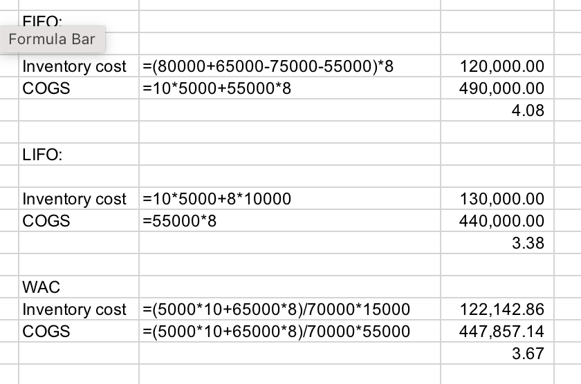
    >
    > A. Incorrect. At the end of Year 1, 5,000 units will remain (0 + 80,000 – 75,000) at a unit cost of $10. All units in the following tables are in thousands.
    >
    > **Under Weighted Average Cost Method**
    >
    > | **Year**           | **1**           | **2**                                     |
    > | ------------------ | --------------- | ----------------------------------------- |
    > | Average cost       | $10             | (5 × $10 + 65 × $8)/70 units = $8.14/unit |
    > | Inventory          | 5 × $10 = $50   | 15 units × $8.14/unit = $122              |
    > | COGS               | 75 × $10 = $750 | 55 × $8.14 = $448                         |
    > | Inventory turnover | ---             | COGS/Inventory = $448/$122 = 3.67         |
    >
    > Because the costs assigned to COGS and inventory are the same, only the units going to each need to be tracked.
    >
    > **Under LIFO Method**
    >
    > | **Year**           | **1**           | **2**                                 |
    > | ------------------ | --------------- | ------------------------------------- |
    > | Inventory          | 5 × $10 = $50   | 5 × $10 + 10 × $8 = $130              |
    > | COGS               | 75 × $10 = $750 | 55 × $8 = $440                        |
    > | Inventory turnover | ---             | COGS/Inventory = $440/$130 = **3.38** |
    >
    > In Year 2, all of the most recent purchases at $8 will go to COGS.
    >
    > Inventory will consist of the 5 units remaining from Year 1 and the 10 units remaining from Year 2 purchases.
    >
    > **Under FIFO Method**
    >
    > | **Year**           | **1**           | **2**                                 |
    > | ------------------ | --------------- | ------------------------------------- |
    > | Inventory          | 5 × $10 = $50   | 15 × $8 = $120                        |
    > | COGS               | 75 × $10 = $750 | 5 × $10 + 50 × $8 = $450              |
    > | Inventory turnover | ---             | COGS/Inventory = $450/$120 = **3.75** |
    >
    > In Year 2, 5 units of the remaining Year 1 inventory and 50 units of Year 2 purchases will go to COGS.
    >
    > Inventory will consist of the remaining 15 units from Year 2 purchases.
    >
    > ---
    >
    > B. Incorrect. At the end of Year 1, 5,000 units will remain (0 + 80,000 – 75,000) at a unit cost of $10. All units in the following tables are in thousands.
    >
    > **Under Weighted Average Cost Method**
    >
    > | **Year**           | **1**           | **2**                                     |
    > | ------------------ | --------------- | ----------------------------------------- |
    > | Average cost       | $10             | (5 × $10 + 65 × $8)/70 units = $8.14/unit |
    > | Inventory          | 5 × $10 = $50   | 15 units × $8.14/unit = $122              |
    > | COGS               | 75 × $10 = $750 | 55 × $8.14 = $448                         |
    > | Inventory turnover | ---             | COGS/Inventory = $448/$122 = 3.67         |
    >
    > Because the costs assigned to COGS and inventory are the same, only the units going to each need to be tracked.
    >
    > **Under LIFO Method**
    >
    > | **Year**           | **1**           | **2**                                 |
    > | ------------------ | --------------- | ------------------------------------- |
    > | Inventory          | 5 × $10 = $50   | 5 × $10 + 10 × $8 = $130              |
    > | COGS               | 75 × $10 = $750 | 55 × $8 = $440                        |
    > | Inventory turnover |                 | COGS/Inventory = $440/$130 = **3.38** |
    >
    > In Year 2, all of the most recent purchases at $8 will go to COGS.
    >
    > Inventory will consist of the 5 units remaining from Year 1 and the 10 units remaining from Year 2 purchases.
    >
    > **Under FIFO Method**
    >
    > | **Year**           | **1**           | **2**                                 |
    > | ------------------ | --------------- | ------------------------------------- |
    > | Inventory          | 5 × $10 = $50   | 15 × $8 = $120                        |
    > | COGS               | 75 × $10 = $750 | 5 × $10 + 50 × $8 = $450              |
    > | Inventory turnover | ---             | COGS/Inventory = $450/$120 = **3.75** |
    >
    > In Year 2, 5 units of the remaining Year 1 inventory and 50 units of Year 2 purchases will go to COGS.
    >
    > Inventory will consist of the remaining 15 units from Year 2 purchases.
    >
    > ---
    >
    > C. **Correct.** At the end of Year 1, 5,000 units will remain (0 + 80,000 – 75,000) at a unit cost of $10. All units in the following tables are in thousands.
    >
    > **Under Weighted Average Cost Method**
    >
    > | **Year**           | **1**           | **2**                                     |
    > | ------------------ | --------------- | ----------------------------------------- |
    > | Average cost       | $10             | (5 × $10 + 65 × $8)/70 units = $8.14/unit |
    > | Inventory          | 5 × $10 = $50   | 15 units × $8.14/unit = $122              |
    > | COGS               | 75 × $10 = $750 | 55 × $8.14 = $448                         |
    > | Inventory turnover | ---             | COGS/Inventory = $448/$122 = 3.67         |
    >
    > Because the costs assigned to COGS and inventory are the same, only the units going to each need to be tracked.
    >
    > **Under LIFO Method**
    >
    > | **Year**           | **1**           | **2**                                 |
    > | ------------------ | --------------- | ------------------------------------- |
    > | Inventory          | 5 × $10 = $50   | 5 × $10 + 10 × $8 = $130              |
    > | COGS               | 75 × $10 = $750 | 55 × $8 = $440                        |
    > | Inventory turnover |                 | COGS/Inventory = $440/$130 = **3.38** |
    >
    > In Year 2, all of the most recent purchases at $8 will go to COGS.
    >
    > Inventory will consist of the 5 units remaining from Year 1 and the 10 units remaining from Year 2 purchases.
    >
    > **Under FIFO Method**
    >
    > | **Year**           | **1**           | **2**                                 |
    > | ------------------ | --------------- | ------------------------------------- |
    > | Inventory          | 5 × $10 = $50   | 15 × $8 = $120                        |
    > | COGS               | 75 × $10 = $750 | 5 × $10 + 50 × $8 = $450              |
    > | Inventory turnover | ---             | COGS/Inventory = $450/$120 = **3.75** |
    >
    > In Year 2, 5 units of the remaining Year 1 inventory and 50 units of Year 2 purchases will go to COGS.
    >
    > Inventory will consist of the remaining 15 units from Year 2 purchases.

28. Under **US GAAP**, financial statement disclosures relating to inventory are *least likely* to include which of the following? Information about the:

    **A.reversal of any inventory write-down.**

    B.amount of inventories **pledged** as security for liabilities.

    C.inventory valuation method used.

    > A. **Correct.** US GAAP **does not allow** the reversal of inventory write-downs, therefore it would not be a disclosure.
    >
    > B. Incorrect. This is a required disclosure of both IFRS and US GAAP.
    >
    > C. Incorrect. This is a required disclosure of both IFRS and US GAAP.
    >
    > For IFRS, under **IAS 2**, if **any write-down or reversal** occurs during the period, an entity must disclose:
    >
    > 1. **The amount of inventory write-downs recognized** as an expense in the period.
    > 2. **The amount of reversals** of inventory write-downs recognized as a **reduction in expense**.
    > 3. **The circumstances or events** that led to the reversal.

30. Ignoring any tax effect, the change in net realizable value of the black licorice jelly beans from 2017 to 2018 will *most likely* result in:
    
    **A.an increase in gross profit of CHF7,775.**
    
    B.an increase in gross profit of CHF11,670.
    
    C.no impact on cost of sales because under IFRS, write-downs cannot be reversed.

    | **E. Century Chocolate Net Realizable Value Information for Black Licorice Jelly Beans** |          |      |          |
    | :----------------------------------------------------------: | :------: | :--- | :------: |
    |                                                              | **2018** |      | **2017** |
    |     FIFO cost of inventory at 31 December (Swiss francs)     | 314,890  |      | 374,870  |
    |         Ending inventory at 31 December (kilograms)          |  77,750  |      |  92,560  |
    |                 Cost per unit (Swiss francs)                 |   4.05   |      |   4.05   |
    |      Net Realizable Value (Swiss francs per kilograms)       |   4.20   |      |   3.95   |

    > A is correct. Gross profit will most likely increase by CHF7,775. The net realizable value has increased and now exceeds the cost. The write-down from 2017 can be reversed. The write-down in 2017 was 9,256 [92,560 × (4.05 – 3.95)]. IFRS require the reversal of any write-downs for a subsequent increase in value of inventory previously written down. The reversal is limited to the lower of the subsequent increase or the original write-down. Only 77,750 kilograms remain in inventory; the reversal is 77,750 × (4.05 – 3.95) = 7,775. **The amount of any reversal of a write-down is recognized as a ==reduction in cost of sales==. This reduction results in an increase in gross profit.**
    
30. To compare the financial performance of the three companies, Groff decides to convert LIFO figures into FIFO figures, and adjust figures to assume no valuation allowance is recognized by any company.

    |         **A. Balance Sheets and Income Statements**          |          |      |           |      |           |
    | :----------------------------------------------------------: | :------: | :--: | :-------: | :--: | :-------: |
    |                                                              | **Crux** |      | **Rolby** |      | **Mikko** |
    |                  Inventory valuation method                  |   LIFO   |      |   FIFO    |      |   LIFO    |
    |                   From the Balance Sheets                    |          |      |           |      |           |
    |                  **As of 31 December 2018**                  |          |      |           |      |           |
    |                       Inventory, gross                       |   480    |      |    620    |      |    510    |
    |                     Valuation allowance                      |    20    |      |    25     |      |    14     |
    |                        Inventory, net                        |   460    |      |    595    |      |    496    |
    |                          Total debt                          |  1,122   |      |    850    |      |    732    |
    |                  Total shareholders’ equity                  |  2,543   |      |   2,403   |      |   2,091   |
    |                  **As of 31 December 2017**                  |          |      |           |      |           |
    |                       Inventory, gross                       |   465    |      |    602    |      |    401    |
    |                     Valuation allowance                      |    23    |      |    15     |      |    12     |
    |                        Inventory, net                        |   442    |      |    587    |      |    389    |
    |                  From the Income Statements                  |          |      |           |      |           |
    |               **Year Ended 31 December 2018**                |          |      |           |      |           |
    |                           Revenues                           |  4,609   |      |   5,442   |      |   3,503   |
    |                     Cost of goods solda                      |  3,120   |      |   3,782   |      |   2,550   |
    |                          Net income                          |   229    |      |    327    |      |    205    |
    | a Charges included in cost of goods sold for inventory write-downs* |    13    |      |    15     |      |    15     |

    \* This does not match the change in the inventory valuation allowance because the valuation allowance is reduced to reflect the valuation allowance attached to items sold and increased for additional necessary write-downs.

    |  **B. LIFO Reserve**   |      |      |      |      |      |
    | :--------------------: | ---- | ---- | ---- | ---- | ---- |
    |      LIFO Reserve      |      |      |      |      |      |
    | As of 31 December 2018 | 55   |      | 0    |      | 77   |
    | As of 31 December 2017 | 72   |      | 0    |      | 50   |
    | As of 31 December 2016 | 96   |      | 0    |      | 43   |
    |        Tax Rate        |      |      |      |      |      |
    |   Effective tax rate   | 30%  |      | 30%  |      | 30%  |

    Question

    Crux’s inventory turnover ratio computed as of 31 December 2018, after the adjustments suggested by Groff, is *closest* to:

    A.5.67.

    **B.5.83.**

    C.6.13.

    > B is correct. Crux’s adjusted inventory turnover ratio must be computed using cost of goods sold (COGS) under FIFO and excluding charges for increases in valuation allowances.
    >
    > **==COGS (adjusted) = COGS (LIFO method) – Charges included in cost of goods sold for inventory write-downs – Change in LIFO reserve==**= USD3,120 million – 13 million – (55 million – 72 million)= USD3,124 million
    >
    > *Note*: Minus the change in LIFO reserve is equivalent to plus the decrease in LIFO reserve. The adjusted inventory turnover ratio is computed using average inventory under FIFO.
    >
    > Ending inventory (FIFO) = Ending inventory (LIFO) + LIFO reserve
    >
    > Ending inventory 2018 (FIFO) = USD480 + 55 = USD535
    >
    > Ending inventory 2017 (FIFO) = USD465 + 72 = USD537
    >
    > **Average inventory** = (USD535 + 537)/2 = USD536
    >
    > Therefore, adjusted inventory turnover ratio equals:
    >
    > Inventory turnover ratio = COGS/Average inventory = USD3,124/USD536 = 5.83
    >
    > **==LIFO Reserve = FIFO Inventory - LIFO Inventory==**
    >
    > **==COGS~FIFO~=COGS~LIFO~-∆LIFO Reserve==**
    >
    >  In normal situation (prices are rising and inventory quantities are stable or increasing), the LIFO reserve will increase

32. Which observation is *most likely* a result of looking only at the information reported in [Exhibit 2](https://study.cfainstitute.org/app/cfa-program-level-i-for-may-2025#), Note 9?

    A.Increased competition has led to lower unit sales.

    B.There have been significant price increases in supplies.

    **C.Management expects a further downturn in sales during 2019.**

    | **9. Inventories:** **Inventories consist of the following:** |                 |                 |
    | :----------------------------------------------------------: | :-------------: | :-------------: |
    |          **31 December (millions in Japanese yen)**          |    **2017**     |    **2018**     |
    |                        Finished goods                        |   JPY 403,856   |   JPY 291,977   |
    |                        Raw materials                         |     99,869      |     85,966      |
    |                       Work in process                        |     79,979      |     83,890      |
    |                      Supplies and other                      |     24,868      |     24,632      |
    |                                                              | **JPY 608,572** | **JPY 486,465** |

    > C is correct. Finished goods and raw materials inventories are lower in 2018 when compared to 2017. **Reduced levels of inventory typically indicate an anticipated business contraction.**

33. [Exhibit 2](https://study.cfainstitute.org/app/cfa-program-level-i-for-may-2025#), Note 2, indicates that “inventories valued on the LIFO basis totaled JPY94,578 million and JPY50,037 million at 31 December 2017 and 2018, respectively.” Based on this, the LIFO reserve should *most likely*:

    A.increase.

    **B.decrease.**

    C.remain the same.

    > B is correct. The decrease in LIFO inventory in 2018 would **typically indicate that more inventory units were sold than produced or purchased**. Accordingly, one would expect a liquidation of some of the older LIFO layers and the LIFO reserve to decrease. In actuality, the LIFO reserve *increased* from JPY10,120 million in 2017 to JPY19,660 million in 2018. This is **not to be expected** and is likely caused by the increase in prices of raw materials, other production materials, and parts of foreign currencies as noted in the MD&A. An analyst should seek to confirm this explanation.

33. A company that reports in accordance with IFRS does *not* use the cost model to value its investment properties and property, plant, and equipment. Information related to an investment property and a plant is as follows:

    | **€ thousands**     | **End of Year**    |                |
    | ------------------- | ------------------ | -------------- |
    |                     | **Carrying Value** | **Fair Value** |
    | Investment property | 1,000              | 1,100          |
    | Plant               | 1,000              | 1,200          |

    The impact on its net income for the year will *most likely* be a gain (in thousands) of:

    **A.€100.**

    B.€200.

    C.€300.

    > 1. **Correct.** The **fair value model** would be used for the **investment property**, and the €100 thousand gain should be recognized on the company’s income statement. The **revaluation model** would be used for the **PP&E**, and the €200 thousand gain should be recognized in the revaluation surplus account on the balance sheet with **no impact on net income**. Therefore, only the €100 thousand will affect net income.
    > 2. Incorrect. The revaluation model would be used for the plant, and the gain should be recognized in the revaluation surplus account on the balance sheet. This is a new purchase and therefore no gains need to be recognized on the income statement to reverse previously recognized losses.
    > 3. Incorrect. The revaluation model would be used for the plant, and the gain should be recognized in the revaluation surplus account on the balance sheet. This is a new purchase and therefore no gains need to be recognized on the income statement to reverse previously recognized losses. Therefore, a maximum of $100,000 would be recognized on the income statement.
    >
    > IFRS:
    >
    > - Investment Property: earning rental income or capital appreciation
    >   - Historical Cost
    >   - Fair Value
    > - Other Long-Lived Assets: 
    >   - Historical Cost
    >   - Revaluation Model: 在重评估日将账面价值对齐Fair value。仍然需要折旧摊销。高于cost的部分进入OCI，低于cost的部分进入利润表

35. Based on Exhibit 1, the *best estimate* of the average remaining useful life of the company’s **plant and equipment** at the end of 2022 is:

    **A.20.75 years.**

    B.24.25 years.

    C.30.00 years.

    Exhibit 2:

    Consolidated Balance Sheet

    | **As of 31 December**                      |      **2022**      |      |                |      |      **2021**      |      |                |
    | :----------------------------------------- | :----------------: | :--- | :------------: | :--- | :----------------: | :--- | :------------: |
    | **Assets**                                 | **Euros millions** |      | **Assets (%)** |      | **Euros millions** |      | **Assets (%)** |
    | Current assets                             |        500         |      |      9.4       |      |        450         |      |      8.5       |
    | **Property & equipment:**                  |                    |      |                |      |                    |      |                |
    | Land                                       |        700         |      |      13.1      |      |        700         |      |      13.2      |
    | Plant & equipment                          |       6,000        |      |     112.1      |      |       5,800        |      |     109.4      |
    | **Total property & equipment**             |       6,700        |      |     125.2      |      |       6,500        |      |     122.6      |
    | Accumulated depreciation                   |      (1,850)       |      |     (34.6)     |      |      (1,650)       |      |     (31.1)     |
    | Net property & equipment                   |       4,850        |      |      90.6      |      |       4,850        |      |      91.5      |
    | Total assets                               |       5,350        |      |     100.0      |      |       5,300        |      |     100.0      |
    | **Liabilities and Shareholders’ Equity**   |                    |      |                |      |                    |      |                |
    | Current liabilities                        |        480         |      |      9.0       |      |        430         |      |      8.1       |
    | Long-term debt                             |       1,030        |      |      19.3      |      |       1,080        |      |      20.4      |
    | Other long-term provisions and liabilities |       1,240        |      |      23.1      |      |       1,440        |      |      27.2      |
    | Total liabilities                          |       2,750        |      |      51.4      |      |       2,950        |      |      55.7      |
    | Shareholders’ equity                       |                    |      |                |      |                    |      |                |
    | Common stock and paid-in-surplus           |        760         |      |      14.2      |      |        760         |      |      14.3      |
    | Retained earnings                          |       1,888        |      |      35.5      |      |       1,600        |      |      30.2      |
    | Other comprehensive losses                 |        (48)        |      |     (0.9)      |      |        (10)        |      |     (0.2)      |
    | Total shareholders’ equity                 |       2,600        |      |      48.6      |      |       2,350        |      |      44.3      |
    | Total liabilities & shareholders’ equity   |       5,350        |      |     100.0      |      |       5,300        |      |     100.0      |

    > A is correct. The estimated average remaining useful life is 20.75 years, calculated as:
    >
    > Estimate of remaining useful life = Net plant and equipment ÷ Annual depreciation expense
    >
    > **Net plant and equipment = Plant & equipment – Accumulated depreciation** (**Property (Land) is not depreciated or amortized**)
    >
    > = EUR6,000 – EUR1,850 = EUR4,150
    >
    > Estimate of remaining useful life = Net P & E ÷ Depreciation expense
    >
    > = EUR4,150 ÷ EUR200 = 20.75

36. Jordan’s response about the financial statement impact of Alpha’s decision to capitalize the cost of its new computer system is correct with respect to:

    A.lower net income.

    B.lower total assets.

    **C.higher cash flow from operating activities.**

    > C is correct. The decision to capitalize the costs of the new computer system results in higher cash flow from operating activities; the expenditure is reported as an outflow of **investing activities** (CFI). The company allocates the capitalized amount over the asset’s useful life as depreciation or amortization expense rather than expensing it in the year of expenditure. Net income and total assets are higher in the current fiscal year.

37. In 2015, a company undertook the following two transactions:

    1. Borrowed money from an insurance company and pledged some of its production facilities as collateral for the loan.
    2. Entered into an agreement with a local construction company to build a new research facility at a fixed price. Construction is to begin by 1 January 2016 and be completed by 31 December 2018.

    With respect to required disclosures in the company’s financial statements, which of the following is *most* accurate? If the company reports under:

    A.US GAAP, only the pledged borrowing must be disclosed.

    B.International Financial Reporting Standards (IFRS), neither transaction must be disclosed.

    **C.US GAAP, neither transaction must be disclosed.**

    > 1. Incorrect. US GAAP does not require disclosure of either transaction, but IFRS requires that both be disclosed.
    > 2. Incorrect. Only IFRS requires that both transactions must be disclosed.
    > 3. Correct. **==Under US GAAP, neither transaction must be disclosed, but disclosure of both transactions is required under IFRS.==**
    >
    > 同学之所以会觉得这两道官网题不知道在说什么，是因为都出得很不好，要不就是没有及时把过时考纲的题目扯下来，要不就是书上都没有提到。这道题我们教研组找了好久，原版书上是没有相关内容的，同学可以就做简单了解就好，这不是考试的考点，题目是想区分GAAP和IFRS下，1、找保险公司抵押贷款2、签一个固定价格建设施的合同这两项业务是否需要公布。我们直接记住答案，C选项GAAP都不要，IFRS都要。

38. Below are excerpts from a company’s intangible assets note for 2015:

    | **($ millions)**                                   | **Group 1** | **Group 2** | **Group 3** | **Group 4** |
    | -------------------------------------------------- | ----------- | ----------- | ----------- | ----------- |
    | Cost (opening)                                     | 840         | 320         | 118         | 96          |
    | Additions                                          | 76          | ---         | 7           | ---         |
    | Cost (ending)                                      | 916         | 320         | 125         | 96          |
    | Accumulated amortization and impairments (opening) | 333         | 45          | 16          | 0           |
    | Amortization                                       | ---         | 15          | 8           | ---         |
    | Impairments                                        | ---         | ---         | ---         | 21          |
    | Accumulated amortization and impairments (ending)  | 333         | 60          | 24          | 21          |
    | Carrying amount                                    | 583         | 260         | 101         | 75          |

    The 2015 **opening** carrying amount (in millions) of the company’s **definite-life** intangible assets is *closest* to:

    **A.$377.**

    B.$361.

    C.$473.

    > 260+101+15+8-0-7=377

39. The gain or loss on a sale of a long-lived asset to which the revaluation model has been applied is *most likely* calculated using sales proceeds less:

    **A.carrying amount.**

    B.carrying amount adjusted for impairment.

    C.historical cost net of accumulated depreciation.

    > **A is correct.** The gain or loss on the sale of long-lived assets is computed as the sales proceeds minus the carrying amount of the asset at the time of sale. This is true under the cost and revaluation models of reporting long-lived assets. In the absence of impairment losses, under the cost model, the carrying amount will equal historical cost net of accumulated depreciation.
    >
    > **No further impairment tests** under the revaluation model.

40. According to IFRS, all of the following pieces of information about property, plant, and equipment must be disclosed in a company’s financial statements and footnotes *except for*:

    A.useful lives.

    **B.acquisition dates.**

    C.amount of disposals.

41. According to IFRS, all of the following pieces of information about intangible assets must be disclosed in a company’s financial statements and footnotes *except for*:

    **A.fair value.**

    B.impairment loss.

    C.amortization rate.

    > A is correct. IFRS do not require fair value of intangible assets to be disclosed.
    >
    > Amortization Rate: e.g., 10%/year for an intangible asset with no salvage value and a useful life of 10 years

42. Which of the following is a required financial statement disclosure for long-lived intangible assets under US GAAP?

    A.The useful lives of assets

    B.The reversal of impairment losses

    **C.Estimated amortization expense for the next five fiscal years**

    > C is correct. **==Under US GAAP, companies are required to disclose the estimated amortization expense for the next five fiscal years.==** Under US GAAP, there is no reversal of impairment losses. **Disclosure of the useful lives—finite ==or indefinite== and additional related details—is required under IFRS.**

43. ==Which of the following is a potential drawback of compensating employees with stock options?==

    1. A.The grant may make employees adverse to risk.
    2. B.The grant may make employees seek more risk.
    3. **C.Both of the above are potential drawbacks.**

    > C is correct. Stock option grants may lead managers to be either risk adverse or have the opposite effect (i.e., encourage excessive risk taking). Therefore, B and C are both potential drawbacks.
    >
    > Option A: "The grant may make employees adverse to risk."
    >
    > - Reasoning: When employees receive stock options, their potential payout increases with stock price growth, but if the stock price falls below the exercise price, the options become worthless ("out of the money"). Employees with significant unexercised options might **prefer stability to protect the value already accrued**, especially if they’re risk-averse or the options are **"in the money"** (stock price exceeds exercise price). For example, a manager might avoid bold strategies that could jeopardize stock price stability, fearing loss of option value. This risk aversion can be a drawback if it stifles innovation or growth, which companies often seek from equity incentives.

44. Previously, a manufacturer of high-quality industrial electrical generators only sold its units to customers, but it has just introduced a leasing program. The generators have expected useful lives of about 25 years, and the company anticipates that the leases will have a term of 20 years or more. If the company reports under International Financial Reporting Standards, which of the following statements about the first year of the new leasing program is *most* accurate? The company will recognize:

    **A.revenue equal to the value of the leased asset.**

    B.depreciation of the leased asset as an expense.

    C.cost of goods sold equal to the market value of the asset.

    > 1. Correct. Because the company is a manufacturer, under IFRS the lessor would classify the lease as a **finance lease** and **==recognize revenue equal to the value of the leased asset and cost of goods sold equal to the carrying value of the asset==**, not its market value. The asset would be derecognized from the balance sheet and **replaced with a lease receivable** therefore there is no asset to depreciate.
    > 2. Incorrect. Because the company is a manufacturer, under IFRS the lessor would classify the lease as a finance lease. The asset would be derecognized from the balance sheet and replaced with a lease receivable, therefore there is no asset to depreciate.
    > 3. Incorrect. Because the company is a manufacturer, under IFRS the lessor would classify the lease as a finance lease and recognize revenue equal to the value of the leased asset and cost of goods sold equal to the carrying value of the asset, not its market value.

44. A company that prepares its financial statements according to IFRS leased a piece of equipment on 1 January of Year 1. Information relevant to the transaction is as follows:

    - Five annual lease payments of $25,000, with the first payment due 1 January of Year 1
    - Interest rate on similar company debt is currently 8%
    - The fair value of the equipment is $115,000
    - Useful life of the equipment is seven years
    - The company depreciates other equipment in the same asset class on a straight-line basis

    The total expense related to the lease on the company’s income statement for Year 1 will be *closest* to:

    A.$22,024.

    B.$25,000.

    **C.$28,185.**

    > 判断为IFRS下的融资租赁，
    >
    > 租赁开始时
    >
    > Dr: ROU  107,803
    >
    >   Cr: Lease Payable   107,803
    >
    > 第一年的ROU摊销（直线法，五年，零残值）
    >
    > Dr: Amortization expenses  107,803/5=21,561
    >
    >   Cr: ROU  21,561
    >
    > 第一年的利息费用
    >
    > Dr: Interest Expense  (107,803-25,000)\*8%=6,624
    >
    > Dr: Lease Payable  25,000-6,624=18,376 
    >
    >   Cr: Cash  25,000
    >
    > Total expense=21,561+6,624=28,185  
    >
    > 1. Incorrect. It correctly classifies it as a finance lease but amortizes it over 7 years: 107,803/7 = 15,400; 15,400 + 6,624 = 22,024.
    >
    > 2. Incorrect. It assumes it is an operating lease and simply deducts the lease payment.
    >
    > 3. **Correct.** Under IFRS 16 all leases are classified as a finance lease and must be capitalized.
    >
    >    Using a financial calculator for an annuity due at the beginning of the period:
    >
    >    PV of lease payments: PMT = $25,000, *i* = 8%, *N* = 5, **Mode = Begin**, Compute PV.
    >
    >    PV = $107,803
    >
    >    Therefore, **the lease would be ==capitalized at $107,803==**.
    >
    >    > Dr: ROU Assets          \$107,803
    >    >
    >    >   Cr: Lease Payable      \$107,803
    >
    >    When making the first payment of \$25,000:
    >
    >    > Dr: Lease Payable    **==\$25,000==**
    >    >
    >    >   Cr: Cash   \$25,000
    >
    >    Interest Expense for the first year:
    >
    >    > Dr: Interest Expense    (\$107,803**==-$25,000==**)\*8%=\$6,624.25
    >    >
    >    >   Cr: Lease Payable                                     \$6,624.25
    >
    >    ROU Assets Amortization:
    >
    >    > Dr: Amortization Expense    \$107,803/**==5==**=\$21,560.63
    >    >
    >    >   Cr: ROU Accumulated Amortization           \$21,560.63
    >
    >    Total Expense = \$6,624.25+\$21,560.63=$28,184.88 
    >
    >    | Present value of the lease (asset value capitalized and initial liability) |                | $107,803   |
    >    | ------------------------------------------------------------ | -------------- | ---------- |
    >    | Payment 1 January 2020                                       |                | –25,000    |
    >    | Liability value 1 January 2020                               |                | $82,803    |
    >    |                                                              |                |            |
    >    | Interest expense in 2020                                     | 0.08 × $82,803 | $6,624.25  |
    >    | Amortization expense for the year using the lease term as the useful life (no indication that the lease will be renewed beyond the initial term) | $107,803/5     | $21,560.63 |
    >    | Total expense in 2020                                        |                | $28,184.88 |

46. Which of the following is typically an objective of a share-based compensation plan?

    **A.Attracting new employees**

    B.Maximizing executive compensation

    C.Alignment of employees’ interest with those of **management**

    > The correct answer is A. **==The objectives of employee compensation plans include *attracting* new employees, *retaining* and *motivating* existing employees and *aligning* employee interests with those of <u>shareholders</u>.==** Answer B, maximizing executive compensation is not typically an objective of a share-based compensation programs. Answer C is not correct because an objective is to align employee interests with **shareholders**, not necessarily management.

47. Assume ABC Company, a fictional company provides the following disclosure about its stock compensation plans:

    “The average fair value of shares granted was USD20.86, USD16.42, and USD17.80 in 2021, 2020, and 2019 respectively.” If the company granted 18,000 shares, with a three-year **vesting period** in 2021, what is the annual compensation expense for the 2021 shares granted?

    **A.USD125,160**

    B.USD339,480

    C.USD375,480

    > The correct answer is A, calculated as follows: 18,000 shares × by average fair value at grant date of USD20.86 = USD375,480 **total compensation**. Divide this amount by the three-year vesting period, and the result is USD125,160 annual compensation expense.
    >
    > A vesting schedule or vesting period refers to **the time an employee must work for a company before they are permitted to own equity-like employee stock options or company shares**—or able to access employer contributions to a retirement plan, like a 401(k). Vesting periods vary depending on the type of asset.

48. Under US GAAP, for defined-benefit plans, which of the following items is reported as profit and loss?

    **A.Interest expense accrued on the beginning pension obligation in the period incurred.**

    B.Actuarial gains and losses in the current period.

    C.Past service costs in the period they arise.

    > 1. **Correct.** Interest expense accrued on the beginning pension obligation is recognized as profit or loss in the period incurred.
    > 2. Incorrect because actuarial gains and losses are recognized in **other comprehensive income** in the period in which they occur and then amortized into pension expense over time.
    > 3. Incorrect because past service costs are recognized in **other comprehensive income** in the period in which they arise and then subsequently amortized into pension expense over the future service period of the employees covered by the plan.

49. Beginning with fiscal year 2019, for leases with a term longer than one year, lessees report a right-to-use asset and a lease liability on the balance sheet:

    A.only for finance leases.

    B.only for operating leases.

    **C.for both finance and operating leases.**

    > C is correct. Beginning with fiscal year 2019, lessees report a right-of-use asset and a lease liability for all leases longer than one year. An exception under IFRS exists for leases when the underlying asset is of low value.

50. The information below is associated with a company that offers its employees a defined benefit plan:

    | Fair value of fund’s assets                    | USD1,500,000,000 |
    | ---------------------------------------------- | ---------------- |
    | Estimated pension obligations                  | USD2,600,000,000 |
    | Present value of estimated pension obligations | USD1,200,000,000 |

    Based on this information, the company’s balance sheet will present a net pension:

    **A.asset of USD300,000,000.**

    B.asset of USD1,400,000,000.

    C.liability of USD1,100,000,000.

    > **A is correct.** A company that offers a defined benefit plan makes payments into a pension fund and the retirees are paid from the fund. The payments that a company makes into the fund are invested until they are needed to pay retirees. If the fair value of the fund’s assets is higher than the present value of the estimated pension obligation, the plan has a surplus and the company’s balance sheet will reflect a net pension asset. Because the fair value of the fund’s assets is USD1,500,000,000 and the present value of estimated pension obligations is USD1,200,000,000, the company will present a net pension asset of USD300,000,000 on its balance sheet.

50. In the current year, Michaels Company has a carrying amount of USD3,500,000 and tax base of USD5,000,000 for accounts receivable. Michaels will most likely recognize:

    **A.a deferred tax asset.**

    B.a deferred tax liability.

    C.no deferred tax asset or liability.

    > **A is correct.** Because the carrying amount is less than the tax base for this asset, this difference is a temporary difference that will result in a deferred tax asset. B is incorrect because a deferred tax liability would apply if the carrying amount was greater than the asset base. C is incorrect because this is not a permanent difference thus there will be either a deferred tax asset or deferred tax liability.
    >
    > 记忆：税务利润>会计利润，多交税了，以后少交税，DTA

51. The following information is available for a company that prepares its financial statements according to US GAAP:

    |                          | **2015**   | **2014** |
    | ------------------------ | ---------- | -------- |
    | Deferred tax assets      | $1,000,000 | $800,000 |
    | Deferred tax liabilities | $600,000   | $700,000 |
    | **Valuation allowance**  | $500,000   | $400,000 |

    The overall effect on 2015 net income from the above changes in the company’s deferred tax accounts is *closest* to a:

    **A.$200,000 increase.**

    B.$300,000 increase.

    C.$200,000 decrease.

    > Income Tax Expense = Current Tax Payable + ∆DTL - ∆DTA
    >
    > Overall effect on net income = -∆DTL + ∆DTA = -(600,000-700,000) + ((1,000,000-500,000)-(800,000-400,000))=200,000 
    >
    > 1. **Correct.** A valuation allowance reduces the value of the deferred tax assets under US GAAP, so the total change in net income as a result of the changes in the three accounts can be calculated as follows:
    >
    >    | **Account**              | **Change in Account from 2014** | **Effect of Change on Net Income** |           |
    >    | ------------------------ | ------------------------------- | ---------------------------------- | --------- |
    >    | **Direction**            | **Dollar Effect**               |                                    |           |
    >    | Deferred tax assets      | $ 200,000 increase              | Increase                           | $200,000  |
    >    | Deferred tax liabilities | $100,000 decrease               | Increase                           | 100,000   |
    >    | Valuation allowance      | $100,000 increase               | Decrease                           | (100,000) |
    >    | **Overall effect:**      | **A net increase of:**          | **$200,000**                       |           |
    >
    > 2. Incorrect. It incorrectly ignores the change in the valuation allowance (doesn’t realize it is related to deferred tax assets).
    >
    > 3. Incorrect. This is the inverse of the correct answer.
    >
    > The carrying value of DTA should be reduced to the expected recoverable amount by increasing t h e amount of a **contra account ==valuation allowance==**

53. Which of the following descriptions of financial reporting is considered to be of the highest quality?

    1. A.Within GAAP but with earnings management
    2. **B.Within GAAP but with biased choices**
    3. C.Outside GAAP but with conservative choices

    > 1. Incorrect. Along the financial reporting quality spectrum, financial reporting that is within GAAP but subject to earnings management is considered to be inferior to within-GAAP financial reporting that has biased choices.
    > 2. **Correct.** Along the financial reporting quality spectrum, financial reporting that is within GAAP but has biased choices is considered to be better quality than within-GAAP financial reporting that is subject to earnings management. Financial reporting that is non-compliant with GAAP is considered to be even lower quality.
    > 3. Incorrect. Along the financial reporting quality spectrum, **financial reporting that is non-compliant with GAAP is considered to be inferior to GAAP-compliant financial reporting**
    
54. To properly **assess** a company’s past performance, an analyst requires:

    1. A.high earnings quality.
    2. **B.high financial reporting quality.**
    3. C.both high earnings quality and high financial reporting quality.

    > **B is correct.** Financial reporting quality pertains to the quality of the information contained in financial reports. If financial reporting quality is low, the information provided is of little use in assessing the company’s performance. Financial reporting quality is distinguishable from earnings quality, which pertains to the earnings and cash generated by the company’s actual economic activities and the resulting financial condition.

55. The effectiveness of a debt covenant in disciplining financial reporting quality is most often limited due to:

    1. A.ineffectiveness of financial triggers.
    2. B.reporting requirements that may not be legally binding.
    3. **C.potential for managers to inflate earnings.**

    > 1. Incorrect because financial triggers can be effective deterrents of debt covenant violations because the investors have the option to recover all or part of their investment.
    > 2. Incorrect because loan agreements often contain loan covenants, which create specifically tailored financial reporting requirements that are legally binding for the issuer.
    > 3. **Correct.** Avoidance of debt covenant violation is a potential motivation for managers to inflate earnings.
    
55. Which attribute of financial reports would *most likely* be evaluated as **optimal** in the financial reporting spectrum?

    1. A.Conservative accounting choices
    2. **B.Sustainable and adequate returns**
    3. C.Emphasized pro forma earnings measures

    > **B is correct.** At the top of the quality spectrum of financial reports are reports that conform to GAAP, are decision useful, and have earnings that are sustainable and offer adequate returns. In other words, these reports have **both high financial reporting quality and high earnings quality**.
    >
    > **==Financial Reporting Quality Spectrum==**
    >
    > A quality spectrum provides a basis for evaluating quality reports. It ranges from reports that are of high financial reporting quality and reflect high and sustainable earnings quality to reports that are not useful due to poor financial reporting quality.
    >
    > - **GAAP decision-useful, sustainable, and adequate returns**: this first level consists of high-quality reports that provide useful information about high-quality earnings.
    >
    > - High-quality financial reports conform to the GAAP of the country (i.e., IFRS, US GAAP, or other home countries GAAP), and embody the characteristics of decision-useful information such as relevance and objective representation.
    >
    > - High-quality earnings indicate that there is an adequate level of investment return. They are derived from activities that a company will likely be able to sustain in future. Sustainable activities and earnings are those that are expected to recur in future.
    >
    > - **GAAP, decision-useful, but not sustainable; low earnings quality:** this second level refers to circumstances in which high-quality reporting provides useful information which reflects results or earnings that are not sustainable and indicative of lower earnings quality.
    >
    > - **Within GAAP, but biased choices:**
    >
    >   biased choices give rise to financial reports which do not objectively represent economic phenomena. This impedes an investor’s ability to correctly assess a company’s past performance, accurately predict its future performance, and appropriately value it.
    >
    >   - Aggressive choices increase a company’s reported performance and financial position in the current period. They may, nevertheless, become counterproductive and decrease a company’s reported performance and financial position in later periods.
    >   - Conservative choices decrease a company’s reported performance and financial position in the current period but may increase them in later periods.
    >   - **‘Earnings smoothing’** refers to an understatement of earnings volatility. It may result from conservative choices made to understate earnings in periods when a company’s operations are performing well, and aggressive choices in periods when the company’s operations are struggling.
    >
    > - **Within GAAP, but earnings management**: in this context, “earnings management” refers to the act of making intentional choices that create biased financial reports. Earnings can be “managed” upwards by taking **real actions** such as deferring expenses or by making accounting choices such as changing accounting estimates.
    >
    > - **Non-compliant accounting**: financial reporting which departs from GAAP can generally be considered low quality. In cases of non-compliance, earnings quality is usually difficult or impossible to assess because no comparison can be made with earlier periods and/or other entities.
    >
    > - **Fictitious transactions**: in this case, a company displays fictitious transactions in fabricated reports at the bottom level of the quality spectrum . The inspiration behind this move is to fraudulently obtain investments by misrepresenting performance and/or to obscure fraudulent misappropriation of company assets.

57. Financial reports of the lowest level of quality reflect:

    1. **A.fictitious events.**
    2. B.biased accounting choices.
    3. C.accounting that is non-compliant with GAAP.

    > **A is correct.** Financial reports span a quality continuum from high to low based on decision-usefulness and earnings quality (see Exhibit 2). The lowest-quality reports portray fictitious events, which may misrepresent the company’s performance or obscure fraudulent misappropriation of the company’s assets.

58. When earnings are increased by deferring research and development (R&D) investments until the next reporting period, this choice is considered:

    1. A.non-compliant accounting.
    2. **B.earnings management as a result of a real action.**
    3. C.earnings management as a result of an accounting choice.

    > **B is correct.** Deferring R&D investments into the next reporting period is an example of earnings management by taking a *real* action.
>
    > Real action指的是采取主动的特定行动来管理earnings

59. Changing the estimates of the salvage value of capital assets is the *least* effective way to manage earnings during the life of an asset for companies whose method of depreciation is:

    1. A.straight-line.
    2. B.units-of-production.
    3. **C.double-declining balance.**

    > 1. Incorrect. The straight-line method calculates depreciation on the net cost of the assets. Changing the salvage value will change the depreciation deduction and thereby affect earnings.
    > 2. Incorrect. The units-of-production method calculates depreciation rate based on the net cost of the assets. Changing the salvage value will change the depreciation rate and thereby affect earnings.
    > 3. **Correct.** The double-declining balance depreciation method applies the rate to the gross cost of the equipment, so **a change in the salvage assumption will have no effect on earnings until the net book value reaches the estimated salvage value**, at which point the company ceases to take depreciation on the asset.
    
60. Under the indirect method of presenting operating cash flows, which action to **alter the cash flow from operations** will be most **difficult to detect**?

    A.Defer payment of a current liability

    **B.Transact with an unconsolidated special purpose entity**

    C.Change inventory costing from FIFO to weighted average

    > 1. Incorrect because an examination of cash provided by operating activities will reveal that the increase in cash due to the deferred payment is offset by a comparable increase in accounts payable.
    > 2. Correct. Unconsolidated special purpose entities are **outside of the view of investors**. Transacting with such an entity may initially produce the appearance of a positive or negative cash flow for the controlling company. Ultimately, this transaction will most likely be reversed along with the appearance of the initial cash flow.
    > 3. Incorrect because changes in inventory accounting may affect gross profit and therefore net income, but with an opposite effect on the ending inventory value. Together these effects would likely have an **offsetting impact** on the appearance of cash generated by operating activities (也就是说无法有效地改变CFO，好像确实是哦). One possible exception might be the effect on derived expenses such as the provision for income tax.

61. Overloading distribution channels (“**channel stuffing**”) would understate:

    **A.inventories.**

    B.accounts receivable.

    C.revenues.

    > 1. Correct. “Channel stuffing,” or **inducing customers to buy more than usual**, will produce an overstatement of revenues, which may be corrected in future periods **if product is returned**. Returned product in future periods would tend to understate inventories in the current period.
    > 2. Incorrect because “channel stuffing,” or inducing customers to buy more than usual, will most likely produce a higher ratio of accounts receivable to revenues because of an overstatement of accounts receivable.
    > 3. Incorrect because “channel stuffing,” or inducing customers to buy more than usual, will produce an overstatement of revenues.

62. Which of the following approaches will most likely reveal manipulation of financial reporting?

    A.Using EBITDA to adjust for non-recurring items

    B.Evaluating potential warning signals in isolation

    **C.Comparing a company’s methods and policies to those of its peers**

    > 1. Incorrect because **companies may construct or report their own version of EBITDA**. Thus, adjusting EBITDA for a non-recurring item, in and of itself, does not reflect or reveal manipulation or financial reporting.
    > 2. Incorrect because investors need to evaluate warning signals **cohesively**, not on an isolated basis.
    > 3. Correct. An investor should compare a company’s policies with those of its peers to determine whether its approaches match or differ from industry norms; if a company is the only one in its industry following a particular approach, a red flag is raised.

63. Which of the following is most likely to be considered a potential benefit of accounting conservatism?

    **A.A reduction in litigation costs**

    B.Less biased financial reporting

    C.An increase in current period reported performance

    > A is correct. Conservatism **reduces the possibility of litigation** and, by extension, litigation costs. Rarely, if ever, is a company sued because it understated good news or overstated bad news. **Accounting conservatism is a type of bias** in financial reporting that decreases a company’s reported performance. Conservatism directly conflicts with the characteristic of neutrality.

64. Which of the following concerns would most likely motivate a manager to make conservative accounting choices?

    A.Attention to future career opportunities

    B.Debt covenant violation risk in the current period

    **C.Unexpected strength in the business environment**

    > C is correct. Managers may be motivated to understate earnings in a period with **unexpected strong performance** by delaying revenue recognition or accelerating expense recognition to increase the probability of exceeding expectations in a subsequent period (referred to as **“banking” some earnings for the next period**.)

65. An audit opinion of a company’s financial reports is most likely intended to:

    A.detect fraud.

    B.reveal misstatements.

    **C.ensure that financial information is presented fairly.**

    > C is correct. An audit is intended to provide assurance that the company’s financial reports are presented fairly, thus providing discipline regarding financial reporting quality. Regulatory agencies usually require that the financial statements of publicly traded companies be audited by an independent auditor to provide assurance that the financial statements conform to accounting standards. Privately held companies may also choose to obtain audit opinions either voluntarily or because an outside party requires it. An audit is not typically intended to detect fraud. An audit is based on sampling and it is possible that the sample might not reveal misstatements.

66. If a company uses a non-GAAP financial measure in an SEC filing, then the company must:

    A.give more prominence to the non-GAAP measure if it is used in earnings releases.

    **B.provide a reconciliation of the non-GAAP measure and equivalent GAAP measure.**

    C.exclude charges requiring cash settlement from any non-GAAP liquidity measures.

    > B is correct. If a company uses a non-GAAP financial measure in an SEC filing, it is required to provide the most directly comparable GAAP measure with equivalent prominence in the filing. In addition, the company is required to provide a reconciliation between the non-GAAP measure and the equivalent GAAP measure. Similarly, IFRS requires that any non-IFRS measures included in financial reports must be defined and their potential relevance explained. The non-IFRS measures must be reconciled with IFRS measures.

67. An analyst reviewing a firm with a large reported restructuring charge to earnings should:

    A.view expenses reported in prior years as overstated.

    B.disregard it because it is solely related to past events.

    **C.consider making pro forma adjustments to prior years’ earnings.**

    > C is correct. To extrapolate historical earnings trends, an analyst should consider making pro forma analytical adjustments of prior years’ earnings to reflect in those prior years a reasonable **share** of the current period’s restructuring and impairment charges. 分摊到多年

68. Other factors held constant, the reduction of a company’s average accounts payable because of suppliers offering less trade credit will most likely:

    **A.not affect the operating cycle.**

    B.reduce the operating cycle.

    C.increase the operating cycle.

    > Operating Cycle = DOH + DSO
    >
    > 1. Correct. **Payables are not part of the operating cycle** calculation, which includes receivables and inventory.
    > 2. Incorrect. As per above, payables are not part of the operating cycle calculation.
    > 3. Incorrect. As per above, payables are not part of the operating cycle calculation.

69. A company’s most recent balance sheet shows the following values (NZ$ thousands):

    | Accounts payable            | 3,800 |
    | --------------------------- | ----- |
    | Long-term debt              | 5,590 |
    | Other long-term liabilities | 800   |
    | Common stock                | 1,200 |
    | Retained earnings           | 1,810 |

    The company’s **debt-to-capital ratio** is *closest* to:

    **A.0.65.**

    B.0.77.

    C.1.86.

    > 1. Correct. The debt-to-capital ratio is
    >
    >    **==Total debt / (Total debt+Total shareholders' equity)==**=5,590/(5,590+1,200+1,810)=0.650
    >
    >    where total debt includes only interest-bearing debt and **capital refers to all debt and equity capital**.
    >
    > 2. Incorrect. It includes current liabilities and other long-term liabilities as a part of total debt: [(3,800 + 5,590 + 800)/(3,800 + 5,590 + 800 + 1,200 + 1,810)] = 0.7719.
    >
    > 3. Incorrect. It calculates long-term debt to equity: [5,590/(1,200 + 1,810)] = 1.86.

70. Selected information for a company and its industry’s average return on equity (ROE) is provided:

    | **Company**                               | **(£)** | **Industry**         | **(£)** |
    | ----------------------------------------- | ------- | -------------------- | ------- |
    | Earnings before interest and taxes (EBIT) | 76,000  | EBIT margin          | 0.28    |
    | Pretax profit                             | 66,400  | Interest burden      | 0.70    |
    | Net income                                | 44,500  | Tax burden           | 0.67    |
    | Sales                                     | 400,000 | Total asset turnover | 0.71    |
    | Total assets                              | 524,488 | Financial leverage   | 1.89    |
    | Total equity                              | 296,488 |                      |         |
    | ROE                                       | 15.0%   |                      | 17.6%   |

    Which of the following is *most likely* a contributor to the company’s inferior ROE compared with that of the industry? The company’s lower:

    A.tax burden ratio.

    **B.financial leverage.**

    C.interest burden ratio.

    > 1. Incorrect. Compare the three specified components from the five-way DuPont analysis:
    >
    >    |                               | **Calculation**               | **Company**                                  | **Industry** |
    >    | ----------------------------- | ----------------------------- | -------------------------------------------- | ------------ |
    >    | **==Tax burden ratio==**      | **==(Net income/EBT)==**      | 44,488/66,400 = 0.67 (Same as industry)      | 0.67         |
    >    | ==**Financial leverages**==   | ==**(Total assets/Equity)**== | 524,488/296,488 = 1.77 (Lower than industry) | 1.89         |
    >    | **==Interest burden ratio==** | **==(EBT/EBIT)==**            | 66,400/76,000 = 0.87 (Higher than industry)  | 0.70         |
    >
    >    *Note: EBT is pre-tax profit (earnings before tax)*
    >
    >    The lower financial leverage ratio relative to the industry is one of the causes of the company’s poor relative performance.
    >
    > 2. **Correct.** Compare the three specified components from the five-way DuPont analysis:
    >
    >    |                       | **Calculation**       | **Company**                                  | **Industry** |
    >    | --------------------- | --------------------- | -------------------------------------------- | ------------ |
    >    | Tax burden ratio      | (Net income/EBT)      | 44,488/66,400 = 0.67 (Same as industry)      | 0.67         |
    >    | Financial leverages   | (Total assets/Equity) | 524,488/296,488 = 1.77 (Lower than industry) | 1.89         |
    >    | Interest burden ratio | (EBT/EBIT)            | 66,400/76,000 = 0.87 (Higher than industry)  | 0.70         |
    >
    >    *Note: EBT is pre-tax profit (earnings before tax)*
    >
    >    The lower financial leverage ratio relative to the industry is one of the causes of the company’s poor relative performance.
    >
    > 3. Incorrect. Compare the three specified components from the five-way DuPont analysis:
    >
    >    |                       | **Calculation**       | **Company**                                  | **Industry** |
    >    | --------------------- | --------------------- | -------------------------------------------- | ------------ |
    >    | Tax burden ratio      | (Net income/EBT)      | 44,488/66,400 = 0.67 (Same as industry)      | 0.67         |
    >    | Financial leverages   | (Total assets/Equity) | 524,488/296,488 = 1.77 (Lower than industry) | 1.89         |
    >    | Interest burden ratio | (EBT/EBIT)            | 66,400/76,000 = 0.87 (Higher than industry)  | 0.70         |
    >
    >    *Note: EBT is pre-tax profit (earnings before tax)*
    >
    >    The lower financial leverage ratio relative to the industry is one of the causes of the company’s poor relative performance.

71. Nigel French, an analyst at Taurus Investment Management, is analyzing Archway Technologies, a manufacturer of luxury electronic auto equipment, at the request of his supervisor, Lukas Wright. French is asked to evaluate Archway’s profitability over the past five years relative to its two main competitors, which are located in **different countries with significantly different tax structures**.

    French begins by assessing Archway’s competitive position within the luxury electronic auto equipment industry using Porter’s five forces framework. A summary of French’s industry analysis is presented in [Exhibit 1](https://study.cfainstitute.org/app/cfa-program-level-i-for-may-2025#).

    Exhibit 1:

    Analysis of Luxury Electronic Auto Equipment Industry Using Porter’s Five Forces Framework

    | **Force**                     | **Factors to Consider**                                      |
    | :---------------------------- | :----------------------------------------------------------- |
    | Threat of substitutes         | Customer switching costs are high                            |
    | Rivalry                       | Archway holds 60 percent of world market share; each of its two main competitors holds 15 percent |
    | Bargaining power of suppliers | Primary inputs are considered basic commodities, and there are a large number of suppliers |
    | Bargaining power of buyers    | Luxury electronic auto equipment is very specialized (non-standardized) |
    | Threat of new entrants        | High fixed costs to enter industry                           |

    French notes that for the year just ended (2019), Archway’s COGS was 30 percent of sales. To forecast Archway’s income statement for 2020, French assumes that all companies in the industry will experience an inflation rate of 8 percent on the COGS. [Exhibit 2](https://study.cfainstitute.org/app/cfa-program-level-i-for-may-2025#) shows French’s forecasts relating to Archway’s price and volume changes.

    Exhibit 2:

    Archway’s 2020 Forecasted Price and Volume Changes

    | Average price increase per unit | 5.00%  |
    | ------------------------------- | ------ |
    | Volume growth                   | –3.00% |

    After putting together income statement projections for Archway, French forecasts Archway’s balance sheet items. He uses Archway’s historical efficiency ratios to forecast the company’s working capital accounts.

    Based on his financial forecast for Archway, French estimates a terminal value using a valuation multiple based on the company’s average price-to-earnings multiple (P/E) over the past five years. Wright discusses with French how the terminal value estimate is sensitive to key assumptions about the company’s future prospects. Wright asks French:

    “What change in the calculation of the terminal value would you make if a technological development that would adversely affect Archway was forecast to occur sometime beyond your financial forecast horizon?”

    Question

    Which profitability metric should French use to assess Archway’s five-year historic performance relative to its competitors?

    A.Current ratio

    **B.Operating margin**

    C.Return on invested capital

    > **B is correct.** Operating (EBIT) margin is a pre-tax profitability measure that can be useful in the peer comparison of companies in countries with different tax structures. Archway’s two main competitors are located in different countries with significantly different tax structures; therefore, a **pre-tax measure** is better than an after-tax measure, such as ROIC. The current ratio is a liquidity measure, not a profitability measure.

72. After putting together income statement projections for Archway, French forecasts Archway’s balance sheet items. He uses Archway’s historical efficiency ratios to forecast the company’s working capital accounts.

    French’s approach to forecasting Archway’s working capital accounts would be *most likely* classified as a:

    A.hybrid approach.

    B.top-down approach.

    **C.bottom-up approach.**

    > C is correct. French is using a bottom-up approach to forecast Archway’s working capital accounts by using the company’s historical efficiency ratios to project future performance.
    >
    > Combine the forecast of each of working capital items to get the working capital forecast.

73. If the luxury electronic auto equipment industry is subject to rapid technological changes and market share shifts, how should French *best* adapt his approach to modeling?

    A.Examine base rates

    **B.Forecast multiple scenarios**

    C.Speak to analysts who hold diverse opinions on the stock

    > B is correct. Forecasting a single scenario would not be appropriate given the high degree of uncertainty and range of potential outcomes for companies in this industry.

74. Fromm uses ROIC as the metric to assess Omikroon’s performance.

    The metric used by Fromm to assess Omikroon’s performance incorporates:

    A.the degree of financial leverage.

    **B.operating liabilities relative to operating assets.**

    C.the firm’s competitiveness relative to companies in other tax regimes.

    > B is correct. **Return on invested capital is net operating profit minus adjusted taxes divided by invested capital**, where **==invested capital==** is defined as **operating assets minus operating liabilities**.

75. Omikroon has just introduced the first electric scooter to the market at year-end 2019. The company’s expectations are as follows:

    - Competing electric scooters will reach the market in 2021.
    - Electric scooters will not be a substitute for petrol scooters.
    - The important research costs in 2020 and 2021 will lead to more efficient electric scooters.

    Fromm decides to use a five-year forecast horizon for Omikroon after considering the following three factors:

    Factor 1: The annual portfolio turnover at Tucana Investments is 30 percent.

    Factor 2: The electronic scooter industry is expected to grow rapidly over the next 10 years.

    Factor 3: Omikroon has announced it would acquire a light truck manufacturer that will be fully integrated into its truck division by 2021 and will add 2 percent to the company’s total revenues.

    Which factor *best* justifies the five-year forecast horizon for Omikroon selected by Fromm?

    A.Factor 1

    **B.Factor 2**

    C.Factor 3

    > B is correct. The electric scooter market is expected to grow rapidly, so the contribution of Omikroon’s new electric scooter division is forecast to expand significantly over the next 10 years. A is incorrect because the investment company’s portfolio turnover is not relevant for forecasting Omrikoon’s future results. C is incorrect because the light truck division is expected to add only 2% to total revenues in the future.
    >
    > 本题本质就是问应该在对公司财务预测的时候选择多久的精确预测期及其原理是什么
    >
    > factor 1 的annual turnover的倒数就是对应的预测的期间（第一个讲义截图对应的）——1/30%=3.33年而不是5年，所以A错
    >
    > factor 3说这个公司会在2年内完全合并一个子公的业务和收入，所以只需要2年的预测期就够了，不需要5年（第二个讲义截图对应的），所以C错
    >
    > 所以只能选factor2 因为预测公司会有10年的高速增长期，也就是公司可高速增长的期限是大于5年的，**预测期小于高速增长期就能保证这个预测是有意义的且是必须的**，所以只能选B
    >
    > 我觉得这是一道垃圾题

76. Scenario 1:	

    Refit the existing factory for EUR27 million.

    Scenario 2:	

    Sell the existing factory for EUR5 million. Build a new factory costing EUR30 million with a useful life of 10 years.

    Fromm’s estimate of **==growth capital expenditures==** included in Omikroon’s PP&E under Scenario 1 should be:

    A.lower than under Scenario 2.

    B.the same as under Scenario 2.

    **C.higher than under Scenario 2.**

    > C is correct. In Scenario 1, growth capital expenditures of EUR27 million for the refit of the existing idle factory is higher than the growth capital expenditures in Scenario 2 of EUR25 million. The EUR25 million is the cost of building a new factory for EUR30 million less the proceeds from the sale of the existing idle factory of EUR5 million.
    >
    > growth capital expenditure指**为了产能扩张而需要投入的资本**，是**“增加”的资本开支**。**需要扣除disposal获得的收益**，是“净”的概念。这与有处置的情况下，FCinv=Capex-proceeds公式相同。如果题目中两个都要求，那我理解答案是相同的。但一般考试不会在这里设置障碍。

77. To validate the forecast for rapid growth in the **electronic scooter market** over the next 10 years, Fromm speaks to the management of Omikroon and investor relations of ZeroWheel, a competitor. Which behavioral bias is Fromm most likely subject to?

    **A.Confirmation**

    B.Conservatism

    C.Overconfidence

    > A is correct. The management of Omikroon and investor relations of ZeroWheel are almost certainly biased in favor of expecting strong growth for the **markets they participate in**. To evaluate the forecast, Fromm should seek more independent sources and balance the biased sources with sources biased in the opposite direction or an analyst who is more skeptical.
    >
    > **==Confirmation Bias==** involves seeking, accepting, or focusing on information that confirms one’s **pre-existing beliefs or expectations**.

78. Based on Exhibit 1, which of the following provides the strongest evidence that Chrome displays economies of scale?

    A.Increasing net sales

    B.Profit margins that are increasing with net sales

    **C.Gross profit margins that are increasing with net sales**

    > C is correct. Economies of scale are a situation in which average costs decrease with increasing sales volume. Chrome’s gross margins have been increasing with net sales. Gross margins that increase with sales levels provide evidence of economies of scale, assuming that higher levels of sales reflect increased unit sales. **Gross margin more directly reflects the cost of sales than does profit margin.**

    | **Metric**                            | **2017** | **2018** | **2019** |
    | :------------------------------------ | :------: | :------: | :------: |
    | Net sales                             |  $46.8   |  $50.5   |  $53.9   |
    | Gross profit                          |   28.6   |   32.1   |   35.1   |
    | Gross margin (gross profit/net sales) |  61.11%  |  63.56%  |  65.12%  |
    | Net Profit                            |   6.0    |   6.1    |   6.3    |
    | Net Margin                            |  12.82%  |  12.08%  |  11.69%  |

79. Exhibit 2:

    Summary of Key Assumptions Used in Candidates’ Models

    | **Metric** | **Candidate A**                                              | **Candidate B**                                              | **Candidate C**                                     |
    | :--------- | :----------------------------------------------------------- | :----------------------------------------------------------- | :-------------------------------------------------- |
    | Net sales  | Net sales will grow at the average annual growth rate in net sales over the 2017–19 time period. | Industry sales will grow at the same rate as nominal GDP, but Chrome will have a two-percentage-point decline in market share. | Net sales will grow 50 bps slower than nominal GDP. |

    Based on Exhibit 2, the job candidate *most likely* using a bottom-up approach to model net sales is:

    **A.Candidate A.**

    B.Candidate B.

    C.Candidate C.

    > A is correct. A bottom-up approach for developing inputs to equity valuation models begins at the level of the individual company or a unit within the company. By modeling net sales **using the average annual growth rate**, Candidate A is using a bottom-up approach. B and C are incorrect because both Candidate B and Candidate C are using a top-down approach, which **begins at the level of the overall economy**.

80. Candidate B asks Green if she had additional information on Horizon’s industry peers and competitors, to put the profitability estimates in a richer context. By asking for this additional information for their analysis, Candidate B is most likely seeking to mitigate which behavioral bias?

    A.Conservatism

    **B.Base rate neglect**

    C.illusion of control

    > B is correct. **==Base rates==** refer to **attributes of a reference class** and **==base rate neglect==** is **ignoring such class information in favor of specific information**. By incorporating industry data, Candidate B is seeking to mitigate this behavioral bias.

# Economics

1. A firm that increases its quantity produced without any change in per-unit cost is experiencing:

   A.economies of scale.

   B.diseconomies of scale.

   **C.constant returns to scale.**

   > C is correct. Output increases in the same proportion as input increases occur at constant returns to scale.
   >
   > "Per-unit cost" includes fixed cost.

2. Which characteristic is a firm *least* likely to exhibit if it faces a **downward sloping demand curve** for its product(s), many competitors, and zero economic profits in the long run?

   **A.No pricing power**

   B.Low barriers to entry

   C.Differentiated product

   > Downward sloping demand curve: 垄断竞争或完全垄断
   >
   > 垄断竞争：低barrier，大量厂商，差异化产品，需要非价格策略，长期无经济利润
   >
   > 只有完全竞争市场中，厂商是price taker
   >
   > 1. Correct. The characteristics of **monopolistic competition** include a large number of competitors, low pricing power, and the production of differentiated products (through advertising and other non-price strategies), but these still result in some pricing power. The ease of entry results in zero economic profits in the long run.
   > 2. Incorrect. Low barriers to entry are a characteristic of monopolistic competition.
   > 3. Incorrect. Product differentiation is a characteristic of monopolistic competition.
   >
   > Perfect competition: horizontal
   >
   > Monopolistic competition: downward sloping
   >
   > Oligopoly: kinked
   >
   > Monopoly: downward sloping

3. A firm in a market environment characterized by **monopolistic competition** is most likely to:

   A.continue to experience economic profit in the long run.

   B.have a well-defined supply function reflecting its marginal and average costs.

   **C.have many competitors each following its own product differentiation strategy.**

   > 1. Incorrect. Just as with the perfectly competitive market structure, with relatively low entry costs, more firms will enter the market and lure some customers away from the firm making an economic profit. The loss of customers to new entrant firms will drive down the demand for all firms producing similar products. In the long run for the monopolistically competitive firm, economic profit will fall to zero.
   > 2. Incorrect. **In monopolistic competition, there is no well-defined supply function.** The information used to determine the appropriate level of output is based on the **intersection of MC and MR**. However, the price that will be charged is based on the market demand schedule. The firm’s supply curve should measure the quantity the firm is willing to supply at various prices. That information is not represented by either marginal cost or average cost.
   > 3. Correct. As the name implies, monopolistic competition is a hybrid market structure. The most distinctive factor in monopolistic competition is product differentiation. Although the market is made up of many firms that compose the product group, each producer attempts to distinguish its product from that of the others, and product differentiation is accomplished in a variety of ways.

4. Aquarius, Inc. is the **dominant** company and the **price leader** in its market. One of the other companies in the market attempts to gain market share by undercutting the price set by Aquarius. The market share of Aquarius will most likely:

   **A.increase.**

   B.decrease.

   C.stay the same.

   > A Stackelberg Model
   >
   > A is correct. As prices decrease, smaller companies will **leave the market** rather than sell below cost. The market share of Aquarius, the price leader, will increase.
   >
   > 寡头垄断的博弈模型：
   >
   > 1. Nash equilibrium: non-cooperative; 越同质，串谋成功的可能性越低
   > 2. Cournot model: two-firm duopoly，假设对方产量固定，决定自己的产量；存在均衡解，介于完全竞争和完全垄断之间
   > 3. Stackelberg model: one dominant firm (DF) as price maker and many competitive firms (CF) as price takers. CF降价会死掉；DF长期以往市场份额会下降

5. Over time, the market share of the dominant company in an oligopolistic market will most likely:

   A.increase.

   **B.decrease.**

   C.remain the same.

   > B is correct. The dominant company’s market share tends to decrease as **profits attract entry** by other companies.

6. Assume that two firms in a duopoly enter into a **collusive** agreement in an attempt to form a cartel and restrict output, raise prices, and increase profits. According to the Nash equilibrium, a low price is most likely charged by:

   A.only one firm.

   B.both firms.

   **C.neither firm.**

   > 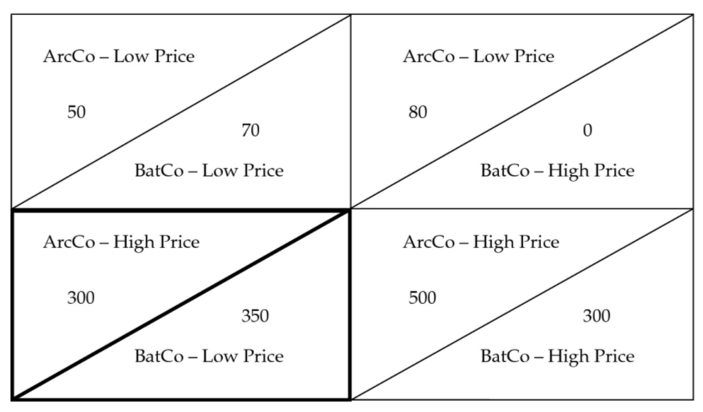
   >
   > The market outcomes for two firms in a duopoly is shown in the diagram. The lower left hand quadrant is the **Nash solution** when there is no collusion. However, with collusion, if ArcCo **shares at least enough of its profit** in the bottom right quadrant to provide BatCo more than it would receive in the lower left, it will be the optimal solution for the pair: the maximum joint profits will arise where *both firms charge high prices for the product*. 
   >
   > Nash equilibrium: participants in a non-cooperative game have no incentive to deviate from their respective strategies after they have considered and anticipated their opponent's rational choices or strategies

7. Each oligopoly firm faces an individual demand curve under:

   A.colluding market conditions only.

   **B.non-colluding market conditions only.**

   C.both colluding and non-colluding market conditions.

   > B. Correct because in an oligopoly market where **collusion** is present, the **aggregate market demand curve is divided** up by the individual production participants. Under **non-colluding** market conditions, each firm faces an **individual** demand curve.

8. According to the **Cournot** assumption, in an oligopoly market each firm determines its profit-maximizing production level by assuming that other firms will:

   A.decrease output.

   **B.not change output.**

   C.increase output.

   > B. Correct because in the Cournot assumption, each firm determines its profit-maximizing production level by assuming that the other firms' output will not change. This assumption simplifies pricing strategy because there is no need to guess what the other firm will do to retaliate.

9. After noting positive changes in the aggregate index of coincident economic indicators, an increase in the ratio of consumer installment debt to income would most likely help confirm that an expansion is:

   A.ending.

   **B.underway.**

   C.forthcoming.

   > The ratio of consumer installment debt to income is a lagging indicator. An increase in it, by itself, would be evidence that an upturn is already underway. This would confirm the implication of positive changes in coincident indicators that an expansion is in place.
   >
   > The ratio increases only after consumers have **already committed to borrowing**, which usually occurs during **previous periods of economic optimism and confidence**.
   >
   > Leading indicators:
   >
   > - 📈 **S&P 500 Index** → “**买股票就是买未来**”
   > - 🏠 **Building Permits** → 开工前必须先申请许可（未来住房建设信号）
   > - ⏰ **Average Weekly Hours, Manufacturing** → 工厂**提前加班**说明未来订单多
   >
   > Coincident indicators:
   >
   > - 💵 **Personal Income** → 收入变动实时反映经济活力
   > - 🏭 **Industrial Output/Production** → 工业产值是GDP的重要组成
   >
   > Lagging indicators (价格性的、失业率):
   >
   > - 💰 **Inflation** → 价格变动通常**在经济回升后出现**
   > - 🧑‍💼 **Unemployment Duration** → 公司通常在**经济萧条确认后**才裁员
   > - 📦 **Inventory-Sales Ratio** → 滞销品堆积反映过去销售减缓
   > - 🏦 **Prime Lending Rate** → 银行加息通常滞后于经济过热
   > - 🧾 **Unit Labor Cost** → 成本上升体现在**产出之后**

10. Based on typical labor utilization patterns across the business cycle, productivity (output per hours worked) is most likely to be highest:

    A.at the peak of a boom.

    B.into a maturing expansion.

    **C.at the bottom of a recession.**

    > C is correct. At the end of a recession, firms will run “**==lean production==**” to generate maximum output with the **fewest number of workers**.
    >
    > 高效生产

11. As the expansion phase of the business cycle advances from early stage to late stage, businesses most likely experience a decrease in:

    A.labor costs.

    B.capital investment.

    **C.availability of qualified workers.**

    > C is correct. When an economy’s expansion is well established, businesses often have difficulty finding qualified workers.
    >
    > Businesses struggle to find skilled, qualified employees because **most capable workers are already employed**.
    >
    > Businesses usually **continue investing** in equipment, machinery, and technology until clear signs of a slowdown appear.

12. An analyst writes in an economic report that the current phase of the business cycle is characterized by accelerating inflationary pressures and borrowing by companies. The analyst is most likely referring to the:

    **A.peak of the business cycle.**

    B.contraction phase of the business cycle.

    C.early expansion phase of the business cycle.

    > A is correct. Accelerating inflation and rapidly expanding capital expenditures typically characterize the peak of the business cycle. During such times, many businesses finance their capital expenditures with debt to expand their production capacity.
    >
    > Early expansion typically features:
    >
    > - Gradually **increasing economic activity**.
    > - Moderate inflationary pressures initially, as there is significant unused capacity.
    > - Gradually increasing borrowing, but not yet significant or rapidly accelerating.

13. Which one of the following trends in various economic indicators is most consistent with a recovery from a recession?

    A.A declining inventory–sales ratio and stable industrial production index

    B.A rising broad stock market index and unit labor costs turning from increasing to decreasing

    **C.A decrease in average weekly initial claims for unemployment insurance and an increase in aggregate real personal income**

    > C is correct. The **improving** **leading** indicator, **average weekly initial claims for unemployment insurance**, and the **improving** **coincident** indicator, **aggregate real personal income**, are most consistent with an economic recovery. Even though a declining **inventory-to-sales ratio**, a **lagging** indicator, is consistent with an early recovery, the **coincident** indicator, the *stable* **industrial production index**, does not support that conclusion. Although a rising stock market index can signal economic expansion, the lagging indicator, the unit labor costs, has peaked, which is more consistent with a recession.

14. When the spread between 10-year US Treasury yields and the short-term federal funds rate narrows and at the same time the prime rate stays unchanged, this mix of indicators most likely forecasts future economic:

    A.growth.

    **B.decline.**

    C.stability.

    > B is correct. The narrowing spread of this leading indicator foretells a drop in short-term rates and a fall in economic activity. The prime rate is a lagging indicator and typically moves after the economy turns.
    >
    > The **prime rate**, also known as the **prime lending rate**, is the interest rate that commercial banks charge their most creditworthy customers, typically large corporations and businesses with strong financial profiles. The prime rate is primarily a **short-term** interest rate.

15. During an economic recovery, a lagging unemployment rate is most likely attributable to:

    A.businesses quickly rehiring workers.

    **B.new job seekers entering the labor force.**

    C.underemployed workers transitioning to higher-paying jobs.

    > B is correct. In an economic recovery, new job seekers return to the labor force, and because they **seldom find work immediately**, their return may initially raise the unemployment rate.
    >
    > ❌ A – Businesses quickly rehiring workers: If businesses rapidly rehired workers, unemployment rates would promptly decline, not lag.
    >
    > ❌ C – Underemployed workers transitioning to higher-paying jobs: This describes improvements in job quality, not unemployment rates. Such transitions do not typically cause a lagging unemployment rate but would instead reflect economic strengthening clearly.

16. If a government increases its spending on domestically produced goods by an amount that is financed by an equivalent increase in taxes, the aggregate demand will most likely:

    A.decrease.

    B.remain unchanged.

    C.increase.

    > Aggregate demand rises when the government increases spending by the same amount as it raises taxes because the **marginal propensity to spend out of disposable income is less than 1**, and hence for every dollar less in disposable income, spending only falls by $c (where c is the marginal propensity to consume). Aggregate spending will fall less than the tax rise by a factor c. This additional output will, in turn, lead to further increases in income and output through the multiplier effect.

17. A contractionary fiscal policy will always involve which of the following?

    A.Balanced budget

    B.Reduction in government spending

    **C.Fall in the budget deficit or rise in the surplus**

    > C is correct. Note that a reduction in government spending could be accompanied by an even bigger fall in taxation, making it be expansionary.

18. In a hypothetical economy, consumption is 70% of **pre-tax income**, and the average tax rate is 25% of total income. If planned government expenditures are expected to increase by $1.25 billion, the increase in total income and spending, in billions, is closest to:

    A.\$1.3.

    **B.\$4.2.**

    C.\$2.6.

    > $c=0.7/(1-25\%)=0.9333$
    >
    > Fiscal multiplier = $\dfrac 1{1-c(1-T)}=\dfrac 1{1-0.9333*(1-25\%)}=4.1667$

19. Which one of the following statements is most accurate?

    A.Ricardian equivalence refers to individuals having no idea of future tax liabilities.

    B.Governments do not allow political pressures to influence fiscal policies but do allow voters to affect monetary policies.

    **C.If there is high unemployment in an economy, then easy monetary and fiscal policies should lead to an expansion in aggregate demand.**

    > C is correct. Note that **governments often allow pressure groups to affect fiscal policy** and that Ricardian equivalence involves individuals correctly anticipating future taxes. Thus, A and B are not correct choices.

20. The least likely explanation for why fiscal policy cannot stabilize aggregate demand completely is that:

    A.private sector behavior changes over time.

    **B.policy changes are implemented very quickly.**

    C.fiscal policy focuses more on inflation than on unemployment.

    > B is correct. Fiscal policy is subject to recognition, action, and impact lags.
    >
    > **Fiscal policy focuses more on inflation than on unemployment.**

21. As a monetary policy tool, quantitative easing (QE) will most likely help revive an ailing economy in which of the following environments?

    A.Deflationary trap

    **B.Declining bank reserves and economic activity**

    C.Liquidity trap

    > 1. Incorrect. Deflation is a pervasive and persistent fall in a general price index and is more difficult for conventional monetary policy to deal with than inflation. This is because once the monetary authority has cut nominal interest rates to zero to stimulate the economy, it cannot cut them any further. It is at this point that the economic conditions for a liquidity trap arise. Deflation raises the real value of debt, while the persistent fall in prices can encourage consumers to put off current consumption, leading to a fall in demand that leads to further deflationary pressure. Thus a **deflationary “trap”** can develop, which is characterized by weak consumption growth, falling prices, and increases in real debt levels.
    > 2. Correct. Quantitative easing (QE) is an “unconventional” approach to monetary policy and is operationally similar to open market purchase operations but conducted on a much larger scale. The additional reserves created by central banks in a policy of quantitative easing can be used to **buy any assets**. The idea is that this additional reserve will kick-start lending, causing broad money growth to expand, which will eventually lead to an increase in real economic activity.
    > 3. Incorrect. A **liquidity trap** is associated with occasions where the **demand for money becomes infinitely elastic**—that is, where the demand curve is horizontal and individuals are willing to hold additional money balances without any change in the interest rate—so that further injections of money into the economy will not serve to further lower interest rates or affect real activity. In this extreme circumstance, monetary policy can become completely ineffective.
    >
    > 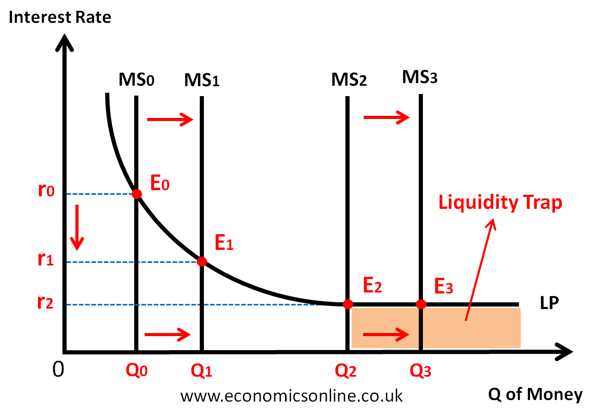

22. A developing country that maintains a fixed value for its currency relative to the US dollar is experiencing a decline in its economic activity, and its inflation rate falls below the level of inflation in the United States. The most likely result of the developing country’s actions to maintain the fixed exchange rate target is that its:

    A.money supply will contract.

    **B.short-term interest rates will fall.**

    C.foreign exchange reserves will decrease.

    > 1. Incorrect. With a decline in economic activity and domestic inflation, the currency of the developing country would start to rise against the dollar. To protect the exchange rate target, the developing country’s monetary authority will purchase foreign exchange reserves and sell its own currency. This will increase the domestic money supply, decrease short-term interest rates, and increase foreign exchange reserves.
    > 2. Correct. With a decline in economic activity and domestic inflation, the currency of the developing country would start to rise against the dollar. To protect the exchange rate target, the developing country’s monetary authority will purchase foreign exchange reserves and sell its own currency. This will increase the domestic money supply, decrease short-term interest rates, and increase foreign exchange reserves.
    > 3. Incorrect. With a decline in economic activity and domestic inflation, the currency of the developing country would start to rise against the dollar. To protect the exchange rate target, the developing country’s monetary authority will purchase foreign exchange reserves and sell its own currency. This will increase the domestic money supply, decrease short-term interest rates, and increase foreign exchange reserves.
    >
    > 这道题是说，一个国家采取固定汇率制，盯住美元。这个国家的经济活动正在下降，其通货膨胀率低于美国的通货膨胀水平。发展中国家采取行动维持固定汇率目标的最可能结果是：
    >
    > 
    >
    > 注意这里的前提，固定汇率制。根据购买力平价理论，**如果通胀率低于美国的话，本币是会升值的**。但是这个国家要使用固定汇率制，在本币有自身升值的势头的时候，**国家要采取让本币贬值的行动**。因此国家央行会抛售本国货币，这样市场上本国货币就多出来了，货币供应大了，短期利率就会下降。

23. If there is a policy rate of 3%, a real trend rate of growth in the underlying economy of 1%, and long-run expected inflation of 3%, then the central bank policy stance operating within a credible inflation-targeting regime is best described as:

    A.contractionary.

    B.neutral.

    **C.expansionary.**

    > 1. Incorrect because, with a contractionary policy stance, the central bank’s policy rate would be greater than the neutral rate. In this case, the policy rate of 3% is less than the neutral rate of 4% (1% trend growth plus 3% long-run inflation expectation), which is expansionary (not contractionary).
    > 2. Incorrect because, with a neutral policy stance, the central bank’s policy rate would be equal to the neutral rate. In this case, the policy rate of 3% is less than the neutral rate of 4% (1% trend growth plus 3% long-run inflation expectation), which is expansionary (not neutral).
    > 3. Correct. A real trend rate of growth of 1%, coupled with 3% long-run expected inflation, suggests a 4% **neutral rate** of interest that neither spurs on nor slows down the underlying economy. The 3% policy rate is less than the 4% neutral rate of interest. When the policy rate is below the neutral rate, monetary policy is described as expansionary.

24. The *least likely* limitation to the effectiveness of monetary policy is that central banks cannot:

    **A.accurately determine the neutral rate of interest.**

    B.regulate the willingness of financial institutions to lend.

    C.control amounts that economic agents deposit into banks.

    > A is correct. The inability to determine exactly the neutral rate of interest does not necessarily limit the power of monetary policy.

25. The transmission of a central bank’s policy rate action through the economy ultimately affects:

    **A.inflation.**

    B.total demand.

    C.long-term interest rates.

    > 1. Correct. The monetary transmission mechanism is the process whereby a central bank’s interest rate gets transmitted through the economy and ultimately affects the rate of increase of prices (inflation).
    > 2. Incorrect because, although policy rate actions do transmit through the economy by affecting total demand, this influence on total demand is an intermediate effect that drives subsequent domestic inflationary pressure. In effect, policy rate actions ultimately impact inflation through the avenue of total demand.
    > 3. Incorrect because although policy rate actions do transmit through the economy through the channel of market rates (both short-term and long-term interest rates), this is just one of four channels and multiple interconnected channel relationships that impacts total demand. In effect, policy rate actions ultimately impact inflation through the channel of market interest rates (including long-term interest rates).
    >
    > See: AD-AS Model. If the AD curve moves to the right, production will be higher and prices will also be higher.

26. The primary monetary policy goal of most major central banks is best characterized as:

    **A.maintaining price stability.**

    B.stimulating economic growth.

    C.maintaining low interest rates.

    > 1. Correct. The primary monetary policy goal of most major central banks is to maintain price stability.
    > 2. Incorrect. Though stimulating economic growth can be part of certain central banks objectives, the **overriding objective is maintaining price stability.**
    > 3. Incorrect. Central banks may have a variety of objectives, but the overriding one is maintaining price stability.

27. Which of the following is most likely a motivation for globalization?

    A.Increasing interdependence of supply chains

    B.Personal growth by expanding personal horizons

    C.Creating jobs in a new country and reducing them at home

    > 1. Incorrect because it is a cost of globalization, not a motivation. Through the process of greater economic and financial cooperation, companies may become dependent on other countries’ resources for their supply chains.
    > 2. Correct because non-state actors, such as companies and investors, who choose to participate in globalization consider three potential gains, including: intrinsic gain. One example of intrinsic gain is the personal growth or education that individuals may receive from expanding their horizons, experiencing new places, or learning new ideas.
    > 3. Incorrect because it is a cost of globalization, not a motivation. If a company moves a factory to another country, it creates jobs in the new country but reduces them at home, while firms in the new country may have to compete with the foreign firm for labor. Some actors will benefit from this exchange, but others may suffer.

28. Which organization will most likely aid a country that is experiencing an economically detrimental current account deficit?

    A.The World Bank

    B.The World Trade Organization

    C.The International Monetary Fund

    > 1. Incorrect. The World Bank’s main objective is to help developing countries fight poverty and enhance environmentally sound economic growth by providing **investment funds**. It does not intervene in balance-of-payments issues.
    > 2. Incorrect. The World Trade Organization **regulates cross-border trade** on a global scale. It does not intervene in balance-of-payments issues.
    > 3. Correct. The International Monetary Fund has the ability to **lend foreign currencies** to a country with an extreme current account deficit.

29. A US company expanding critical spare part inventories for local customers made at its existing Canadian facility after a supply chain disruption is most likely using the coping tactic of:

    A.reshoring the essentials.

    B.reglobalizing production.

    C.doubling down on key markets.

    > A is correct. The COVID-19 pandemic has highlighted the need for certain essential supply chains to be rebuilt domestically for emergency situations, with availability of critical spare parts being an analogy. The close integration of the US and Canadian economies through the revised USMCA agreement effectively makes expanded production at an existing Canadian factory an example of reducing manufacturing risk by relocating to home countries via reshoring. B is incorrect because instead of reducing manufacturing risk by duplicating or fortifying its supply chain, the company is simply continuing to use its existing capacity more intensively. C is incorrect because although the production is intended to better supply its home market, there is no evidence that the company is expanding its presence in the US market or shifting its focus to the exclusion of available opportunities elsewhere.

30. 

31. An example of a **geopolitical multifaceted** tool for furthering national interests is:

    A.cabotage.

    B.armed conflict.

    C.nationalization of key export industries.

    > A is correct. **==Cabotage== is the right to transport passengers or goods within a country by a *foreign* firm.** Many countries—including those with multilateral trade agreements—impose restrictions on cabotage across transportation subsectors, meaning that shippers, airlines, and truck drivers are not allowed to transport goods and services within another country’s borders. Allowing cabotage requires coordination on areas like physical security and economic coordination, a highly multilateral (multifaceted tool) process. 
    >
    > B is incorrect because armed conflict is the most extreme example of a **national security tool**. It can be either internal or external to a country in taking a direct and active approach to wielding influence. 
    >
    > C is incorrect because nationalization of key export industries is an **economic tool**. This process of transferring an activity or industry from private to state control is a **non-cooperative** approach to asserting economic control.

32. Which of these is most likely to be described as an event risk?

    A.An earthquake

    **B.An election**

    C.An ongoing civil war

    > B is correct. Event risk evolves around set dates, such as elections and new legislation, or other date-driven milestones, such as holidays or political anniversaries known in advance. The other choices could not be known in advance. An earthquake (A) is an example of an exogenous risk. An ongoing civil war (C) is an example of a **thematic risk** (a period of time).

33. Which of the following is most likely a tool of geopolitics that promotes globalization and cooperation?

    A.Export subsidies

    **B.Multilateral trade agreements**

    C.Collective security agreements

    > 1. Incorrect because export subsidies are a tool of geopolitics that is consistent with globalization and non-cooperation.
    > 2. Correct because multilateral trade agreements, such as the World Trade Organization (WTO), are a tool of geopolitics that is consistent with globalization and cooperation.
    > 3. Incorrect because collective security agreements, such as the North Atlantic Treaty Organization (NATO), are a tool of geopolitics that is consistent with cooperation and **nationalism**.

34. Which of the following statements about geopolitical threats in the investment environment is most accurate?

    A.Geopolitical risk is not always present in the investment environment.

    **B.Highly collaborative, interconnected countries are vulnerable to geopolitical risk.**

    C.Geopolitical risk tends to have less of an impact on markets already experiencing a general contraction or economic downturn.

    > B is correct. Although highly collaborative and globalized countries are, on balance, less likely to experience geopolitical risk because the political, economic, and financial costs of partners inflicting those risks are higher than less collaborative countries, **the same interconnectedness may make them more vulnerable to geopolitical risk**. 
    >
    > A is incorrect because geopolitical risk is always present in the investment environment. 
    >
    > C is incorrect because geopolitical risk tends to have a **greater** impact on markets already experiencing a general contraction or economic downturn.

35. An applicable conclusion drawn from the Geopolitical Risk Index (GPR) is that:

    **A.high geopolitical risk results in tangible macroeconomic effects.**

    B.recurring geopolitical risk events lead to reduced corporate investment.

    C.the adverse impact of actual events is greater over time than that of the threat of such events.

    > A is correct. The GPR creators found that high levels of geopolitical risk reduce US investment, employment, and price level of the stock market. 
    >
    > B is incorrect because firms reduce investment in the wake of **idiosyncratic** events, which would be unlikely to repeat. 
    >
    > C is incorrect because the **threat** of an event was shown to have a larger impact over time than that of the actual events themselves.

36. The basic geopolitical risk type most likely in comparison to have the smallest degree of uncertainty is:

    A.exogenous risk.

    **B.event risk.**

    C.thematic risk.

    > B is correct. Event risk evolves around set dates, such as elections or new legislation, or other date-driven milestones, such as holidays or political anniversaries. Analysts can thus look to political calendars as a predictable starting point for determining the occurrence of event risk, with time to devise a suitable response.
    >
    > A is incorrect because exogenous risk is sudden and unanticipated. Examples include sudden uprisings, invasions, or the aftermath of natural disasters. The timing and range of its effects thus have the greatest unknowns. 
    >
    > C is incorrect because thematic risks are known risks that evolve and expand over a period of time. Climate change, pattern migration, the rise of populist forces, and the ongoing threat of terrorism fall into this category. These are more foreseeable than exogenous risks, but with their **extended interval of exposure**, planned responses likely require **continual adjustments** (continual uncertainty).

37. A small country has a comparative advantage in the production of pencils. The government establishes an export subsidy for pencils to promote economic growth. Which of the following will be the most likely result of this policy?

    A.As new domestic producers enter the pencils market, supply will increase and domestic prices will decline.

    B.The increase in the domestic producer surplus will exceed the sum of the subsidy and the decrease in the domestic consumer surplus.

    **C.Although domestic producers will receive a net benefit, the policy will give rise to inefficiencies that cause a deadweight loss to the national welfare.**

    > 1. Incorrect. Producers shift output from the domestic to the export market to capture the subsidy. Furthermore, as a small country, the domestic market is a price taker and thus consumers pay the international price plus the subsidy causing the domestic price to rise.
    > 2. Incorrect. As prices rise and producers increase production beyond the efficient level, efficiencies diminish. National welfare must decline, as the increase in producer surplus is less than the combined cost to consumer and government.
    > 3. Correct. Export subsidies interfere with the functioning of the free market and result in a deadweight loss to society. The deadweight loss arises on the producer side because the higher subsidized price causes inefficient producers to remain in the market. On the consumer side, the higher price causes those that would have purchased at the lower price to be shut out of the market.

38. Which of the following statements best describes the costs of international trade?

    A.Countries without an absolute advantage in producing a good cannot benefit significantly from international trade.

    **B.Resources may need to be allocated into or out of an industry and less-efficient companies may be forced to exit an industry, which in turn may lead to higher unemployment.**

    C.Loss of manufacturing jobs in developed countries as a result of import competition means that developed countries benefit far less than developing countries from trade.

    > B is correct. Resources may need to be reallocated into or out of an industry, depending on whether that industry is an exporting sector or an import-competing sector of that economy. As a result of this adjustment process, less-efficient companies may be forced to exit the industry, which in turn may lead to higher unemployment and the need for retraining so that displaced workers may find jobs in expanding industries.

39. A large country can:

    **A.benefit by imposing a tariff.**

    B.benefit with an export subsidy.

    C.not benefit from any trade restriction.

    > A is correct. By definition, a large country is big enough to affect the world price of its imports and exports. A large country can benefit by imposing a tariff if its terms of trade improve by enough to outweigh the welfare loss arising from inefficient allocation of resources.

40. In the classification of currency regimes, a currency board system (CBS) most likely differs from a fixed-rate parity system in that:

    A.a CBS has a discretionary target level of foreign exchange reserves.

    B.a CBS can peg to a basket of currencies but a fixed-rate system cannot.

    **C.the monetary authority within a CBS does not act as a traditional lender of last resort.**

    > 1. Incorrect. **In a fixed parity system the monetary authority has a discretionary target level of reserves**, but in a CBS it does not because there is a **commitment to exchange domestic currency for a specified foreign currency at a fixed exchange rate**.
    > 2. Incorrect. It is **the fixed-rate system that can use ==a basket of currencies== for the peg**.
    > 3. Correct. In a CBS, the monetary authority has an obligation to maintain 100% foreign currency reserves against the monetary base. It therefore cannot lend to troubled financial institutions. As long as the country under a fixed parity regime maintains its exchange peg, the central bank can serve as a lender of last resort.
    >
    > Currency Board System (CBS):
    >
    > - A CBS is a rigid form of fixed exchange rate regime where the country’s monetary base is fully backed by foreign currency reserves at a fixed exchange rate.
    > - Key characteristics:
    >   - Strict rule-based — no discretionary monetary policy.
    >   - The monetary authority cannot print money unless fully backed by foreign reserves.
    >   - It does not function as a lender of last resort, because it cannot inject liquidity at will.
    >
    > Fixed-rate Parity System:
    >
    > - More flexible than a CBS.
    > - Central banks maintain a fixed or tightly managed exchange rate, but still retain some discretion over:
    >   - Open market operations
    >   - Lender-of-last-resort functions
    >   - Money supply management

41. Which of the following is most likely a characteristic of a country that follows the dollarization exchange rate regime? The country:

    A.is able to monetize its domestic debt.

    **B.has the currency credibility of the US dollar.**

    C.has a term structure similar to that of the United States.

    > 1. Incorrect. Adopting the US currency will impose fiscal discipline, preventing the government from monetizing its debt.
    > 2. Correct. When a country adopts the US currency as its currency, hence the name dollarization, the dollarized country inherits the currency credibility of the US dollar.
    > 3. Incorrect. The interest rates in a country that adopts the US currency as its currency are generally not the same as in the United States.

42. Assume that the nominal spot exchange rate (USD/EUR) increases by 7.5%, the eurozone price level decreases by 4%, and the US price level increases by 2.5%. The change in the real exchange rate (%) is closest to:

    A.–6.3%.

    **B.0.7%.**

    C.14.8%.

    > 想象你想比较在中国和美国买一篮子商品的成本：
    >
    > - 在**中国**：成本是$P_d$（人民币计价）
    > - 在**美国**：成本是$P_f$（美元计价），你需要先用人民币兑换美元 ⇒ 成本变成$E \cdot P_f$（以人民币表示）
    >
    > 于是你就有了：
    > $$
    > \text{RER} = \frac{\text{外国商品的人民币成本}}{\text{本国商品的人民币成本}} = \frac{E \cdot P_f}{P_d}
    > $$
    >
    > 1. Incorrect because the change in the nominal exchange rate is not included: (1 – 4%)/(1 + 2.5%) – 1= –6.3%.
    >
    > 2. Correct.
    >
    >    Real exchange rate = Nominal spot exchange rate × (CPI of the foreign country/CPI of the domestic country)
    >
    >    Change in the real exchange rate = [(1 + Change in exchange rate) × (1 + Change in price level in foreign country)]/(1 + Change in price level in domestic country) – 1 = [(1 + 7.5%) × (1 – 4%)]/(1 + 2.5%) – 1 = 0.7%
    >
    > 3. Incorrect because the change in the price levels are inverted: [(1 + 7.5%) × (1 + 2.5%)[/(1 – 4%) – 1= 14.8%.

43. Which market participants are most likely to limit the use of leverage in the management of their accounts?

    **A.Exchange-traded funds**

    B.Commodity trading advisers

    C.Bank proprietary trading desks

    > 1. Correct. Exchange-traded funds are part of a class of institutional investors referred to as real money accounts. They are usually restricted in their use of leverage or financial derivatives in their accounts.
    > 2. Incorrect. Commodity trading advisers are part of the professional trading community that uses leverage or financial derivatives in the management of their accounts.
    > 3. Incorrect. ==Proprietary trading desks== (自营交易部门) at banks are part of the professional trading community that uses leverage or financial derivatives in the management of their accounts.

44. A New Zealand traveler returned from Singapore with SGD7,500 (Singapore dollars). A foreign exchange dealer provided the traveler with the following quotes:

    | Ratio   | Spot Rates |
    | ------- | ---------- |
    | USD/SGD | 1.2600     |
    | NZD/USD | 0.7670     |

    The amount of New Zealand dollars (NZD) that the traveler would receive for his Singapore dollars is closest to:

    A.NZD4,565.

    **B.NZD7,248.**

    C.NZD7,761.

    > SGD 7,500 = 7,500\*1.2600 = USD 9,450 = 9,450\*0.7670 = NZD 7,248.15

45. A research report produced by a dealer includes the following exchange rates:

    |         | **Spot Rate** | **Expected Spot Rate in One Year** |
    | ------- | ------------- | ---------------------------------- |
    | USD/EUR | 1.3960        | 1.3860                             |
    | USD/CAD | 1.0110        | 1.0300                             |
    | EUR/GBP | 1.2850        | 1.2790                             |

    The expected appreciation (%) of the Canadian dollar (CAD) relative to the British pound (GBP) is *closest* to:

    A.–3.00

    B.0.70.

    **C.3.09.**

    > 1. Incorrect. It calculates the spot and expected spot rates correctly, but uses GBP as the base currency: Appreciation of CAD/GBP = 1.7211/1.7743 – 1 = –3.00%.
    >
    > 2. Incorrect. The appreciation of the individual exchange rates are summed: –0.72 +1.88 – 0.44 = 0.72.
    >
    > 3. **Correct.**
    >
    >    |                                                              | **Spot Rate** | **Expected Spot Rate in One Year**    | **Appreciation: Expected/Spot – 1** |
    >    | ------------------------------------------------------------ | ------------- | ------------------------------------- | ----------------------------------- |
    >    | USD/EUR                                                      | 1.3960        | 1.3860                                | –0.72%                              |
    >    | USD/CAD                                                      | 1.0110        | 1.0300                                | 1.88%                               |
    >    | EUR/GBP                                                      | 1.2850        | 1.2790                                | –0.44%                              |
    >    | CAD/GBP                                                      | **=**         | **[(USD/EUR) × (EUR/GBP)]/(USD/CAD)** |                                     |
    >    | CAD/GBP                                                      | 1.7743        | 1.7211                                | –2.99%                              |
    >    | GBP/CAD*                                                     | 0.5636        | 0.5810                                | **3.09%**                           |
    >    | ** Canadian dollar is the base currency and the British pound is the price currency* |               |                                       |                                     |
    >
    >    CAD/GBP = [(USD/EUR) × (EUR/GBP)]/(USD/CAD)
    >
    >    Spot Rate of CAD/GBP = (1.3960 × 1.2850)/1.0110 = 1.7743
    >
    >    Expected Spot Rate of CAD/GBP = (1.3860 ×1.2790)/1.0300 = 1.7211
    >
    >    **To determine the appreciation of the Canadian dollar (CAD) ==relative to the British pound==, the ==British pound (GBP) is the price currency== and the Canadian dollar is the base currency**, giving rise to the following calculation:
    >
    >    1/1.72111/1.7743−1=1.77431.7211−1=3.09%

46. A BRL/MXN spot rate is listed by a dealer at 0.1378. The six-month forward rate is 0.14193. The six-month forward points are closest to:

    A.–41.3.

    **B.+41.3.**

    C.+299.7.

    > B is correct. The number of forward points equals the forward rate minus the spot rate, or 0.14193 – 0.1378 = 0.00413, multiplied by 10,000: 10,000 × 0.00413= 41.3 points. By convention, forward points are scaled so that ±1 forward point corresponds to a change of ±1 in the **last decimal place** of the spot exchange rate.

47. Which of the following statements is *most* accurate based on the FX quotations in the table?

    |         | **Spot Rate** | **1-Year Forward Rate** |
    | ------- | ------------- | ----------------------- |
    | USD/EUR | 1.2952        | 1.3001                  |

    **A.The euro is trading at a ==forward premium== of 49 points**

    B.The US dollar is trading at a forward premium of 49 points

    C.The forward rate is trading at a discount to the spot rate by 0.0049 points

    > A. Correct. Forward premium = Forward rate – Spot rate = 1.3001 – 1.2952 = 0.0049. To convert to points, scale four decimal places—that is, multiply by 10,000 = 10,000 × 0.0049 = 49 points. Because the forward rate exceeds the spot rate for the base currency (euro), the euro is trading at a forward premium of 49 points.

48. A forward premium indicates: 

    A.an expected increase in demand for the base currency.

    B.the interest rate is higher in the base currency than in the price currency.

    **C.the interest rate is higher in the price currency than in the base currency.**

    > **C is correct.** To eliminate arbitrage opportunities, the spot exchange rate (*S*), the forward exchange rate (*F*), the interest rate in the base currency (rd, and the interest rate in the price currency (rf) must satisfy:
    >
    > Ff/d/ Sf/d = (1+rfτ / 1+rdτ).
    >
    > According to this formula, the base currency will trade at forward premium (*F* > *S*) if, and only if, the interest rate in the price currency is higher than the interest rate in the base currency (rf > rd).

# Quantitative Methods

1. A fund receives investments at the beginning of each year and generates returns for three years as follows:

   Exhibit 1:

   Investments and Returns for Three Years

   | **Year of Investment** | **Assets under Management at the Beginning of each year** | **Return during Year of Investment** |
   | :--------------------- | :-------------------------------------------------------: | :----------------------------------: |
   | 1                      |                         USD1,000                          |                 15%                  |
   | 2                      |                         USD4,000                          |                 14%                  |
   | 3                      |                         USD45,000                         |                 −4%                  |

   Which return measure over the three-year period is negative?

   1. A.Geometric mean return
   2. B.Time-weighted rate of return
   3. **C.Money-weighted rate of return**

   > **C is correct.** The money-weighted rate of return considers both the timing and amounts of investments into the fund. To calculate the money-weighted rate of return, tabulate the annual returns and investment amounts to determine the cash flows.
   >
   > | **Year**                             |  **1**   |  **2**   |   **3**   |
   > | :----------------------------------- | :------: | :------: | :-------: |
   > | Balance from previous year           |    0     | USD1,150 | USD4,560  |
   > | New investment                       | USD1,000 | USD2,850 | USD40,440 |
   > | Net balance at the beginning of year | USD1,000 | USD4,000 | USD45,000 |
   > | Investment return for the year       |   15%    |   14%    |    −4%    |
   > | Investment gain (loss)               |  USD150  |  USD560  | −USD1,800 |
   > | Balance at the end of year           | USD1,150 | USD4,560 | USD43,200 |
   >
   > CF0 = –USD1,000, CF1 = –USD2,850, CF2 = –USD40,440, CF3 = +USD43,200.CF0=−1,000CF1=−2,850CF2=−40,440CF3=+43,200CF0(1+IRR)0+CF1(1+IRR)1+CF2(1+IRR)2+CF3(1+𝐼𝑅𝑅)3=−1,0001+−2,850(1+IRR)1+−40,440(1+IRR)2+43,200(1+IRR)3=0.
   >
   > Solving for *IRR* results in a value of *IRR* = −2.22 percent.
   >
   > Note that A and B are incorrect because the time-weighted rate of return (TWR) of the fund is the same as the geometric mean return of the fund and is positive:
   >
   > 𝑅TW=(1.15)(1.14)(0.96)‾‾‾‾‾‾‾‾‾‾‾‾‾‾‾‾√3−1=7.97%.

1. An investor is evaluating the returns of three recently formed ETFs. Selected return information on the ETFs is presented in Exhibit 20:

   Exhibit 1:

   Returns on ETFs

   | **ETF** | **Time Since Inception** | **Return Since Inception (%)** |
   | :------ | :----------------------: | :----------------------------: |
   | 1       |         125 days         |              4.25              |
   | 2       |         8 weeks          |              1.95              |
   | 3       |        16 months         |             17.18              |

   Which ETF has the highest annualized rate of return?

   A.ETF 1

   **B.ETF 2**

   C.ETF 3

   > **B is correct.** The annualized rate of return for
   >
   > ETF 1 annualized return = (1.0425365/125) – 1 = 12.92%ETF 2 annualized return = (1.019552/8) − 1 = 13.37%ETF 3 annualized return = (1.171812/16) – 1 = 12.63%
   >
   > Despite having the lowest value for the periodic rate, ETF 2 has the highest annualized rate of return because of the reinvestment rate assumption and the compounding of the periodic rate.

1. The quarterly returns on a portfolio are as follows:

   | **Quarter** | **1** | **2** | **3** | **4** |
   | ----------- | ----- | ----- | ----- | ----- |
   | Return      | 20%   | -20%  | 10%   | -10%  |

   The **time-weighted rate of return** of the portfolio is *closest* to:

   **A.−5.0%.**

   B.−1.3%.

   C.0.0%.

   > A. Correct. The time-weighted rate of return of this portfolio = (1 + *r*1)(1 + *r*2)(1 + *r*3)(1 + *r*4) − 1,where *r*1 = holding period return (HPR) for the first quarter, second quarter, and so on:
   >
   > = (1 + 0.20)(1 − 0.20)(1 + 0.10)(1 − 0.10) − 1
   >
   > = −4.96% (or ~ −5.0%).

1. An investment manager’s gross return is:

   A.an after-tax nominal, risk-adjusted return.

   B.the return earned by the manager prior to deduction of trading expenses.

   **C.an often used measure of an investment manager’s skill because it does not include expenses related to management or administration.**

   > C is correct. Gross returns are calculated on a pre-tax basis; trading expenses *are* accounted for in the computation of gross returns as they contribute directly to the returns earned by the manager. A is incorrect because investment managers’ gross returns are pre-tax and not adjusted for risk. B is incorrect because **managers’ gross returns do reflect the deduction of trading expenses since they contribute directly to the return earned by the manager**.

1. If a client controls the timing of cash flows into and out of a portfolio, which of the following is *most* appropriate when evaluating the performance of the portfolio manager?

   **A.Time-weighted rate of return**

   B.Arithmetic mean rate of return

   C.Money-weighted rate of return

   > 1. **Correct** because the time-weighted rate of return is the preferred performance measure as it **neutralizes the effect of cash withdrawals or additions to the portfolio, which are generally outside of the control of the portfolio manager**.
   > 2. Incorrect because the arithmetic return is biased upward. For the evaluation of portfolios of publicly traded securities, the time-weighted rate of return is the preferred performance measure.
   > 3. Incorrect because investment managers find time-weighted returns more meaningful. If a client gives an investment manager more funds to invest at an unfavorable time, the manager’s money-weighted rate of return will tend to be depressed. If a client adds funds at a favorable time, the money-weighted return will tend to be elevated. The time-weighted rate of return removes these effects.

1. At the beginning of the year, an investor holds EUR10,000 in a hedge fund. The investor borrowed 25 percent of the purchase price, EUR2,500, at an annual interest rate of 6 percent and expects to pay a 30 percent tax on the return she earns from his investment. At the end of the year, the hedge fund reported the information in Exhibit 22:

   Exhibit 1:

   Hedge Fund Investment

   | Gross return                           | 8.46% |
   | -------------------------------------- | ----- |
   | Trading expenses                       | 1.10% |
   | Managerial and administrative expenses | 1.60% |

   The investor’s after-tax return on the hedge fund investment is closest to:

   A.3.60 percent.

   B.3.98 percent.

   **C.5.00 percent.**

   > **C is correct.** The first step is to compute the investor’s net return from the hedge fund investment. The net return is the fund’s gross return less managerial and administrative expenses of 1.60 percent, or 8.46% – 1.60% = 6.86%. Note that **trading expenses are already reflected in the gross return, so they are not subtracted.**
   >
   > The second step is to compute the investor’s leveraged return (the investor borrowed EUR2,500 (25 percent) of the purchase), calculated as: follows
   >
   > 𝑅𝐿=𝑅𝑝+𝑉𝐵𝑉𝐸(𝑅𝑝−𝑟𝐷) 𝑅𝐿=6.86% + 𝐸𝑈𝑅2,500 𝐸𝑈𝑅7,500(6.86%− 6%)𝑅𝐿= 6.86% + 0.33×0.86% = 7.15%.
   >
   > The final step is to compute the after-tax return:
   >
   > After-tax return = 7.15% (1 – 0.30) = 5.00%.

1. Consider a Swiss Confederation zero-coupon bond with a par value of CHF100, a remaining time to maturity of 12 years and a price of CHF89. **In three years’ time** (未来3年里), the bond is expected to have a price of CHF95.25. If purchased today, the bond’s expected annualized return is *closest* to:

   A.0.58 percent.

   B.1.64 percent.

   **C.2.29 percent.**

   > **C is correct.** The FV of the bond is CHF95.25, the PV is CHF89, and the number of annual periods (*t*) is 3. Using Equation 18,
   >
   > 2.29 percent = (92.25/89)(1/3) − 1.
   >
   > A is incorrect as the result is derived using *t* of 12. B is incorrect as this result is derived using a PV of CHF95.25 and an FV of 100.

1. Consider the results of an analysis focusing on the market capitalizations of a sample of 100 firms:

   Exhibit 1:

   Market Capitalization of a Sample of 100 Firms

   |     **Bin**     | **Cumulative Percentage of Sample (%)** | **Market Capitalization (euro billions)** | **Number of Observations** |      |
   | :-------------: | :-------------------------------------: | :---------------------------------------: | :------------------------: | ---- |
   | **Lower Bound** |             **Upper Bound**             |                                           |                            |      |
   |        1        |                    5                    |                   0.28                    |           15.45            | 5    |
   |        2        |                   10                    |                   15.45                   |           21.22            | 5    |
   |        3        |                   15                    |                   21.22                   |           29.37            | 5    |
   |        4        |                   20                    |                   29.37                   |           32.57            | 5    |
   |        5        |                   25                    |                   32.57                   |           34.72            | 5    |
   |        6        |                   30                    |                   34.72                   |           37.58            | 5    |
   |        7        |                   35                    |                   37.58                   |           39.90            | 5    |
   |        8        |                   40                    |                   39.90                   |           41.57            | 5    |
   |        9        |                   45                    |                   41.57                   |           44.86            | 5    |
   |       10        |                   50                    |                   44.86                   |           46.88            | 5    |
   |       11        |                   55                    |                   46.88                   |           49.40            | 5    |
   |       12        |                   60                    |                   49.40                   |           51.27            | 5    |
   |       13        |                   65                    |                   51.27                   |           53.58            | 5    |
   |       14        |                   70                    |                   53.58                   |           56.66            | 5    |
   |       15        |                   75                    |                   56.66                   |           58.34            | 5    |
   |       16        |                   80                    |                   58.34                   |           63.10            | 5    |
   |       17        |                   85                    |                   63.10                   |           67.06            | 5    |
   |       18        |                   90                    |                   67.06                   |           73.00            | 5    |
   |       19        |                   95                    |                   73.00                   |           81.62            | 5    |
   |       20        |                   100                   |                   81.62                   |           96.85            | 5    |

   The tenth percentile corresponds to observations in bin(s):

   A.2.

   **B.1 and 2.**

   C.19 and 20.

   > **B is correct.** The tenth percentile corresponds to the **lowest 10 percent of the observations** in the sample, which are in bins 1 and 2.

1. The following table shows the volatility of a series of funds that belong to the same peer group, ranked in ascending order:

   | **Fund** | **Volatility (%)** |
   | -------- | ------------------ |
   | Fund 1   | 9.81               |
   | Fund 2   | 10.12              |
   | Fund 3   | 10.84              |
   | Fund 4   | 11.33              |
   | Fund 5   | 12.25              |
   | Fund 6   | 13.39              |
   | Fund 7   | 13.42              |
   | Fund 8   | 13.99              |
   | Fund 9   | 14.47              |
   | Fund 10  | 14.85              |
   | Fund 11  | 15.00              |
   | Fund 12  | 17.36              |
   | Fund 13  | 17.98              |

   The approximate value of the first quintile is *closest* to:

   **A.10.70%.**

   B.11.09%.

   C.10.84%.

   > **A. Correct**. The position of the first quintile is found with the following formula:
   >
   > Ly = (n + 1) × (y/100),where
   >
   > *y* = the percentage point at which the distribution is divided. In this case, *y* = 20, which corresponds to the 20th percentile (first quintile)
   >
   > *n* = the number of observations (funds) in the peer group. In this case, *n* = 13
   >
   > *L*20 = the location of the 20th percentile (first quintile)
   >
   > *L*20 = (13 + 1) × (20/100) = 2.80.
   >
   > Therefore, the location of the first quintile is between the volatility of Fund 2 and Fund 3 (because they are ranked in ascending order).
   >
   > Linear interpolation is used to find the approximate value of the first quintile:
   >
   > *P20* ≈ *X*2 + (2.80 − 2) × (*X*3 − *X*2) where
   >
   > *X*2 = the volatility of Fund 2
   >
   > *X*3 = the volatility of Fund 3
   >
   > *P*20 = the approximate value of the first quintile
   >
   > *P*20 ≈ 10.12% + (2.80 − 2) × (10.84% − 10.12%) = 10.70%
   >
   > **==Why use (n + 1) instead of just n?==**
   >
   > - The formula assumes **linear interpolation between ranks**, including **beyond the last data point**.
   > - Using **(n + 1)** spreads the distribution evenly, which improves the approximation especially for small datasets.

1. An analyst gathers the following information about a portfolio's returns:

   | **Year** | **Return** |
   | -------- | ---------- |
   | 1        | 6%         |
   | 2        | 7%         |
   | 3        | 3%         |
   | 4        | 2%         |
   | 5        | 4%         |

   If the target return is 5%, the target downside deviation is *closest* to:

   A.1.7%.

   **B.1.9%.**

   C.2.2%.

   > **B Correct** because the formula for target downside deviation is $\sqrt{\dfrac 1{\color{red}{n-1}}\sum(X_i-B)^2}$, where *Xi* is the return for the period, *B* is the target return and *n* is the total number of sample observations. Moreover, the summation is taken over only those observations (*Xi*) that are less than or equal to the target *B*.
   >
   > | **Year** | **Return (%)** | **Deviations from the target** | **Squared deviations** |
   > | -------- | -------------- | ------------------------------ | ---------------------- |
   > |          |                |                                |                        |
   > | 1        | 6              | 0                              | 0                      |
   > | 2        | 7              | 0                              | 0                      |
   > | 3        | 3              | –2                             | 4                      |
   > | 4        | 2              | –3                             | 9                      |
   > | 5        | 4              | –1                             | 1                      |
   >
   > Since the sum of squared deviations is 14, the target downside deviation = [14/(5 – 1)]0.5, resulting in 1.87% ≈ 1.9%.

1. A fund had the following experience over the past 10 years:

    Exhibit 1:

    Performance over 10 Years

    | **Year** | **Return** |
    | :------- | :--------: |
    | 1        |    4.5%    |
    | 2        |    6.0%    |
    | 3        |    1.5%    |
    | 4        |   −2.0%    |
    | 5        |    0.0%    |
    | 6        |    4.5%    |
    | 7        |    3.5%    |
    | 8        |    2.5%    |
    | 9        |    5.5%    |
    | 10       |    4.0%    |

    The target **==semideviation==** of the returns over the 10 years, if the target is 2 percent, is *closest* to:

    A.1.42 percent.

    B.1.50 percent.

    C.2.01 percent.

    **B is correct.** The target semideviation of the returns over the 10 years with a target of 2 percent is calculated as follows:

    | **Year** | **Return** | **Deviation Squared ==below Target== of 2%** |
    | :------: | :--------: | :------------------------------------------: |
    |    1     |    4.5%    |                                              |
    |    2     |    6.0%    |                                              |
    |    3     |    1.5%    |                   0.000025                   |
    |    4     |   −2.0%    |                   0.001600                   |
    |    5     |    0.0%    |                   0.000400                   |
    |    6     |    4.5%    |                                              |
    |    7     |    3.5%    |                                              |
    |    8     |    2.5%    |                                              |
    |    9     |    5.5%    |                                              |
    |    10    |    4.0%    |                                              |
    |   Sum    |            |                   0.002025                   |

    The target semideviation is the square root of the sum of the squared deviations from the target, divided by *n* − 1:
    $$
    s_{\text{target}}=\sqrt{\dfrac{0.002025}{(10-1)}}=1.5\%
    $$

1. An investor wants to maximize the possibility of earning at least 5% on her investments each year.

    | **Portfolio** | **Expected Return** | **Standard Deviation** | **Roy’s Safety-First Ratio** |
    | ------------- | ------------------- | ---------------------- | ---------------------------- |
    | 1             | ---                 | ---                    | 0.35                         |
    | 2             | ---                 | ---                    | 0.64                         |
    | 3             | 22%                 | 40%                    | ??                           |

    Using **==Roy’s safety-first criterion==**, the *most* appropriate choice for the investor is portfolio:

    A.3.

    **B.2.**

    C.1.

    > 1. Incorrect because 0.425 is less than 0.64.
    >
    > 2. **Correct.** The portfolio with the highest **==safety-first ratio (SFRatio)==** is preferred. The SFRatio is calculated by subtracting the threshold return (*RL*) from the expected return [*E*(*RP*)] and dividing by the standard deviation (σ*P*).
    >
    >    $\text{SFRatio}=\dfrac{\mathbb E[R_p]-R_L}{\sigma_P}$. For the choices given:
    >
    >    |                              | **Portfolio 1** | **Portfolio 2** | **Portfolio 3**   |
    >    | ---------------------------- | --------------- | --------------- | ----------------- |
    >    | Roy’s Safety First Criterion | 0.35            | **0.64**        | 0.425=[(22-5)/40] |
    >
    > 3. Incorrect because 0.35 is less than 0.64.

1. The following sample of 10 items is selected from a population. The population variance is unknown.

    | 10   | 20   | –8   | 2    | –9   | 5    | 0    | –8   | 3    | 21   |
    | ---- | ---- | ---- | ---- | ---- | ---- | ---- | ---- | ---- | ---- |
    |      |      |      |      |      |      |      |      |      |      |

    The standard error of the sample mean is *closest* to:

    **A.3.60.**

    B.3.43.

    C.10.84.

    > **A. Correct.** When the population variance is unknown, the standard error of the sample mean is calculated as $s_{\bar X}=\dfrac s{\sqrt n}$, where *s* is the sample standard deviation and *n* is the size of the sample. The sample standard deviation is $s=\sqrt{\sum(X_i-\bar X)^2/(n-1)}$. 

1. Compared with bootstrap resampling, **==jackknife==** resampling:

    A.is done with replacement.

    **B.usually requires that the number of repetitions is equal to the sample size.**

    C.produces dissimilar results for every run because resamples are randomly drawn.

    > **B is correct.** For a sample of size *n*, jackknife resampling usually requires *n* repetitions. In contrast, with bootstrap resampling, we are left to determine how many repetitions are appropriate.

1. Which of the following factors is **not** used in the calculation of a confidence interval?

    A.Point estimate

    **B.Sampling error**

    C.Reliability factor

    > 1. Incorrect because a point estimate is used to calculate a confidence interval; Point estimate ± **==Reliability factor==** × Standard error = confidence interval.
    > 2. **Correct** because a confidence interval for a parameter is calculated as: Point estimate ± Reliability factor × Standard error, where standard error is the standard error of the sample statistic providing the point estimate. Thus, sampling error is not part of the calculation. Sampling error is the difference between the observed value of a statistic and the quantity it is intended to estimate. It is because of sampling error that confidence intervals are used.
    > 3. Incorrect because a reliability factor is used to calculate a confidence interval; Point estimate ± Reliability factor × Standard error = confidence interval.

1. Which of the following is *most likely* to be an explanation of the power of a test? The power of a test is the probability of:

    **A.rejecting the null when it is false.**

    B.not accepting the alternative when it is false.

    C.a Type I error.

1. The probability of correctly rejecting a false null hypothesis is *best* described as one minus the:

    A.test statistic's *p*-value.

    B.probability of a Type I error.

    **C.probability of a Type II error.**

    > 1. Incorrect because the power of the test is equal to one minus the probability of Type II error. The *p*-value is a measure of Type I error and is synonymous with distracter B.
    > 2. Incorrect because the power of the test is equal to one minus the probability of Type II error. The *p*-value is a measure of Type I error and is synonymous with distracter B.
    > 3. **Correct** because the power of a test is the probability of correctly rejecting the null–that is, the probability of rejecting the null when it is false. Failing to reject the null hypothesis when it is false is a Type II error. So the power of the test is equal to one minus the probability of Type II error.
    >
    > 

1. Which of the following statements regarding the null hypothesis is correct?

    A.It can be stated as “not equal to” provided the alternative hypothesis is stated as “equal to.”

    **B.Along with the alternative hypothesis, it considers all possible values of the population parameter.**

    C.In a two-tailed test, it is rejected when evidence supports equality between the hypothesized value and the population parameter.

    > A is incorrect because **the null hypothesis must always include the equality sign** (less than or equal to, equal to, or greater than or equal to). 

1. Which of the following statements regarding a one-tailed hypothesis test is correct?

    A.The rejection region increases in size as the **==level of significance==** becomes smaller.

    **B.A one-tailed test more strongly reflects the beliefs of the researcher than a two-tailed test.**

    C.The absolute value of the critical value is larger than that for a two-tailed test at the same level of significance.

    > **B is correct.** One-tailed tests in which the alternative is “greater than” or “less than” represent the beliefs of the researcher more firmly than a “not equal to” alternative hypothesis.
    >
    > A is incorrect because a smaller significance level implies a smaller rejection region. C is incorrect because the absolute value of the critical value for a one-tailed hypothesis test is smaller than that of a two-tailed test.
    >
    > 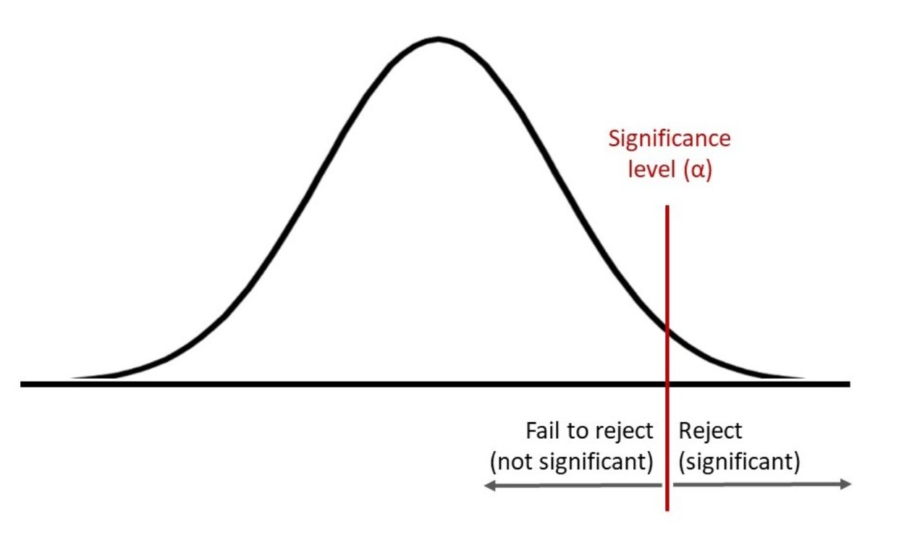

1. A parametric test is *most likely* preferred to a non-parametric test when:

    A.the data are given in ratio or ordinal scale.

    B.defined sets of assumptions are given.

    C.the population is heavily skewed.

    > 1. Incorrect. A nonparametric test is suitable for this case.
    > 2. **Correct**. A parametric test is more appropriate than a non-parametric one when an analyst is concerned with parameters whose validity depends on a definite set of assumptions—for example, assumptions about the distribution of the population producing the sample.
    > 3. Incorrect. A nonparametric test is also suitable for this.

1. Using the following sample results drawn as 25 paired observations from their underlying distributions, test whether the mean returns of the two portfolios differ from each other at the 1% level of statistical significance. Assume the underlying distributions of returns for each portfolio are normal and that their population variances are not known.

    |                    | **Portfolio 1** | **Portfolio 2** | **Difference** |
    | ------------------ | --------------- | --------------- | -------------- |
    | Mean return        | 17.00           | 21.25           | 4.25           |
    | Standard deviation | 15.50           | 15.75           | 6.25           |

    *t*-statistic for 24 degrees of freedom and at the 1% level of statistical significance = 2.807

    Null hypothesis (*H*0): Mean difference of returns = 0

    Based on the paired comparisons test of the two portfolios, the *most* appropriate conclusion is that *H*0 should be:

    **A.rejected because the computed test statistic exceeds 2.807.**

    B.accepted because the computed test statistic exceeds 2.807.

    C.accepted because the computed test statistic is less than 2.807.

    > **A Correct** because the test statistic is: $\dfrac{\bar d-\mu_{d0}}{s_d/\sqrt n}$ where
    >
    > $d$⎯⎯ = the mean difference
    >
    > $\mu_{d0}$ = the hypothesized difference in the means
    >
    > $s_d$ = the sample standard deviation of differences
    >
    > $n$ = the sample size
    >
    > In this case, the test statistic equals: (4.25−0)(6.25/√25) = 3.40. Because 3.40>2.807, the null hypothesis that the mean difference is zero is rejected.

1. Independent samples drawn from **normally distributed populations** exhibit the following characteristics:

    |      | **Sample Size** | **Sample Mean** | **Standard Deviation** |
    | ---- | --------------- | --------------- | ---------------------- |
    | A    | 25              | 200             | 45                     |
    | B    | 18              | 185             | 60                     |

    Assuming that the variances of the underlying populations are **equal**, the **pooled estimate of the common variance** is 2,678.05. The *t*-test statistic appropriate to test the hypothesis that the two population means are equal is *closest* to:

    A.1.90.

    B.0.29.

    **C.0.94.**

    > To test the **difference between the means of two normally distributed populations**, the choice of test statistic depends on:
    >
    > 1. Whether the **population variances are known or unknown**
    > 2. Whether the **variances are equal or unequal**
    > 3. Whether the samples are **independent or paired**
    >
    > **📌 Most Common Case: Two Independent Samples, Variances Unknown**
    >
    > $t = \frac{\bar{X}_1 - \bar{X}_2}{\sqrt{ \frac{s_1^2}{n_1} + \frac{s_2^2}{n_2} }}$
    >
    > **Equal variances (pooled variance t-test):**
    >
    > $t = \frac{\bar{X}_1 - \bar{X}_2}{\sqrt{s_p^2 \left( \frac{1}{n_1} + \frac{1}{n_2} \right) }}$
    >
    > with pooled variance:
    >
    > $s_p^2 = \frac{(n_1 - 1)s_1^2 + (n_2 - 1)s_2^2}{n_1 + n_2 - 2}$

1. An analyst collects the following data related to paired observations for Sample A and Sample B. Assume that both samples are dependent and are drawn from normally distributed populations and that the population variances are not known.

    | **Paired Observation** | **Sample A Value** | **Sample B Value** |
    | ---------------------- | ------------------ | ------------------ |
    | 1                      | 25                 | 18                 |
    | 2                      | 12                 | 9                  |
    | 3                      | –5                 | –8                 |
    | 4                      | 6                  | 3                  |
    | 5                      | –8                 | 1                  |

    The *t*-statistic to test the hypothesis that the mean difference is equal to zero is *closest* to:

    **A.0.52.**

    B.0.27.

    C.0.23.

    > **A Correct**. First, the mean difference is calculated:
    >
    > $\bar d=\dfrac 1n\sum d_i$
    >
    > Then, the sample variance and the standard error of the mean difference are calculated:
    >
    > $s_d^2=\sum (d_i-\bar d)^2/(n-1)$
    >
    > $s_d^-=s_d/\sqrt n$
    >
    > Then, the *t*-statistic is calculated:
    >
    > $t=\dfrac{\bar d-\mu_{d0}}{s_d^-}$

1. During the past 36 months, the standard deviation of a portfolio’s monthly returns has been 4.9%. To test a claim that this portfolio’s investment strategy results in a standard deviation of monthly returns that is less than 5.0%, the value of the test statistic is *closest* to:

    A.34.30.

    **B.33.61.**

    C.34.57.

    > $\chi^2_{n-1}=\dfrac{(n-1)s^2}{\sigma_0^2}$

1. The power of a hypothesis test is:

    A.equivalent to the level of significance.

    **B.the probability of not making a Type II error.**

    C.unchanged by increasing a small sample size.

    > Power of a hypothesis test is defined as:
    >
    > $\text{Power} = 1 - \beta$
    >
    > Increasing sample size **increases the power** of a test by reducing the standard error and making it easier to detect a true effect.

1. An analyst examines 30 paired monthly returns for two stock indexes. To determine if the mean difference of the returns is zero, the number of degrees of freedom of the *t*-test is:

    A.28.

    **B.29.**

    C.58.

    > 1. Incorrect because the *t*-statistic for a paired comparisons test has *n* – 1 degrees of freedom, not *n* – 2 degrees of freedom, where *n* is the number of pairs of observations. When *n* = 30, the number of degrees of freedom is 30 – 1 = 29, not 30 – 2 = 28.
    > 2. **Correct** because the *t*-statistic for a **paired** comparisons test has ***n* – 1** degrees of freedom, where *n* is the number of pairs of observations. When *n* = 30, the number of degrees of freedom is 30 – 1 = 29.
    > 3. Incorrect because this is the number of degrees of freedom of the *t*-statistic for a hypothesis test concerning the equality of the population means of **two independent samples**, which is *n*1 + *n*2 − 2. When both *n*1 and *n*2 is 30, the number of degrees of freedom of the *t*-statistic for a hypothesis test concerning the equality of the population means of two independent samples is 30 + 30 − 2 = 58.

1. In the step “stating a decision rule” in testing a hypothesis, which of the following elements must be specified?

    **A.Critical value**

    B.Power of a test

    C.Value of a test statistic

    > **A is correct.** The critical value in a decision rule is the rejection point for the test. It is the point with which the test statistic is compared to determine whether to reject the null hypothesis, which is part of the fourth step in hypothesis testing. B is incorrect because the power of a test refers to the probability of rejecting the null hypothesis when it is false. C is incorrect because the value of the test statistic is specified in the ‘Identify the appropriate test statistic and its probability distribution” step.

1. An analyst is examining the monthly returns for two funds over one year. Both funds’ returns are non-normally distributed. To test whether the mean return of one fund is greater than the mean return of the other fund, the analyst can use:

    A.a parametric test only.

    **B.a nonparametric test only.**

    C.both parametric and nonparametric tests.

    > **B is correct.** There are only 12 (monthly) observations over the one year of the sample and thus the **samples are small**. Additionally, the funds’ returns are **non-normally distributed**. Therefore, the samples do not meet the distributional assumptions for a parametric test. The Mann–Whitney U test (a nonparametric test) could be used to test the differences between population means.

1. Howard Golub, CFA, is preparing to write a research report on Stellar Energy Corp. common stock. One of the world’s largest companies, Stellar is in the business of refining and marketing oil. As part of his analysis, Golub wants to evaluate the sensitivity of the stock’s returns to various economic factors. For example, a client recently asked Golub whether the price of Stellar Energy Corp. stock has tended to rise following increases in retail energy prices. Golub believes the association between the two variables is negative, but he does not know the strength of the association.

    Golub directs his assistant, Jill Batten, to study the relationships between (1) Stellar monthly common stock returns and the previous month’s percentage change in the US Consumer Price Index for Energy (CPIENG) and (2) Stellar monthly common stock returns and the previous month’s percentage change in the US Producer Price Index for Crude Energy Materials (PPICEM). Golub wants Batten to run both a correlation and a linear regression analysis. In response, Batten compiles the summary statistics shown in [Exhibit 1](https://study.cfainstitute.org/app/cfa-program-level-i-for-may-2025#) for 248 months. All the data are in decimal form, where 0.01 indicates a 1 percent return. Batten also runs a regression analysis using Stellar monthly returns as the dependent variable and the monthly change in CPIENG as the independent variable. [Exhibit 2](https://study.cfainstitute.org/app/cfa-program-level-i-for-may-2025#) displays the results of this regression model.

    Exhibit 1:

    Descriptive Statistics

    |                                 | **Stellar Common Stock Monthly Return** | **Lagged Monthly Change** |        |
    | :-----------------------------: | :-------------------------------------: | :-----------------------: | ------ |
    |           **CPIENG**            |               **PPICEM**                |                           |        |
    |              Mean               |                 0.0123                  |          0.0023           | 0.0042 |
    |       Standard deviation        |                 0.0717                  |          0.0160           | 0.0534 |
    |                                 |                                         |                           |        |
    | Covariance, Stellar vs. CPIENG  |                −0.00017                 |                           |        |
    | Covariance, Stellar vs. PPICEM  |                −0.00048                 |                           |        |
    |  Covariance, CPIENG vs. PPICEM  |                 0.00044                 |                           |        |
    | Correlation, Stellar vs. CPIENG |                 −0.1452                 |                           |        |

    Exhibit 2:

    Regression Analysis with CPIENG

    |   **Regression Statistics**    |        |      |
    | :----------------------------: | ------ | ---- |
    |              *R*2              | 0.0211 |      |
    | Standard error of the estimate | 0.0710 |      |
    |          Observations          | 248    |      |

    |            | **Coefficients** | **Standard Error** | ***t\*-Statistic** |
    | :--------- | :--------------: | :----------------: | :----------------: |
    | Intercept  |      0.0138      |       0.0046       |       3.0275       |
    | CPIENG (%) |     −0.6486      |       0.2818       |      −2.3014       |

    Critical *t*-values

    One-sided, left side: −1.651

    One-sided, right side: +1.651

    Two-sided: ±1.967

    Based on the regression, if the CPIENG ***decreases* by 1.0 percent**, the expected return on Stellar common stock during the next period is *closest* to:

    1. A.0.0073 (0.73 percent).
    2. B.0.0138 (1.38 percent).
    3. C.0.0203 (2.03 percent).

    > **C is correct.** From the regression equation, Expected return = 0.0138 + (−0.6486 × −0.01) = 0.0138 + 0.006486 = 0.0203, or 2.03 percent.

1. Anh Liu is an analyst researching whether a company’s debt burden affects investors’ decision to short the company’s stock. She calculates the short interest ratio (the ratio of short interest to average daily share volume, expressed in days) for 50 companies as of the end of the year and compares this ratio with the companies’ debt ratio (the ratio of total liabilities to total assets, expressed in decimal form).

    Liu provides a number of statistics in [Exhibit 1](https://study.cfainstitute.org/app/cfa-program-level-i-for-may-2025#). She also estimates a simple regression to investigate the effect of the debt ratio on a company’s short interest ratio. The results of this simple regression, including the analysis of variance (ANOVA), are shown in [Exhibit 2](https://study.cfainstitute.org/app/cfa-program-level-i-for-may-2025#).

    In addition to estimating a regression equation, Liu graphs the 50 observations using a scatter plot, with the short interest ratio on the vertical axis and the debt ratio on the horizontal axis.

    Exhibit 1:

    Summary Statistics

    | **Statistic**                                     |     **Debt Ratio (\*Xi\*)**      |      | **Short Interest Ratio (\*Yi\*)** |
    | :------------------------------------------------ | :------------------------------: | :--- | :-------------------------------: |
    | Sum                                               |             19.8550              |      |             192.3000              |
    | Sum of squared deviations from the mean           |     ∑𝑛𝑖=1(𝑋𝑖−𝑋⎯⎯⎯)2=2.2225.      |      |     ∑𝑛𝑖=1(𝑌𝑖−𝑌⎯⎯⎯)2=412.2042.     |
    | Sum of cross-products of deviations from the mean | ∑𝑛𝑖=1(𝑋𝑖−𝑋⎯⎯⎯)(𝑌𝑖−𝑌⎯⎯⎯)=−9.2430. |      |                                   |

    Exhibit 2:

    Regression of the Short Interest Ratio on the Debt Ratio

    | **ANOVA**                  | **Degrees of Freedom (df)** | **Sum of Squares** | **Mean Square** |
    | :------------------------- | :-------------------------: | :----------------: | :-------------: |
    | Regression                 |              1              |      38.4404       |     38.4404     |
    | Residual                   |             48              |      373.7638      |     7.7867      |
    | Total                      |             49              |      412.2042      |                 |
    | **Regression Statistics**  |                             |                    |                 |
    | *R*2                       |           0.0933            |                    |                 |
    | Standard error of estimate |           2.7905            |                    |                 |
    | Observations               |             50              |                    |                 |
    |                            |                             |                    |                 |

    |                | **Coefficients** | **Standard Error** | ***t\*-Statistic** |
    | :------------- | :--------------: | :----------------: | :----------------: |
    | Intercept      |      5.4975      |       0.8416       |       6.5322       |
    | Debt ratio (%) |     −4.1589      |       1.8718       |      −2.2219       |

    Critical *t*-values for a 0.05 level of significance:

    One-sided, left side: −1.677

    One-sided, right side: +1.677

    Two-sided: ±2.011

    Liu is considering three interpretations of these results for her report on the relationship between debt ratios and short interest ratios:

    | Interpretation 1: | Companies’ higher debt ratios cause lower short interest ratios. |
    | ----------------- | ------------------------------------------------------------ |
    | Interpretation 2: | Companies’ higher short interest ratios cause higher debt ratios. |
    | Interpretation 3: | Companies with higher debt ratios tend to have lower short interest ratios. |

    She is especially interested in using her estimation results to predict the short interest ratio for MQD Corporation, which has a debt ratio of 0.40.

    Question

    Based on [Exhibit 1](https://study.cfainstitute.org/app/cfa-program-level-i-for-may-2025#), the sample covariance is *closest to*:

    1. A.−9.2430.
    2. B.−0.1886.
    3. C.8.4123.

    > **B is correct.** The sample covariance is calculated as follows:
    >
    > $\dfrac{\sum(X_i-\bar X)(Y_i-\bar Y)}{n-1}=-9.2430/49=-0.1886$

1. Based on [Exhibit 2](https://study.cfainstitute.org/app/cfa-program-level-i-for-may-2025#), the number of degrees of freedom for the *t*-test of the slope coefficient in this regression is:

    **A.48.**

    B.49.

    C.50.

    > **A is correct.** The degrees of freedom are the number of observations **minus the number of parameters estimated**,

1. Based on Liu’s regression results in [Exhibit 2](https://study.cfainstitute.org/app/cfa-program-level-i-for-may-2025#), the *F*-statistic for testing whether the slope coefficient is equal to zero is *closest* to:

    A.−2.2219.

    B.3.5036.

    **C.4.9367.**

    > **C is correct.** The calculation is $F=\dfrac{\text{MSR (d.f.=1)}}{\text{MSE (d.f.=n-k-1)}}$=38.44047.7867=4.9367.

1. Doug Abitbol is a portfolio manager for Polyi Investments, a hedge fund that trades in the United States. Abitbol manages the hedge fund with the help of Robert Olabudo, a junior portfolio manager.

    Abitbol looks at economists’ inflation forecasts and would like to examine the relationship between the US Consumer Price Index (US CPI) consensus forecast and the actual US CPI using regression analysis. Olabudo estimates regression coefficients to test whether the consensus forecast is unbiased. If the consensus forecasts are unbiased, the intercept should be 0.0 and the slope will be equal to 1.0. Regression results are presented in [Exhibit 1](https://study.cfainstitute.org/app/cfa-program-level-i-for-may-2025#). Additionally, Olabudo calculates the 95 percent prediction interval of the actual CPI using a US CPI consensus forecast of 2.8.

    Exhibit 1:

    Regression Output: Estimating US CPI

    | **Regression Statistics**  |        |      |      |
    | :------------------------- | :----- | :--- | :--- |
    | *R*2                       | 0.9859 |      |      |
    | Standard error of estimate | 0.0009 |      |      |
    | Observations               | 60     |      |      |

    |                           | **Coefficients** | **Standard Error** | ***t\*-Statistic** |
    | :------------------------ | :--------------: | :----------------: | :----------------: |
    | Intercept                 |      0.0001      |       0.0002       |       0.5000       |
    | US CPI consensus forecast |      0.9830      |       0.0155       |      63.4194       |

    *Notes:*

    1. The absolute value of the critical value for the *t*-statistic is 2.002 at the 5 percent level of significance.
    2. The standard deviation of the US CPI consensus forecast is *sx* = 0.7539.
    3. The mean of the US CPI consensus forecast is 𝑋⎯⎯⎯ = 1.3350.

    Finally, Abitbol and Olabudo discuss the forecast and forecast interval:

    - **Observation 1:** For a given confidence level, the forecast interval is the same no matter the US CPI consensus forecast.
    - **Observation 2:** A larger standard error of the estimate will result in a wider confidence interval.

    Based on [Exhibit 1](https://study.cfainstitute.org/app/cfa-program-level-i-for-may-2025#), Olabudo should: 

    **A.conclude that the inflation predictions are unbiased.**

    B.reject the null hypothesis that the slope coefficient equals one.

    C.reject the null hypothesis that the intercept coefficient equals zero.

    > **A is correct.** We fail to reject the null hypothesis of a slope equal to one, and we fail to reject the null hypothesis of an intercept equal to zero. **The test of the slope equal to 1.0** is 
    >
    > 𝑡=0.9830−1.0000.0155=−1.09677. 
    >
    > The test of the intercept equal to 0.0 is 
    >
    > 𝑡=0.0001−0.0000.00002=0.5000. 
    >
    > Therefore, we conclude that the forecasts are unbiased.

1. Based on [Exhibit 1](https://study.cfainstitute.org/app/cfa-program-level-i-for-may-2025#), Olabudo should calculate a prediction interval for the actual US CPI *closest* to:

    **A.2.7506 to 2.7544.**

    B.2.7521 to 2.7529.

    C.2.7981 to 2.8019.

    > Prediction interval of dependent variable: $\hat Y_f\pm t_{\alpha/2}\times S_f$
    >
    > where $S_f$ is the **==standard error of the forecast==** defined as
    > $$
    > S_f=S_e\times\sqrt{1+\dfrac 1n+\dfrac{(X_f-\bar X)^2}{\sum(X_i-\bar X)^2}}
    > $$

# Corporate Issuers

1. The owner exposed to the *least* business liability is a:

   A.sole trader.

   **B.partner in a general partnership.**

   C.general partner in a limited partnership.

   > 1. Incorrect because a sole trader retains all return and assumes all risk.
   > 2. **Correct** because general partnerships are like sole proprietorships with the important distinction that they allow for additional resources to be brought into the business along with the **sharing of business risk** among a larger group of individuals.
   > 3. Incorrect because a limited partnership must have at least one general partner with unlimited liability who is responsible for the management of the business.

2. Dee’s Arbor Group Inc. (DAG Inc.) is a large international investor in timber and forest assets located on the North and South American continents. DAG Inc. is the general partner of DAG LP, a limited partnership that is the 100% owner of the timber and forest assets. DAG LP is controlled by DAG Inc. and its limited partners; the limited partners own a 20% stake in the partnership, while DAG Inc. holds the remaining majority stake.

   DAG Inc.’s shares are listed on stock exchanges in the United States and Canada. DAG Inc. is organized as a special corporate form available in its jurisdiction in which it does not pay corporate income taxes so long as it distributes all of its net income as dividends to its shareholders and complies with other conditions. In the current and past fiscal years, DAG Inc. has complied with all of these conditions.

   DAG Inc.’s shares are owned by various members of the Dee family, who hold several key senior management positions at DAG Inc. and DAG LP, and collectively they own 30% of the shares of DAG Inc. The remainder of DAG Inc.’s shares are owned by a variety of individual and institutional investors, none of whom own more than 5%. The following diagram shows the organizational structure of DAG Inc. and DAG LP.

   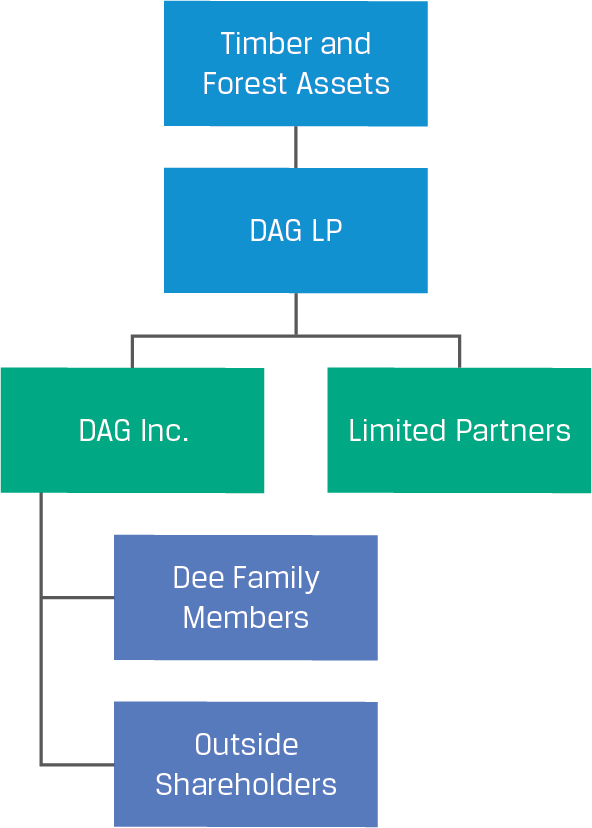

   What is a significant difference between the limited partners of DAG LP and the outside shareholders of DAG Inc.?

   A.Managerial responsibilities

   B.Taxation of income from the partnership 

   **C.The ability to vote and replace members of the DAG Inc. board of directors**

   > **C is correct.** The limited partners of DAG LP are not shareholders of DAG Inc., so they do not have voting rights in the corporation. Additionally, because the limited partners own only 20% of the partnership, they also have little ability to remove DAG Inc. as the general partner. In contrast, outside shareholders own 70% of DAG Inc. and have voting rights. They could use their collective ownership to effect change in the management of DAG Inc.
   >
   > A is incorrect. Neither the DAG LP limited partners nor the outside shareholders of DAG Inc. have managerial responsibilities. The general partner has managerial responsibilities of the partnership, and **the board of DAG Inc. has managerial responsibilities of the corporation**. 
   >
   > B is incorrect. Owing to the special corporate form of DAG Inc., both the corporation *and* the limited partnership are pass-through entities. Therefore, neither the partnership nor the corporation pays entity-level income taxes, but both the limited partners and shareholders are responsible for personal income taxes.

3. Kobe Steel Ltd. is a major Japanese steel manufacturer formed in 1905 that supplies global manufacturers of cars, planes, and trains. The company issued a report in March 2018 apologizing for falsifying data on the strength and durability of its aluminum, copper, steel products, and iron ore powder. Following the scandal, its stock sank to a five-year low and its cost of debt jumped to record levels.

   An Independent Investigation Committee (IIC) investigated the misconduct and authored the report, which concluded that the misconduct resulted from (1) a management style that overemphasized profitability amid inadequate corporate governance, (2) the imbalanced operation of plants that resulted in reduced awareness of quality compliance among employees, and (3) insufficient quality control procedures that allowed the misconduct to take place. The report also emphasized that the company had “a culture that prioritized winning purchase orders and meeting delivery deadlines over ensuring quality.”

   The company committed to implementing various measures to prevent a recurrence of the misconduct. Regarding governance, measures included the following:

   - Appointing an independent chairman of the board of directors
   - Having at least one-third of the board of directors be independent
   - Creating a nominating and compensation committee, consisting of a majority of independent directors, to serve as a voluntary advisory body to the board of directors
   - Creating an independent quality supervision committee consisting of external experts
   - Creating an audit and supervisory committee consisting of five members: two internal directors and three independent directors with backgrounds in legal, financial, and industrial fields

   Which of the following is considered a best practice that would strengthen the measures discussed to prevent a recurrence of the misconduct?

   A.A shareholder rights plan

   B.A stock-based compensation plan

   **C.An audit committee composed solely of independent board members**

   > **C is correct.** The company formed an audit and supervisory committee that included a majority of independent directors, but best practices would recommend an audit committee composed solely of independent members, with at least one director with accounting or related financial management experience.
   >
   > A is incorrect. A **shareholder rights plan**, also known as a **poison pill**, is used to defend against unwanted takeovers that could potentially undervalue the company, but it does not defend the company or shareholders against management or employee misconduct.
   >
   > B is incorrect. A stock-based compensation plan is used to align the interests of management with those of shareholders, though it might further incentivize risk-taking and misconduct, which is the issue in this case.
   >
   > A shareholder rights plan—often called a “poison pill”—is a corporate defense mechanism designed to deter or slow down an unwanted takeover attempt. Here’s how it works and why companies adopt it:
   >
   > **Structure & Mechanics**
   >
   > The board authorizes the issuance of “rights” (essentially options) to existing shareholders (except the potential acquirer).
   >
   > These rights typically become exercisable only when a single shareholder (or group) crosses a pre‑set ownership threshold (commonly 10–20% of outstanding shares).
   >
   > Upon that trigger, each right allows its holder to purchase additional shares at a deep discount (for example, at half the market price).
   >
   > **Economic Effect**
   >
   > If an unwanted bidder accumulates enough shares to cross the threshold, the rights “flip in.”
   >
   > Existing shareholders (other than the bidder) can exercise rights to buy new shares cheaply, diluting the bidder’s stake and making a takeover prohibitively expensive.

4. The potential for conflict between debtholders and shareholders is:

   A.lower for long-term debt than for short-term debt.

   B.the same for long-term debt and short-term debt.

   **C.higher for long-term debt than for short-term debt.**

   > 1. Incorrect because the potential debt/equity conflict is greater in the case of long-term rather than short-term debt because the passage of time exposes debtholders to possible changes in business conditions, strategy, and management behavior. So, the conflict between debtholders and shareholders is greater (not lower) in the case of long-term versus short-term debt.
   > 2. Incorrect because the potential debt/equity conflict is greater in the case of long-term rather than short-term debt because the passage of time exposes debtholders to possible changes in business conditions, strategy, and management behavior. So, the conflict between debtholders and shareholders is greater (not the same) in the case of long-term versus short-term debt.
   > 3. **Correct** because the potential debt/equity conflict is greater in the case of long-term rather than short-term debt because the passage of time exposes debtholders to possible changes in business conditions, strategy, and management behavior.

5. Which of the following is *most likely* a secondary source of liquidity?

   A.Bank line of credit

   **B.Inventory liquidation**

   C.Trade credit

   > 1. Incorrect because a line of credit is a **primary source of liquidity**.
   > 2. **Correct.** Trade credit and a bank line of credit are considered primary sources of liquidity. Liquidating inventory is a **secondary source of liquidity**.
   > 3. Incorrect because trade credit is a primary source of liquidity.
   >
   > Primary source of liquidity: cash from normal day-to-day operations
   >
   > Secondary source of liquidity: using a secondary source may change the company's financial and operating positions

6. An issuer changing its credit terms for customers from **==2/10, net 30==** to 2/10, net 40 will most likely experience:

   A.a pull on its liquidity.

   **B.a drag on its liquidity.**

   C.no change in its liquidity.

   > **B is correct.** By extending the net period, the issuer will likely see its accounts receivable increase, lengthening its cash conversion cycle and producing a drag on its liquidity.
   >
   > “2/10, net 30” are common trade‑credit terms a seller offers its buyers. They mean:
   >
   > - **2/10** — Buyer can take a 2 % discount on the invoice amount if payment is made within 10 days of the invoice date.
   > - **Net 30** — Otherwise, the full (“net”) invoice amount is due within 30 days of the invoice date, with no discount.
   >
   > Put simply: pay within 10 days and save 2 %; if not, you must pay 100 % by day 30.

7. When preparing the cash-flow forecasts for both projects, Soroka should include:

   A.only the cost of the market research.

   **B.only the loss of revenue from existing products.**

   C.both the market research cost and the loss of revenue from existing products.

   > **B is correct.** Capital allocation analysis should include **only incremental cash flows** associated with a new investment. The loss of revenue from existing products is an incremental negative effect that should be included in the analysis. The market research costs in this case are a **sunk cost** because the research has already been completed and therefore does not affect cash-flow estimates, no matter whether ABC undertakes either of these projects or neither of them.

8. A firm is considering a project that would require an initial investment of THB270 million (Thai baht). The project will help increase the firm’s after-tax net cash flows by THB30 million per year in perpetuity, and it is found to have a negative NPV of THB20 million. The IRR (%) of the project is *closest* to:

   A.10.3%.

   **B.11.1%.**

   C.12.0%.

   > 1. Incorrect. It assumes a positive NPV of 20 and solves for IRR = 30/290 = 10.34%.
   >
   > 2. **Correct.** The IRR is the discount rate that makes the **NPV = 0**. Because the cash flow stream is in perpetuity, it can be solved as follows:
   >
   >    0 = –270 + (30/IRR)
   >
   >    IRR = 11.1%
   >
   > 3. Incorrect. It assumes a negative NPV of 20 and solves for IRR = 30/250 = 12.00% (which is the current discount rate (required rate of return)).

9. Subsequent to making a capital investment, a company reacts to poor financial results from the project by abandoning it. This action alone *best* exemplifies the exercise of a:

   **A.sizing option.**

   B.timing option.

   C.flexibility option.

   > 1. **Correct** because sizing options encompass **abandonment or expansion of capacity**. If after investing the company can abandon the investment if the financial results are disappointing, it has an abandonment option. At some future date, if the cash flow from abandoning an investment exceeds the present value of the cash flows from continuing the investment, the company should exercise the abandonment option. Conversely, if the company can make additional investments when future financial results are strong, the company has a growth option or an expansion option.
   > 2. Incorrect because timing options involve the sequencing of projects. Instead of investing now, the company can delay investing. Delaying an investment and basing the decision on hopefully improved information that you might have in, say, a year could help improve the NPV of the projects selected. Project sequencing options allow the company to defer the decision to invest in a future investment until the outcome of some or all of a current investment is known. Investments are sequenced over time, so that investing in a project creates the option to make future investments.
   > 3. Incorrect because flexibility options include operational changes possible with current capacity, such as paying overtime or adding a shift to meet excess demand. Once an investment is made, operational flexibilities besides abandonment or expansion may be available. If demand exceeds capacity, by increasing prices, the company could benefit from the excess demand, which it cannot do by increasing production. There are also production-flexibility options, which offer the operational flexibility to alter production when demand varies from what is forecast. Even though it is expensive, the company can profit from working overtime or from adding additional shifts.

10. A financial analyst is evaluating the capital structure for Boulder, Inc. Boulder, Inc., is a US-based unleveraged firm with a constant (perpetual) cash flow of $6 million per year before taxes. The firm has a market value of $45 million and a corporate tax rate of 30%. Boulder plans to issue $15 million in debt to retire an equivalent amount of equity. The debt will have a cost of 5.5%.

    The financial analyst notes that the tax shield advantage of debt is offset due to the risk of financial distress. He estimates the present value of the cost of financial distress at various debt levels as follows:

    | **Value of Debt** | **Present Value of Cost of Distress** |
    | :---------------: | :-----------------------------------: |
    |    $5 million     |             $0.1 million              |
    |    $10 million    |             $0.2 million              |
    |    $15 million    |             $0.5 million              |
    |    $20 million    |             $1.5 million              |
    |    $25 million    |             $6.0 million              |
    |    $30 million    |             $12.0 million             |

    The use of the $15 million of debt financing increases the value of Boulder by ____________ over its unlevered value. Ignore the costs of financial distress. 

    **A.$4.5 million**

    B.$10.5 million

    C.$15 million

    > **A is correct.** According to MM Proposition I with corporate taxes, the value of the levered company is greater than that of the unlevered company by an amount equal to the tax rate multiplied by the value of the debt (*tD*), defined as the present value of the debt tax shield.
    >
    > ***VL* = *VU* + *tD*** = \$45 million + 0.30\*\$15million = \$49.5 million.
    >
    > Thus, the use of debt financing will increase the value of Boulder by \$4.5 million over the unlevered firm. Note that the firm’s value increases continuously as additional debt is added to the capital structure, and the optimal capital structure is 100% debt.

11. A financial analyst is evaluating the capital structure for Plover, Inc., a European-based unleveraged firm with a constant (perpetual) cash flow of EUR10.0 million per year before taxes. The firm has a market value of EUR100.0 million and a corporate tax rate of 20%. Plover plans to issue EUR35.0 million in debt to retire an equivalent amount of equity, so the size of the firm will remain unchanged. The debt will have a cost of 4.5%. Assume the cost of financial distress is close to zero.

    After the debt issuance and change in the capital structure, Plover’s WACC is closest to:

    A.5.47%.

    **B.7.48%.**

    C.8.82%.

    > **B is correct.** The calculations to determine the WACC are as follows:
    >
    > The after-tax cash flows for the company are EUR10.0 million (1 – 0.20) = EUR8.0 million. Since the cash flows are assumed to be perpetual, WACC for the unlevered firm is calculated as
    >
    > *rWACC* = *CF*(1 – *t*)/*V* = EUR8.0 million/EUR100.0 million = 8.0%.
    >
    > **The market value of Plover with the debt financing is EUR107 million:**
    >
    > ***VL* = *VU* + *tD* = EUR100.0 million + 0.20(EUR35.0 million) = EUR107.0 million.**
    >
    > To find the cost of equity, we first need to find the market value of equity:
    >
    > *VL* = *D* + *E*, where *D* and *E* are market values of debt and equity, respectively.
    >
    > *E* = EUR107.0 million – EUR35.0 million = EUR72.0 million.
    >
    > **The cost of equity is given by**
    >
    > **$r_E=r_V+(r_V-r_D)\color{red}{(1-T)\dfrac DE}$= 8.0% + (8.0% – 4.5%)(0.80)(EUR35.0 million/EUR72.0 million) = 9.36%.**
    >
    > Plover’s WACC is calculated as follows:
    >
    > WACC = (Weighting of debt × Cost of debt) + (Weighting of equity × Cost of equity)= (EUR35 million/EUR107.0 million)(4.5%)(1 – 0.2) + (EUR72.0 million/EUR107.0 million)(9.36%)= 7.48%, which is lower than the 8.0% for the unlevered firm.

12. When a publicly traded company's **target capital structure** is unknown, which of the following is *most likely* an **acceptable proxy**?

    A.Equal weights for debt and equity

    B.The company’s current capital structure at book value weights

    **C.An unweighted average of comparable companies’ capital structures**

    1. Incorrect because an analyst, typically does not know the target capital structure and must estimate it using one of several approaches. 1. Assume the company’s current capital structure, at market value weights for the components, represents the company’s target capital structure. 2, Examine trends in the company’s capital structure or statements by management regarding capital structure policy to infer the target capital structure. 3. Use averages of comparable companies’ capital structures as the target capital structure. Equal weights for debt and equity is not a plausible approach unless it matches one of these approaches by chance.
    2. Incorrect because an analyst, typically does not know the target capital structure and must estimate it using one of several approaches. 1. Assume the company’s current capital structure, at market value weights for the components, represents the company’s target capital structure. 2, Examine trends in the company’s capital structure or statements by management regarding capital structure policy to infer the target capital structure. 3. Use averages of comparable companies’ capital structures as the target capital structure. In other words, current capital structure may be used, but at market value weights.
    3. **Correct** because an analyst, typically does not know the target capital structure and must estimate it using averages of comparable companies’ capital structures as the target capital structure. .Note that in applying this method, we use an **unweighted, arithmetic average**, as is often done for **simplicity**.

13. A company's target capital structure is usually expressed by firm managers as:

    **A.a range in book value terms.**

    B.a range in market value terms.

    C.a specific number in market value terms.

    > 1. **Correct** because transaction costs and minimum deal sizes make it **impractical for firms to constantly align capital structure to a specific number**. As a result, firm managers usually set an optimal capital range: for example, 30%–50% debt rather than 40%. Target capital structure is often expressed using the book value of equity and debt for the several reasons including **market values can fluctuate substantially and capital structure policy is aligned to measures used by third parties**. Since lenders, debt investors, and rating agencies generally focus on the book value of debt and equity for their calculation measures, firm managers take this fact into account in determining their capital structure policies.
    > 2. Incorrect because transaction costs and minimum deal sizes make it impractical for firms to constantly align capital structure to a specific number. As a result, firm managers usually set an optimal capital range: for example, 30%–50% debt rather than 40%. Target capital structure is often expressed using the book value of equity and debt for the several reasons including market values can fluctuate substantially and capital structure policy is aligned to measures used by third parties. Since lenders, debt investors, and rating agencies generally focus on the book value of debt and equity for their calculation measures, firm managers take this fact into account in determining their capital structure policies.
    > 3. Incorrect because transaction costs and minimum deal sizes make it impractical for firms to constantly align capital structure to a specific number. As a result, firm managers usually set an optimal capital range: for example, 30%–50% debt rather than 40%. Target capital structure is often expressed using the book value of equity and debt for the several reasons including market values can fluctuate substantially and capital structure policy is aligned to measures used by third parties. Since lenders, debt investors, and rating agencies generally focus on the book value of debt and equity for their calculation measures, firm managers take this fact into account in determining their capital structure policies.

14. A pricing approach where a company simultaneously charges different prices to different customers based on purchase volume is *best* referred to as:

    **A.tiered pricing.**

    B.bundled pricing.

    C.dynamic pricing.

    > 1. **Correct** because economists use the term '**price discrimination**' when firms charge different prices to different customers. **Tiered pricing** charges different prices to different buyers, most commonly based on volume purchased.
    > 2. Incorrect because **bundling** refers to combining multiple products or services so that customers are incentivized, or required, to buy them together as opposed to offering the same product at different prices depending on the purchased volume. Bundling can be effective, particularly for products that are complementary, with high incremental margins and high marketing costs relative to the cost of the product itself. Examples include hotel rooms with free breakfast; furnished rental apartments; cable TV and internet services; pre-packaged sets of toys, tools, or kitchen utensils; and cloud-based software combining an application, processing power, storage, and support services.
    > 3. Incorrect because **dynamic pricing** charges different prices at different times (i.e., pricing is based on time of purchase as opposed to volume purchased; prices are not simultaneously adjusted based on the purchased volume). Specific examples include off-peak pricing (e.g., for hotel rooms, advertising, airline tickets, electricity, or matinee movie tickets), 'surge' pricing, and 'congestion' pricing (e.g., for ride sharing and toll roads).
    >
    > Price discrimination also includes **auction / reverse auction**.

# Equity Investments

1. An investor purchases 1,000 shares of a non-dividend paying stock on margin and sells them after one year as follows:

   | Purchase price per share | $25  |
   | ------------------------ | ---- |
   | Sale price per share     | $20  |
   | Annual call money rate   | 5%   |
   | Leverage ratio           | 2    |

   Ignoring commissions, the investor's holding period return is *closest* to:

   **A.–45%.**

   B.–40%.

   C.–23%.

   > **A Correct** because this is the return on investment to the investor.
   >
   > Total purchase price = \$25/share × 1,000 shares = \$25,000
   >
   > Leverage ratio of 2 indicates buyer's equity of 1/2
   >
   > Buyer's equity = 1/2 × \$25,000 = \$12,500
   >
   > Borrowed money = \$25,000 – \$12,500 = \$12,500
   >
   > Interest on borrowed money = 5% × \$12,500 = \$625
   >
   > Sale proceeds = \$20/share × 1,000 shares = \$20,000
   >
   > Net return to buyer = Sale proceeds – purchase price – interest payment = \$20,000 – \$25,000 – \$625 = –\$5,625
   >
   > Return on investment to the buyer = –\$5,625 / \$12,500 = –45%

2. Akihiko Takabe has designed a sophisticated forecasting model, which predicts the movements in the overall stock market, in the hope of earning a return in excess of a fair return for the risk involved. He uses the predictions of the model to decide whether to buy, hold, or sell the shares of an index fund that aims to replicate the movements of the stock market. Takabe would *best* be characterized as a(n):

   A.hedger.

   B.investor.

   **C.information-motivated trader.**

   > **C is correct.** Takabe is best characterized as an information-motivated trader. Takabe believes that his model provides him **superior information about the movements in the stock market** and his motive for trading is to profit from this information.

3. If it is difficult to find a buyer or a seller for an asset, the asset *most likely* trades on:

   **A.brokered markets.**

   B.order-driven markets.

   C.quote-driven markets.

   > 1. **Correct** because brokered markets are markets in which brokers arrange trades among their clients. Brokers organize markets for instruments for which finding a buyer or seller willing to trade is difficult because the instruments are **unique**.
   > 2. Incorrect because organizing order-driven markets for these instruments (assets for which finding a buyer or seller is difficult) is not sensible because too few traders would submit orders for them.
   > 3. Incorrect because dealers generally are unable or unwilling to **hold these assets** in their inventories, they will not **make markets** in them.

4. James Beach is young and has substantial wealth. A significant proportion of his stock portfolio consists of emerging market stocks that offer relatively high expected returns at the cost of relatively high risk. Beach believes that investment in emerging market stocks is appropriate for him given his ability and willingness to take risk. Which of the following labels *most appropriately* describes Beach?

   A.Hedger.

   **B.Investor.**

   C.Information-motivated trader.

   > **B is correct.** Beach is an investor. He is simply investing in risky assets **consistent with his level of risk aversion**. Beach is not hedging any existing risk or **using information to identify and trade mispriced securities**. Therefore, he is not a hedger or an information-motivated trader.

5. **==Dark pools==** are *best* described as:

   A.operated by investment dealers that specialize in high-risk securities.

   **B.trading venues that exercise little regulatory authority over their subscribers.**

   C.certain groups of similar assets that issue securities representing shared ownership.

   > 1. Incorrect. Dark pools may be operated by investment dealers but do not necessarily trade high risk securities.
   > 2. **Correct.** Dark pools are trading venues that function like exchanges but do not exercise regulatory authority over their subscribers except with respect to the conduct of their trading in those venues.
   > 3. Incorrect. This is the definition of pooled investment vehicles.

6. An investor buys a stock on margin. Assume that the interest on the loan and the dividend are both paid at the end of the holding period. The data related to the transaction are as follows:

   | Number of shares         | 500         |
   | ------------------------ | ----------- |
   | Purchase price per share | $28         |
   | Leverage ratio           | 3.33        |
   | Commission               | $0.05/share |
   | Position holding period  | Six months  |
   | Sale price per share     | $30         |
   | Call money rate          | 5% per year |
   | Dividend                 | $0.40/share |

   The investor’s total return on this investment over the margin holding period is *closest* to:

   A.15.6%.

   B.16.7%.

   **C.21.4%.**

   > **C Correct.**
   >
   > | Initial investment      | [(\$28 × 500) × (1/3.33)] **==+ (\$0.05 × 500)==** | $4,229 |
   > | ----------------------- | -------------------------------------------------- | ------ |
   > | – Purchase commission   | $0.05 × 500                                        | –25    |
   > | + Trading gain          | (\$30 – \$28) × 500                                | 1,000  |
   > | – Margin interest paid  | $9,800 × 0.05 × 6 months                           | –245   |
   > | + Dividends received    | $0.40 × 500                                        | 200    |
   > | – Sales commission paid | $0.05 × 500                                        | –25    |
   > | = Remaining equity      | ---                                                | $5,134 |
   > | Return on investment    | (\$5,134 – \$4,229)/\$4,229                        | 21.4%  |
   >
   > 相当于是说commission是算在成本里面的

7. The following data pertain to a margin purchase of a stock:

   | Purchase price                  | $50/share   |
   | ------------------------------- | ----------- |
   | Sale price                      | $55/share   |
   | Shares purchased                | 500         |
   | Margin                          | 45%         |
   | Call money rate                 | 6%          |
   | Dividend                        | $1.80/share |
   | Commission on purchase and sale | $0.05/share |

   If the stock is sold exactly one year after the purchase, the total return on this investment is *closest* to:

   A.14.4%.

   B.19.4%.

   **C.22.4%.**

   > **C Correct.**
   >
   > | Proceeds on sale                              | $55 × 500                            | $27,500   |
   > | --------------------------------------------- | ------------------------------------ | --------- |
   > | **Minus** payoff loan                         | $50 × 500 × 0.55                     | –$13,750  |
   > | **Minus** margin interest paid                | $13,750 × 0.06                       | –$825     |
   > | **Plus** dividend received                    | $1.80 × 500                          | $900      |
   > | **Minus** sales commission paid on sale       | $0.05 × 500                          | **–$25**  |
   > | = Remaining equity                            |                                      | $13,800   |
   > | Initial Investment **(including commission)** | (\$50 × 500 × 0.45) + (\$0.05 × 500) | $11,275   |
   > | Return on the initial investment:             | ($13,800 – $11,275)/$11,275          | **22.4%** |

8. A trader buys a stock at $64 on margin with a leverage ratio of 2.5 and a maintenance margin of 30%. Below what price will a margin call *most likely* occur?

   A.$36.57

   B.$44.80

   **C.$54.86**

   > Debt=\$64-\$64/2.5=$38.40 
   >
   > Min Value=\$38.4/(1-30%)=$54.86

9. A trader places a limit order to buy shares at a price of \$49.94 with the stock trading at a market bid price of \$49.49 and the bid–ask spread of 0.7%. The order will *most likely* be filled at:

   A.$49.49.

   **B.$49.84**.

   C.$49.94.

   > **B Correct.** An order is filled at the best available price as long as this price is lower than the limit price. In this case, the best available price is the market ask price = \$49.49 × (1 + 0.7%) = \$49.84. Because this price is lower than the limit price of \$49.94, the order will be filled at this price.
   >
   > The **==bid-ask spread==** is calculated by taking the ask price and then subtracting the bid price. This can be expressed as: bid-ask spread = ask price – bid price. You can also calculate it as a percentage: bid-ask spread (%) = (ask price – bid price) **÷ ask price** × 100.

10. Which of the following statements concerning the objectives of market regulation is *least* accurate?

    A.Regulators promote fair and orderly markets.

    B.ensure that systems are in place to prevent fraud.

    **C.Regulators set standards to ensure that all agents acting in the market are skilled.**

    > 1. Incorrect. One of the objectives of market regulation is to promote fair and orderly markets in which traders can trade at prices that accurately reflect fundamental values.
    > 2. Incorrect. Regulators ensure that systems are in place to protect customers from fraud.
    > 3. **Correct.** Regulators help solve agency problems by setting **minimum standards of competence, not skill**, for agents and by defining and enforcing minimum standards of practice.

11. Jason Williams purchased 500 shares of a company at $32 per share. The stock was bought on 75 percent margin. One month later, Williams had to pay interest on the amount borrowed at a rate of 2 percent per month. At that time, Williams received a dividend of $0.50 per share. Immediately after that he sold the shares at $28 per share. He paid commissions of $10 on the purchase and $10 on the sale of the stock. What was the rate of return on this investment for the one-month period?

    A.−12.5 percent.

    **B.–15.4 percent.**

    C.–50.1 percent.

    > **B is correct.** The return is –15.4 percent.
    >
    > - Total cost of the purchase = \$16,000 = 500 × $32
    > - Equity invested = \$12,000 = 0.75 × $16,000
    > - Amount borrowed = $4,000 = 16,000 – 12,000
    > - Interest paid at month end = \$80 = 0.02 × $4,000
    > - Dividend received at month end = \$250 = 500 × $0.50
    > - Proceeds on stock sale = \$14,000 = 500 × $28
    > - **Total commissions paid = \$20 = \$10 + $10**
    > - Net gain/loss = −$1,850 = −16,000 − 80 + 250 + 14,000 − 20
    > - Initial investment **including commission on purchase** = $12,010
    > - Return = −15.4% = −\$1,850/$12,010

12. Caroline Rogers believes the price of Gamma Corp. stock will go down in the near future. She has decided to sell short 200 shares of Gamma Corp. at the current market price of €47. The initial margin requirement is 40 percent. Which of the following is an appropriate statement regarding the margin requirement that Rogers is subject to on this short sale?

    **A.She will need to contribute €3,760 as margin.**

    B.She will need to contribute €5,640 as margin.

    C.She will only need to leave the proceeds from the short sale as deposit and does not need to contribute any additional funds.

    > **A is correct.** She will need to contribute €3,760 as margin. In view of the possibility of a loss, if the stock price goes up, she will need to contribute €3,760 = 40% of €9,400 as the initial margin. Rogers will need to leave the proceeds from the short sale (€9,400 = 200 × €47) on deposit.
    >
    > Option C is incorrect because margin rules for short sales require the seller to **post extra collateral beyond just the proceeds**. When you short stock:
    >
    > 1. **Proceeds held in escrow** – The €9,400 you receive from selling the 200 shares is retained by the broker; you don’t get to use it.
    > 2. **Initial margin requirement** – Regulations (and most brokers) mandate you deposit additional funds equal to a percentage of the short position’s value—in this case, 40 % of €9,400, or €3,760.

13. Consider the following limit order book for a stock. The bid and ask sizes are number of shares in hundreds.

    | **Bid Size** | **Limit Price (¥)** | **Offer Size** |
    | :----------- | :-----------------: | :------------: |
    | 3            |       122.80        |                |
    | 8            |       123.00        |                |
    | 4            |       123.35        |                |
    |              |       123.80        |       7        |
    |              |       124.10        |       6        |
    |              |       124.50        |       7        |

    A new buy limit order is placed for 300 shares at ¥123.40. This limit order is said to:

    A.take the market

    B.make the market

    **C.make a new market**

    > 

14. You have placed a sell market-on-open order—a market order that would automatically be submitted at the market’s open tomorrow and would fill at the market price. Your instruction, to sell the shares at the market open, is a(n):

    A.execution instruction.

    **B.validity instruction.**

    C.clearing instruction.

    > **B is correct.** An instruction regarding when to fill an order is considered a validity instruction.
    >
    > **Execution instructions** indicate how to fill the order (e.g., limit, market)
    >
    > **Validity instructions** indicate when the order may be filled (e.g., open, close)
    >
    > **Clearing instructions** indicate how to settle the trade

15. A financial analyst is examining whether a country’s financial market is well functioning. She finds that the transaction costs in this market are low and trading volumes are high. She concludes that the market is quite liquid. In such a market:

    A.traders will find it hard to make use of their information.

    B.traders will find it easy to trade and their trading will make the market less informationally efficient.

    **C.traders will find it easy to trade and their trading will make the market more informationally efficient.**

    > **C is correct.** In such a market, well-informed traders will find it easy to trade and their trading will make the market more informationally efficient. In a liquid market, it is easier for informed traders to fill their orders. Their trading will cause prices to **incorporate their information** and the prices will be more in line with the fundamental values.

16. An analyst gathers the following information about a price-weighted index composed of three stocks:

    | **Stock** | **Outstanding Shares** | **Beginning of Period Price** | **Dividends per Share** | **End of Period Price** |
    | :-------- | :--------------------: | :---------------------------: | :---------------------: | :---------------------: |
    | 1         |         10,000         |            $25.00             |          $2.00          |         $20.00          |
    | 2         |         40,000         |            $10.00             |          $0.50          |         $13.50          |
    | 3         |         50,000         |            $10.00             |          $0.00          |         $14.00          |

    The index's **==price return==** is *closest* to:

    **A.5.6%.**

    B.11.1%.

    C.25.2%.

    > In a price‑weighted index calculating price return, you **only look at how component stock prices change**—not at cash flows like dividends.
    >
    > (20+13.5+14)/(25+10+10)-1=0.0556 

17. An increase in shares held by controlling shareholders *most likely* impacts the constituent weightings of a(n):

    A.price-weighted index.

    B.equal-weighted index.

    **C.float-adjusted market-capitalization-weighted index.**

    > 1. Incorrect because in price weighting, the weight on each constituent security is determined by dividing its price by the sum of all the prices of the constituent securities, which means the lower free float (due to increased weight of controlling shareholders) has no impact on constituent weights.
    > 2. Incorrect because the equal weighting assigns an equal weight to each constituent security at inception, which means the lower free float (due to increased number of shares held by controlling shareholders) has no impact on constituent weights.
    > 3. **Correct** because **float**-adjusted market-capitalization-weighted indexes reflect the shares **available for public trading** (excluding the ones held by controlling shareholders) by multiplying the market price per share by the number of shares available to the investing public (i.e., the float-adjusted market capitalization), which means constituent weights are impacted.

18. The values of a price return index and a total return index consisting of identical equal-weighted dividend-paying equities will be equal:

    A.only at inception.

    B.at inception and on rebalancing dates.

    C.at inception and on reconstitution dates.

    > **A is correct.** At inception, the values of the price return and total return versions of an index are equal.

19. A price-weighted index series is composed of the following three stocks:

    |           | **Price before Split** | **Price after Split** |
    | --------- | ---------------------- | --------------------- |
    | **Stock** | **End of Day 1**       | **End of Day 2**      |
    | X         | $10                    | $12                   |
    | Y         | $20                    | $19                   |
    | Z         | $60                    | $22                   |

    If stock Z completes a three-for-one split at the end of Day 1, the value of the index after the split (at the end of Day 2) is *closest* to:

    A.29.9.

    **B.31.7.**

    C.32.3.

    > **B Correct.** The value of the price-weighted index is determined by dividing the sum of the security values by the divisor, which is typically set at inception to equal the initial number of securities in the index. In the case of a stock split, the index provider must adjust the value of the divisor by dividing the sum of the constituent prices after the split by the value of the index before the split. This adjustment results in a new divisor that keeps the index value at the same level as before the split. The new divisor will then be used to calculate the index value after the split.
    >
    > Index before the split = (10+20+60)/3 = 30
    >
    > New divisor, X: 30=(10+20+20)/X, X=1.67
    >
    > Index after the split = (12+19+22)/1.67 = 31.7

20. The index weighting that results in portfolio weights shifting away from securities that have increased in relative value toward securities that have fallen in relative value whenever the portfolio is rebalanced is *most* accurately described as:

    A.equal weighting.

    **B.fundamental weighting.**

    C.float-adjusted market-capitalization weighting.

    > 1. Incorrect. In an equal weighting scheme, securities that constitute the largest fraction of the target market value are underrepresented and securities that constitute a small fraction of the target market value are overrepresented. This weighting scheme does not consider fundamental measures in rebalancing.
    > 2. **Correct.** Fundamentally weighted indexes generally will have a **contrarian “effect”** in that the portfolio weights will shift away from securities that have increased in relative value and toward securities that have fallen in relative value whenever the portfolio is rebalanced.
    > 3. Incorrect. In the float-adjusted market-capitalization weighting scheme, the constituent securities whose prices have risen the most (or fallen the most) have a greater (or lower) weight in the index.

21. An equity index consists of three securities with market information as follows:

    | **Security** | **Shares Outstanding** | **Price at Beginning of Period** | **Price at End of Period** | **Dividend per Share** |
    | ------------ | ---------------------- | -------------------------------- | -------------------------- | ---------------------- |
    | A            | 5,000,000              | $10.00                           | $9.50                      | $1.00                  |
    | B            | 2,000,000              | $20.00                           | $21.50                     | $0.80                  |
    | C            | 1,500,000              | $30.00                           | $33.00                     | $0.60                  |

    The **price-weighted** total return index is *closest* to:

    A.6.7%.

    B.9.5%.

    **C.10.7%.**

    > **C Correct.**
    >
    > Calculation of Index and Return Based on Price-Weighted Method
    >
    > | **Security**      | **Shares Outstanding** | **BOP Price** | **EOP Price** | **Dividends per Share** |
    > | ----------------- | ---------------------- | ------------- | ------------- | ----------------------- |
    > | A                 | 5,000,000              | $10.00        | $9.50         | $1.00                   |
    > | B                 | 2,000,000              | $20.00        | $21.50        | $0.80                   |
    > | C                 | 1,500,000              | $30.00        | $33.00        | $0.60                   |
    > | Total             | $60.00                 | $64.00        | $2.40         |                         |
    > | Index value       | 20.00                  | 21.33         | 0.80          |                         |
    > | **Type of Index** | **BOP Value**          | **EOP Value** | **Return**    |                         |
    > | Price return      | $20.00                 | $21.33        | **6.65%**     |                         |
    > | Total return      | $20.00                 | $22.13        | **10.65%**    |                         |
    >
    > BOP = Beginning of period; EOP = Ending of period
    >
    > 区分equal-weighted（收益率的算数平均）和price-weighted（先算portfolio的总价值，求综合的收益率）

22. For portfolio managers of passive funds, market indexes are *least* useful as:

    A.proxies to measure systematic risk.

    **B.benchmarks for portfolio performance attribution.**

    C.tools to develop exchange-traded funds for non-accessible markets.

    > 1. Incorrect. Market indexes are used as proxies to measure systematic risk. The use is relevant to passively managed funds.
    > 2. **Correct.** **Market indexes are used as benchmarks for actively managed portfolios**, which is not relevant to passively managed funds. Passively managed funds do not care about performance but tracking errors.
    > 3. Incorrect. Market indexes are used as model portfolios to develop new ETFs. The use is relevant to these portfolio managers as some emerging markets are not easily accessible for direct investments.

23. Which of the following statements is *least* accurate with respect to fixed-income indexes?

    A.Many of the underlying securities in the index tend to be illiquid.

    B.The indexes are susceptible to turnover of the underlying securities.

    **C.Compared with equity indexes, it is easier and less expensive to replicate fixed-income indexes.**

    > 1. Incorrect. Many of the underlying securities in the index tend to be illiquid because **fixed-income markets are predominantly dealer markets.**
    > 2. Incorrect. The indexes are susceptible to turnover of the underlying securities because over time, **fixed-income securities mature** and issuers offer new securities to meet their financial needs.
    > 3. **Correct.** Compared with equity indexes, the **large number of fixed-income securities**—combined with the **lack of liquidity** of some securities—has made it more costly and difficult for investors to replicate fixed-income indexes and duplicate their performance.

24. Which of the following index weighting methods is most likely subject to a **==value tilt==**?

    A.Equal weighting.

    **B.Fundamental weighting.**

    C.Market-capitalization weighting.

    > Fundamental‐weighted indexes allocate weights based on “hard” fundamentals (e.g. book value, earnings, sales), effectively overweighting stocks that are **cheap relative to those measures**—that is, **value stocks**. Equal weighting does introduce a small‐cap and mild value tilt, while market‐cap weighting is typically **growth**‐biased when growth stocks carry larger market caps.

25. Which of the following *most* accurately describes the basis for construction of nearly all bond market indexes?

    **A.Dealer prices**

    B.Model prices

    C.Market prices

    > **A Correct.** Firms (dealers) are assigned to specific securities and are responsible for creating liquid markets for those securities by purchasing and selling them from their inventory. In addition, many securities do not trade frequently and, as a result, are relatively illiquid. As a result, index providers must contact dealers to obtain current prices on constituent securities to update the index, or they must estimate the prices of constituent securities using the prices of traded fixed-income securities with similar characteristics.

26. Which of the following index weighting methods requires the most frequent rebalancing?

    A.Price weighting.

    **B.Equal weighting.**

    C.Market-capitalization weighting.

    > **B is correct.** Changing market prices will cause weights that were initially equal to become unequal, thus requiring rebalancing.
    >
    > "Weight" means how many shares of stocks should be put into the index

27. Which of the following statements concerning different types of market indexes is *least* accurate?

    A.Hedge fund indexes are subject to survivorship bias from voluntary reporting.

    B.Commodity indexes are subject to different weighting methods for specific commodities.

    C.Equity indexes draw from a larger number of constituent securities than fixed-income indexes.

    > 1. Incorrect. Most research organizations rely on the voluntary cooperation of hedge funds to compile performance data. As a result, hedge fund indexes are subject to survivorship bias from voluntary reporting.
    > 2. Incorrect. Commodity indexes do not have an obvious weighting mechanism, and index providers create their own weighting methods. As a result, commodity indexes are subject to different weighting methods for specific commodities.
    > 3. **Correct.** The fixed-income universe includes securities issued by governments, government agencies, and corporations with a variety of types and characteristics. **The number of fixed-income securities is many times larger than the number of equity securities.**

28. Uses of market indexes do not include serving as a:

    A.measure of **systemic risk**.

    B.basis for new investment products.

    C.benchmark for evaluating portfolio performance.

    > **A is correct.** Security market indexes are used as proxies for measuring market or **systematic** risk, not as measures of **systemic** risk.

29. Which of the following statements regarding sector indexes is *most* accurate? Sector indexes:

    A.track different economic sectors and cannot be aggregated to represent the equivalent of a broad market index.

    **B.provide a means to determine whether an active investment manager is more successful at stock selection or sector allocation.**

    C.apply a universally agreed upon sector classification system to identify the constituent securities of specific economic sectors, such as consumer goods, energy, finance, health care.

    > **B is correct.** Sector indexes provide a means to determine whether a portfolio manager is more successful at stock selection or sector allocation.

30. Commodity index values are based on:

    **A.futures contract prices.**

    B.the market price of the specific commodity.

    C.the average market price of a basket of similar commodities.

    > **A is correct.** Commodity indexes consist of futures contracts on one or more commodities.

31. Which of the following statements is *most* accurate?

    A.Commodity indexes all share similar weighting methods.

    B.Commodity indexes containing the same underlying commodities offer similar returns.

    **C.The performance of commodity indexes can be quite different from that of the underlying commodities.**

    > **C is correct.** The performance of commodity indexes can be quite different from that of the underlying commodities because the indexes consist of futures contracts on the commodities rather than the actual commodities.

32. Which of the following is *not* a real estate index category?

    1. A.Appraisal index.
    2. **B.Initial sales index.**
    3. C.Repeat sales index.

    > Real estate index
    >
    > Categorized as **appraisal indices** (评价指数), **repeat sales indices** (重复销售指数), and **REITs indices**

33. A unique feature of hedge fund indexes is that they:

    1. A.are frequently equal weighted.
    2. **B.are determined by the constituents of the index.**
    3. C.reflect the value of private rather than public investments.

    > **B is correct.** Hedge funds are not required to report their performance to any party other than their investors. Therefore, each hedge fund decides to which database(s) it will report its performance. Thus, for a hedge fund index, constituents determine the index rather than index providers determining the constituents.

34. Which of the following statements is *most* accurate in an efficient market?

    1. **A.Securities market prices fully reflect their fundamental values.**
    2. B.Active strategies will lead to excess risk-adjusted portfolio returns.
    3. C.Securities market prices respond **over time** to changes in economic information.

    > 1. **Correct.** In an efficient market, market participants will process available information, and those with opposite views will trade among each other until securities market prices fully reflect their fundamental values. An efficient market is thus a market in which asset prices reflect all past and present information.
    > 2. Incorrect. In an efficient market, securities market prices reflect their fundamental values, so opportunities for active strategies to achieve excess risk adjusted returns may not exist.
    > 3. Incorrect. An efficient market is a market in which asset prices reflect information **quickly, not over time**.

35. Arbitrage activity will *most likely* be higher in securities markets:

    1. A.that are efficient.
    2. **B.with no restrictions on short selling.**
    3. C.with high information acquisition costs.

    > 1. Incorrect. In an efficient market security prices tend to be closely aligned with the intrinsic values. Thus, arbitrage activity will be less in markets that are efficient.
    > 2. **Correct.** Short selling helps in **price discovery**. Arbitrageurs benefit from pricing discrepancies (inefficiencies); therefore, arbitrage activity will be higher in markets with no restrictions on short selling.
    > 3. Incorrect. High trading costs (transaction costs and information-acquisition costs) would **negatively impact the potential profits** thereby impeding the arbitrage activity.

36. An increase in the time between when an order to trade a security is placed and when the order is executed *most likely* indicates that market efficiency has:

    1. **A.decreased.**
    2. B.remained the same.
    3. C.increased.

    > **A is correct.** **Operating inefficiencies** reduce market efficiency.

37. If a researcher conducting empirical tests of a trading strategy using time series of returns finds statistically significant abnormal returns, then the researcher has *most likely* found:

    1. **A.a market anomaly.**
    2. B.evidence of market inefficiency.
    3. C.a strategy to produce future abnormal returns.

    > **A is correct.** Finding significant abnormal returns does not necessarily indicate that markets are inefficient or that abnormal returns can be realized by applying the strategy to future time periods. Abnormal returns are considered market anomalies because they may be the result of the model used to estimate the **expected returns** or may be the result of underestimating transaction costs or other expenses associated with implementing the strategy, **rather than because of market inefficiency**.

38. Which of the following statements is *most* accurate?

    1. **A.==Putable common shares== provide benefits to both the issuing company and investors.**
    2. B.Convertible preference shares are more volatile and riskier than the underlying common shares.
    3. C.Investors owning a small number of common shares would prefer statutory voting to cumulative voting.

    > 1. **Correct.** The put option feature **facilitates raising capital** because the shares are more appealing to investors. As such, it provides a benefit to the issuing company. It also helps investors limit their potential losses because they can sell the shares back to the issuing company if the market price falls below the pre-specified put price. Therefore, putable common shares are beneficial to both the issuing company and the investors.
    > 2. Incorrect. Convertible preference shares are less volatile and less risky than the underlying common shares because the dividend payments are known and more stable.
    > 3. Incorrect. Investors owning a small number of common shares would prefer cumulative voting, not statutory voting. Cumulative voting allows the investor to **cast all votes in favor of a single candidate** thereby increasing the chance of having her preferred candidate elected.

39. The type of equity voting right that grants one vote for each share of equity owned is referred to as:

    1. A.proxy voting.
    2. **B.statutory voting.**
    3. C.cumulative voting.

    > **B is correct.** Statutory voting is the type of equity voting right that grants one vote per share owned.
    >
    > - **Statutory Voting**
    >
    >   You receive **S votes for each of N seats** (total = S × N), but **you may cast at most S votes per seat** and **cannot pool votes** across different seats.
    >
    > - **Cumulative Voting**
    >
    >   You receive **S × N votes in one pool** and may **allocate them freely** among the candidates (e.g. all to one nominee, split unevenly, etc.).

40. The advantages to an investor owning convertible preference shares of a company *most likely* include:

    1. **A.less price volatility than the underlying common shares.**
    2. B.preference dividends that are fixed contractual obligations of the company.
    3. C.an opportunity to receive additional dividends if the company’s profits exceed a pre-specified level.

    > 1. **Correct.** Convertible preference shares tend to exhibit less price volatility than the underlying common shares because the dividend payments are known and more stable.
    > 2. Incorrect. Preference dividends are fixed but, unlike interest payment on debt, they are not contractual obligations of the company.
    > 3. Incorrect. An opportunity to receive additional dividend **if the company’s profits exceed a pre-specified level** is the benefit that accrues to the holders of **participating preferred shares**, not convertible preference shareholders.

41. The voting rights of an unsponsored depository receipt (DR) belong to the:

    1. **A.depository bank.**
    2. B.direct owners of the foreign common shares.
    3. C.foreign company whose shares are held by the depository.

    > Depository receipts (DRs) represent ownership in a foreign company
    >
    > **Sponsored DR:** foreign company has a direct involvement in the issuance and investors have the same rights as the direct owners of the common shares
    >
    > **Unsponsored DR:** foreign company has no involvement with the issuance and investors have right to receive dividends, but no voting rights, which is held by the issuer of DRs

42. With respect to Level III sponsored ADRs, which of the following is *least likely* to be accurate? They:

    1. **A.have low listing fees.**
    2. B.are traded on the NYSE, NASDAQ, and AMEX.
    3. C.are used to raise equity capital in US markets.

    > | **Feature**                | **Level I**                                                  | **Level II**                                                 | **Level III**                                                |
    > | -------------------------- | ------------------------------------------------------------ | ------------------------------------------------------------ | ------------------------------------------------------------ |
    > | **Trading Venue**          | OTC (pink sheets or OTCQB)                                   | National exchange (NYSE, NASDAQ)                             | National exchange (NYSE, NASDAQ)                             |
    > | **SEC Registration**       | Exempt from full registration under Rule 12g3-2(b); file only Form F-6 | Registered under the Securities Exchange Act (Form F-6, 20-F) | Registered under Securities Act of 1933 (Form F-1) and Exchange Act (20-F) |
    > | **Financial Reporting**    | Home‐country reports in local language; no U.S. GAAP reconciliation | Home‐country GAAP or IFRS; reconciled to U.S. GAAP; audited  | Same as Level II (full U.S. reporting)                       |
    > | **Capital Raising**        | ❌ Cannot raise new capital in U.S.                           | ❌ Cannot raise new capital in U.S.                           | ✅ Can issue new shares and raise capital in U.S.             |
    > | **Liquidity & Visibility** | Low (fewer market‐makers, thinly traded)                     | Higher (exchange listing)                                    | Highest (exchange listing + syndication)                     |
    > | **Sponsor Requirement**    | May be **unsponsored** (no depositary bank) or sponsored; minimal IR support | Always **sponsored** by a depositary bank; some IR support   | Always **sponsored**; full IR support                        |

43. Which of the following is *incorrect* about the risk of an equity security? The risk of an equity security is:

    1. A.based on the uncertainty of its cash flows.
    2. B.based on the uncertainty of its future price.
    3. **C.measured using the standard deviation of its dividends.**

    > **C is correct.** Some equity securities do not pay dividends, and therefore the standard deviation of dividends cannot be used to measure the risk of all equity securities.

44. Joshua Hu, a research analyst, is initiating coverage on several companies in the ocean freight shipping industry. OldShips is a mature company with high fixed costs and a high capital expenditure to sales ratio because it owns and operates its own fleet of ships. CleanYards is a technologically advanced, sustainable shipyard with a focus on specialized repairs and ship construction. Hu has compiled the following data for the two companies:

    |                                    | **OldShips** | **CleanYards** |
    | :--------------------------------- | :----------: | :------------: |
    | Degree of Financial Leverage (DFL) |     2.0      |      2.0       |
    | Degree of Operating Leverage (DOL) |     1.0      |      2.0       |
    | Asset turnover ratio               |    0.84×     |     0.42×      |
    | DSO                                |      27      |       98       |
    | DOH                                |      12      |       46       |
    | DPO                                |      55      |       40       |

    NewShips, a third company, is a web-based shipping technology platform that connects ship operators such as OldShips with customers in a wide variety of industries who need ocean freight shipping. NewShips’ customers place orders online and pay for freight to be placed on a container to any destination in the world. NewShips’ partners, like OldShips, provide vessels on both long- and short-term charters.

    In 2X19, NewShips’ platform brokered orders for 900,000 twenty-foot equivalent unit (TEU) containers in aggregate, with an average gross freight rate of USD3,848 per TEU. On average, NewShips’ commission, which it receives as a broker from the customer, was 6% of the freight rate.

    Which of the following is *most likely* to be an element of Hu’s **subsequent reports**?

    1. A.Industry size, growth rate, and key drivers
    2. **B.Summary of changes to the recommendation**
    3. C.Ownership structure and management composition

    > **B is correct.** A subsequent company research report focuses on updating investors on new information or changes in an analyst’s price target and recommendation.
    >
    > A and C are incorrect, because in-depth information regarding industry size, growth rate, and key drivers or ownership structure and management composition is more suited to an **initiation report.**

45. An alternative method of grouping companies by geography is *least likely* to be completed using:

    1. A.location of head office.
    2. **B.geographic composition of revenue.**
    3. C.primary listing of its equity securities.

    > **B is correct.** Classification by country is typically by the country where the issuer is **incorporated**, the country of the **primary listing** of its equity securities, the **location of its headquarters**, or **market perception**. Note that classification by the geographic composition of revenue is generally ***not*** the approach taken, **though** this aspect may be the foremost concern for an analyst.
    >
    > 说白了就是懒

46. Which of the following is *most likely* classified as a defensive industry?

    1. A.A non-cyclical, high-growth industry
    2. B.A cyclical industry with a few competitors
    3. **C.A mature industry with government-controlled pricing**

    > 1. Incorrect. A defensive industry will have stable earnings, not growing earnings.
    > 2. Incorrect, A defensive industry is non-cyclic.
    > 3. **Correct.** A defensive industry is **non-cyclical** with **stable earnings**. A mature industry with government-controlled pricing will have stable earnings and be non-cyclical.
    >
    > Classification of non-cyclical companies:
    >
    > - Defensive companies
    > - Growth companies

47. A market consists of three firms with market shares of 50%, 30%, and 20%. The Herfindahl-Hirschman Index (HHI) is *closest* to:

    1. A.0.38.
    2. B.2,500.
    3. **C.3,800.**

    > The Herfindahl-Hirschman Index (HHI) is calculated by summing the squares of the market share percentages of all firms in a market.
    >
    > For example, if a market has two firms with 70% and 30% market shares, the HHI is calculated as 70² + 30² = 5800.

48. The CEO of a large law firm is concerned about a new mobile application that uses algorithms to auto-complete legal forms and questions in discovery and provides recommendations for small-claims matters at a much lower cost than a traditional law firm charges. As a result, the CEO is contemplating whether the firm should develop and launch its own branded application, which would affect its short-term profitability but maintain its existing customer base, or give up market share to focus on more complex claims with higher profitability. This scenario is an example of:

    1. A.defensiveness.
    2. **B.innovator’s dilemma.**
    3. C.sustaining innovation.

    > **B is correct.** The described mobile application represents a fundamental change in the business model of a law firm. The application is a **disruptive**, not **sustaining**, innovation, as it brings new entrants into the market but with a very **different value proposition**. The CEO’s decision represents the “**==innovator’s dilemma==**”: the firm can either 
    >
    > 1. invest in the disruptive innovation, speeding the decline of its existing business but not losing market share, or 
    > 2. ignore the innovation and lose market share while continuing to generate strong profits in the near term.

49. PESTLE analysis is a framework for identifying:

    1. **A.industry themes.**
    2. B.the level of industry concentration.
    3. C.determinants of industry profitability.

    > **A is correct.** PESTLE analysis is a framework for identifying “themes” or “narratives” that investors may take a perspective on and desire exposure to. B refers to the Herfindahl-Hirschman Index. C refers to **Porter’s Five Forces**.

50. Forecast objects should be:

    1. A.based on independent third-party reports.
    2. B.based on individual discrete items, not aggregations.
    3. **C.disclosed regularly or based on items that are disclosed regularly.**

    > **C is correct.** Forecast objects should either be disclosed regularly or be directly calculable using what is disclosed regularly. Information that is *not* disclosed regularly (such as a third-party consultancy’s report) is suitable to *inform* forecasts but can be problematic for direct use, because forecasts cannot be confirmed in a timely manner. While it may be intuitive to forecast individual discrete items, such as sales and gross margin by individual product line, if gross margin is disclosed only on a consolidated basis, it will be difficult for analysts to verify their product-line gross margin estimates.

51. An analyst notes that a company’s capital expenditures do not follow a discernible pattern; the company seems to have periods of very low capital expenditures and periods of high capital expenditures. Management does not provide any guidance on capital expenditures. The analyst should develop a forecast of capital expenditures based on:

    1. **A.the company’s usage of PP&E capacity.**
    2. B.the industry’s average capital expenditures.
    3. C.the company’s average capital expenditures.

    > **A is correct.** Based on the company’s spending pattern, it most likely makes capital expenditures based on capacity needs as it grows. If it is approaching full usage of existing capacity, it will expand.

52. An analyst predicts that if a company’s technological developments are a success, the company’s operating costs will be reduced by 15%. As a result of the reduction in costs, the company will reduce the average selling price of its products by 5% and the volume of sales will increase by 8%. The company’s current gross profit margin is 40%. If technological developments occur, the company’s gross profit margin will be *closest* to:

    1. A.44.8%.
    2. **B.46.3%.**
    3. C.47.5%.

    > **B is correct.**
    >
    > Sales = 100(0.95)(1.08) = 102.6
    >
    > Cost of sales = **60(0.85)(1.08)** = 55.1 **Cost of sales is linked to the production volume**
    >
    > Gross profit = 102.2 − 55.1 = 47.5
    >
    > Gross profit margin = 47.5/102.6 = 46.3%

53. An analyst gathers the following information about a company's non-callable, non-convertible preferred stock:

    | Par value per share     | €100    |
    | ----------------------- | ------- |
    | Required rate of return | 7.2%    |
    | Maturity                | 5 years |

    If the stock's intrinsic value is €125, the company's semi-annual dividend on the preferred stock is *closest* to:

    1. **A.€6.62.**
    2. B.€7.20.
    3. C.€9.00.

    > P/Y=2
    >
    > PV=-125
    >
    > FV=100
    >
    > I/Y=3.6%
    >
    > N=10
    >
    > Solve for PMT

54. Which of the following dates in the dividend chronology can fall on a weekend?

    1. A.The ex-date.
    2. B.The record date.
    3. **C.The payment date.**

    > The payment date can occur on a **weekend or holiday** unlike other pertinent dates, such as the ex-date and record date, which occur only on business days.
    >
    > For US stocks, ex-date happens before record date.
    >
    > 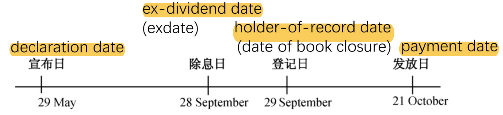
    >
    > - U.S. trades settle two business days after trade date (T+2). The ex‑date is set two business days before the record date so that anyone who bought “pre ex‑date” will settle by the record date and thus be on the register.

55. The best model to use when valuing a young dividend-paying company that is just entering the growth phase is *most likely* the:

    1. A.Gordon growth model.
    2. B.two-stage dividend discount model.
    3. **C.three-stage dividend discount model.**

    > - **Three‑stage model** – allows for:
    >   1. an initial high‑growth phase,
    >   2. **a transition (declining growth) phase,**
    >   3. then a final stable perpetual growth.

56. An analyst gathered the following information about a company:

    | Current earnings per share                     | $6.00 |
    | ---------------------------------------------- | ----- |
    | Current dividend per share                     | $2.40 |
    | Current market price per share                 | $35   |
    | Required rate of return on the stock           | 15.0% |
    | Expected growth rate of earnings and dividends | 8.0%  |

    Which of the following statements *best* describes the company’s price-to-earnings ratio (P/E)? Compared to the company’s trailing P/E ratio, the justified **==forward P/E ratio==** based on the Gordon growth dividend discount model is:

    1. **A.lower.**
    2. B.the same.
    3. C.higher.

    > - **Trailing P/E = Price ÷ E₀**, where E₀ is earnings over the past 12 months.
    > - **Forward P/E = Price ÷ E₁**, where E₁ is the analyst’s estimate of earnings over the next 12 months.
    >
    > The justified forward P/E (based on the Gordon growth model) is:
    >
    > $\text{Justified Forward P/E} = \dfrac{P_0}{E_1}=\dfrac{D_1/E_1}{r - g}$

57. The following financial data are available for a company:

    | Return on assets (ROA) | 4.8%  |
    | ---------------------- | ----- |
    | Total asset turnover   | 1.92  |
    | Financial leverage     | 1.75  |
    | Dividend payout ratio  | 48.1% |

    The company’s sustainable growth rate is *closest* to:

    1. A.4.00%.
    2. **B.4.40%.**
    3. C.4.78%.

    > **B Correct.**
    >
    > **==Sustainable growth rate== = Retention ratio (*b*) × Return on equity (ROE)**, where *b* = 1 – Dividend payout ratio = 1 – 0.481 = 0.519.
    >
    > ROE = Return on assets × Financial leverage
    >
    > = 0.048 × 1.75
    >
    > = 0.084.
    >
    > Therefore the sustainable growth rate = *b* × ROE = 0.519 × 0.084 = 0.0436 ≈ 4.40%.

58. An analyst gathers the following information about a company:

    | Dividend payout ratio             | 40%  |
    | --------------------------------- | ---- |
    | Required rate of return on equity | 15%  |
    | Return on equity                  | 20%  |

    The justified forward P/E ratio for the company's stock is *closest* to:

    1. A.5.7.
    2. B.8.0.
    3. **C.13.3.**

    > **C Correct** because the **==justified forward P/E ratio = *P*0 / *E*1 = *p* / (*r* – *g*)==**, where *p* is the dividend payout ratio, *r* is the required rate of return, *g* is the sustainable dividend growth rate; *g* = *b* × ROE where *b* is the earning retention rate = (1 – dividend payout ratio) and ROE is return on equity. Given *g* = (1 – 0.40) × 20% = 12%, then the justified forward P/E ratio = 0.40 / (0.15 – 0.12) = 13.3.
    >
    > Forward P/E = P0/E1 = p \* E0 \* [1+(1-p) \* ROE] / [r-(1-p) \* ROE] / [E0 \* [1+(1-p) \* ROE] ] = p/(r-g) = 40%/(15%-20%\*(1-40%))=13.333 

59. The primary difference between P/E multiples based on comparables and P/E multiples based on fundamentals is that **==fundamentals-based P/Es==** take into account:

    1. **A.future expectations.**
    2. B.the law of one price.
    3. C.historical information.

    > **A is correct.** Multiples based on comparables are grounded in the law of one price and take into account historical multiple values. In contrast, P/E multiples based on fundamentals can be based on the **Gordon growth model**, which takes into account future expected dividends.

60. Which of the following statements regarding the calculation of the enterprise value multiple is *most likely* correct?

    1. **A.Operating income may be used instead of EBITDA.**
    2. B.EBITDA may not be used if company earnings are negative.
    3. C.Book value of debt may be used instead of market value of debt.

    > **A is correct.** Operating income may be used in place of EBITDA when calculating the enterprise value multiple (i.e., **EBIT multiple**). EBITDA may be used when company earnings are negative because **EBITDA is usually positive** ("may not"…). The book value of debt cannot be used in place of market value of debt.

61. Which of the following statements concerning different valuation approaches is *most* accurate?

    1. **A.The ==justified forward price-to-earnings ratio (P/E)== approach offers the advantage of incorporating fundamentals and presenting intrinsic value estimations.**
    2. B.It is advantageous to use asset-based valuation approaches rather than forward-looking cash flow models in the case of companies that have significant intangibles.
    3. C.One advantage of the three-stage dividend discount model (DDM) model is that it is equally appropriate to young companies entering the growth phase and those entering the maturity phase.

    > 1. **Correct.** The justified forward P/E approach offers the advantage of incorporating fundamentals and presenting intrinsic value estimations.
    >
    >    $\text{Justified P/E} = \frac{\,1 - b\,}{\,r - g\,}$
    >
    >    where b is the retention ratio, r is the required return, and g is the sustainable growth rate ($g = b \times \text{ROE}$). This formula comes from equating the Gordon Growth Model to the P/E ratio.
    >
    > 2. Incorrect. In the case of companies that carry significant intangibles, the use of forward looking cash flow models is more advantageous than the asset-based valuation models.
    >
    > 3. Incorrect. The three-stage DDM model is appropriate to young companies entering the growth phase but not those entering the maturity phase. For such companies, the two-stage DDM model is appropriate.

62. Which of the following is *most likely* a reason for using asset-based valuation?

    1. **A.The analyst is valuing a privately held company.**
    2. B.The company has a relatively high level of intangible assets.
    3. C.The market values of assets and liabilities are different from the balance sheet values.

    > **A is correct.** Asset-based valuations are most often used when an analyst is valuing **private enterprises**, i.e., when **market values are not readily available**. Both B and C are considerations in asset-based valuations but are more likely to be reasons to avoid that valuation model rather than reasons to use it.

# Fixed Income

1. A firm that increases the size of an existing bond issue with a price significantly different from par is conducting a:

   1. **A.reopening.**
   2. B.private placement.
   3. C.distressed debt issuance.

   > When an issuer **increases the size of an existing bond issue**, it is said to **“reopen”** (or “tap”) that issue. The newly issued bonds carry the **same** maturity date and coupon (interest rate) as the original series but are typically sold at whatever price the market demands—often at a premium or discount to par.

2. Ewing Corp. is a large corporation that has an existing relationship with Sycamore Bank. Ewing is seeking short-term financing from a committed line of credit; however, Sycamore will offer only an uncommitted line of credit. Which of the following *best* supports Sycamore’s decision?

   1. A.Sycamore will receive an upfront commitment fee on the uncommitted line of credit.
   2. **B.Sycamore will require less bank capital for the uncommitted line than for the committed line of credit.**
   3. C.Sycamore can form a syndicate to reduce the amount of committed capital needed under an uncommitted line of credit.

   > **B is correct.** Committed lines require more bank capital than uncommitted lines, although commitments of less than a year (usually 364 days) minimize a bank’s capital requirement. A is incorrect because Sycamore will receive an upfront commitment fee on a committed line of credit. C is incorrect because Sycamore can form a syndicate to reduce the amount of committed capital needed under a committed line of credit.

3. A transaction where a hedge fund enters into a repo by taking a short position in a security with a view that its price will decline relative to the price of another security held is *best* described as:

   1. **A.a reverse repo.**
   2. B.a triparty repo.
   3. C.financing the ownership of a security.

   > - In a **reverse repo**, the counterparty (here, the hedge fund) **lends cash** and receives securities as collateral. The hedge fund can then sell those securities short in the market, betting their price will fall. When it later buys back the securities to return them under the repo, it profits if the price has declined relative to its other holding.

4. Which of the following statements about high yield is correct?

   1. A.High-yield investors benefit from higher bond prices as issuer-specific credit spreads fall, but in the case of callable debt, these gains are capped at the original purchase price.
   2. **B.Issuers in the high-yield market seek to retain financial flexibility by borrowing under leveraged loans with prepayment features or issuing bonds with contingency features.**
   3. C.Issuers who believe that their creditworthiness will decline frequently choose to issue callable debt, because the value of this contingency feature rises as a firm’s borrowing costs rise.

   > A **leveraged loan** is a senior secured (or sometimes unsecured) term loan extended to a borrower—typically a corporate, private‑equity sponsor, or special‑purpose vehicle—that already has substantial debt (i.e. is “leveraged”) or a non‑investment‑grade credit rating (below BBB–/Baa3).

5. Balance sheets of government entities are unlikely to include:

   1. A.FX reserves.
   2. B.long-term debt.
   3. **C.accrual of unfunded liabilities.**

   > **C is correct.** Public sector financial accounting standards vary widely and are often **prepared using cash**, rather than accrual-based, principles, typically excluding such items as the **depreciation** of fixed public goods, such as federal highways, or the **accrual** of unfunded liabilities, such as government pension obligations. 

6. Quasi-governmental bonds are *most likely*:

   1. A.issued by a national government in a foreign currency.
   2. B.issued by a governmental body below the national level.
   3. **C.repaid from cash flows generated by the issuer or from the project being financed.**

   > **C Correct** because Government agencies are quasi-government entities that issue debt in order to fund the government-sponsored provision of specific public goods or services based on sovereign or local law. This may involve the financing of specific activities promoted by the government or the operation of necessary infrastructure as mandated by law. For example, the Airport Authority of Hong Kong (AAHK), introduced in an earlier module, is the statutory agency for operating and developing the Hong Kong International Airport. AAHK issues a combination of short- and long-term debt to meet the airport’s specific working capital and capital investment needs. The primary source of repayment is cash flows from airport operations, while its sovereign government backing is a secondary source of repayment.

7. In practice, which of the following applies as it relates to sovereign government financing?

   1. A.Taxpayers smooth consumption over time, saving expected future taxes today for future payment.
   2. B.Taxpayers form rational expectations that today’s tax cuts will result in future tax increases and pass on tax savings to descendants.
   3. **C.Governments seek to minimize interest rate and rollover risks by distributing debt across maturities while issuing debt in regular, predictable intervals.**

   > **C is correct.** Governments seek to minimize interest rate and rollover risks by distributing debt across maturities while issuing debt in regular, predictable intervals. A and B are incorrect because taxpayers are neither able to perfectly smooth consumption over time, nor do they form rational expectations about current versus future taxes across generations, leading to fiscal instability, creating uncertainty in future tax rates, and threatening the stability of economic growth over time.
   >
   > - **A** describes the ***Ricardian‐equivalence*** concept (taxpayers saving today for future taxes), which empirical studies show **rarely holds in practice**.
   > - **B** likewise rests on a strong version of rational expectations and intergenerational transfer of tax burdens—also not observed as a practical financing strategy.

8. A non-sovereign bond issued to fund public goods and services in the **non-sovereign’s** (local) limited jurisdiction that is repaid from **local tax cash flows** is referred to as:

   1. **A.a GO bond.**
   2. B.a revenue bond.
   3. C.an agency bond.

   > **A is correct.** General obligation bonds are used to fund public goods and services in the non-sovereign’s limited jurisdiction and are repaid from local tax cash flows. B is incorrect because revenue bonds are issued for a specific project financing (infrastructure such as roads, bridges, or tunnels) with the source of repayment often linked to a project’s revenue stream (tolls, fees, etc.). C is incorrect because government agencies are quasi-government entities that issue debt in order to fund the government-sponsored provision of specific public goods or services based on sovereign or local law, with the primary source of repayment related to the public good or service and the sovereign government backing as a secondary source of repayment.

9. An investor sells a bond at the quoted price of \$98.00. In addition, she receives accrued interest of \$4.40. The flat price of the bond is equal to the:

   1. A.par value plus accrued interest.
   2. B.accrued interest plus the agreed-on bond price.
   3. **C.agreed-on bond price excluding accrued interest.**

   > 1. Incorrect because flat price is the agreed-upon bond price excluding accrued interest.
   > 2. Incorrect because flat price excludes accrued interest.
   > 3. **Correct.** The **==agreed-on bond price==** excluding accrued interest is referred to as the flat price.
   >
   > **==Flat price==** is also referred to as "clean price"
   >
   > The agreed-on bond price is dirty price

10. Exceptions to the **==maturity effect==** exist for bonds that have:

    1. **A.long maturities, make small coupon payments, and trade at a discount.**
    2. B.short maturities, have high coupon rates, and trade at a discount.
    3. C.long maturities, have high coupon rates, and trade at a premium.

    > The maturity effect “generally” holds that, for a given change in yield, longer‐maturity bonds exhibit larger percentage price changes than shorter‐maturity bonds. However, there is a well‑known exception:
    >
    > > **Long‐term, low‑coupon bonds trading at a discount can actually show smaller price sensitivity than shorter‐term counterparts.**
    >
    > In that case:
    >
    > - The **low coupon** means **most value is in the distant principal payment** (so it is not so sensitive to changes in yields than near-term payments).
    > - A **deep discount** increases the bond’s yield so much that the weight on that distant principal shrinks, reducing duration.
    > - As a result, the longer bond can be **less** sensitive than the shorter one.

11. With a constant market discount rate, as a non-callable, fixed-coupon bond approaches maturity: 

    1. A.the price–yield relationship will become more convex.
    2. **B.a low-coupon bond trading at a discount will increase in price.**
    3. C.a high-coupon bond trading at a premium will increase in price.

    > **B is correct.** Any bond trading at a discount will increase in price because of the **==pull-to-par effect==**.
    >
    > A is incorrect because the price–yield relationship generally becomes less convex as a bond approaches maturity.
    >
    > C is incorrect because a high-coupon bond trading at a premium will decrease in price as it approaches maturity.

12. A credit analyst is *least likely* to use **==matrix pricing==** to estimate the required yield and price of a(n):

    1. A.newly underwritten bond.
    2. **B.actively traded speculative grade bond.**
    3. C.inactively traded investment grade bond.

    > 1. Incorrect because matrix pricing is most suited to pricing newly underwritten bonds.
    > 2. **Correct.** Matrix pricing is most suited to **pricing inactively traded bonds and newly underwritten bonds**. A credit analyst is least likely to use matrix pricing to price an actively traded bond.
    > 3. Incorrect because matrix pricing is most suited to pricing inactively traded bonds.

13. A bond is traded in between its coupon payment dates. Which of the following is true? 

    1. A.The buyer must pay the full price plus the accrued interest.
    2. B.The bond’s quoted price is greater than its flat price.
    3. **C.Accrued interest is not included in the flat price.**

    > **C is correct.** The flat price, quoted by bond dealers, is the full price less accrued interest. Accrued interest is not included in the flat price.
    >
    > A is incorrect. The buyer must pay the full price, which already includes accrued interest.
    >
    > B is incorrect. **The flat price is the quoted price.**

14. An analyst is analyzing a three-year, 2.25% annual coupon bond issued by QWE Company. Currently, the bond’s yield-to-maturity is 2.707%. The three-year swap rate is 1.840%. The government spot rates are presented in the table.

    | **Maturity** | **Government Spot Rate** |
    | :----------- | :----------------------: |
    | 1Y           |          0.899%          |
    | 2Y           |          1.260%          |
    | 3Y           |          1.904%          |

    The **G-Spread** (in basis points) for the QWE bond is closest to: 

    1. **A.80.**
    2. B.87.
    3. C.135.

    > A **government spot rate** is the yield on a zero‑coupon government bond (i.e. the “true” risk‑free rate for a single payment at that maturity) . A **swap rate** is the fixed rate one party pays (or receives) in an interest‑rate swap in exchange for floating‑rate payments—so it embeds **interbank credit and liquidity premia**, not just pure government funding costs
    >
    > G-spread: yield spread over an actual or interpolated government bond
    >
    > **I-spread:** yield spread of a specific bond over the standard swap rate in that currency of the same tenor
    >
    > The “I” in **I‑spread** simply stands for **“interpolated.”**
    >
    > - When you compute an I‑spread, you take the yield (or Z‑spread) of a corporate bond and subtract the **swap curve** rate that has been **interpolated** to exactly the same maturity as your bond.

15. The factor *least likely* to influence the **yield spread** on an option-free, fixed-rate bond is a change in the:

    1. A.liquidity of the bond.
    2. **B.expected inflation rate.**
    3. C.credit risk of the issuer.

    > Changes in the expected inflation rate influence the benchmark rate but not the spread.

16. If the price of the QWE bond is 98.70% of par, its Z-spread (in basis points) is closest to: 

    1. A.80.
    2. **B.82.**
    3. C.87.

    > Zero volatility spread (Z-spread, static spread) is a constant yield spread over a government spot curve
    > $$
    > P_{0}
    > = \frac{C_{1}}{\bigl(1 + s_{1} + Z\bigr)^{1}}
    > + \frac{C_{2}}{\bigl(1 + s_{2} + Z\bigr)^{2}}
    > + \cdots
    > + \frac{C_{n} + \mathrm{Par}}{\bigl(1 + s_{n} + Z\bigr)^{n}}
    > $$

17. An analyst is analyzing a six-year callable bond with a semiannual coupon of 2.50% trading at a price of 98.90 per 100 par value and the following call schedule:

    | **Call Schedule** |                |
    | :---------------- | :------------: |
    | **Period**        | **Call Price** |
    | 4–5 Years         |     101.50     |
    | 5–6 Years         |     101.00     |

    Match the yields below to the respective yield measures.

    | **Yield** |  **Yield Measure**   |
    | :-------- | :------------------: |
    | 2.6998%   | Yield-to-first call  |
    | 2.6998%   | Yield-to-second call |
    | 2.9253%   |  Yield-to-maturity   |
    | 3.1497%   |    Yield-to-worst    |

    > **Calculation of yield‑to‑first call**
    >
    > PV = $PMT/(1+r)^1 + PMT/(1+r)^2 + \dots + (PMT + CallPrice)/(1+r)^N$
    >
    > Numerically:
    >
    > PV = $1.25/(1+r)^1 + 1.25/(1+r)^2 + \dots + (1.25 + 101.50)/(1+r)^8$
    >
    > Solve for $r$:
    >
    > $r = 0.015748 \times 2 = 0.031497$
    >
    > **Calculation of yield‑to‑second call**
    >
    > PV = $PMT/(1+r)^1 + PMT/(1+r)^2 + \dots + (PMT + CallPrice)/(1+r)^N$
    >
    > Numerically:
    >
    > PV = $1.25/(1+r)^1 + 1.25/(1+r)^2 + \dots + (1.25 + 101.0)/(1+r)^{10}$
    >
    > Solve for $r$:
    >
    > $r = 0.014626 \times 2 = 0.029253$
    >
    > **Calculation of yield‑to‑maturity**
    >
    > PV = $PMT/(1+r)^1 + PMT/(1+r)^2 + \dots + (PMT + FV)/(1+r)^N$
    >
    > Numerically:
    >
    > PV = $1.25/(1+r)^1 + 1.25/(1+r)^2 + \dots + (1.25 + 100.0)/(1+r)^{12}$
    >
    > Solve for $r$:
    >
    > $r = 0.013499 \times 2 = 0.026998$

18. DMT Corp. issued a five-year floating-rate note (FRN) that pays a quarterly coupon of three-month market reference rate (MRR) plus 125 bps. The FRN is priced at 96 per 100 of par value. Assuming a 30/360-day count convention, evenly spaced periods, and constant three-month market reference rate (MRR) of 5%, the **==discount margin==** for the FRN is *closest* to:

    1. A.180 bps.
    2. **B.221 bps.**
    3. C.400 bps.

    > The discount margin can be estimated by solving for DM in the equation
    >
    > 
    >
    > $96 = \frac{1.5625}{\bigl(1 + \frac{0.05 + DM}{4}\bigr)^{1}} \;+\; \frac{1.5625}{\bigl(1 + \frac{0.05 + DM}{4}\bigr)^{2}} \;+\;\dots+\; \frac{101.5625}{\bigl(1 + \frac{0.05 + DM}{4}\bigr)^{20}}$
    >
    > 
    >
    > The solution for the discount rate, $r = \frac{0.05 + DM}{4}$, is 1.8025%. Therefore, $DM = 2.21%$ or 221 bps.

19. A two-year floating-rate note issued by a French corporation pays the three-month MRR of –0.55% plus 160 bps. The floater is priced at 101.20 per 100 of par value. Assuming the 30/360 day-count convention and 90 days per period, the discount margin for the floater is closest to:

    1. A.25 bps.
    2. B.50 bps.
    3. C.110 bps.

    > CR = -055%+1.6%=1.05%
    >
    > 3-month payment, m=12/3=4, PMT=100*1.05%/4=0.2625
    >
    > N=8, PV=-101.2, FV=100, PMT=0.2625, I/Y->0.1118%, then annual DR = 4I/Y=0.4470%
    >
    > DR=MRR+DM, DM=DR-MRR=0.4470%+0.55%=0.9970%=99.7bps

20. Which of the following 90-day money market instruments *most likely* offers the investor the highest rate of return?

    | **Money Market Instrument** | **Quoted Rate** | **Quotation Basis** | **Day Convention**  | Yield                               |
    | --------------------------- | --------------- | ------------------- | ------------------- | ----------------------------------- |
    | Instrument A                | 5.78%           | 360                 | Discount rate       | 1/(1-5.78%\*90/360)-1=0.01466186393 |
    | Instrument B                | 5.80%           | 365                 | Discount rate       | 1/(1-5.80%\*90/365)-1=0.0145        |
    | Instrument C                | 5.96%           | 365                 | **==Add-on rate==** | (1+5.96%\*90/365)/1-1=0.01469589041 |

    1. A.Instrument A
    2. B.Instrument B
    3. **C.Instrument C**

    > 

21. Using the following US Treasury forward rates, the value of a 2.5-year $100 par value Treasury bond with a 5% coupon rate is *closest* to:

    | **Period** | **Years** | **Forward Rate** |
    | ---------- | --------- | ---------------- |
    | 1          | 0.5       | 1.20%            |
    | 2          | 1         | 1.80%            |
    | 3          | 1.5       | 2.30%            |
    | 4          | 2         | 2.70%            |
    | 5          | 2.5       | 3.00%            |

    1. A.$101.52.
    2. B.$104.87.
    3. **C.$106.83.**

    > 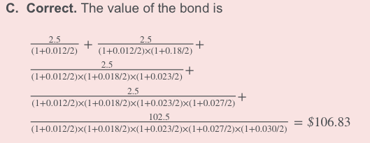

22. Match the following statements about par rate curves with corresponding statements about spot rate curves. 

    | 1. The par rate curve lies above the spot rate curve.       | A. The spot rate curve is upward sloping (i.e., normal), and spot rates are negative. |
    | ----------------------------------------------------------- | ------------------------------------------------------------ |
    | 2. The par rate curve lies below the spot rate curve.       | B. The spot rate curve is upward sloping (i.e., normal), and spot rates are positive. |
    | 3. The par rate curve is equivalent to the spot rate curve. | C. The spot rate curve is flat across all maturities.        |

    > 1. A. This situation is illustrated in the German and Swiss government interest rate data in which spot rates are negative while the spot rate curve is upward sloping. In such instances, par rates lie above spot rates.
    > 2. B. This situation is illustrated in the Canadian and Australian government interest rate data in which spot rates are positive and the spot curve is normal.
    > 3. C. This is a hypothetical case but can be seen by creating a flat spot rate curve.

23. A long-term bond investor with an investment horizon of 8 years invests in option-free, fixed-rate bonds with a Macaulay duration of 10.5. The investor *most likely* currently has a:

    1. A.positive duration gap and is currently exposed to the risk of lower interest rates.
    2. **B.positive duration gap and is currently exposed to the risk of higher interest rates.**
    3. C.negative duration gap and is currently exposed to the risk of higher interest rates.

    > **B Correct.** The **==duration gap==** is the bond’s **Macaulay duration minus the investment horizon**, which is positive in this case. A positive duration gap implies that the investor is currently exposed to the risk of higher interest rates.

24. The duration gap at which reinvestment risk and price risk are equal is:

    1. A.less than zero.
    2. **B.equal to zero.**
    3. C.greater than zero.

    > **B is correct.** Reinvestment risk and price risk **equally offset each other** when an investor’s investment horizon equals a bond’s Macaulay duration. This is when the duration gap is zero.

25. Which of the following conditions is *not* required for the realized horizon yield to equal the original yield to maturity on an option-free, fixed-coupon bond?

    1. **A.The bond is held to maturity.**
    2. B.The bond is sold at a price on the constant-yield price trajectory.
    3. C.The coupon payments are reinvested at the same interest rate as the original yield to maturity.

    > **A Correct.** The realized horizon yield will equal the original yield to maturity if the coupon payments are reinvested at the original yield to maturity and the bond is sold at a price on the constant-yield price trajectory. The latter condition ensures that the investor does not have any capital gains or losses when the bond is sold.

26. An investor purchases a 12-year, 5.8% annual bond and intends to sell it after 10 years. The Macaulay duration of the bond is 8.97 years. If interest rates fall by 75 bps immediately after the purchase of the bond, the investor faces:

    1. **A.negative reinvestment risk.**
    2. B.no reinvestment risk.
    3. C.positive reinvestment risk.

    > **Negative reinvestment risk**: The danger that future reinvestment rates **fall below** the rate built into the original yield calculation.
    >
    > **Positive reinvestment risk**: The danger (for the investor) that reinvestment rates **rise above** the assumed rate, or—viewed from the issuer’s side—the *opportunity* that higher rates let them reinvest at a gain.

27. Which of the following statements regarding the interest rate risk of a fixed-rate bond is correct?

    1. A.Coupon reinvestment risk and market price risk are positively related.
    2. B.All investors in a particular bond are exposed to the same interest rate risk.
    3. **C.Market price risk matters more than coupon reinvestment risk when the investor’s time horizon is short relative to the bond’s time to maturity.**

    > 1. Incorrect because coupon reinvestment risk and market price risk are offsetting types of interest rate risk that are inversely (not positively) related. When interest rates go up (down), the future value of reinvested coupons increases (decreases) whereas the sale price of a bond that matures after the horizon date decreases (increases).
    > 2. Incorrect because investors holding the same bond can have very different exposures to **interest rate risk** if they have different investment horizons. When the investor’s horizon is short relative to a bond’s time to maturity, **market price risk** matters more than **coupon reinvestment risk**. In contrast, when the investor’s horizon is long, reinvestment risk matters more than market price risk.
    > 3. **Correct.** Market price risk matters more than coupon reinvestment risk when the investor has a short horizon relative to the bond’s time to maturity.

28. *True or false:* **==Curve duration==** is a type of **==yield duration==**.

    1. A.True
    2. **B.False**

    > **B is correct.** The Macaulay, modified, and money duration measures, as well as the price value of a basis point, are all types of yield duration. The curve duration is not classified as a type of yield duration.
    >
    > **Curve duration** is the sensitivity of a bond’s (or portfolio’s) price to a **parallel shift** in the **entire ==benchmark yield curve==** used to discount its cash flows.
    >
    > Formally:
    >
    > $\text{Curve Duration} = -\frac{1}{P_0} \cdot \frac{\partial P}{\partial y_{\text{curve}}}$
    >
    > | **Feature**        | **Modified Duration**                 | **Curve Duration**                                    |
    > | ------------------ | ------------------------------------- | ----------------------------------------------------- |
    > | 📌 **What shifts?** | The bond’s **own yield** (YTM or OAS) | The entire **benchmark yield curve** (parallel shift) |

29. Consider the following information relating to a corporate bond:

    | Full price of bond (PVFull)   | $100,367,242 |
    | ----------------------------- | ------------ |
    | Modified duration (AnnModDur) | 8.124 years  |
    | Accrued interest              | $303,218     |

    The money duration of the corporate bond is *closest* to:

    1. A.$812,920,131.
    2. **B.$815,383,474.**
    3. C.$817,846,817.

    > 1. Incorrect because the full price of the bond (PVFull) includes accrued interest. The calculation of money duration should include accrued interest. However, accrued interest is incorrectly subtracted from the full price of the bond here:
    >
    >    MoneyDur = AnnModDur × [PVFull – Accrued interest]
    >
    >    = 8.124 × [$100,367,242 – $303,218]
    >
    >    = $812,920,131
    >
    > 2. **Correct.** The money duration of the corporate bond is equal to $815,383,474.
    >
    >    MoneyDur = AnnModDur × PVFull
    >
    >    = 8.124 × $100,367,242
    >
    >    = $815,383,474

30. A portfolio manager is assessing the interest rate risk of three bonds as she considers making an investment of USD50 million. All three bonds are issued on 1 June 2026 and mature on 1 June 2030, and they have the following characteristics:

    | **Characteristic**  | **Bond One** | **Bond Two** | **Bond Three** |
    | :------------------ | :----------: | :----------: | :------------: |
    | Coupon (semiannual) |      7%      |      3%      |       5%       |
    | Yield-to-maturity   |      3%      |      7%      |       5%       |

    Relative to a five-year zero-coupon bond priced to yield 5%, Bond Three has a modified duration that is *best*described as:

    1. **A.lower than the zero-coupon bond’s modified duration.**
    2. B.the same as the zero-coupon bond’s modified duration.
    3. C.greater than the zero-coupon bond’s modified duration.

    > **A is correct.** No calculation is necessary, as we know that a five-year zero-coupon bond has a **Macaulay duration** of 5, which is greater than that of a coupon bond like Bond three. Since they have the same yields, the bond’s modified durations will have the same relationship as their Macaulay duration.

31. Which of the following statements regarding Macaulay duration is correct?

    1. A.For a given coupon rate, Macaulay duration can be lower for a long-term discount bond than for a short-term discount bond.
    2. B.For a given time to maturity and yield to maturity, Macaulay duration is lower for a zero-coupon bond than for a low-coupon bond trading at a discount.
    3. C.For a given time to maturity and yield to maturity, Macaulay duration is lower for a low-coupon bond trading at a discount than for a high-coupon bond trading at a premium.

    > 1. **Correct** because generally, the Macaulay duration statistic increases with a bond’s time to maturity. This pattern always holds for bonds trading at par value or at a premium but does not always hold for discount bonds. In the case of discount bonds, for a given coupon rate, a longer-term discount bond can have a lower Macaulay duration than a shorter-term discount bond. This situation typically occurs when the number of periods remaining in the bond’s life is large and the coupon rate is below the yield to maturity.
    > 2. Incorrect because for the same time to maturity and yield to maturity, the Macaulay duration is higher (not lower) for a zero-coupon bond than for a low-coupon bond trading at a discount.
    > 3. Incorrect because for the same time to maturity and yield to maturity, the Macaulay duration is higher (not lower) for a low-coupon bond trading at a discount than for a high-coupon bond trading at a premium.

32. The portfolio manager is interested in comparing the interest rate risk of Bond Three to that of Bond Four, a floating-rate note that **resets every six months**. On 1 June 2026, both bonds were priced to yield 5%. If the yield changes from 5% to 5.25% halfway through the first coupon period, which bond has the greater Macaulay duration?

    1. **A.Bond Three**
    2. B.Bond Four
    3. C.Neither: The Macaulay duration is the same for both bonds.

    > **A is correct.** The Macaulay duration for Bond Three is 3.6747. The Macaulay duration for Bond Four is 0.5 because there is exposure to interest rate changes for one-half of the coupon period.

33. The following table provides information about a portfolio of three bonds.

    | **Bond** | **Maturity** | **Price** | **Par Amount** | **Duration** |
    | -------- | ------------ | --------- | -------------- | ------------ |
    | 1        | 17-year      | $109.2461 | $16 million    | 8.56         |
    | 2        | 20-year      | $100.4732 | $4 million     | 9.19         |
    | 3        | 25-year      | $84.6427  | $8 million     | 11.48        |

    Based on this information, the duration of the portfolio is *closest* to:

    1. **A.9.35.**
    2. B.9.48.
    3. C.9.74.

    > Duration should be **weighted by market values**

34. An investor’s well-diversified portfolio has $200,000 in cash. The investor aims to invest in short-term, one-year Large-Cap Company bonds, prior to using the cash to invest in an upcoming IPO. There are currently two Large-Cap Company bonds on the market to purchase, both with one-year maturities. One of the bonds, Bond A, is a non-callable bond, while Bond B is a callable bond. As a fixed-income analyst, you are asked to conduct an analysis.

    Question

    For the two bonds offered by Large-Cap Company, which duration calculation would be the *most* appropriate to use to measure interest rate risk?

    1. A.Modified duration
    2. B.Macaulay duration
    3. **C.Effective duration**

    > **C is correct.** Since Bond B is callable, it has an **embedded option**, and effective duration is the most appropriate duration measure. Effective duration also works on bonds without embedded options and would allow the analyst to compare the interest rate risk of the two bonds.

35. An investor’s well-diversified portfolio has $200,000 in cash. The investor aims to invest in short-term, one-year Large-Cap Company bonds, prior to using the cash to invest in an upcoming IPO. There are currently two Large-Cap Company bonds on the market to purchase, both with one-year maturities. One of the bonds, Bond A, is a non-callable bond, while Bond B is a callable bond. As a fixed-income analyst, you are asked to conduct an analysis.

    Question

    For Bond B, as the benchmark yield curve declines, the slope of the line tangent to the bond flattens as the benchmark yield declines and reaches an inflection point, after which the effective convexity becomes:

    1. A.positive.
    2. **B.negative.**
    3. C.neither positive nor negative.

    > **B is correct.** Since the bond is **callable**, after a certain point on the yield curve, the issuer will exercise the call and the owner will not be able to realize additional gains from declines in the benchmark yield curve.

36. An investor’s well-diversified portfolio has $200,000 in cash. The investor aims to invest in short-term, one-year Large-Cap Company bonds, prior to using the cash to invest in an upcoming IPO. There are currently two Large-Cap Company bonds on the market to purchase, both with one-year maturities. One of the bonds, Bond A, is a non-callable bond, while Bond B is a callable bond. As a fixed-income analyst, you are asked to conduct an analysis.

    Question

    The following information on Bonds A and B was obtained:

    | **Bond** | **Effective Duration** | **Effective Convexity** |
    | :------- | :--------------------: | :---------------------: |
    | A        |        7.48621         |        29.35972         |
    | B        |        7.23852         |       –321.75618        |

    Compare the interest rate risk of Bond A and Bond B.

    1. A.Bond A is riskier than Bond B.
    2. **B.Bond B is riskier than Bond A.**
    3. C.Bond A and Bond B have approximately the same interest rate risk.

    > **B is correct.** Bond B is riskier since the **100 bps upward shift** in the yield curve results in a greater percentage price decrease, owing to its negative effective convexity:
    >
    > 

37. An investor’s well-diversified portfolio has $200,000 in cash. The investor aims to invest in short-term, one-year Large-Cap Company bonds, prior to using the cash to invest in an upcoming IPO. There are currently two Large-Cap Company bonds on the market to purchase, both with one-year maturities. One of the bonds, Bond A, is a non-callable bond, while Bond B is a callable bond. As a fixed-income analyst, you are asked to conduct an analysis.

    A colleague asks whether you also considered looking at the key rate durations when comparing the interest rate risks of Bond A and Bond B. Would research into key rate durations for Bond A and Bond B help you make a better decision about the interest rate risk of the two bonds?

    1. A.Yes
    2. **B.No**
    3. C.Inconclusive

    > **B is correct.** Since both bonds mature **in one year**, **==key rate duration==** analysis would not give you any additional insight, since both bonds would undergo the same shift in the curve.
    >
    > Key‑rate duration (KRD)—sometimes called **partial duration**—measures how much the price of a bond (or a whole portfolio) will change if the yield **at one specific maturity point on the ==benchmark curve==** moves by 1 percentage point, **while every other point on the curve is held constant**. Because it isolates sensitivity to *shape* changes in the curve, KRD is the standard tool for analysing and hedging non‑parallel yield‑curve risk. 

38. An analyst gathers the following information about a pension plan's liabilities:

    | Interest Rate Assumption | Present Value of Liabilities (in $ Millions) |
    | :----------------------: | :------------------------------------------: |
    |           0.5%           |                     198                      |
    |           1.0%           |                     186                      |
    |           1.5%           |                     174                      |

    If interest rates are currently 1.0%, the **==effective duration==** of the liabilities is *closest* to:

    1. A.6.5.
    2. **B.12.9.**
    3. C.25.8.

    > **B Correct** because effective duration = (PV– – PV+)/(2 × ΔCurve × PV0) = ($198 million – $174 million)/(2 × 0.005 × $186 million) = 12.9032 ≈ 12.9.

39. What impact would a “flight to safety” (i.e., government bond yields falling and credit spreads widening) have on the analytical duration estimate of Bond A?

    1. A.Decreased duration
    2. B.Increased duration
    3. **C.No impact**

    > **C is correct.** There would be no impact on the analytical duration estimate. However, an empirical duration estimate would be impacted. A flight to safety would result in an increase in the bond price due to the falling benchmark yield being offset by widening credit spread. This would lead to a lower empirical duration than analytical duration.

40. An uncollateralized USD200,000 note has the following characteristics:

    Recovery rate 95%

    Exposure at default USD150,000

    If the note’s expected loss in the event of default is USD2,500, its probability of default is *closest to:*

    1. A.15%.
    2. B.25%.
    3. C.33%.

    > **The correct answer is C.**
    >
    > Here we may use Equation 1 to solve for POD:
    >
    > **EL = POD × (EE – Collateral) × (1 – RR)**.

41. While the likelihood of default for IG borrowers is typically **below** that of an HY issuer, an investor’s loss in the event of a default for secured debt is usually **lower** than unsecured debt due to the secondary source of repayment.

    > HY: high-yield
    >
    > IG: investment-grade

42. A bond investor is considering the credit risk components and observed yield spreads for two IG bonds of similar maturity and liquidity:

    |            | **POD** | **LGD** | **Yield Spread** |
    | :--------- | :-----: | :-----: | :--------------: |
    | **Bond 1** |  1.25%  |   75%   |     100 bps      |
    | **Bond 2** |  1.1%   |   85%   |      95 bps      |

    Which of the following conclusions about the relationship between these bonds is most correct?

    1. A.An investor should be indifferent between purchasing Bond 1 and Bond 2, since Bond 1’s higher spread is sufficient compensation for the higher POD versus Bond 2.
    2. B.An investor should prefer Bond 2 over Bond 1, since they may earn a spread that is more than sufficient for assuming the credit risk.
    3. **C.An investor should prefer Bond 1 over Bond 2, since it offers the highest spread relative to the expected loss.**

    > **C is correct.** We can compare Bond 1 and Bond 2 by calculating the expected loss for each and comparing it to the annual spread:
    >
    > EL = POD × LGDCredit Spread ≈ POD × LGD*Bond 1:* EL = 0.938% (= 1.25% × 75%)Spread − EL = 6.2 bps (= 1.00% − 0.938%).*Bond 2:* EL = 0.935% (= 1.1% × 85%)Spread − EL = 1.5 bps (=0.95% − 0.935%).
    >
    > An investor should therefore choose Bond 1 given its higher expected return versus credit risk. A is incorrect as it fails to take the LGD into account. B is incorrect as although Bond 1 earns a 1.5 bps spread above the expected annual loss, it is less than the additional 6.2 bps spread above the expected loss earned by purchasing Bond 1.

43. Which of the following statements best characterizes external strength for a non-reserve currency sovereign country?

    1. A.The ability to impose and enforce strict capital controls
    2. B.The establishment of a fixed exchange rate regime
    3. **C.The ability to generate sufficient stable foreign currency cash inflows**

    > **C is correct.** A key factor influencing whether a non-reserve currency sovereign government can meet external debt obligations is external liquidity and solvency, or the ability to generate sufficient, stable foreign currency cash inflows to meet interest and principal payments on external debt. A is incorrect, as capital controls may restrict the ability to generate FX inflows. B is incorrect, as a fixed exchange rate regime may cause instability in the case of currency devaluation.

44. With respect to the credit rating agencies' practice of **==notching==**, the size of a notching adjustment:

    1. A.is larger for higher-rated credits.
    2. B.is standardized between rating agencies.
    3. **C.depends on the rating of the issuer's ==senior unsecured== debt.**

45. A corporation with a holding company structure has debt at both its parent holding company and operating subsidiaries. Debt at the operating level must be serviced before funds can be upstreamed to pay debt at the holding company. This arrangement *best* describes:

    1. **A.==structural subordination==.**
    2. B.a cross-default provision.
    3. C.the corporate family rating.

    > **A Correct** because another factor considered by rating agencies is structural subordination, which can arise when a corporation with a holding company structure has debt at both its parent holding company and operating subsidiaries. Debt at the operating subsidiaries will get serviced by the cash flow and assets of the subsidiaries before funds can be passed (“**upstreamed**”) to the holding company to service debt at that level.
    >
    > Subordination is a type of internal credit enhancement. Other designs of subordination include waterfall structure and tranches.

46. Mojofon’s S&P issuer credit rating is B+. Its S&P subordinated bond issue rating is *most likely*:

    1. A.BB –.
    2. B.B+.
    3. **C.B –.**

    > **The correct answer is C.** **An issuer credit rating is the rating applied to a company’s senior unsecured debt** (the "**notch**"). The rating agency will usually apply a notching adjustment to the lower-ranked subordinated debt, whose rating should therefore be lower than that of the senior unsecured debt.

47. Which of the following statements regarding securitized products is correct?

    1. A.Credit tranching offers credit protection for the equity tranche in a securitization.
    2. B.Pass-through securities are the simplest securitized structure and involve issuers retaining the underlying assets.
    3. **C.In a true securitization, the underlying pool of assets is removed from the balance sheet and transferred into an independent legal entity that issues securities backed by these assets.**

    > **The correct answer is C.** In a true securitization, the specific pool of assets is removed from the balance sheet and transferred into a separate and independent legal entity that then issues securities backed by these pooled assets. A is incorrect because credit tranching offers credit protection for the more senior bond classes in a securitization not the equity tranche. B is incorrect because **covered bonds**, not pass-through securities, are the simplest securitization structure, which involves the issuer retaining the underlying assets on its balance sheet.

48. Upon a bankruptcy affecting a covered bond, the first available safeguards to protect against potential losses are the:

    1. **A.ringfenced loans.**
    2. B.unencumbered assets of the issuer.
    3. C.assets added by the collateral manager during ramp-up.

    > **The correct answer is A.** In the case of bankruptcy covered bond investors, they have dual recourse with the first safeguard being the ringfenced loans in the cover pool that underlie the covered bond transaction. B is incorrect because while investors also have recourse to the unencumbered assets of the issuer, those serve as a subsequent safeguard. C is incorrect because this post-transaction contribution is characteristic of the non-amortizing structure of a **CDO** (collateralized debt obligation).

49. Consider the following potential reasons to explain why covered bonds usually carry lower credit risks and offer lower yields than otherwise similar ABS:

    1. Eligibility criteria
    2. Dynamic cover pool
    3. Redemption regime in event of sponsor default

    Which of the following factors accurately explain(s) this result?

    1. A.Reason 1 only
    2. B.Reasons 1 and 2 only
    3. **C.Reasons 1, 2, and 3**

    > **Reason 1: Eligibility Criteria**
    >
    > - Covered bonds require the **cover pool** to meet **strict regulatory standards** (e.g., high-quality mortgages or public-sector loans).
    > - This improves asset quality compared to ABS, which may contain subprime or heterogeneous assets.
    > - **Result**: Lower credit risk → Lower yield.
    >
    > **Reason 2: Dynamic Cover Pool**
    >
    > - The cover pool is **actively managed** — if an asset defaults or matures, it must be replaced.
    > - This **mitigates asset deterioration risk**, which ABS investors cannot avoid (ABS pools are static).
    > - **Result**: Improves asset backing → Lower credit risk → Lower yield.
    >
    > **Reason 3: Redemption Regime in Event of Sponsor Default**
    >
    > - If the issuer defaults, **investors still have recourse to the cover pool** (dual recourse).
    > - Additionally, many jurisdictions allow for **extended maturity (soft bullet)** or **conditional pass-through** to avoid fire-sale of assets.
    > - This structure **enhances payment stability** and reduces credit event risk.
    >
    > **==Covered bonds==** are debt securities issued by banks or financial institutions that are backed by a **cover pool of high-quality assets** (like mortgages or public-sector loans), **while remaining on the issuer’s balance sheet**. They provide **dual recourse**: bondholders can claim against both the **issuer** and the **cover pool** if the issuer defaults. Covered bonds are conservative, **low-risk, low-yield instruments**, widely used in Europe.
    >
    > In **covered bonds**, the **==first recourse==** is to the **issuer**, and the **==secondary recourse==** is to the **cover pool** of assets if the issuer defaults.

50. Select the internal credit enhancement that seeks to improve the overall credit quality of a risky pool of securitized loans.

    1. A.Letters of credit
    2. **B.Overcollateralization**
    3. C.Cash collateral accounts

    > **The correct answer is B.** Overcollateralization, one of the three main types of internal credit enhancements used in securitization transactions, is a provision that the collateral underlying the transaction is larger than the face value of the issued bonds. The extra collateral provides a cushion to cover losses from defaults in the underlying pool of collateral. A and C are incorrect because both are types of external, not internal, credit enhancements.
    >
    > 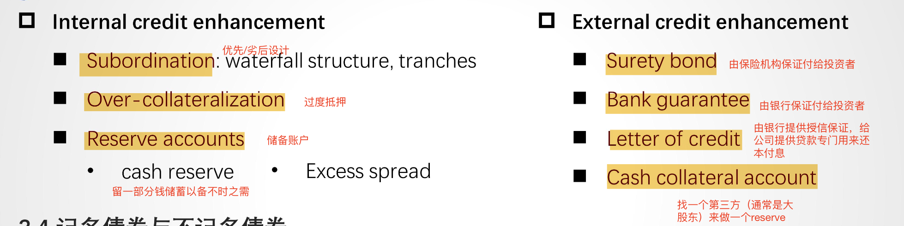
    >
    > 区分cash collateral accounts (external) and reserve accounts (internal)

51. An action affecting the cash flow received by a credit card ABS holder during its revolving period is the:

    1. A.early repayment of principal by cardholders.
    2. B.card’s floating-rate cap exceeding the periodic rate.
    3. **C.triggering of an ABS rapid amortization provision.**

    > **The correct answer is C.** Triggering rapid amortization provisions accelerates and alters principal cash flows. Noteholders will receive their investments earlier, which they can then reallocate to other investments offering more attractive risk/return characteristics. A is incorrect because typically during the revolving period, as credit cards are non-amortizing loans, the security holders receive only payments from the finance charges and fees the lender collects. Returned principal is reinvested in the collateral pool. B is incorrect because when floating-rate cap exceeds the rate cardholders must pay, there is no related binding limit on finance payments.
    >
    > **Credit card receivable-backed securities**
    >
    > • The cash flows consist of finance charges collected, fees, and principal repayments
    >
    > • They are non-amortizing loans with lockout period, during which the principal is reinvested and only finance charges collected and fees is paid to investors

52. A characteristic of solar loans that makes them attractive to potential solar ABS investors is their:

    1. A.universal availability to any homeowners.
    2. **B.ability to combine multiple liens to mitigate default risk.**
    3. C.flexibility in allowing either purchase or rental of solar systems.

    > **The correct answer is B.** Default risk minimization adds to investment appeal, and solar loans provide opportunities for overcollateralization. Normally, solar ABS are collateralized by the underlying debt: mortgages, loans, or receivables. These loans can be further collateralized by a lien pledged on the installed systems, on the property itself, or both. A is incorrect as solar loans are typically extended only to prime borrowers who own their homes and have good payment records. C is incorrect as the loans enable property owner purchase of installed systems instead of rental that is transacted through solar leases.

53. The feature of a **covered bond** transaction *most likely* shared with both CDOs and non-mortgage ABS is its:

    1. A.specified LTV cutoff.
    2. B.multiple tranches for the cover pool.
    3. **C.distinct maturity and settlement dates.**

    > **The correct answer is C.** As illustrated by their respective term sheets, all three types of ABS transactions have timing milestones designating due dates for investments (settlement date) and the end of their terms (maturity date). A is incorrect because in contrast to their non-amortizing counterparts, covered bonds are backed by a segregated pool of assets that typically consist of commercial or residential mortgages, for which an LTV cutoff is applicable. B is incorrect because while other ABS often use credit tranching to create bond classes with different borrower default exposures, covered bonds usually consist of one bond class per cover pool.

54. Investors in commercial mortgage-backed securities (CMBS) face balloon risk, which is *most likely* a type of:

    1. A.call risk.
    2. **B.extension risk.**
    3. C.contraction risk.

    > **B Correct.** **==Balloon risk==** is the risk that the borrower will not be able to arrange for refinancing or sell the property to make the **==balloon payment==** typically associated with commercial loans backing CMBS. As a result, the CMBS may extend in maturity, implying that balloon risk is a type of extension risk.
    >
    > A **balloon payment** is a **large, lump-sum payment** due at the **end of a loan’s term**, after a series of **smaller periodic payments**. It’s common in loans where the regular payments **do not fully amortize** the principal.

55. Which of the following is *least likely* a feature typical of an agency residential mortgage-backed security (RMBS)?

    1. A.A guarantee by a government-sponsored enterprise
    2. **B.The use of credit enhancements to reduce credit risk**
    3. C.The satisfaction of specific established underwriting standards

    > **B. The use of credit enhancements to reduce credit risk**
    >
    > - **Least likely** in agency RMBS
    > - Agency RMBS **do not rely on credit enhancements** like subordination, excess spread, or reserve funds — those are **used in private-label (non-agency) RMBS**.
    > - Credit risk is **mitigated by the agency guarantee**, not through structural credit enhancement mechanisms.

56. 

57. | **Bond Class**   |                                                              |
    | :--------------- | :----------------------------------------------------------- |
    | A (senior)       | *Tranche A Notes* Face value: CAD250 million Interest rate: MRR + 1.00% Maturity: One year |
    | B (subordinated) | *Tranche B Notes* Face value: CAD100 million Interest rate: MRR + 2.00% Maturity: Two years |
    | C (subordinated) | *Tranche C Notes* Face value: CAD100 million Interest rate: MRR + 3.00% Maturity: Three years |
    | D (subordinated) | *Tranche D Notes* Face value: CAD50 million Interest rate: MRR + 4.00% Maturity: Four years |
    | Total            | CAD500 million                                               |

    Question

    | **Bond Class**   |                                                              |
    | :--------------- | :----------------------------------------------------------- |
    | A (senior)       | *Tranche A Notes* Face value: CAD250 million Interest rate: MRR + 1.00% Maturity: One year |
    | B (subordinated) | *Tranche B Notes* Face value: CAD100 million Interest rate: MRR + 2.00% Maturity: Two years |
    | C (subordinated) | *Tranche C Notes* Face value: CAD100 million Interest rate: MRR + 3.00% Maturity: Three years |
    | D (subordinated) | *Tranche D Notes* Face value: CAD50 million Interest rate: MRR + 4.00% Maturity: Four years |
    | Total            | CAD500 million                                               |

    Select which of the following statements related to the collateralized bonds issued directly by the SPE is *most* accurate.

    1. A.This senior/subordinated structure is an example of time tranching.
    2. **B.Losses are realized by the subordinated bond classes before any losses are realized by Class A bonds.**
    3. C.In a waterfall structure such as this one, losses are shared proportionally across all subordinated bond classes.

    > **A. This senior/subordinated structure is an example of time tranching.**
    >
    > - **Incorrect.**
    > - **Time tranching** refers to a structure where **principal repayments** are distributed sequentially based on **maturity**, such as in **PAC or TAC tranches** in CMOs.
    > - Here, the tranches differ in maturity, but the key structure is **based on credit subordination**, not scheduled principal payments — this is **credit tranching**, not time tranching.

58. An investor who owns a mortgage pass-through security is exposed to contraction risk, which is the risk that when interest rates:

    1. A.rise, the security will effectively have a shorter maturity than was anticipated at the time of purchase.
    2. B.decline, the security will effectively have a longer maturity than was anticipated at the time of purchase.
    3. **C.decline, the security will effectively have a shorter maturity than was anticipated at the time of purchase.**

    > **C Correct.** Contraction risk is the risk faced by investors when interest rates fall in that the security will effectively have a shorter maturity than was anticipated at the time of purchase because homeowners can **refinance at new, lower interest rates**.

59. A borrower wishes to procure a mortgage loan to purchase a property. Information regarding the property, the desired loan, and the buyer’s finances is shown below:

    - Property price: CAD750,000
    - Desired loan amount: CAD525,000
    - Annual interest rate: 5.00%
    - Loan term: 30 years/360 months
    - Monthly payment: CAD2,818.31
    - Borrower’s annual pre-tax gross income: CAD210,000

    The **==debt-to-income (DTI)==** ratio is *closest to*:

    1. A.1.30%.
    2. **B.16.10%.**
    3. C.250.00%.

    > The **Debt-to-Income (DTI) ratio** is a key credit metric that measures a **borrower’s monthly debt obligations** relative to their **gross monthly income**. It is widely used in mortgage underwriting and consumer credit risk assessment.
    >
    > 2,818.31\*12/210,000=0.161 

60. For a CMO that includes Planned Amortization Class (PAC) tranches, if the prepayment rate is within the anticipated range, which of the following tranches *most likely* protects investors from prepayment risk?

    1. A.PAC tranche
    2. B.Senior tranche
    3. **C.Support tranche**

    > **The correct answer is C.** If the prepayment rate is within the specified range, all prepayment risk is absorbed by the support tranche. This provides greater predictability of the size and timing of cash flows paid to investors in the PAC tranches.
    >
    > If **prepayment rates fall outside the anticipated PAC collar range**, the **support tranche can ==no longer fully absorb== the variability**, and the **PAC tranche loses its protection** — exposing it to **either contraction risk** (if prepayments are too fast) or **extension risk** (if too slow).

61. Shown below are five mortgages that comprise the entire pool in a mortgage-backed security.

    | **Mortgage** | **Interest Rate** **(\*i\*)** | **Beginning Balance** **(BB)** | **Current Balance** **(CB)** | **Original Term (months)** | **Number of Months to Maturity** |
    | :----------- | :---------------------------: | :----------------------------: | :--------------------------: | :------------------------: | :------------------------------: |
    | **A**        |             2.00%             |           CAD200,000           |          CAD83,000           |            420             |               140                |
    | **B**        |             3.00%             |           CAD300,000           |          CAD193,000          |            360             |               192                |
    | **C**        |             4.00%             |           CAD400,000           |          CAD315,000          |            360             |               240                |
    | **D**        |             5.00%             |           CAD500,000           |          CAD357,000          |            240             |               144                |
    | **E**        |             6.00%             |           CAD600,000           |          CAD548,000          |            420             |               324                |
    |              |                               |        **CAD2,000,000**        |       **CAD1,496,000**       |                            |                                  |

    The **==WAM==** for this security is *closest* to:

    1. A.208 months.
    2. B.224 months.
    3. **C.236 months.**

    > Weighted average maturity (WAM) is weighting the **remaining** number of months to maturity
    > for each mortgage loan in the pool
    >
    > Weighted average life (WAL) gives investors an indication of how long they can expect to hold
    > the MBS before it is paid off

62. Prepayment: No prepayment on the underlying mortgages is allowed in the first 5 years.

    | **Tranche Information** |                 |                     |
    | :---------------------- | :-------------: | :-----------------: |
    | **Tranche**             | **Coupon Rate** | **Principal Value** |
    | **A**                   |      2.00%      |     20,000,000      |
    | **B**                   |      3.00%      |     22,000,000      |
    | **C**                   |      4.00%      |     23,000,000      |
    | **D**                   |      5.00%      |     18,000,000      |

    Question

    The weighted average coupon payment is *closest to*:

    1. **A.3.47%.**
    2. B.3.50%.
    3. C.3.61%.

    > **The correct answer is A.** The weighted average coupon (**==WAC==**) payment is calculated as the value of each tranche’s coupon rate **weighted by the principal value** of that tranche as a percentage of the total value of all tranches

63. Use the following information for questions 9, 10, and 11:

    Shown below are three properties whose mortgages are securitized to create a sequential-pay CMBS and information related to the four tranches comprising the CMBS.

    | **Property Information** |                       |                      |                 |                                  |                  |
    | :----------------------- | :-------------------: | :------------------: | :-------------: | :------------------------------: | :--------------: |
    | **Property Type**        | **Fair Market Value** | **Mortgaged Amount** | **Coupon Rate** |           **Maturity**           |  **Repayment**   |
    | Office Building          |      35,000,000       |      27,000,000      |      4.00%      | Four years from settlement date  | Fully amortizing |
    | Office Building          |      60,000,000       |      44,000,000      |      3.00%      | Four years from settlement date  | Fully amortizing |
    | Warehouse                |      15,000,000       |      12,000,000      |      5.00%      | Eight years from settlement date | Fully amortizing |

    The weighted average proceeds from the mortgages is *closest to*:

    1. A.3.47%.
    2. B.3.50%.
    3. **C.3.61%.**

    > **The correct answer is C.** The **==weighted average proceeds from the mortgages (*WAMP*==** shown below) is calculated as the **coupon rate** of each mortgage weighted by that mortgage’s **value/amount** as a percentage of the total value of all the mortgages.

64. Which of the following provides call protection for CMBS investors at the structural level?

    1. A.Defeasance
    2. B.Prepayment lockout
    3. **C.Sequential-pay tranches**

    > **The correct answer is C.** 
    >
    > Structural call protection is achieved through **==sequential-pay tranches==** in the CMBS as a lower-rated tranche cannot be paid down until the higher-rated tranche is completely retired. 
    >
    > **Sequential Structure = Principal Lock-in for ==Juniors==**
    >
    > - The structure **delays principal repayment** to subordinated tranches (B, C, D, etc.), even if the underlying loans are prepaying rapidly.
    > - This **extends the weighted average life (WAL)** of junior tranches in a **predictable** way.
    >
    > A is incorrect because defeasance provides call protection at the **individual loan level**. **==Defeasance==** **allows** prepayment, but the borrower must **purchase** a portfolio of government securities that **fully replicates** the cash flows of the remaining scheduled principal and interest payments, including the balloon loan balance, on the loan. 
    >
    > B is incorrect because prepayment lockout provides call protection at the **individual loan level**. Prepayment lockout is a contractual agreement that prohibits any prepayments during a specified period.

# Derivatives

1. Baywhite Financial is a broker-dealer and wealth management firm that helps its clients manage their portfolios using stand-alone derivative strategies. A new Baywhite analyst is asked to evaluate the following client situations.

   Question

   A client seeking advice on her fixed-income portfolio observes the price and yield-to-maturity of one-year (*r1*) and two-year (*r2*) annual coupon government benchmark bonds currently available in the market. Which of the following statements best describes how the analyst can determine a breakeven reinvestment rate in one year’s time to help decide whether to invest now for one or two years? 

   1. A.As the two-year rate involves intermediate cash flows, divide the square root of (1 + *r2*) by (1 + *r1*) and subtract 1 to arrive at a breakeven reinvestment rate for one year in one year’s time.
   2. B.Since the first year’s returns are compounded in the second year, set (1 + *r1*) multiplied by 1 plus the breakeven reinvestment rate equal to (1 + *r2*)2 and solve for the breakeven reinvestment rate.
   3. **C.Since the breakeven reinvestment involves a zero-coupon cash flow, first substitute the one-year rate (*r1*) into the two-year bond price equation to solve for the two-year spot or zero rate (*z2*), then set (1 + *r1*) × (1 + breakeven reinvestment rate) = (1 + *z2*)2 and solve for the breakeven reinvestment rate.**

   > **Why C is Correct:**
   >
   > - In this context, we are comparing **a one-year investment rolled over at a reinvestment rate** with a **two-year zero-coupon equivalent yield**, which is the **2-year spot rate (z₂)**.
   > - Because the **1-year bond** has only **one cash flow**, r₁ = z₁.
   > - The **breakeven reinvestment rate** is equivalent to the **1-year forward rate one year from now**, denoted **IFR₁,₁**.
   >
   > **Mathematical Setup:**
   >
   > You want the return from investing for one year and rolling over at the breakeven rate to equal the return from a 2-year zero-coupon bond.
   >
   > $(1 + z_1)(1 + \text{IFR}_{1,1}) = (1 + z_2)^2$
   >
   > Solving:
   >
   > $\text{IFR}_{1,1} = \frac{(1 + z_2)^2}{(1 + z_1)} - 1$
   >
   > So, you:
   >
   > 1. Use r₁ = z₁
   > 2. Use the 2-year bond price and r₁ to **solve for z₂**
   > 3. Plug into the formula to get the **implied forward rate** (the breakeven reinvestment rate)
   >
   > **❌ Why B Is Close but Not Precise:**
   >
   > - **B** assumes r₂ (the 2-year **yield-to-maturity** on a coupon bond) can directly replace spot rates, but:
   >   - A coupon bond’s **YTM is not the same as the zero rate (z₂)** unless it’s a zero-coupon bond.
   >   - The **precise breakeven calculation** requires using **spot rates**, not YTMs.
   >   - Therefore, B is **conceptually intuitive**, but **not technically accurate**.

2. The pricing of forwards and futures will *most likely* differ if:

   1. A.interest rates exhibit zero volatility.
   2. B.futures prices and interest rates are uncorrelated.
   3. **C.futures prices and interest rates are negatively correlated.**

   > The pricing of **forwards vs. futures** can differ because of the way **daily settlement in futures contracts** affects the overall value of the position. 
   >
   > - **Futures** are **marked to market daily**, meaning gains and losses are settled each day and can be **reinvested**.
   > - **Forwards** are not marked to market — they settle **only at maturity**.

3. Ace Limited is a financial intermediary active in both futures and forward markets. You have been hired as an investment consultant and asked to review Ace’s activities and answer the following questions.

   Question

   Ace serves as a futures commission merchant to assist several of its commodity trading adviser (CTA) clients to clear and settle their futures margin positions with the futures exchange. Ace is reviewing the copper futures market for a CTA client considering a long copper futures position for the first time. Details of the copper futures market are as follows:

   CME Copper Futures Contract Specifications

   | **Contract Maturities:** | Monthly [from 1 month to 15 months]                          |
   | ------------------------ | ------------------------------------------------------------ |
   | **Contract Size:**       | 25,000 pounds                                                |
   | **Delivery Type:**       | Cash settled                                                 |
   | **Price Quotation:**     | $ per pound                                                  |
   | **Initial Margin:**      | $10,000 per contract                                         |
   | **Maintenance Margin:**  | $6,000 per contract                                          |
   | **Final Maturity:**      | Last CME business day of contract month                      |
   | **Daily Settlement:**    | CME Trading Operations calculates daily settlement values based on its published procedures |

   Today’s copper spot price is \$4.25 per pound, and the constant risk-free rate is 1.875%. Each contract has a $10 storage cost payable at the end of the month. Which of the following statements best characterizes the margin exposure profile of Ace’s CTA client if it enters a one-month copper futures contract?

   1. A.The CTA will be expected to post \$10,000 initial margin and would receive a margin call if the copper futures price were to immediately fall below \$4.10 per pound or below a price of $102,425 per contract.
   2. B.The CTA would be expected to post \$10,000 in initial margin and would receive a margin call at any time over the life of the contract if the copper futures price were to immediately fall below \$3.86 per pound or below a price of $96,425 per contract.
   3. C.The CTA will be expected to post $10,000 initial margin, but we cannot determine the exact futures price at which a margin call will occur as the futures MTM is settled each day and the contract value resets to zero.

   > **A is correct.** The CTA will face a margin call if the copper contract price falls by more than $4,000, or $0.16 (= $4,000/25,000) per pound. We may solve for the price at which the CTA receives a margin call by first **solving for the initial futures contract price**, *f*0(*T*), at contract inception as follows:
   >
   > *f*0(*T*) = [*S*0 + PV0(*C*)] (1 + *r*)*T*.

4. Identify which of the following corresponds to which description. 

   | 1. ==Long interest rate futures position==   | A. Results in a gain when MRR settles above the initial forward commitment rate at maturity |
   | -------------------------------------------- | ------------------------------------------------------------ |
   | 2. Pay fixed (receive floating) FRA contract | B. Results in a loss when MRR settles above the initial forward commitment rate at maturity |
   | 3. Receive fixed (pay floating) FRA contract | C. Has a forward commitment price that will increase as short-term interest rates fall |

   > **1. C is correct.** The futures contract price changes daily based upon a **==(yield − 100) quoting convention==**, so its price will increase as yields fall and vice versa. The fixed rate on an FRA does not change for the life of the contract.

5. Ace enters a 10-year GBP interest rate swap with a client in which Ace receives an initial six-month GBP MRR of 1.75% and pays a fixed GBP swap rate of 3.10% for the first semiannual period. Which of the following statements best describes the value of the swap from Ace’s perspective three months after the inception of the trade?

   1. A.Ace has an MTM *loss* on the swap, because it owes a net settlement payment to its counterparty equal to 1.35% multiplied by the notional and period.
   2. B.Ace has an MTM *gain* on the swap, because once it makes the first known net payment to its counterparty, the remainder of the future net fixed versus floating cash flows must have a positive present value from Ace’s perspective.
   3. **C.While the present value of fixed and future cash flows was set to zero by solving for the swap rate at inception, we do not have enough information to determine whether the swap currently has a positive or negative value from Ace’s perspective following inception.**

   > **C is correct.** At time *t* = 0, the present value of fixed and future cash flows was set to zero by solving for the swap rate at inception. Although the current settlement value is known, we cannot determine whether the swap has a positive or negative value from Ace’s perspective **three months later** without further information—specifically, the current level of future forward rates.
   >
   > - **At inception**, the swap’s fixed-leg and floating-leg cash flows are set so that the swap has **zero value**.
   > - **Three months in**, no floating payment has yet been made (floating is fixed at the start of the six-month period and paid in arrears at six months), and no fixed payment has occurred.
   > - To know whether Ace now has a gain or loss, you’d need **today’s discount curve and forward rates** to revalue both legs.
   > - **Without current market rates**, you **cannot** tell if the present value of the remaining fixed versus floating cash flows is positive or negative.

6. Ace enters a 10-year GBP interest rate swap with a client in which Ace receives an initial six-month GBP MRR of 1.75% and pays a fixed GBP swap rate of 3.10% for the first semiannual period. Six months later, Ace and its counterparty settle the first swap payment, and **no change has occurred in terms of future interest rate expectations**. Which of the following statements best describes the value of the swap from Ace’s perspective?

   1. **A.Ace has an MTM gain on the swap, because once it makes the first known net payment to its counterparty, the ==remainder== of the future net fixed versus floating cash flows must have a ==positive present value== from Ace’s perspective.**
   2. B.Ace has an MTM loss on the swap, because once it receives the first known payment from its counterparty, the remainder of the future net fixed versus floating cash flows must have a negative present value from Ace’s perspective.
   3. C.While the present value of fixed and future cash flows was set to zero by solving for the swap rate at inception, we do not have enough information to determine whether the swap currently has a positive or negative value from Ace’s perspective following inception.

   > **A is correct.** Ace makes the first net payment because the fixed-rate payment is greater than the floating rate received. Given no change in forward interest rates, this implies that the remaining net cash flows must have positive present value to Ace. B is incorrect as this response states the opposite compared to the prior response. C is incorrect because we have information about forward rate expectations.
   >
   > Zero in total, negative realized, therefore positive expected

7. At time *t* = 0, Ace observes the following zero rates over three periods:

   | **Periods** | **Zero Rates** |
   | :---------- | :------------: |
   | 1           |    2.2727%     |
   | 2           |    3.0323%     |
   | 3           |    3.6355%     |

   Which of the following best describes how Ace arrives at a three-period par swap rate (*s*3)?

   1. A.Since the par swap rate represents the fixed rate at which the present value of fixed and future cash flows equal one another, we discount each zero rate back to the present using zero rates and solve for *s*3 to get 2.961%.
   2. **B.Since the par swap rate represents the fixed rate at which the present value of fixed and future cash flows equal one another, we first solve for the implied forward rate per period using zero rates, then discount each implied forward rate back to the present using zero rates, and solve for *s*3 to get 3.605%.**
   3. C.Since the par swap rate represents the fixed rate at which the present value of fixed and future cash flows equal one another, we first solve for the implied forward rate per period using zero rates, then discount each zero rate back to the present using implied forward rates, and solve for *s*3 to get 3.009%.

   > **Par swap** 是一种**利率互换（interest rate swap）**，其固定利率（即 swap rate）被设定为使互换合同在签署时的**净现值为零**。
   >
   > 平价互换的定义是：**固定腿现金流的现值 = 浮动腿现金流的现值**，在互换开始时，净现值为 0。
   >
   > 由于浮动腿期初就知道的未来预期现金流可以用**隐含远期利率（IFR）**表达，而这些 IFR 可以用零息利率推导出来。然后再用零息贴现因子将其折现，等于固定腿的贴现现金流。
   >
   > **步骤 1：将零息利率转化为贴现因子** P_i
   > $$
   > \begin{aligned} P_1 &= \frac{1}{(1 + 0.022727)^1} = 0.97778 \\ P_2 &= \frac{1}{(1 + 0.030323)^2} = 0.94201 \\ P_3 &= \frac{1}{(1 + 0.036355)^3} = 0.89841 \\ \end{aligned}
   > $$
   > **步骤 2：使用贴现因子计算 par swap rate**
   >
   > 公式为：
   >
   > $s_3 = \frac{1 - P_3}{P_1 + P_2 + P_3} = \frac{1 - 0.89841}{0.97778 + 0.94201 + 0.89841} = \frac{0.10159}{2.8182} = \boxed{0.03605 = 3.605\%}$
   >
   > 这与选项 B 所说的结果完全一致。
   >
   > 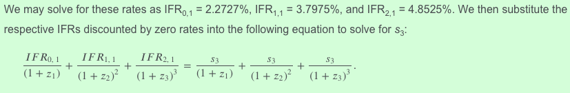
   >
   > 左边是floating leg现金流的现值，右边是fixed leg现金流的限制

8. Holding other factors constant, the value of a European put option will *most likely* decrease as the:

   1. **A.risk-free interest rate increases.**
   2. B.value of the underlying decreases.
   3. C.volatility of the underlying increases.

   > | **Option Type**   | **Effect of ↑ Risk-Free Rate (**r\uparrow**)** | **Explanation**                                              |
   > | ----------------- | ---------------------------------------------- | ------------------------------------------------------------ |
   > | **European Call** | **Value ↑**                                    | Higher r ↓ present value of strike → lower cost to exercise → **call more valuable** |
   > | **European Put**  | **Value ↓**                                    | Higher r ↓ present value of strike → future payout worth less → **put less valuable** |

9. In evaluating the purchased put strategy (with *X* = *F0*(*T*)), the CIO has asked you to consider selling the put in three months’ time if its price appreciates over that period. Which of the following best characterizes the no-arbitrage put price at that time?

   1. A.As VFO will exercise only if the spot price is below the exercise price, the lower bound of the put price is the greater of zero and the present value of the spot price minus the exercise price.
   2. B.As VFO will exercise only if the spot price is below the exercise price, the upper bound of the put price equals the present value of the exercise price minus the spot price.
   3. **C.The put price can be no greater than the forward price and no less than the greater of zero and the present value of the exercise price minus the spot price.**

   > **The correct answer is C.** The **==put exercise price, *X*==** (equal to *F0*(*T*) in this case), represents the *upper* bound on the put value, while the *lower* bound is the greater of the present value of the exercise price minus the spot price and zero:
   >
   > Max(0, 𝑋(1+𝑟)^−(𝑇−𝑡)^−𝑆𝑡)<𝑝𝑡≤𝑋
   >
   > A is incorrect, as the *lower* bound of the put price is the greater of zero and the present value of the exercise price minus the spot price, not the present value of the spot price minus the exercise price. B is incorrect, as the *lower*, not the upper, bound of the put price equals the present value of the exercise price minus the spot price.

10. The value of a European put is directly related to the:

    1. A.risk-free rate.
    2. **B.exercise price.**
    3. C.value of the underlying.

    > 1. Incorrect because the value of a European put is inversely related to the risk-free interest rate.
    > 2. **Correct** because the value of a European put option is directly related to the exercise price.
    > 3. Incorrect because the value of a European put option is inversely related to the value of the underlying.
    >
    > "**==directly==**" means "positively"

11. VFO is concerned about the potential for increasing interest rates in the future. Which of the following statements provides the most correct description as to how rising rates after entering into the two option strategies would affect the option valuations?

    1. A.Rising risk-free rates would make the selling a call option strategy more advantageous to VFO because call options increase in value with higher risk-free rates.
    2. B.Rising risk-free rates would make the buying a put option strategy more advantageous to VFO because the company locks in the put option premium at lower interest rates.
    3. **C.Rising risk-free rates are a negative for both option strategies.**

    > **C is correct.** Because both option strategies (buy a put or sell a call) are short strategies, VFO is delaying cash inflows so higher risk-free rates are negative. A is incorrect as this statement describes the value effect from buying a call option, not from selling. B is incorrect as the locked-in premium will decline after rising risk-free rates.
    >
    > As interest rate rises, the value of (long positions) of call options increases and that of put options decreases. So the value of a short position of call options decreases.

12. Privatbank Kleinert KGaA, a private wealth manager in Munich, has a number of clients with large holdings in the German fintech firm SparCoin AG. Kleinert’s analyst is concerned about a drop in SparCoin’s share price in the next year and is recommending to clients that they consider purchasing a one-year put with an exercise price of €100. SparCoin’s spot price (*S*0) is €105.25, and it pays no dividends. The risk-free rate is 0.37%.

    Question

    If Kleinert’s clients observe that the one-year put option with a €100 exercise price is trading at €2.50, which of the following statements best describes how Kleinert’s clients could take advantage of this to earn a risk-free return greater than 0.37% over the year.

    1. **A.Kleinert should purchase the put option and also purchase approximately 0.23 shares per option to match the hedge ratio.**
    2. B.Kleinert should purchase the put option and purchase 50% of the underlying shares given the 50-50 chance the stock will fall and the put option exercised.
    3. C.Kleinert should purchase the put option and purchase 47% of the underlying shares to match the risk-neutral probability of put exercise.

    > 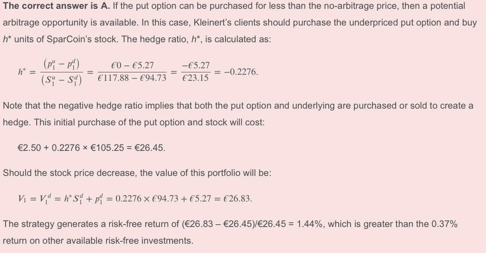

# Alternative Investments

1. A hedge fund has the following fee structure:

   - Annual management fee based on year-end AUM: 2%
   - Incentive fee: 20%
   - Hurdle rate before incentive fee collection starts: 4%
   - Current high-water mark: $610 million

   The fund has a value of \$583.1 million at the beginning of the year. After one year, it has a value of \$642 million before fees. The net percentage return to an investor for this year is closest to:

   1. A.6.72%.
   2. B.6.80%.
   3. C.7.64%.

2. Which of the following documents provides tailored terms for a specific investor?

   1. **A.A side letter**
   2. B.An excusal right
   3. C.A limited partnership agreement

   > An **==excusal right==** gives an investor the **right to forgo a capital contribution or to not participate in a particular type of investment**. An excusal right is granted when it has been **stipulated in a side letter**, not independently.

3. Identify the fee approach that *most directly* encourages private equity fund managers to invest selectively, not just quickly. Management fees:

   1. **A.based on committed capital**
   2. B.combined with an incentive fee
   3. C.based on a fixed percentage of assets under management

   > 如果管理费是根据投资的金额来算（包括incentive fee也间接地和invested capital关联）的话，那么GP为了赚取管理费一定是会着急把所有钱赶紧投出去，这样才能赚更多的管理费。但是如果是基于承诺的资金来扣的话，GP就可以对项目进行精挑细选，因为不需要把钱投出去也是可以拿管理费的，所以才会采用这样的制度，来让GP有时间慢慢挑好的项目投资。

4. Regarding distribution methods in alternative investments, which of the following is *most*advantageous to the limited partners? A(n):

   1. A.American waterfall.
   2. B.deal-by-deal waterfall.
   3. **C.whole-of-fund waterfall.**

   > **C Correct** because in whole-of-fund (European) waterfalls, all distributions go to the LPs as deals are exited and the **GP does not participate in any profits until** the LPs receive their initial investment and the hurdle rate has been met. In contrast to deal-by-deal (American) waterfalls, whole-of-fund waterfalls occur at the aggregate fund level and are more advantageous to the LPs.

5. A joint venture is an alternative investment structure that is *most* *likely* used for:

   1. A.infrastructure investment.
   2. B.private equity investment.
   3. **C.real estate direct investment.**

   > A **joint venture (JV)** is commonly used in **real estate direct investments**, where two or more parties — typically a **capital partner (e.g., institutional investor)** and an **operating partner (e.g., property developer or manager)** — collaborate to co-invest in and manage a specific real estate asset or portfolio.

6. Which of the following is *most likely* to participate in early-stage financing?

   1. A.Founders
   2. B.Angel investors
   3. **C.Strategic investors**

   > 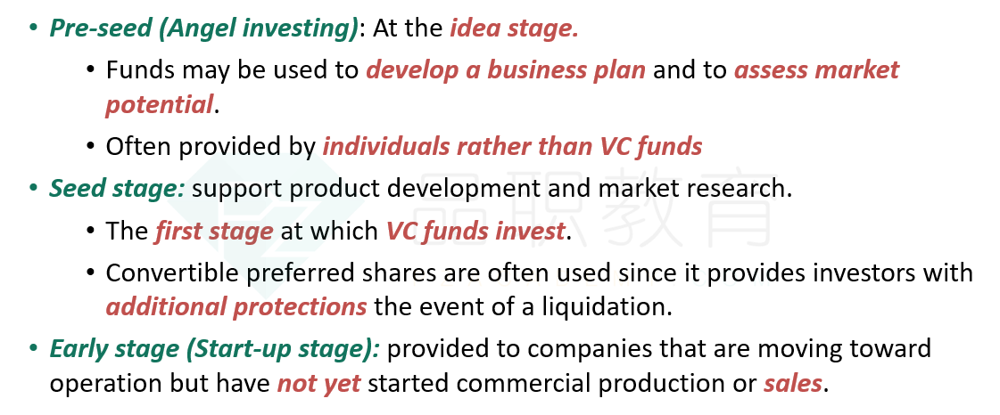

7. All else being equal, which of the following types of private debt is *most likely* to have the lowest level of risk?

   1. A.Mezzanine debt
   2. B.Unitranche debt
   3. C.Infrastructure debt

   > 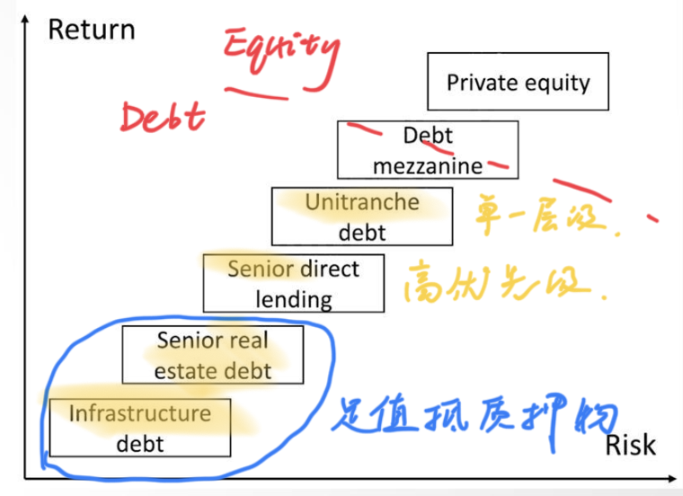

8. A leveraged loan is *best* defined as a loan:

   1. **A.that is itself levered.**
   2. B.to mature companies in financial difficulty.
   3. C.that comes with warrants or conversion rights.

   > **A Correct** because a leveraged loan is a loan that is itself levered. Private debt firms that invest in leveraged loans first borrow money to finance the debt and then extend it to another borrower. By using leverage, a private debt firm can enhance the return on its loan portfolio.

9. Which of the following combinations of financial characteristics *most likely* would be associated with a venture debt transaction?

   1. A.Positive revenues and cash flow
   2. B.Declining revenues and cash flow
   3. **C.Low revenues and negative cash flow**

   > **C is correct.** These financial characteristics are typical of the start-up stage in the corporate life cycle, when it is suitable to rely on venture debt. A is incorrect because these are features of the maturity stage, when direct lending, mezzanine financing, and leveraged lending are customary. B is incorrect because these are features of the maturity stage, when direct lending, mezzanine financing, and leveraged lending are customary.

10. The *most likely* effect on a portfolio’s diversification when exposure to direct lending commences is that it:

   1. **A.decreases.**
   2. B.remains the same.
   3. C.increases.

   > **A is correct.** While private capital can have overall positive contributions to diversification, direct lending can involve a **large capital commitment to a single borrower**, with increased concentration risk and reduced diversification. Investors attempt to protect against the risk of direct lending by having the debt itself classified as senior and secured with protective covenants in place to benefit from the associated higher interest rates while reducing non-diversifiable specific risk associated with a single borrower.

11. The private capital category *most likely* to offer the highest diversification benefit for portfolios holding public stock and bonds is:

    1. A.private debt.
    2. B.private equity.
    3. **C.venture capital.**

    > **C is correct.** Research on the correlations between portfolios holding these public assets shows that venture capital has the lowest correlations across all major market indexes. This relationship implies a higher diversification benefit for venture capital.
    >
    > 题目问的并不是**VC是否投资公共股票和债券**，而是：
    >
    > > 在一个**已经**投资了公共股票和债券的投资组合中，**哪一类私募资本最能起到多样化作用**？

12. A REIT is considered to be “hybrid” if it invests in both:

    1. **A.equity REITs and mortgage REITs.**
    2. B.sole ownership and joint ventures.
    3. C.direct and indirect property ownership.

    > **The correct answer is A.** There are three main forms of REIT: 
    >
    > 1. **==equity REITs==** that invest in properties outright or through partnerships and joint ventures, 
    > 2. **==mortgage REITs==** that underwrite loans to real estate (mortgages) or invest in MBS, and 
    > 3. **==hybrid REITs==** that invest in both of these types.
    >
    > | **项目**     | **Equity REITs**   | **Mortgage REITs**     |
    > | ------------ | ------------------ | ---------------------- |
    > | 投资标的     | 实体房地产（物业） | 房地产相关的贷款或证券 |
    > | 收入来源     | 租金               | 利息收入               |
    > | 风险因素     | 房地产市场、空置率 | 利率波动、信贷风险     |
    > | 对利率敏感性 | 较低               | 很高                   |
    > | 收益波动性   | 稳定               | 较大                   |
    > | 常见杠杆水平 | 中等               | 高                     |

13. Which of the following infrastructure investments would *most likely* be easiest to value? A:

    1. A.private equity fund holding brownfield investments.
    2. B.master limited partnership holding greenfield investments.
    3. **C.master limited partnership holding brownfield investments.**

    > 1. Incorrect because private equity is characterized as **Level 3 in the Fair Value Hierarchy**, meaning **unobservable inputs** are used to measure fair value. That is, private equity is more difficult to value than a master limited partnership, which is typically publicly traded.
    > 2. Incorrect because greenfield investments are more difficult to value than brownfield ones (i.e., the correct answer). Greenfield investments involve developing new assets and new infrastructure, whereas brownfield investments are more easy to value because they are characterized by immediate cash flows and an operating history.
    > 3. **Correct** because a **==master limited partnership==** is usually a more **liquid** investment that is **often publicly traded**. When comparing an investment that is liquid and publicly traded to an illiquid private equity investment, the liquid publicly traded investment will be easier to value. Furthermore, brownfield investments are more easy to value than greenfield investments because they are characterized by **immediate cash flows and an operating history**.
    >
    > A **Master Limited Partnership (MLP)** is a **publicly traded partnership** that combines the **tax benefits of a partnership** with the **liquidity of publicly traded securities**.

14. A real estate investor looking for equity exposure in the **public market** is *most likely* to invest in:

    1. A.real estate limited partnerships.
    2. B.collateralized mortgage obligations.
    3. **C.shares of real estate investment trusts.**

    > 1. Incorrect because real estate limited partnerships are an example of a private real estate investment.
    > 2. Incorrect because a collateralized mortgage obligation (CMO) is an example of debt-based exposure to real estate.
    > 3. **Correct** because shares in real estate investment trusts are publicly traded and represent an **equity** investment in real estate.

15. Which of the following tends *not* to characterize real estate investments?

    1. A.Predictability
    2. B.Protection from inflation
    3. **C.High correlations with other asset classes**

    > **The correct answer is C.** Real estate has historically **low correlations** with other asset classes, and adding real estate to an investment portfolio provides diversification benefits at relatively lower levels of risk. Many commercial real estate companies offer **multiple-year leases with fixed rents**; hence, the income earned from these leases is typically both predictable and stable. Moreover, real estate tends to provide **inflation protection because the lease payments are regularly adjusted**.

16. Unlike appraisers, equity investors tend to place heavy emphasis on:

    1. A.recent trends.
    2. **B.discounted cash flows.**
    3. C.current market conditions.

    > **The correct answer is B.** Equity investors in public real estate discount future cash flows, while appraisers of private real estate place heavy emphasis on current market conditions and recent trends.

17. Infrastructure investments can be categorized based on the nature of their underlying assets as:

    1. **A.economic or social.**
    2. B.local, regional, or national.
    3. C.usage-based or take-or-pay.

    > **The correct answer is A.** To categorize infrastructure investments, investors frequently rely on the underlying assets, with the broadest categorization distinguishing between economic and social infrastructure assets.

18. Which of these would most likely appeal to an investor who wants long-term, stable returns?

    1. A.Greenfield investments
    2. **B.Brownfield investments**
    3. C.Secondary-stage investments

    > **The correct answer is B.** With brownfield investments, typically some of the financial and operating history is available. Therefore, brownfield investments may be sought after by both strategic investors specializing in operating the assets and—particularly with privatizations—financial investors focused on long-term, stable returns.

19. Which of the following types of infrastructure investments entails the lowest expected risk?

    1. A.Greenfield
    2. B.Brownfield
    3. **C.Secondary stage**

    > **The correct answer is C.** In the three groupings of the infrastructure development cycle—greenfield, operational secondary stage, and brownfield—the operational secondary-stage assets with an existing track record of generating steady, bond-like cash flows possess the lowest risk and offer the lowest return to the investors. Brownfield investments, redevelopment of existing infrastructure, are incrementally riskier, and greenfield projects are the riskiest.
    >
    > | **阶段**                            | **简介**                         | **风险水平** | **回报预期**       | **关键词**                   |
    > | ----------------------------------- | -------------------------------- | ------------ | ------------------ | ---------------------------- |
    > | **1. Greenfield 阶段**              | 完全从零开发的新项目，无收入历史 | 🔴 高风险     | 🟢 高回报（潜在）   | 项目建设、审批、初始资本投入 |
    > | **2. Brownfield 阶段**              | 改建或升级已有基础设施           | 🟠 中等风险   | 🟡 中等回报         | 扩容、技术升级、结构改造     |
    > | **3. Secondary / Operational 阶段** | 成熟运营中的项目，有稳定现金流   | 🟢 低风险     | 🔴 低回报（类债券） | 稳定收入、再交易、长期合同   |

20. Which of the following has the highest weighting to current yield?

    1. A.Greenfield assets with limited construction and demand risk
    2. **B.Fully constructed brownfield assets with contracted revenues**
    3. C.Greenfield assets without guarantees of demand upon completion

    > **The correct answer is B.** Brownfield assets with mitigated risks (e.g., fully constructed with contracted/regulated revenues) that are located in the most stable OECD countries have a high weighting to current yield. Greenfield assets with limited construction and demand risk have a mix of yield and capital appreciation. Greenfield projects without guarantees of demand upon completion—e.g., variable electricity prices, uncertain traffic on roads and through ports—have a high weighting to capital appreciation.
    >
    > **✅ 什么是 “weighting to current yield”？**
    >
    > **Weighting to current yield** 指的是：
    >
    > > 某类资产的**回报中，有多大比例来自“当前期现金收入”**（比如租金、通行费、利息等），而不是来自将来的资本增值或投机性价值重估。
    >
    > 🔁 换句话说，它衡量的是：
    >
    > **“现金流回报的占比” vs “未来增长或资产增值的占比”**

21. Compared with similar fixed-income instruments, infrastructure debt:

    1. **A.has higher recovery rates.**
    2. B.experiences higher default rates.
    3. C.has more fluctuation over the economic cycle.

    > **The correct answer is A.** Given the **stable underlying nature of cash flows**, infrastructure debt tends to experience **lower default rates** and **higher recovery** than similar fixed-income instruments, and it is **less subject to fluctuation** over the economic cycle.

22. The *most likely* impact of adding commodities to a portfolio of equities and bonds is to:

    1. A.increase risk.
    2. B.generate cash flows.
    3. **C.reduce exposure to inflation.**

    > 1. Incorrect because farmland, timberland, and commodities exhibit potential for portfolio **diversification**. Historically, all three of these asset classes have low correlations with investment returns from traditional assets (i.e., stocks and bonds) during the business cycle.
    > 2. Incorrect because commodities themselves do not generate cash flows but usually incur costs.
    > 3. **Correct** because investors often consider commodity investments as a **hedge against inflation**.

23. Which of the following statements most correctly describes why commodity investments are thought to provide a hedge against inflation?

    1. **A.The returns on commodity investing are driven by commodity price changes, and inflation partially reflects these changes.**
    2. B.Commodity prices increase after inflation rates increase.
    3. C.Expectations of higher inflation cause commodity prices to increase.

    > **A is correct.** Commodity prices are a significant portion of consumer prices because commodities include aspects of everyday life, such as food and energy, and thus consumer price inflation will incorporate the effects of commodity price changes. By investing in commodities, an investor is, at least partially, hedged against the inflation that occurs with rising commodity prices. B is incorrect because inflation and commodity prices do not move together, but instead, changes in the inflation rate lag behind changes in commodity prices. C is incorrect because in this case, commodity price increases occur before inflation changes.
    >
    > B and C因果倒置了

24. A fundamental long/short hedge fund manager is evaluating specific securities to build a portfolio’s positions. Which of the following is the strategy the manager would *least likely*adopt?

    1. A.Long securities that have an upside potential relative to current price
    2. B.Short sectors with macro trends negatively impacting the company
    3. **C.Long securities that trade at a significant discount, expecting an increased valuation in case of a bankruptcy**

    > **C is correct.** Participating in a potential bankruptcy situation would be characteristic of an event-driven hedge fund manager and not a fundamental long/short manager. B is incorrect because a fundamental long/short manager would invest in securities expected to exhibit high growth and capital appreciation. C is incorrect because a fundamental long/short manager would short securities in sectors that project negative growth.

25. Which of the following fund structures is most likely to be suitable for an institutional hedge fund investor that seeks a highly customizable offering with negotiable fees?

    1. **A.Separately managed hedge funds**
    2. B.Commingled hedge funds (master feeder funds)
    3. C.Mutual funds
    4. D.Funds of funds

    > **A is correct.** A hedge fund SMA can be tailored to a single investor seeking a tailored portfolio with negotiated fees. The other fund structures do not generally offer customization or negotiable fees.

26. Which of the following parties is responsible for the portfolio management of a fund of hedge funds?

    1. A.Accredited investor
    2. **B.General partner**
    3. C.Limited partner

    > **B is correct.** The general partner is responsible for choosing the hedge funds in a fund of hedge funds. A and C are incorrect because they refer to customers or investors in the fund.
    >
    > Accredited investor: **合格投资者** 或 **专业投资者**

27. Which of the following best explains why it is unlikely a poor-performing hedge fund would be added to an index?

    1. A.Survivorship bias
    2. B.Backfill bias
    3. **C.Selection bias**

    > **C is correct.** Selection bias refers to when the benchmark inclusion criteria cover only those funds that have good performance and hence report their performance to attract new investors. A is incorrect; survivorship bias is when the benchmark stops including funds that have ceased operations, most likely due to poor performance, and hence does not fully represent the hedge fund universe. B is incorrect; backfill bias occurs when an index retroactively includes the performance of a fund before it is added to the index.
    >
    > **Backfill bias（回填偏差）**是指：
    >
    > > 在构建投资基金数据库时，**只在基金表现良好之后才将其历史业绩回填进入数据库**，从而**夸大了平均历史回报率**的一种系统性偏差。

28. A benefit of distributed ledger technology (DLT) that increases its use by the investment industry is its:

    1. A.scalability of underlying systems.
    2. B.ease of integration with existing systems.
    3. **C.streamlining of current post-trade processes.**

    > **The correct answer is C.** DLT has the potential to streamline the existing, often complex and labor-intensive post-trade processes in securities markets by providing close to real-time **trade verification, reconciliation, and settlement**, thereby reducing related complexity, time, and costs.
    >
    > 在投资行业中，**交易后的流程（post-trade processes）**包括结算（settlement）、清算（clearing）、对账（reconciliation）等。这些流程传统上涉及多个中介机构、系统和手工操作，效率低、成本高、容易出错。
    >
    > **DLT（分布式账本技术）**的优势恰好在于：
    >
    > - **共享数据源**：所有参与方访问相同的、同步的交易记录；
    > - **实时结算可能性**：可望实现**T+0 或即时结算**；
    > - **减少中介和人工干预**：如托管人、清算所；
    > - **降低对账成本和出错概率**。
    >
    > **A. Scalability of underlying systems**
    >
    > - 实际上，**DLT目前面临扩展性问题**（尤其是公有链）；
    > - 处理速度、吞吐量仍是制约其大规模部署的难题；
    > - 所以“scalability”不是推动其应用的当前主要优势。

29. Which of the following statements about distributed ledger technology is *most* accurate?

    1. A.Bitcoin uses a permissioned network.
    2. B.Miners execute smart contracts in the blockchain.
    3. **C.Tokenization can streamline the transfer of ownership of physical assets.**

    > 1. Incorrect because bitcoin is a well-­known use of an **open permissionless network**.
    > 2. Incorrect because miners **verify transactions** in the blockchain, they do not execute smart contracts. The consensus mechanism used to verify a transaction includes a cryptographic problem that must be solved by some computers on the network (known as miners) each time a transaction takes place. On the other hand, smart contracts are computer programs that self-execute on the basis of pre-specified terms and conditions agreed to by the parties to a contract.
    > 3. **Correct** because through tokenization, the process of representing ownership rights to physical assets on a blockchain or distributed ledger, distributed ledger technology (DLT) has the potential to streamline this process by creating a single, digital record of ownership with which to verify ownership title and authenticity, including all historical activity.

30. A cryptocurrency miner can earn new digital assets by:

    1. A.solving complex algorithm puzzles to validate blocks of transactions onto a blockchain network based on a PoS protocol.
    2. B.staking his own cryptocurrencies to validate blocks of transactions onto a blockchain network based on a PoW protocol.
    3. **C.validating and locking transactions onto a blockchain irrespective of the consensus protocol adopted by the particular network.**

    > **The correct answer is C.** Under both PoW (Proof of Work) and PoS (Proof of Stake) consensus protocols, the validation of the transactions, or “mining,” always comes with rewards. A successful miner that validates the transactions obtains new digital assets—either a cryptocurrency or a token. For blockchain networks based on the **PoW** protocol, the miner earns his digital assets by **solving complex algorithm puzzles** to validate blocks of transactions onto a blockchain network. For blockchain networks based on the **PoS** protocol, the miner earns his digital assets by **staking his own** to validate and attest to the new blocks of transactions.

31. An investor who wants to replicate the return on Bitcoins without the use of a digital wallet can *best* do so by:

    1. **A.investing in a cryptocurrency coin trust that holds Bitcoins.**
    2. B.investing in a listed cryptocurrency exchange stock.
    3. C.buying Bitcoins from a centralized cryptocurrency exchange.

    > **The correct answer is A.** Investing in a cryptocurrency coin trust that holds Bitcoins is the best way to replicate the return on Bitcoins. Investing in a listed cryptocurrency exchange stock provides very indirect exposure that may not necessarily replicate the performance of Bitcoins because of a variety of company-specific factors, as well as the sensitivity to the general stock market environment. Buying Bitcoins from a centralized cryptocurrency exchange provides a direct exposure, but it would require a digital wallet.

32. Which of the following is a key building block of dApps?

    1. A.Bitcoins
    2. **B.Smart contracts**
    3. C.Centralized exchanges

    > **The correct answer is B.** Smart contracts are the building block of dApps. dApps are usually developed on the Ethereum blockchain network or other smart contract platforms that allow for peer-to-peer interaction using interoperable, transparent smart contracts that persist for the duration of the chain. These decentralized applications, or dApps, allow for transactions to take place—and to be recorded on the blockchain—without a central coordinating mechanism or centralized exchange.

33. Performance metrics of alternative investments

    1. Sharpe Ratio
    2. Sortino Ratio: downside standard deviation
    3. Treynor Ratio: systematic risk

34. Which of the following statements about private equity performance evaluation is *most* accurate?

    1. A.Private equity fund management fees are based on capital called.
    2. **B.Cash flows are frequently described in terms of the J-curve effect.**
    3. C.Managers have no discretion on the timing of the distribution of proceeds.

    > In private equity, the J Curve represents the tendency of private equity funds to post negative returns in the initial years and then post increasing returns in later years when the investments mature. The negative returns at the onset of investments may result from investment costs, management fees, an investment portfolio that is yet to mature, and underperforming portfolios that are written off in their early days.
    >
    > 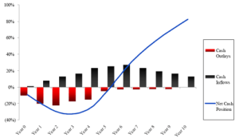

35. Which of the following hedge fund investments require the highest level of scrutiny and due diligence?

    1. A.Level 1 assets
    2. B.Level 2 assets
    3. **C.Level 3 assets**

    > **C Correct** because any investment vehicle that is heavily involved with Level 3–priced assets deserves increased scrutiny and due diligence. The following is a methodology that involves the categorization of investments into three buckets: Level 1, 2, and 3 asset pricing. 
    >
    > Level 1 assets have an exchange-traded, **publicly traded price** available that is mandated to be used for valuation purposes.
    >
    > Level 2 asset values use **outside quotes from brokers** when publicly traded (Level 1) prices are not available.
    >
    > Level 3 asset values are computed using only **internal models** when outsider broker (Level 2) quotes are not available or not reliable.

36. Buyout Capital, LLC, is a private equity fund that has the following characteristics:

    - Capital committed: $200 million
    - Preferred return: 8% soft hurdle, with full catch-up
    - Fund distribution: after five years
    - Management fee: none
    - Carried interest: 20% above preferred return
    - Waterfall structure: American (deal by deal) with clawback

    The fund made five investments, tabulated as follows:

    | **Investment No.** | **Year** |              | **Amount ($ m)** |         | **Profit** |      |         |            |
    | :----------------: | :------: | :----------: | :--------------: | :-----: | :--------: | ---- | ------- | ---------- |
    |    **Invested**    | **Sold** | **Invested** |     **Sold**     | **$ m** |   **%**    |      |         |            |
    |         1          |    0     |      4       |                  |   40    |     60     |      | 20      | 10.67%     |
    |         2          |    0     |      4       |                  |   40    |    100     |      | 60      | 25.74%     |
    |         3          |    1     |      5       |                  |   40    |     50     |      | 10      | 5.74%      |
    |         4          |    1     |      5       |                  |   40    |    120     |      | 80      | 31.61%     |
    |         5          |    2     |      5       |                  |   40    |     30     |      | (10)    | neg.       |
    |     **Total**      |          |              |                  | **200** |  **360**   |      | **160** | **12.47%** |

    Question

    What is the total carried interest to the GP?

    1. **A.$30 million**
    2. B.$32 million
    3. C.$34 million

    > **A is correct.** The distribution of profit of each investment is as follows:
    >
    > | **Investment No.** | **Year** |              |      | Amount ($ m) |          |      | **Profit** |            |                |               |
    > | :----------------: | :------: | :----------: | :--: | :----------: | :------: | :--: | :--------: | ---------- | -------------- | ------------- |
    > |    **Invested**    | **Sold** | **Invested** |      | **Invested** | **Sold** |      |  **$ m**   | **%**      | **LPs at 80%** | **GP at 20%** |
    > |         1          |    0     |      4       |      |      40      |    60    |      |     20     | 10.67%     | 16             | 4             |
    > |         2          |    0     |      4       |      |      40      |   100    |      |     60     | 25.74%     | 48             | 12            |
    > |         3          |    1     |      5       |      |      40      |    50    |      |     10     | 5.74%      | 10             | 0             |
    > |         4          |    1     |      5       |      |      40      |   120    |      |     80     | 31.61%     | 64             | 16            |
    > |         5          |    2     |      5       |      |      40      |    30    |      |    (10)    | neg.       | (8)            | (2)           |
    > |     **Total**      |          |              |      |   **200**    | **360**  |      |  **160**   | **12.47%** | **130**        | **30**        |
    >
    > Since the preferred return of the LP is 8%, Investments 1, 2, and 4 all meet the criterion and the profit is split 80/20 between the LPs and GP. **Investment 3 does not earn the GP any carry because it fails to meet the preferred return; neither does Investment 5, whose profit is negative.** Because of the clawback clause, the GP’s carry is reduced **by \$2 million (or 20% of the loss on Investment 5).** Therefore, the total carried interest adds up to $30 million, or 30/160 = 18.75% of the total profit made by the fund.

# Portfolio Management

1. Evidence of risk aversion is *best* illustrated by a risk–return relationship that is:

   1. A.negative.
   2. B.neutral.
   3. **C.positive.**

   > C. 正相关（Positive risk–return relationship） —— 最能说明“风险厌恶”：
   >
   > ​	•	风险厌恶者要求“风险越高，期望回报越高”，否则他们不会承担额外风险；
   >
   > ​	•	投资者需要**风险溢价（risk premium）**来补偿他们承担的不确定性；
   >
   > ​	•	这正是资本市场线（CML）或证券市场线（SML）所体现的特征。

2. With respect to risk-averse investors, a risk-free asset will generate a numerical utility that is:

   1. **A.the same for all individuals.**
   2. B.positive for risk-averse investors.
   3. C.equal to zero for risk seeking investors.

   > **A is correct.** A risk-free asset has a variance of zero and is not dependent on whether the investor is risk neutral, risk seeking or risk averse. That is, given that the utility function of an investment is expressed as 𝑈=𝐸(𝑟)−12𝐴𝜎2, where *A* is the measure of risk aversion, then the sign of *A* is irrelevant if the variance is zero (like that of a risk-free asset).

3. Consider a portfolio with two assets. Asset A comprises 25% of the portfolio and has a standard deviation of 17.9%. Asset B comprises 75% of the portfolio and has a standard deviation of 6.2%. If the correlation of these two investments is 0.5, the portfolio standard deviation is *closest* to:

   1. A.6.45%.
   2. **B.7.90%.**
   3. C.9.13%.

   > $$
   > \sigma_p = \sqrt{w_1^2 \sigma_1^2 + w_2^2 \sigma_2^2 + 2 w_1 w_2 \rho_{1,2} \sigma_1 \sigma_2}
   > $$

4. With respect to an equally weighted portfolio made up of a large number of assets, which of the following contributes the *most* to the volatility of the portfolio?

   1. A.Average variance of the individual assets.
   2. B.Standard deviation of the individual assets.
   3. **C.Average covariance between all pairs of assets.**

   > **C is correct.** The co-movement measures between the assets increases (i.e., covariance and correlation) as the number of assets in the equally weighted portfolio increases. The contribution of each individual asset’s variance (or standard deviation) to the portfolio’s volatility decreases as the number of assets in the equally weighted portfolio increases. The following equation for the variance of an equally weighted portfolio illustrates these points:
   > $$
   > \sigma_p^2 = \frac{\bar{\sigma}^2}{N} + \frac{N - 1}{N} \, \overline{COV} 
   > = \frac{\bar{\sigma}^2}{N} + \frac{N - 1}{N} \, \bar{\rho} \, \bar{\sigma}^2
   > $$

5. With respect to capital market theory, an investor’s optimal portfolio is the combination of a risk-free asset and a risky asset with the highest:

   1. A.expected return.
   2. **B.indifference curve.**
   3. C.capital allocation line slope.

   > **B is correct.** Investors will have different optimal portfolios depending on their indifference curves. The optimal portfolio for each investor is the one with highest utility; that is, where the CAL is tangent to the individual investor’s highest possible indifference curve.

6. Which of the following is *least likely* an assumption underlying the capital asset pricing model (CAPM)?

   1. **A.Investors analyze securities according to their own future cash flow estimates and probability distributions.**
   2. B.There are no restrictions on short selling assets.
   3. C.The amount invested in an asset can be as much or as little as the investor wants.

   > 1. **Correct**. The CAPM requires that there are no restrictions on short selling (which is an assumption underlying frictionless markets) and that the amount invested in an asset can be as much or as little as the investor wants (that is, investments are infinitely divisible). The CAPM also assumes that all investors analyze securities in the same way using the same inputs for future cash flows and the same probability distributions; that is, it assumes that investors have homogenous expectations.
   > 2. Incorrect. **No restrictions on short selling assets (which is an assumption underlying frictionless markets)** is an assumption of the CAPM.
   > 3. Incorrect. An investor being able to invest as much or as little in an asset (that is, investments are infinitely divisible) is an assumption of the CAPM.

7. A portfolio with equal parts invested in a risk-free asset and a risky portfolio will *most likely*lie on:

   1. A.the efficient frontier.
   2. **B.a capital allocation line.**
   3. C.the security market line.

   > **==Capital market line (CML)==** is a special CAL that includes all possible combinations of Rf, asset and **market portfolio**
   >
   > **==Capital allocation line (CAL)==** represents the portfolios available to an investor through combining the risk-free asset with one **risky asset**
   >
   > 证券市场线（security market line，SML）：CAPM在坐标图上体现. The security market line applies to any security, efficient or not.

8. **==M-squared==**=$(R_p-R_f)\dfrac{\sigma_M}{\sigma_p}-(R_M-R_f)$

9. Which of the following portfolio performance measures are the *most* appropriate for an investor who holds a fully diversified portfolio?

   1. A.Sharpe ratio and Treynor ratio.
   2. **B.Treynor ratio and Jensen’s alpha.**
   3. C.*M*-Squared and Sharpe ratio.

   > 1. Incorrect. The Treynor ratio is appropriate for an investor who holds a fully diversified portfolio, but the **Sharpe ratio is appropriate for an investor who does *not* hold a fully diversified portfolio**.
   > 2. **Correct**. For an investor who holds a fully diversified portfolio, the Treynor ratio and Jensen’s alpha are the appropriate portfolio performance measures. They are appropriate because in a fully diversified portfolio, only systematic risk matters; both these metrics measure performance relative to beta or systematic risk.
   > 3. Incorrect. These measures are appropriate for an investor who does **not** hold a fully diversified portfolio.

10. With respect to capital market theory, which of the following assumptions allows for the existence of the market portfolio? All investors:

    1. A.are price takers.
    2. **B.have homogeneous expectations.**
    3. C.plan for the same, single holding period.

    > **B is correct.** The homogeneous expectations assumption means that all investors analyze securities in the same way and are rational. That is, they use the same probability distributions, use the same inputs for future cash flows, and arrive at the same valuations. Because their valuation of all assets is identical, they will generate the **same optimal risky portfolio**, which is the **market portfolio**.

11. Which of the following performance measures does *not* require the measure to be compared to another value?

    1. A.Sharpe ratio.
    2. B.Treynor ratio.
    3. **C.Jensen’s alpha.**

    > **C is correct.** The sign of Jensen’s alpha indicates whether or not the portfolio has outperformed the market. If alpha is positive, the portfolio has outperformed the market; if alpha is negative, the portfolio has underperformed the market.

12. Which of the following performance measures is *most* appropriate for an investor who is *not* fully diversified?

    1. **A.*M*2.**
    2. B.Treynor ratio.
    3. C.Jensen’s alpha.

    > **A is the correct answer.** *M*2 adjusts for risk using **==standard deviation (i.e., total risk)==**.

13. The slope of the **==security characteristic line==** is an asset’s:

    1. **A.beta.**
    2. B.excess return.
    3. C.risk premium.

    > **A is correct.** The security characteristic line is a plot of the excess return of the security on the excess return of the market. In such a graph, Jensen’s alpha is the intercept and the beta is the slope.
    >
    > The **Security Characteristic Line (SCL)** is a **regression line** that shows the relationship between the **excess return of an individual security** and the **excess return of the market portfolio**.

14. A key difference between a wrap account and a mutual fund is that wrap accounts:

    1. **A.have assets that are owned directly by the individual.**
    2. B.cannot be tailored to the tax needs of a client.
    3. C.have a lower required minimum investment.

    > 1. **Correct**. The key difference between a wrap account and a mutual fund is that in a wrap account, the assets are owned directly by the individual.
    > 2. Incorrect. Wrap accounts can be tailored to the tax needs of a client.
    > 3. Incorrect. **Wrap accounts have higher required minimum investments.**
    >
    > A ==**wrap account**== **（包裹账户）** is a type of investment account in which a **single, all-inclusive fee (or “wrap fee”)** is charged to cover a **bundle of services** such as:
    >
    > - Portfolio management
    > - Transaction costs
    > - Custody
    > - Reporting
    > - Advisory or financial planning
    >
    > > In short: **You pay one flat fee, and the advisor takes care of everything.**

15. Which of the following is *least likely* true for a separately managed account (SMA) compared with a mutual fund?

    1. A.Assets are directly owned by the individual.
    2. **B.The minimum investment required to open a SMA is lower than that of a mutual fund.**
    3. C.Transactions can be tailored to the specific tax needs of the investor.

    > 1. Incorrect. SMA assets are directly owned by the individual. The investor has control over which assets are bought and sold as well as the timing of the transactions.
    > 2. **Correct**. The minimum investment required to open a separately managed account is usually much higher than that to open a mutual fund.
    > 3. Incorrect. SMA transactions can be tailored to the specific tax needs of the investor.
    >
    > | **维度**         | **Wrap Account（包裹账户）**                                 | **SMA（单独管理账户）**                                |
    > | ---------------- | ------------------------------------------------------------ | ------------------------------------------------------ |
    > | **定义**         | 一种**收费模式**：将投资服务（如交易、咨询、报告）**打包统一收取年费** | 一种**账户结构**：资产由专业经理**为单一客户单独管理** |
    > | **服务对象**     | 高净值客户，追求一站式、费用清晰                             | 高净值客户，追求策略可控、个性化持仓                   |
    > | **收费方式**     | 一般为**资产年费（如1%）包干所有服务**                       | 通常有管理费、交易费，可能计入 Wrap 内                 |
    > | **投资组合构建** | 可以包括 SMA、共同基金、ETF、另类资产等                      | 通常由特定资产经理直接持仓构建                         |
    > | **定制化程度**   | 中等（偏组合导向）                                           | ✅ 高度定制：可设行业限制、税务偏好等                   |
    > | **税务处理**     | 投资人在其账户中拥有资产，可做税务规划                       | ✅ 投资人直接拥有底层证券，可进行税务损失收割等         |
    > | **资产归属**     | ✅ 资产仍归客户所有                                           | ✅ 同样归客户所有（非基金份额）                         |
    > | **典型用途**     | 财富顾问或平台提供一站式管理                                 | 特定策略（如价值投资、ESG）由专属经理执行              |
    > | **是否互相包含** | ✅ Wrap账户中可以包含 SMA 策略                                | ❌ SMA 本身不是收费模式，不包含 Wrap                    |

16. Which of the following is the *best* reason for an investor to be concerned with the composition of a portfolio?

    1. **A.Risk reduction.**
    2. B.Downside risk protection.
    3. C.Avoidance of investment disasters.

    > **A is correct.** Combining assets into a portfolio should reduce the portfolio’s volatility. The portfolio approach does not necessarily provide downside protection or guarantee that the portfolio always will avoid losses.

17. With respect to the portfolio management process, the asset allocation is determined in the:

    1. A.planning step.
    2. B.feedback step.
    3. **C.execution step.**

    > 投资组合管理的步骤：
    >
    > 1. Planning
    >    1. Understanding the clients' needs
    >    2. Developing the IPS
    > 2. Execution
    >    1. Asset allocation
    >    2. Security analysis
    >    3. Portfolio construction
    > 3. Feedback
    >    1. Portfolio monitoring and rebalancing
    >    2. Performance measurement and reporting

18. Which of the following institutions will *on average* have the greatest need for liquidity?

    1. **A.Banks.**
    2. B.Investment companies.
    3. C.Non-life insurance companies.

    > **A is correct.** The excess reserves invested by banks need to be relatively liquid. Although investment companies and non-life insurance companies have high liquidity needs, the liquidity need for banks is on average the greatest.

19. An investment policy statement’s risk objective states that over a 12-month period, with a probability of 95%, the client’s portfolio must not lose more than 5% of its value. This statement is *most likely* a(n):

    1. A.total risk objective.
    2. B.relative risk objective.
    3. **C.absolute risk objective.**

    > 1. Incorrect. This is an absolute (not total) risk objective because it expresses a maximum loss in value with an associated probability of loss.
    > 2. Incorrect. This is an absolute (not relative) risk objective because it expresses a maximum loss in value with an associated probability of loss.
    > 3. **Correct**. The statement is an absolute risk objective because it expresses a maximum loss in value with an associated probability of loss.
    >
    > | **维度**         | **Absolute Return Objective 绝对收益目标** | **Relative Return Objective 相对收益目标** |
    > | ---------------- | ------------------------------------------ | ------------------------------------------ |
    > | **目标描述**     | 明确规定一个**数值目标**（通常为年化率）   | 目标是**相对于某个基准的超额回报**         |
    > | **表达方式**     | 如：“实现年化 6% 的总回报”                 | 如：“超越 MSCI World Index 年回报 2%”      |
    > | **是否依赖基准** | ❌ 无需参考市场基准                         | ✅ 明确依赖一个可衡量的基准指数             |
    > | **适用对象**     | 常用于**个人投资者、养老基金、保险账户**   | 常用于**机构委外投资、主动管理产品**       |
    > | **投资风格**     | 更强调**资本保值/稳定增长**                | 更强调**相对绩效、主动选股或择时**         |
    > | **风险定义**     | 违背目标即为风险（如年回报 < 6%）          | 跑输基准即为风险（如相对回报 < 0）         |

20. Which of the following *best* describes the underlying rationale for a written investment policy statement (IPS)?

    1. **A.A written IPS communicates a plan for trying to achieve investment success.**
    2. B.A written IPS provides investment managers with a ready defense against client lawsuits.
    3. C.A written IPS allows investment managers to *instruct* clients about the proper use and purpose of investments.

21. A financial adviser gathers the following information about a new client:

    - The client is a successful economics professor at a major university.
    - The client plans to work full time for seven years and then will work part time for three years before retiring.
    - The client owns two homes and does not have any outstanding debt.
    - The client has accumulated retirement savings of approximately \$2 million through his employer’s retirement plan and will have anticipated retirement spending needs of $60,000 per year.
    - The client reads numerous financial publications and follows markets closely.
    - Although concerned about the current health of the global economy, the client maintains that he is a long-term investor.

    Based on the above information, which of the following *best* describes this client?

    1. A.High ability to take risk but a low willingness to take risk
    2. **B.High ability to take risk and a high willingness to take risk**
    3. C.Low ability to take risk but a high willingness to take risk

    > 1. Incorrect. The client’s investing knowledge, experience, and focus on long-term investing indicate a willingness to withstand investment risk.
    > 2. **Correct**. The client is in a strong financial situation (stable job, no debt), has a reasonably long time horizon before needing any liquidity (10 years), and reasonable retirement spending needs relative to total assets. These factors indicate a high ability to take risk. In addition, the client’s **knowledge of financial markets, experience, and focus on the long term also indicate a high willingness to take risk**.
    > 3. Incorrect. The client has a high ability to withstand investment risk for the reasons identified above.

22. A client who is a 34-year old widow with two healthy young children (aged 5 and 7) has asked you to help her form an investment policy statement. She has been employed as an administrative assistant in a bureau of her national government for the previous 12 years. She has two primary financial goals—her retirement and providing for the college education of her children. This client’s time horizon is *best* described as being:

    1. **A.long term.**
    2. B.short term.
    3. C.medium term.

    > **A is correct.** The client’s financial objectives are long term. Her stable employment indicates that her immediate liquidity needs are modest. The children will not go to college until 10 or more years later. Her time horizon is best described as being long term.

23. The strategic asset allocation and portfolio rebalancing policy are *most likely* addressed in which section of an investment policy statement?

    1. **A.Appendices**
    2. B.Investment objectives
    3. C.Procedures

    > 1. **Correct**. Information related to strategic asset allocation and portfolio rebalancing policy would be placed in the appendices of an investment policy statement.
    > 2. Incorrect. This section contains information on the client’s objectives when investing.
    > 3. Incorrect. This section contains information on the steps to take to **keep** the investment policy statement current and the procedures to follow to respond to various **contingencies**.

24. Under-diversified portfolios are not a potential implication of which of the following behavioral biases?

    1. **A.Representativeness**
    2. B.Illusion of control
    3. C.Confirmation

    > **A is correct.** Under-diversified portfolios are a consequence of both **==illusion of control==** and **==confirmation biases==**. 
    >
    > Researchers have found that some investors prefer to invest in companies that they feel they have control over, such as the companies they work for, leading them to hold concentrated positions. 
    >
    > Confirmation bias may lead to Financial Market Participants (FMPs) ignoring negative news, **paying attention only to information confirming that a company is a good investment**, which may result in large positions. 
    >
    > Representativeness bias is not typically associated with under-diversified portfolios.
    >
    > | **偏误类型**                | **中文解释** | **记忆词首** | **特点**                 |
    > | --------------------------- | ------------ | ------------ | ------------------------ |
    > | **Conservatism Bias**       | 保守偏误     | **C**        | 不愿修正旧信息           |
    > | **Confirmation Bias**       | 确认偏误     | **C**        | 只看支持自己观点的证据   |
    > | **Representativeness Bias** | 代表性偏误   | **R**        | 用刻板印象代替统计判断   |
    > | **Illusion of Control**     | 控制错觉     | **I**        | 高估自己对结果的影响力   |
    > | **Hindsight Bias**          | 事后偏误     | **H**        | 认为结果本来就是可预见的 |
    >
    > | **偏误类型**                 | **中文解释**                             |
    > | ---------------------------- | ---------------------------------------- |
    > | **Anchoring and Adjustment** | 锚定与调整偏误：受初始值影响过重         |
    > | **Mental Accounting**        | 心理账户偏误：人为分账户影响最优决策     |
    > | **Framing Bias**             | 框架偏误：信息表达方式影响决策           |
    > | **Availability Bias**        | 可得性偏误：过度依赖最近或印象深刻的信息 |
    >
    > | **偏误类型**             | **中文解释**                           |
    > | ------------------------ | -------------------------------------- |
    > | **Loss Aversion Bias**   | 损失厌恶：对损失敏感程度高于收益       |
    > | **Overconfidence Bias**  | 过度自信：高估自己能力/判断准确性      |
    > | **Self-control Bias**    | 自控力弱：过度消费、推迟储蓄           |
    > | **Endowment Bias**       | 禀赋效应：对自己**拥有的**资产估值过高 |
    > | **Regret Aversion Bias** | 后悔厌恶：避免做出可能带来后悔的决策   |

25. Status quo bias is least similar to which of the following behavioral biases?

    1. A.Endowment
    2. B.Regret aversion
    3. **C.Confirmation**

    > ✅ C. Confirmation bias（确认偏误） — 最不相似 ✅
    >
    > ​	•	确认偏误是指人们倾向于寻找或解释信息，以支持已有的信念或观点；
    >
    > ​	•	其核心是**选择性注意**，与信息处理有关；
    >
    > ​	•	虽然也可能导致不改变行为，但动因不同 —— 是在主动筛选信息、而非避免改变本身；
    >
    > ​	•	所以它与 Status quo bias 在动因、表现和影响上都较不相似。
    >
    > A. Endowment bias（禀赋效应）
    >
    > ​	•	与 status quo bias 高度相关；
    >
    > ​	•	投资者倾向于高估自己**已经拥有**的资产价值，因此**不愿出售 → 维持现状**；
    >
    > ​	•	二者都反映出对改变当前状态的抗拒。
    >
    > B. Regret aversion（后悔厌恶）
    >
    > ​	•	投资者害怕改变后后悔，因此选择**“不动”以避免承担决策责任**；
    >
    > ​	•	与 status quo bias 在行为上高度重叠：都导致“维持现状”。

26. Which strategy would best mitigate or prevent endowment bias?

    1. A.Actively seeking out information that challenges existing beliefs
    2. B.When new information is presented, asking “How does this information change my forecast?”
    3. **C.Asking “Would you buy this security today at the current price?”**

    > **C is correct.** Endowment bias refers to people attributing additional, unwarranted value to things they possess versus things they do not. This bias is evident in FMPs that systematically and materially overvalue securities in their portfolio versus securities not in their portfolio. The question “Would you buy this security today at the current price?” turns the investor’s attention to **assessing the reasonableness of the current price as a buy price rather than solely as a selling price**.

27. Caitríona Daosri is a portfolio manager for an international bank, where she advises high-net-worth clients. Daosri is meeting with a new client, Estêvão Kai, a 40-year-old surgeon with €4 million across various accounts and a salary of €500,000 per annum. Kai explains to Daosri that he has four accounts at four different banks, each with specific sources and uses of funds, as shown in the following table:

    | **Bank Account** | **Source of Deposits** |     **Use of Funds**     |
    | :--------------- | :--------------------: | :----------------------: |
    | 1                |         Salary         |     Living expenses      |
    | 2                |         Bonus          |     Charitable gifts     |
    | 3                |   Portfolio interest   |  Savings for retirement  |
    | 4                |  Portfolio dividends   | Mother’s living expenses |

    Which of the following is a likely consequence of Kai’s approach to managing his finances?

    1. A.Concentrated portfolio positions
    2. **B.Forgone opportunities to reduce risk by combining assets with low correlations**
    3. C.Excessive trading

    > **B is correct.** The most common consequence of mental accounting is neglecting opportunities to reduce risk by combining assets with low correlations, because **each account’s asset allocation is examined discretely**. Offsetting positions across accounts, or an overall inefficient allocation with respect to risk, can lead to suboptimal aggregate performance.

28. All of the following are reasons that an apparent deviation from the efficient market hypothesis might <u>not</u> be anomalous <u>except</u>:

    1. A.The abnormal returns represent compensation for exposure to risk.
    2. B.Changing the asset pricing model makes the deviation to disappear.
    3. **C.The deviation is well known or documented.**

    > ✅ **正确答案是：C. The deviation is well known or documented.**
    >
    > 📌 题目解析：
    >
    > 题目问的是：**以下哪一项不是**（except）**解释“表面上偏离有效市场假说”却其实**不是异常现象（non-anomalous）的**合理理由？
    >
    > 换句话说：哪一项**不能驳回市场无效的证据**？
    >
    > ✅ 正确选项解析：
    >
    > C. The deviation is well known or documented.
    >
    > - 仅仅因为一个偏差（deviation）是**“被广泛研究”或“文献充分”**，**并不能说明它不是市场无效（即 anomaly）**；
    > - 相反，**如果该偏差长期存在、公开，并能被利用赚钱**，这正是对有效市场假说（EMH）**构成挑战的证据**；
    > - 在 EMH 框架下，一种现象**一旦被识别出来，就应该很快被套利者消除**；
    > - 所以：**这个选项不能驳回 anomaly 的成立，反而更可能支持 anomaly 存在**
    >
    > ❌ 错误选项解析（都是合理的非异常解释）
    >
    > A.Abnormal returns represent compensation for risk
    >
    > - 很多表面上的“超额收益”其实是由于**承担了额外风险因子**（如小盘股、价值股）；
    > - 在多因子模型中这并不算 anomaly，而是“合理的风险溢价”；
    > - ✅ 是一种**常见且合理的非异常解释**。
    >
    > B.Changing the asset pricing model eliminates the anomaly
    >
    > - 使用更复杂或合适的定价模型（例如从CAPM换为Fama-French模型）后，一些“异常现象”就消失了；
    > - 这说明**原来的异常可能只是模型选择错误导致的估计偏差**；
    > - ✅ 也是合理驳回 anomaly 的理由。

29. Investment managers incentivized or accountable for short-term performance by current and prospective clients is a potentially rational explanation for which of the following?

    1. A.Home bias
    2. **B.Bubbles**
    3. C.Value stocks outperforming growth stocks

    > **B is correct.** Investment managers’ incentives—or perhaps more accurately, their perception of their incentives—for short-term performance were named as considerations in the technology and real estate bubbles. Not participating in the bubble presented certain FMPs with commercial or career risk.
    >
    > **==Home Bias==**
    >
    > - 指投资者倾向于投资自己国家或地区的资产；
    > - 主要由情感、熟悉度偏误、信息不对称等行为因素驱动；
    > - 与“业绩考核周期”关系不大。

30. All of the following are reasons that the historical outperformance of value stocks versus growth stocks may <u>not</u> be anomalous <u>except</u>:

    1. A.Abnormal returns represent compensation for risk exposures, such as the heightened risk of value stocks to suffer distress during downturns.
    2. **B.Companies with strong historical growth rates are viewed as good investments, with higher expected returns than risk characteristics merit.**
    3. C.The deviation disappears by incorporating a three-factor asset pricing model.

    > **B is correct.** This choice describes the **halo effect**, which does offer a behavioral explanation for the poor performance of growth stocks versus value stocks. Growth stocks are mispriced relative to their risk characteristics, because FMPs focusing on just a few properties, such as a high historical revenue growth rate, while neglecting other characteristics.

31. Risk management in the case of individuals is *best* described as concerned with:

    1. A.hedging risk exposures.
    2. **B.maximizing utility while bearing a tolerable level of risk.**
    3. C.maximizing utility while avoiding exposure to undesirable risks.

    > **B is correct.** For individuals, risk management concerns maximizing utility while taking risk consistent with individual’s level of risk tolerance.

32. Which of the following pairs of risks are *most closely* related?

    1. **A.Model risk and tail risk**
    2. B.Liquidity risk and operational risk
    3. C.Credit risk and solvency risk

    > 1. **Correct**. Model risk is the risk of using the wrong model to analyze an investment or the risk of using the right model for the analysis but using it incorrectly. Tail risk, although it involves unlikely but substantial losses, typically **results from using inappropriate modeling assumptions** such as assuming that returns are normally distributed. Credit risk involves the risk of a borrower not repaying you, whereas solvency risk is the risk of you running out of the money needed to pay your obligations. Liquidity risk is the risk that the future transaction price for an investment will be different than expected, whereas operational risk includes a wide range of potential problems occurring within an organization’s personnel and systems.
    > 2. Incorrect. Liquidity risk is the risk that the future transaction price for an investment will be different than expected, whereas operational risk includes a wide range of potential problems occurring within an organization’s personnel and systems.
    > 3. Incorrect. Credit risk involves the risk of a borrower not repaying you, whereas **==solvency risk==** is the risk of **you running out of the money needed to pay your obligations**.

33. Which of the following may be controlled by an investor?

    1. **A.Risk**
    2. B.Raw returns
    3. C.Risk-adjusted returns

    > **A is correct.** Many decision makers focus on return, which is not something that is easily controlled, as opposed to risk, or **exposure to risk**, which may actually be managed or controlled

34. The factors a risk management framework should address include all of the following *except*:

    1. A.communications.
    2. B.policies and processes.
    3. **C.names of responsible individuals.**

    > **C is correct.** While risk infrastructure, which a risk management framework must address, refers to the **people** and **systems** required to track risk exposures, there is no requirement to actually name the responsible individuals.

35. Risk governance:

    1. **A.aligns risk management activities with the goals of the overall enterprise.**
    2. B.defines the qualitative assessment and evaluation of potential sources of risk in an organization.
    3. C.delegates responsibility for risk management to all levels of the organization’s hierarchy.

    > **A is correct.** Risk governance is the top-down process that defines risk tolerance, provides risk oversight and guidance to align risk with enterprise goals.
    >
    > Risk Management framework
    >
    > • Risk infrastructure: the people and systems required to track risk exposures and perform t h e quantitative risk analysis t o assess the organization's risk profile
    >
    > • Risk governance: the top-down process and guidance that directs risk management activities to the overall enterprise

36. A good risk governance process would *most likely*:

    1. **A.provide guidance on the size of the largest acceptable loss for the organization.**
    2. B.provide different risk targets for each unit within the organization.
    3. C.be a bottom-up process that reflects the current risk exposures of all parts of the organization.

    > 1. **Correct**. A quality risk governance process takes a top-down approach and is charged with risk oversight for the entire organization. It should operate on an enterprise-wise basis rather than viewing each unit in isolation. It will determine the organization’s risk tolerance and provide a sense of the maximum loss the organization can absorb.
    > 2. Incorrect. A good risk governance process looks at the enterprise **as a whole** rather than viewing individual units in isolation.
    > 3. Incorrect. A risk governance process is a top-down process.

37. A firm’s risk management committee would be expected to do all of the following *except*:

    1. **A.approving the governing body’s proposed risk policies.**
    2. B.deliberating the governing body’s risk policies at the operational level.
    3. C.providing top decision-makers with a forum for considering risk management issues.

    > **A is correct.** The risk management committee is a part of the risk governance structure **at the operational level**—as such, it does not approve the governing body’s policies.
    >
    > - **治理机构（governing body）**，如董事会，是组织结构中的**最高决策层**；
    > - **风险管理委员会（RMC）是一个辅助性和执行性角色**，通常：
    >   - 协助制定或细化政策；
    >   - 在操作层面推进风险框架；
    >   - 向治理机构汇报；
    > - ✅ **但批准政策是董事会的职责，而不是RMC的责任**；

38. An example of risk transfer combined with self-insurance is *most likely*:

    1. A.a bond portfolio hedged with an interest rate option.
    2. **B.an insurance policy with a deductible.**
    3. C.a bank that establishes a loan loss reserve fund.

    > 1. Incorrect. Hedging with derivatives accomplishes **risk shifting**, not risk transfer.
    > 2. **Correct**. Risk transfer is accomplished through an insurance policy. A deductible in an insurance policy means the insured is bearing some of the risk of loss and thereby (partially) **self-insuring** (deductible的部分自己硬扛；deductible之外的部分转移给保险人). Hedging with derivatives accomplishes risk shifting, not risk transfer. A bank loan loss reserve is a form of self-insurance combined with diversification, but it does not include risk transfer.
    > 3. Incorrect. A bank loan loss reserve is a form of self-insurance combined with diversification, but it does not include risk transfer.

39. Among other things, an organization’s risk tolerance should *most likely* reflect its:

    1. A.perception of market stability.
    2. B.size.
    3. **C.competitive position.**

    > 1. Incorrect. Neither the risk sources affecting an organization nor the size of the losses an organization can absorb are a function of perceived market stability.
    > 2. Incorrect. An organization’s size does not define the risk sources it faces or the relative losses it can absorb, so it should not be reflected in its risk tolerance.
    > 3. **Correct**. An organization with a strong competitive position can **recover** from losses more easily than one with a weaker competitive position. Therefore an organization’s risk tolerance should reflect its competitive position. An organization’s size does not define the risk sources it faces or the relative losses it can absorb, so it should not be reflected in its risk tolerance. Neither the risk sources affecting an organization nor the size of the losses an organization can absorb are a function of its perception of market stability.
    >
    > - 规模大 ≠ 容忍度高；
    > - 有些小型企业风控能力很强，有些大型企业反而杠杆高、流动性差；
    > - 风险容忍度看的是**抵御风险的实际能力（盈利性、现金流、战略优势）**，不是简单体量大小。

40. An example of a non-financial risk is:

    1. A.market risk.
    2. B.liquidity risk.
    3. **C.settlement risk.**

    > **C is correct.** Settlement risk is related to default risk but deals with the timing of payments rather than the risk of default.
    >
    > Financial Risks:
    >
    > - Credit risk
    > - Market risk
    > - Liquidity risk
    >
    > ✅ **==Settlement risk==（结算风险）** 是指在一笔金融交易中：
    >
    > > 一方已履行付款义务，而**对方未能按时交付对价（如现金、证券或资产）**，从而导致**交易无法完成或造成损失**的风险。

# Ethical Standards

1. Which of the following *least likely* reflects the two primary principles of the CFA Institute Rules of Procedure for Proceedings Related to Professional Conduct?

   1. A.Confidentiality of proceedings
   2. **B.Public disclosure of disciplinary sanctions**
   3. C.Fair process to the member and candidate

   > **B Correct** because the two principles of the Rules of Procedure for Proceedings Related to Professional Conduct are **confidentiality of proceedings** and **fair process to the member and candidate**.

2. Which of the following groups is *most likely* responsible for maintaining oversight and responsibility for the Professional Conduct Program (PCP)?

   1. A.Professional Conduct Division
   2. B.Disciplinary Review Committee
   3. **C.CFA Institute Board of Governors**

   > | **组织**                      | **职责**           | **是否最终监管责任** |
   > | ----------------------------- | ------------------ | -------------------- |
   > | **Board of Governors** ✅      | 战略方向、最终监管 | ✅ 是                 |
   > | Professional Conduct Division | 执行调查、建议处理 | ❌ 否                 |
   > | Disciplinary Review Committee | 审查案件并裁决     | ❌ 否                 |

3. Which of the following is *most likely* found in the CFA Institute Standards of Professional Conduct, Standard I–Professionalism? Members and candidates must:

   1. A.place the integrity of the investment profession and the interest of clients above their own interest
   2. B.maintain and improve their professional competence and strive to maintain and improve the competence of other investment professionals
   3. **C.not engage in any professional conduct involving dishonesty, fraud, or deceit or commit any act that reflects adversely on their professional reputation, integrity, or competence**

   > **C Correct** because the statement, "Members and Candidates must not engage in any professional conduct involving dishonesty, fraud, or deceit or commit any act that reflects adversely on their professional reputation, integrity, or competence" can be found in the CFA Institute Standards of Professional Conduct, Standard I–Professionalism (D) Misconduct.

4. Standard IV: Duties to Employers states that members and candidates must not:

   1. A.accept any gifts that might compromise their independence and objectivity.
   2. **B.deprive their employer of their skills and abilities as related to their employment.**
   3. C.accept compensation competing with their employer’s interest without the written consent of their employer only.

   > **B is correct.** Standard IV(A) Loyalty states that members and candidates cannot deprive their employer of the advantage of their skills and abilities in matters related to their employment. e.g.,上班不能摸鱼
   >
   > A is incorrect because accepting gifts that might compromise a member’s or candidate’s independence and objectivity is addressed by Standard I: Professionalism, not Standard IV: Duties to Employers.
   >
   > C is incorrect because Standard IV(B) Additional Compensation Arrangements permits members and candidates to accept compensation that competes with their employer’s interest if they obtain written consent **from all parties involved**.

5. When can a party, nonmember or firm, *most likely* claim compliance with the CFA Institute Code of Ethics and Standards of Professional Conduct? Once they have:

   1. A.notified the CFA Institute of their claim.
   2. B.verified their claim of compliance with the CFA Institute.
   3. **C.ensured that their code and ethics meets the principles of the Code and Standards.**

   > 1. Incorrect because CFA Institute welcomes public acknowledgement when appropriate and encourages firms to notify the Institute of the adoption plans.
   > 2. Incorrect because CFA Institute does not verify claims of compliance with the Code of Ethics and Standards of Professional Conduct.
   > 3. **Correct** because the Code and Standards apply to individual members of CFA Institute and candidates in the CFA Program. CFA Institute does encourage firms to adopt the Code and Standards, however, as part of their code of ethics. Those who claim compliance should fully understand the requirements of each of the principles of the Code and Standard.

6. Nicholas Bennett, CFA, is a trader at a stock exchange. Another trader approached Bennett on the floor of the exchange and verbally harassed him about a poorly executed trade. In response, Bennett pushed the trader and knocked him to the ground. After investigating the incident, the exchange cleared Bennett from any wrongdoing. Which of the following *best* describes Bennett’s conduct in relation to the CFA Institute Code of Ethics or Standards of Professional Conduct? Bennett:

   1. A.did not violate any Code or Standard.
   2. **B.violated the Professional Misconduct Standard.**
   3. C.violated both Misconduct and Integrity of Capital Markets Standards.

   > 1. Incorrect because Bennett’s actions violated the Code of Ethics and the Standard relating to Professionalism.
   > 2. **Correct** because the CFA Institute Code of Ethics requires members to act with integrity, competence, diligence, respect, and in an ethical and professional manner; the Standards of Professional Conduct relating to Professional Misconduct state members and candidates must not commit any act reflecting adversely on their professional reputation, integrity, or competence. Bennett’s actions violated the Code of Ethics and the Standard relating to Professionalism but not the Standard relating to Integrity of Capital Markets.
   > 3. Incorrect because Bennett’s actions violated the Code of Ethics and the Standard relating to Professionalism but not the Standard relating to Integrity of Capital Markets.
   >
   > **Standard I(D) – Misconduct（不当行为）**
   >
   > > Members and Candidates must not engage in any professional conduct involving **dishonesty, fraud, or deceit** or commit any act that reflects **adversely on their professional reputation, integrity, or competence.**
   >
   > - Bennett 的**暴力行为**即使不是违法，也**严重不符合职业操守与行为准则**；
   > - 即使是在被激怒的情境下，CFA 成员也应维持职业冷静与尊重；
   > - 所以他的行为**违反了 I(D) Misconduct 标准**；

7. Standard V: Investment Analysis, Recommendations, and Actions states that members and candidates must:

   1. A.find an investment suitable for their client before making a recommendation.
   2. B.make reasonable efforts to ensure that performance presentation is fair, accurate, and complete.
   3. **C.distinguish between fact and opinion in the presentation of investment analysis and recommendations.**

   > **C is correct.** Standard V(B) Communication with Clients and Prospective Clients states that members and candidates must distinguish between fact and opinion in the presentation of investment analysis and recommendations.
   >
   > A is incorrect because this standard is discussed in Standard III: Duties to Clients.
   >
   > B is incorrect because performance presentation is discussed in Standard III: Duties to Clients.

8. A central bank fines a commercial bank it supervises for not following statutory regulations regarding non-performing loan provisions on three large loans as a result of the bank’s loan provisioning policy. Louis Marie Buffet, CFA, sits on the Board of Directors of the commercial bank as a non-executive director, representing minority shareholders. He also chairs the internal audit committee of the bank that determines the loan provisioning policy of the bank. Mercy Gatabaki, CFA, is the bank’s external auditor and follows international auditing standards whereby she tests the loan portfolio by randomly selecting loans to check for compliance in all aspects of central bank regulations. Which charterholder is *most likely* in violation of the Code and Standards?

   1. A.Both
   2. **B.Buffet**
   3. C.Gatabaki

   > **Correct** because Buffet sat on the audit committee that determined the bank’s provisioning policies that were contrary to the statutory regulations of the central bank. As a result, he most likely violated Standard I–Professionalism by **not abiding with regulations of a regulatory body**. Gatabaki did not violate Standard I–Professionalism as it is not apparent she knowingly facilitated the incorrect provisioning policy.

9. Which statement about a manager’s use of client brokerage commissions violates the Code and Standards? 

   1. A.A client may direct a manager to use that client’s brokerage commissions to purchase goods and services for that client. 
   2. B.Client brokerage commissions should be used to benefit the client and should be commensurate with the value of the brokerage and research services received. 
   3. **C.Client brokerage commissions may be directed to pay for the investment manager’s operating expenses.** 

   > 虽然佣金是客户在买卖证券时支付给经纪商的费用，但这笔钱是：
   >
   > 客户为了自己的投资目的而产生的支出，
   >
   > 其价值应全部用于客户自身的利益，
   >
   > 投资经理不能将它当成自己的资源来“支配”。

10. Rebecca Wong is enrolled to take the Level I CFA exam. Her friend William Leung purchased Level I study materials from a well-known CFA review program the previous year. Leung made a photocopy of the previous year’s copyrighted materials and sold it to Wong to help her study. Who *most likely* violated the CFA Institute Code of Ethics or any Standards of Professional Conduct?

    1. A.Only Leung
    2. **B.Both Wong and Leung**
    3. C.Neither Wong or Leung

    > 1. Incorrect because photocopying copyrighted material, regardless of the year of publication, is a violation of the CFA Institute Standards.
    > 2. **Correct** because photocopying copyrighted material, regardless of the year of publication, is a violation of the CFA Institute Standards [Standard I(A)] as copyrighted materials are **protected by law**. Candidates and members must comply with all applicable laws, rules, and regulations and must not knowingly participate or assist in a violation of laws.
    > 3. Incorrect because photocopying copyrighted material, regardless of the year of publication, is a violation of the CFA Institute Standards.

11. Unless otherwise stated in the question, all individuals in the following questions are CFA Institute members or candidates in the CFA Program and, therefore, are subject to the CFA Institute Code of Ethics and Standards of Professional Conduct.

    Question

    Jamison is a junior research analyst with Howard & Howard, a brokerage and investment banking firm. Howard & Howard’s mergers and acquisitions department has represented the Britland Company in all of its acquisitions for the past 20 years. Two of Howard & Howard’s senior officers are directors of various Britland subsidiaries. Jamison has been asked to write a research report on Britland. What is the best course of action for her to follow? 

    1. A.Jamison may write the report but must refrain from expressing any opinions because of the special relationships between the two companies. 
    2. **B.Jamison should not write the report because the two Howard & Howard officers serve as directors for subsidiaries of Britland.** 
    3. C.Jamison may write the report if she discloses the director relationship between the two companies. 

    > **The correct answer is B.** This question involves Standard VI(A) Avoid or Disclose Conflicts. The question establishes a conflict of interest in which an analyst, Jamison, is asked to write a research report on a company that is a client of her employer. In addition, two directors of the company are senior officers of Jamison’s employer. Best practice would be to avoid the conflicts of interest by not providing a research report on companies that are clients of or have a director relationship with Howard & Howard. If the conflicts are not avoided, both the **client relationship** and **director relationship** must be disclosed by Jamison in her research report. 
    >
    > Answer C is incorrect because Jamison would be **disclosing only one of the conflicts**. 
    >
    > Answer A is incorrect because whether Jamison expresses any opinions in the report is irrelevant to her duty to disclose all conflicts of interest. Not expressing opinions does not relieve the analyst of the responsibility to disclose the special relationships between the two companies.

12. Oni Erobo, CFA, the General Partner in a real estate development project, is responsible for completing the project within an 18-month period and within budget. Erobo will receive an equity stake of 20% in the project if it comes within budget. Concerned that project costs could escalate, the Limited Partners require Erobo to cap expenses at 15% above budget. Costs were within expectation up until the last month of construction when imported lighting fixture costs (accounting for roughly 5% of total costs) escalated by more than 50%. As a result, the overall return declined below the Partners expected 35% ROI. Erobo did not inform the Limited Partners about the increased costs. Did Erobo *most likely* violate the CFA Code of Ethics and Standards of Professional Conduct?

    1. **A.No**
    2. B.Yes, because returns are lower than expected by the Partners
    3. C.Yes, because he did not disclose the increased costs to his Partners

    > 1. **Correct** because no violation took place. Erobo was not required to inform the Limited Partners about the increase in lighting fixture cost as the increase would not cause the overall project cost to escalate higher than the 15% budget variance contingency agreed within the partnership.
    > 2. Incorrect because Erobo did not make any promises regarding the return of the project.
    > 3. Incorrect because Erobo was not required to inform the Limited Partners regarding the increase in lighting fixture cost since the increase would not cause the overall project cost to escalate higher than the 15% budget variance agreed within the partnership allowing Erobo a 20% equity stake.

13. Albert and Tye, who recently started their own investment advisory business, have registered to take the Level III CFA exam. Albert’s business card reads, “Judy Albert, CFA Level II.” Tye has not put anything about the CFA designation on his business card, but promotional material that he designed for the business describes the CFA requirements and indicates that Tye participates in the CFA Program and has completed Levels I and II. According to the Standards: 

    1. **A.Albert has violated the Standards, but Tye has not.** 
    2. B.Tye has violated the Standards, but Albert has not. 
    3. C.both Albert and Tye have violated the Standards. 

    > **The correct answer is A.** Standard VII(B) Reference to CFA Institute, the CFA Designation, and the CFA Program is the subject of this question. The reference on Albert’s business card implies that there is a “CFA Level II” designation; Tye merely indicates in promotional material that he is participating in the CFA Program and has completed Levels I and II. Candidates may not imply that there is some sort of partial designation earned after passing a level of the CFA exam. Therefore, Albert has violated Standard VII(B). **Candidates may communicate that they are participating in the CFA Program, however, and may state the levels that they have completed.** Therefore, Tye has not violated Standard VII(B). 

14. A member claims a professional designation she has not earned. This action *most likely*violates the Standard(s) relating to: 

    1. A.loyalty only.
    2. B.misconduct only.
    3. **C.both loyalty and misconduct.**

    > **C Correct** because actions involving unearned designations are violations of Standard IV (A), Loyalty but also Standard I (D), Misconduct. The Standard relating to loyalty deals with matters related to employment, Members and Candidates must act for the benefit of their employer and not deprive their employer of the advantage of their skills and abilities, divulge confidential information, or otherwise cause harm to their employer. **Actions regarding unearned designations are potentially harmful to an employer.** The standard relating to **misconduct** requires, Members and Candidates must not engage in any professional conduct involving **dishonesty, fraud, or deceit** or commit any act that reflects adversely on their professional reputation, integrity, or competence. Actions regarding unearned designations are dishonest, an act of fraud and deceitful and will reflect adversely on a person's professional reputation, integrity and competence.

15. Scott works for a regional brokerage firm. He estimates that Walkton Industries will increase its dividend by US\$1.50 a share during the next year. He realizes that this increase is contingent on pending legislation that would, if enacted, give Walkton a substantial tax break. The US representative for Walkton’s home district has told Scott that, although she is lobbying hard for the bill and prospects for its passage are favorable, concern of the US Congress over the federal deficit could cause the tax bill to be voted down. Walkton Industries has not made any statements about a change in dividend policy. Scott writes in his research report, “We expect Walkton’s stock price to rise by at least US\$8.00 a share by the end of the year because the dividend will increase by US$1.50 a share. Investors buying the stock at the current time should expect to realize a total return of at least 15% on the stock.” According to the Standards: 

    1. A.Scott violated the Standards because he used material inside information. 
    2. **B.Scott violated the Standards because he failed to separate opinion from fact.** 
    3. C.Scott violated the Standards by basing his research on uncertain predictions of future government action. 

    > **The correct answer is B.** This question relates to Standard V(B) Communication with Clients and Prospective Clients. Scott has issued a research report stating that he expects the price of Walkton Industries stock to rise by US\$8 a share “because the dividend will increase” by US$1.50 per share. He has made this statement knowing that the dividend will increase only if Congress enacts certain legislation, an uncertain prospect. By stating that the dividend will increase, Scott failed to separate fact from opinion. The information regarding passage of legislation is not material nonpublic information because it is **conjecture**, and the question does not state whether the US representative gave Scott her **opinion on the passage of the legislation** in confidence. She could have been offering this opinion to anyone who asked. Therefore, answer A is incorrect. It may be acceptable to base a recommendation, in part, on an expectation of future events, even though they may be uncertain. Therefore, answer C is incorrect. 

16. Emma Fischer, CFA, is an analyst covering the banking sector. She has declared bankruptcy due to large unpaid personal medical bills. On weekends, she participates in public protests for climate protection. She was recently arrested for trespassing during a protest, which is an act of civil disobedience in her country. Has Fischer violated the Standards?

    1. **A.No**
    2. B.Yes, she has violated the Standard relating to misconduct
    3. C.Yes, she has violated the Standard relating to loyalty, prudence and care

    > **A Correct** because according to Standard I (D), Misconduct, personal bankruptcy may not reflect on the integrity or trustworthiness of the person declaring bankruptcy, but if the circumstances of the bankruptcy involve fraudulent or deceitful business conduct, the bankruptcy may be a violation of this standard. Also, generally, Standard I(D) is not meant to cover legal transgressions resulting from acts of civil disobedience in support of personal beliefs because **such conduct does not reflect poorly on the member’s or candidate’s professional reputation, integrity, or competence.** Therefore, Fischer has not violated Standard I (D). Further, Standard III (A), Loyalty, Prudence, and Care, states that Members and Candidates have a duty of loyalty to their clients and must act with reasonable care and exercise prudent judgment. Members and Candidates must act for the benefit of their clients and place their clients’ interests before their employer’s or their own interests. Neither Fischer's bankruptcy no nor the act of trespassing during a protest imposes on her duty of loyalty to her clients. She has not violated Standard III (A).

17. Justin Blake, CFA, a retired portfolio manager, owns 20,000 shares of a small public company that he would like to sell because he is worried about the company’s prospects. He posts messages on several internet bulletin boards. The messages read, “This stock is going up once the pending patents are released, so now is the time to buy. The stock is a buy at anything below $3. I have done some close research on these guys.” According to the Standards of Practice Handbook, Blake *most likely* violated the Standard(s) relating to:

    1. **A.Market Manipulation, but not Avoid or Disclose Conflicts.**
    2. B.both Market Manipulation and Avoid or Disclose Conflicts.
    3. C.neither Market Manipulation nor Avoid or Disclose Conflicts.

    > 1. **Correct** because Blake violated Standard II(B), Market Manipulation, by engaging in a practice that is likely to artificially inflate trading volume.
    > 2. Incorrect because the Standard VI(A), Avoid or Disclose Conflicts, requires disclosure of **conflicts to clients, prospective clients, and employers**, and such disclosure is not required for Blake.
    > 3. Incorrect because Blake violated Standard II(B), Market Manipulation, by engaging in a practice that is likely to artificially inflate trading volume.

18. Ward is scheduled to visit the corporate headquarters of Evans Industries. Ward expects to use the information he obtains there to complete his research report on Evans stock. Ward learns that Evans plans to pay all of Ward’s expenses for the trip, including the costs of meals, his hotel room, and air transportation. Which of the following actions would be the *best* course for Ward to take under the Code and Standards? 

    1. A.Accept the expense-paid trip, and write an objective report. 
    2. **B.Pay for all travel expenses, including the costs of meals and incidental items.** 
    3. C.Accept the expense-paid trip, but disclose the value of the services accepted in the report. 

    > **The correct answer is B.** The best course of action under Standard I(B) Independence and Objectivity is to avoid a conflict of interest whenever possible. Therefore, for Ward to pay for all his expenses is the correct answer. Answer C details a course of action in which the conflict would be disclosed, but the solution is not as appropriate as avoiding the conflict of interest. Answer A would not be the best course because it would not remove the appearance of a conflict of interest; even though the report would not be affected by the reimbursement of expenses, it could appear to be. 
    >
    > 差 旅 费 ： 原 则 上 ⾃ ⼰ （ 雇 主 可 以 报 销 ） 付 钱 ， 特 殊 情 况 下 能 够 接 受 " 普 通 安 排

19. Charlie Mancini, CFA, is the Managing Director for Business Development at SV Financial (SVF), a large US-based mutual fund organization. Mancini has been under pressure recently to increase revenues. In order to secure business from a large hedge fund manager based in Asia, Mancini recently approved flexible terms for the fund’s client agreement. To allow for time zone differences, the agreement permits the hedge fund to trade in all of SVF’s mutual funds six hours after the close of US markets, which is prohibited by US regulators. Did Mancini violate any CFA Institute Standards of Professional Conduct?

    1. A.No
    2. B.Yes, with regard to fair dealing
    3. **C.Yes, with regard to fair dealing and to material nonpublic information**

    > 1. Incorrect because violations of several Standards have occurred.
    > 2. Incorrect because a violation of the Fair Dealing standard has occurred.
    > 3. **Correct** because clients should be treated fairly and impartially [Standard III(B), Fair Dealing]. In addition, the flexible trading terms allow the hedge fund manager to enrich themselves and thus is a violation of Standard II(A), Material Nonpublic Information.

20. Johanna Ayers, CFA, is a portfolio manager. She has a new client and develops an investment policy statement (IPS) that addresses the client's risk and return objectives and constraints. The client does not disclose assets managed by other firms and Ayers agrees to only manage the portion of the client's assets disclosed to her. In a separate document, Ayers develops an investment program and strategic asset allocation for the portion of client assets she manages. Has Ayers *most likely* violated the Standard relating to suitability?

    1. **A.No.**
    2. B.Yes, by keeping the investment program and strategic asset allocation in a document that is separate from the IPS.
    3. C.Yes, by agreeing to manage a portion of the client's assets without knowledge of the client's assets managed by other firms.

    > **A Correct** because according to Standard III (C), Suitability, suitability review can be done most effectively when the client fully discloses his or her complete financial portfolio, including those portions not managed by the member or candidate. If clients withhold information about their financial portfolios, the suitability analysis conducted by members and candidates **cannot be expected to be complete**; it must be based on the information provided. Ayers may develop an investment program that is suitable for the client without knowing about their other assets, even though the information is not complete. In addition, Standard III (C) also states after formulating long-term capital market expectations, members and candidates can assist in developing an appropriate strategic asset allocation and investment program for the client, whether these are presented in separate documents or incorporated in the IPS or in appendices to the IPS. Ayers may keep these records in a separate document.

21. Grace Lee, CFA, is an investment advisor. The investment policy statement of one of her clients specifies an equal-weighted portfolio of consumer durables, clean energy, and technology stocks. Over time, the portfolio has become significantly over-weighted toward technology stocks due to their superior performance. Lee expects technology stocks to outperform for another year and decides not to rebalance the portfolio. Has Lee violated the Standards?

    1. A.No.
    2. B.Yes, only the Standard relating to suitability.
    3. **C.Yes, both the Standard relating to suitability and the Standard relating to loyalty, prudence, and care.**

    > **C Correct** because Standard III(C), Suitability, When Members and Candidates are in an advisory relationship with a client, they must determine that an investment is suitable to the client’s financial situation and consistent with the client’s written objectives, mandates, and constraints before making an investment recommendation or taking investment action. Also, the investment professional’s determination of suitability should reflect only the investment recommendations or actions that a prudent person would be willing to undertake. **Not every investment opportunity will be suitable for every portfolio, regardless of the potential return being offered.** Lee has ignored her client’s mandate of an equal-weighted portfolio and is in violation of this standard. Further, according to Standard III(A), Loyalty, Prudence, and Care, ;Members and Candidates have a duty of loyalty to their clients and must act with rea­sonable care and exercise prudent judgment. Also, members and candidates **must follow any guidelines set by their clients for the management of their assets**. Lee’s decision not to rebalance the portfolio is a violation of this Standard. So, Lee has violated both Standard III(C) and Standard III(A).

22. According to the Standard relating to suitability, a member who manages a mutual fund is required:

    1. **A.only to invest in a manner consistent with the fund's stated mandate.**
    2. B.only to determine the suitability of the fund for investors who may be purchasing shares in the fund.
    3. C.both to invest in a manner consistent with the fund's stated mandate and to determine the suitability of the fund for investors who may be purchasing shares in the fund.

    > 1. **Correct** because according to Standard III (C), Suitability, Some members and candidates do not manage money for individuals but are responsible for managing a fund to an index or an expected mandate. The responsibility of these members and candidates is to invest in a manner consistent with the stated mandate.
    > 2. Incorrect because according to Standard III (C), Suitability, Members and candidates who manage pooled assets to a specific mandate are not responsible for determining the suitability of the fund as an investment for investors who may be purchasing shares in the fund. The responsibility for determining the suitability of an investment for clients can be conferred only on members and candidates who have an advisory relationship with clients. Therefore, members managing a mutual fund to a mandate are not required to determine the suitability of the fund for investors who may be purchasing shares in the fund.
    > 3. Incorrect because according to Standard III (C), Suitability, **Members and candidates who manage pooled assets to a specific mandate are not responsible for determining the suitability of the fund** as an investment for investors who may be purchasing shares in the fund. The responsibility for determining the suitability of an investment for clients can be conferred only on members and candidates who have an **advisory relationship** with clients. Therefore, members managing a mutual fund to a mandate are not required to determine the suitability of the fund for investors who may be purchasing shares in the fund.

23. Hui Chen, CFA, develops marketing materials for an investment fund he founded three years ago. The materials show the 3-year, 2-year, and 1-year returns for the fund. He includes a footnote that states in small print “Past performance does not guarantee future returns.” He does not claim compliance with the GIPS standards in the disclosures or footnotes. He also includes a separate sheet showing the most recent semi-annual and quarterly returns, which notes that they have been neither audited nor verified. Has Chen *most likely* violated any CFA Institute Standards of Professional Conduct?

    1. **A.No**
    2. B.Yes, because he did not adhere to the GIPS standards
    3. C.Yes, because he included un-audited and unverified results

    > 1. **Correct** because the Standards require members to make reasonable efforts to make sure performance information is fair, accurate, and complete. The Standards do not require compliance with Global Investment Performance Standards (GIPS), auditing, or verification requirements (Standard III(D)).
    > 2. Incorrect because the Standards do not require compliance with GIPS.
    > 3. Incorrect because the Standards do not require that results be audited or verified unless claiming compliance with GIPS.

24. Mary Rein, CFA, makes a brief presentation about her firm's performance to a group of current and prospective clients. According to the Standard relating to performance presentation, is Rein required to make available the detailed information supporting her presentation to clients upon request?

    1. A.No
    2. B.Yes, only to current clients
    3. **C.Yes, both to current clients and to prospective clients**

    > 1. Incorrect because according to Standard III (D), Performance Presentation, information should be made available to both clients and prospects on request, as described in the response rationale for the correct answer.
    > 2. Incorrect because according to Standard III (D), Performance Presentation, information should be made available to both clients and prospects on request, as described in the response rationale for the correct answer.
    > 3. **Correct** because according to Standard III (D), Performance Presentation, if the presentation is brief, the member or candidate must make available to clients and prospects, on request, the detailed information supporting that communication. Best practice dictates that brief presentations include a reference to the limited nature of the information provided.
    >
    > 应 当 尽 可 能 披 露 详 细 信 息 • 如 果 披 露 的 是 b r i e f i n f o r m a t i o n ， 要 确 保 其 他 完 整 信 息 时 a v a i l a b l e 的

25. Which of the following statements is a stated purpose of disclosure in Standard VI(C) Referral Fees? 

    1. A.Disclosure will allow the client to request discounted service fees. 
    2. **B.Disclosure will help the client evaluate any possible partiality shown in the recommendation of services.** 
    3. C.Disclosure means advising a prospective client about the referral arrangement once a formal client relationship **has been** established. 

    > **The correct answer is B.** Answer B gives one of the two primary reasons listed in the *Handbook* for disclosing referral fees to clients under Standard VI(C) Referral Fees. (The other is to allow clients and employers to **evaluate the full cost of the services**.) Answer A is incorrect because Standard VI(C) does not require members or candidates to discount their fees when they receive referral fees. Answer C is inconsistent with Standard VI(C) because disclosure of referral fees, to be effective, should be made to prospective clients before entering into a formal client relationship with them. 
    >
    > 如 果 可 能 收 受 介 绍 费 ， 需 要 事 前 披 露 给 所 有 利 益 相 关 ⽅
    >
    > • ⽬ 的 之 ⼀ 是 让 客 户 准 确 评 估 真 实 成 本 ： 利 益 相 关 ⽅ 包 括 客 户
    >
    > • ⽬ 的 之 ⼆ 是 让 雇 主 准 确 评 估 你 的 实 际 情 况 ： 利 益 相 关 ⽅ 包 括 雇 主
    >
    > • 公 司 内 部 互 相 推 荐 ， 雇 主 已 经 知 道 ， 那 么 ⽆ 需 披 露 给 雇 主

26. A former hedge fund manager, Jackman, has decided to launch a new private wealth management firm. From his prior experiences, he believes the new firm needs to achieve US\$1 million in assets under management in the first year. Jackman offers a US\$10,000 incentive to any adviser who joins his firm with the minimum of US$200,000 in committed investments. Jackman places notice of the opening on several industry web portals and career search sites. Which of the following is *correct* according to the Code and Standards? 

    1. A.A member or candidate is eligible for the new position and incentive if he or she can arrange for enough current clients to switch to the new firm and if the member or candidate discloses the incentive fee.
    2. B.A member or candidate may not accept employment with the new firm, because Jackman’s incentive offer violates the Code and Standards. 
    3. **C.A member or candidate is not eligible for the new position unless he or she is currently unemployed, because soliciting the clients of the member’s or candidate’s current employer is prohibited.** 

    > **Answer C is correct.** Standard IV(A) Loyalty discusses activities permissible to members and candidates when they are leaving their current employer; soliciting clients is strictly prohibited. Thus, answer A is inconsistent with the Code and Standards even with the required disclosure. Answer B is incorrect because the offer does not directly violate the Code and Standards. There may be out-of-work members and candidates who can arrange the necessary commitments without violating the Code and Standards. 

27. Richard Hicks, CFA, is an investment advisor. A friend asks Hicks to share client contacts in order to solicit charitable donations. Hicks responds that he is unable to share current clients' contact details and instead provides e-mail addresses of several former clients. The next day, Hicks finds out that one of his colleagues, Claudia Moll, a Level III candidate in the CFA Program, has failed to inform her supervisor about her personal bankruptcy resulting from large medical bills. Have the Standards *most likely* been violated?

    1. A.No
    2. B.Yes, by Moll
    3. **C.Yes, by Hicks**

    > 1. Incorrect because Hicks violated Standard III (E), Preservation of Confidentiality, by providing e-mails of his former clients to his friend, as described in the response rationale for the correct answer.
    > 2. Incorrect because according to Standard I (D), Misconduct, Personal bankruptcy may not reflect on the integrity or trustworthiness of the person declaring bankruptcy, but if the circumstances of the bankruptcy involve fraudulent or deceitful business conduct, the bankruptcy may be a violation of this standard. In this case Moll's bankruptcy is due to medical bills, thus a personal rather than a professional matter, hence no violation.
    > 3. **Correct** because according to Standard III (E), Preservation of Confidentiality, This standard protects the confidentiality of client information even if the person or entity is no longer a client of the member or candidate. Therefore, members and candidates must continue to maintain the confidentiality of client records even after the client relationship has ended. Thus revealing e-mails of former clients is a violation.

28. Carter works for Invest Today, a local asset management firm. A broker that provides Carter with proprietary research through client brokerage arrangements is offering a new trading service. The broker is offering low-fee, execution-only trades to complement its traditional full-service execution-and-research trades. To entice Carter and other asset managers to send additional business its way, the broker will apply the commissions paid on the new service toward satisfying the brokerage commitment of the prior full-service arrangements. Carter has always been satisfied with the execution provided on the full-service trades, and the fees of the new low-fee trades are **comparable** to those of other brokers currently used for the accounts that prohibit soft dollar arrangements. 

    1. **A.Carter can trade for his accounts that prohibit soft dollar arrangements under the new low-fee trading scheme.** 
    2. B.Carter cannot use the new trading scheme because the commissions are prohibited by the soft dollar restrictions of the accounts. 
    3. C.Carter should trade only through the new low-fee scheme and should increase his trading volume to meet his required commission commitment. 

    > **Answer A is correct.** The question relates to Standard III(A) Loyalty, Prudence, and Care. Carter believes the broker offers effective execution at a **fee that is comparable with those of other brokers,** so he is free to use the broker for all accounts. 
    >
    > Answer B is incorrect because the accounts that prohibit soft dollar arrangements do not want to fund the purchase of research by Carter. The new trading scheme **does not incur additional commissions from clients**, so it would not go against the prohibitions. 
    >
    > Answer C is incorrect because Carter **should not incur unnecessary or excessive “churning”** of the portfolios (excessive trading) for the purpose of meeting the brokerage commitments of soft dollar arrangements. 

29. Stafford is a portfolio manager for a specialized real estate mutual fund. Her firm clearly describes in the fund’s prospectus its soft dollar policies. Stafford decides that entering the CFA Program will enhance her investment decision-making skill and decides to use the fund’s soft dollar account to pay the registration and exam fees for the CFA Program. Which of the following statements is *most likely* correct? 

    1. A.Stafford did not violate the Code and Standards because the prospectus informed investors of the fund’s soft dollar policies. 
    2. B.Stafford violated the Code and Standards because improving her investment skills is not a reasonable use of the soft dollar account. 
    3. **C.Stafford violated the Code and Standards because the CFA Program does not meet the definition of research allowed to be purchased with brokerage commissions.** 

    > **Answer C is correct.** According to Standard III(A) Loyalty, Prudence, and Care, the CFA Program would be considered a personal or firm expense and should not be paid for with the fund’s brokerage commissions. **Soft dollar accounts should be used only to purchase research services that directly assist the investment manager in the investment decision-making process**, not to assist the management of the firm or to further education. Thus, answer A is incorrect. Answer B is incorrect because the reasonableness of how the money is used is not an issue; the issue is that educational expense is not research. 

30. Which of the following statements is accurate according to the Standards?

    - **Statement 1:** A member, prior to leaving his current employer, may contact potential clients for purposes of soliciting their business for their new employer.
    - **Statement 2:** A member, while still employed, is free to make arrangements outside of normal working hours to apply for a license with the local regulator to set up a competing business.

    1. **A.Statement 1 only**
    2. B.Statement 2 only
    3. C.Both Statement 1 and Statement 2

    > 1. Incorrect because according to Standard IV(A), Loyalty, a member or candidate who is contemplating seeking other employment **must not contact** **existing** clients or **potential** clients prior to leaving his or her employer for purposes of **soliciting** their business for the new employer. Therefore, Statement 1 is not accurate.
    > 2. **Correct** because according to Standard IV(A), Loyalty, a departing employee is generally free to **make arrangements or preparations** to go into a competitive business before terminating the relationship with his or her employer **as long as such preparations do not breach the employee’s duty of loyalty**. Also, Allen’s (the member's) preparation for the new business by registering with the regulatory authorities does not conflict with the work for her employer if the preparations have been done on Allen’s (the member's) own time outside the office and if Allen (the member) will not be soliciting clients for the business or otherwise operating the new company until she has left her current employer. Therefore, Statement 2 is accurate.
    > 3. Incorrect because, as described in the rationale for the correct answer, only Statement 2 is accurate. A member or candidate who is contemplating seeking other employment must not contact existing clients or potential clients prior to leaving his or her employer for purposes of soliciting their business for the new employer. Therefore, Statement 1 is in not accurate.

31. Andrews, a private wealth manager, is conducting interviews for a new research analyst for his firm. One of the candidates is Wright, an analyst with a local investment bank. During the interview, while Wright is describing his analytical skills, he mentions a current merger in which his firm is acting as the adviser. Andrews has heard rumors of a possible merger between the two companies, but no releases have been made by the companies concerned. Which of the following actions by Andrews is *least likely* a violation of the Code and Standards? 

    1. A.Waiting until the next day before trading on the information to allow time for it to become public 
    2. B.Notifying all investment managers in his firm of the new information so none of their clients are disadvantaged 
    3. **C.Placing the securities mentioned as part of the merger on the firm’s restricted trading list** 

    > **Answer C is correct.** The guidance to Standard II(A) Material Nonpublic Information recommends adding securities to the firm’s restricted list when the firm has or may have material nonpublic information. By adding these securities to this list, Andrews would uphold this standard. Because waiting until the next day will not ensure that news of the merger is made public, answer A is incorrect. Negotiations between the two companies may take much longer, and the merger may never happen. Andrews must wait until the information is disseminated to the market before he trades on that information. Answer B is incorrect because Andrews should not disclose the information to other managers; no trading is allowed on material nonpublic information. 
    >
    > 当 获 悉 “ 重 ⼤ 且 ⾮ 公 开 ” 信 息 时 ， 原 则 上 应 当 监 控 并 限 制 相 关 的 ⾃ 营 交 易

32. Cannan has been working from home on weekends and occasionally saves correspondence with clients and completed reports on her home computer. Because of worsening market conditions, Cannan is one of several employees released by her firm. While Cannan is looking for a new job, she uses the files she saved at home to request letters of recommendation from former clients. She also provides to prospective clients some of the reports as examples of her abilities. Which of the following statements is true? 

    1. **A.Cannan violated the Code and Standards because she did not receive permission from her former employer to keep or use the files after her employment ended.** 
    2. B.Cannan did not violate the Code and Standards, because the files were created and saved on her own time and computer. 
    3. C.Cannan violated the Code and Standards because she is prohibited from saving files on her home computer. 

    > **Answer A is correct.** According to Standard V(C) Record Retention, Cannan needed the permission of her employer to maintain the files at home after her employment ended. Without that permission, she should have deleted the files. All files created as part of a member’s or candidate’s professional activity are the property of the firm, even those created outside normal work hours. Thus, answer B is incorrect. Answer C is incorrect because the Code and Standards do not prohibit using one’s personal computer to complete work for one’s employer. 

33. According to the Standards, which of the following statements relating to a member in a supervisory position is accurate?

    - **Statement 1:** The member must make reasonable efforts to ensure that anyone subject to her supervision complies with the Code and Standards.
    - **Statement 2:** The member must adopt the CFA Institute Code of Ethics to substitute for lack of compliance procedures until the firm adopts reasonable procedures to allow adequate exercise of supervisory responsibility.

    1. **A.Statement 1 only**
    2. B.Statement 2 only
    3. C.Both Statement 1 and Statement 2

    > 1. **Correct** because according to Standard IV(C), Responsibilities of Supervisors, Members and Candidates must make reasonable efforts to ensure that anyone subject to their supervision or authority complies with applicable laws, rules, regulations, and the Code and Standards. Therefore, Statement 1 is accurate.
    > 2. Incorrect because according to Standard IV(C), Responsibilities of Supervisors, if the member or candidate clearly **cannot discharge** supervisory responsibilities because of the absence of a compliance system or because of an inadequate compliance system, the member or candidate should **decline in writing** to accept supervisory responsibility until the firm adopts reasonable procedures to allow adequate exercise of supervisory responsibility. Therefore, Statement 2 is not accurate.
    > 3. Incorrect because according to Standard IV(C), Responsibilities of Supervisors, if the member or candidate clearly cannot discharge supervisory responsibilities because of the absence of a compliance system or because of an inadequate compliance system, the member or candidate should decline in writing to accept supervisory responsibility until the firm adopts reasonable procedures to allow adequate exercise of supervisory responsibility. Therefore, Statement 2 is not accurate.

34. A member *most likely* violates the Standard relating to responsibilities of supervisors if she:

    1. A.accepts supervisory duties before ensuring the firm has adopted a codes of ethics.
    2. B.delegates supervisory duties to subordinates who have no prior compliance experience.
    3. **C.relies on a subordinate's statements without initiating an assessment about the extent of a potential violation of the Standards.**

    > 1. Incorrect because Standard IV (C) Responsibilities of Supervisors encourages members and candidates to **recommend that their employers to adopt a code of ethics**, but it **does not require the member to decline supervisory responsibilities if no code of ethics in place**. A member or candidate with supervisory responsibilities should bring an inadequate compliance system to the attention of the firm's senior managers and recommend corrective action. If the member or candidate clearly **cannot discharge supervisory responsibilities** because of the absence of a compliance system or because of an inadequate compliance system, the member or candidate should decline in writing to accept supervisory responsibility until the firm adopts reasonable procedures to allow adequate exercise of supervisor responsibility.
    > 2. Incorrect because according to Standard IV(C) Responsibilities of Supervisors, Members and Candidates may delegate supervisory duties to subordinates who directly oversee the other employees.
    > 3. **Correct** because according to Standard IV (C) Responsibilities of Supervisors, once a supervisor learns that an employee has violated or may have violated the law or the Code and Standards, the supervisor must promptly initiate an assessment to determine the extent of the wrongdoing. Relying on an employee's statements about the extent of the violation or assurances that the wrongdoing will not reoccur is not enough.

35. Cecilia Foster, CFA, starts a job as director of research for Sisyphus Investments (SI). In her new job, Foster oversees a small team analysts. Foster discovers the compliance system at SI is not up to her expectations and tells her supervisor the system needs improvement. The supervisor tells Foster that the firm will consider compliance system improvements in four months, at the start of the next fiscal year. To comply with the Standards, Foster *most likely* should initially:

    1. A.resign her new position.
    2. **B.decline in writing to accept supervisory responsibility.**
    3. C.establish departmental procedures to ensure fellow Charterholders comply with applicable regulations.

    > 1. Incorrect because Standard IV (C), Responsibilities of Supervisors, states that if a member cannot establish an adequate compliance system, the member or candidate should decline in writing to accept supervisory responsibility until the firm adopts reasonable procedures. The Standard does not indicate that the member should resign a position due to inadequate compliance systems. Standard I (A), Knowledge of the Law, states that members should resign in certain situations involving legal violations by colleagues or their firms and not due to flaws in compliance systems.
    > 2. **Correct** because Standard IV (C), Responsibilities of Supervisors, states if the member or candidate clearly cannot discharge supervisory responsibilities because of the absence of a compliance system or because of an inadequate compliance system, the member or candidate should **decline in writing to accept supervisory responsibility** (不是辞职，只是辞去supervisory role) until the firm adopts reasonable procedures to allow adequate exercise of supervisory responsibility.
    > 3. Incorrect because Standard IV (C), Responsibilities of Supervisors, states: members and candidates must promote actions by all employees under their supervision and authority to comply with applicable laws, rules, regulations, and firm policies and the Code and Standards. Ensuring compliance **only by Charterholders** would not comply with the Standard.

36. Norman Bosno, CFA, acts as an outside portfolio manager to a Sovereign Wealth Fund. Raphel Palmeti, a Fund official, approaches Bosno to interest him in investing in Starlite Construction Company. He tells Bosno if he approves a two million dollar investment in Starlite by the Fund, Bosno will receive a “bonus” that will make him wealthy. Palmeti also adds if Bosno decides not to invest, he will lose the Fund account. After doing a quick and simple analysis, Bosno determines the investment is too risky for the Fund. If Bosno agrees to make the investment, what Standard is *least likely* to be violated?

    1. A.Loyalty, Prudence, and Care
    2. **B.Diligence and Reasonable Basis**
    3. C.Additional Compensation Arrangements

    > 1. Incorrect because Bosno has a duty to ensure loyalty, prudence, and care to his client, the Sovereign Wealth Fund, not the Fund Official. The Fund’s interests must come before the Official’s, Bosno’s, or his company’s.
    > 2. **Correct** because despite Bosno undertaking a quick and simple analysis to determine the investment would be too risky for the Sovereign Wealth Fund doesn’t necessarily mean he was not diligent and did not have a reasonable basis for making that determination.
    > 3. Incorrect because the Standard Duties to Employers–Additional Compensation Arrangements calls for a member or candidate to not accept gifts or benefits that compete with or might reasonably be expected to create a conflict of interest with their employer’s interests unless they obtain written consent from all parties involved prior to receiving the compensation.

37. Mary Lorraine, CFA, is a portfolio manager. She adds new factors to her stock selection process which affects all existing clients. She omits providing her clients with a written update regarding this change. Instead, Lorraine explains the change to her clients over the phone. Has Lorraine violated the Standards?

    1. **A.No**
    2. B.Yes, because she adds new factors to her stock selection process which affects all existing clients
    3. C.Yes, because she fails to provide her clients with a written update about adding new factors to her stock selection process

    > 1. **Correct** because according to Standard V(B), Communication with Clients and Prospective Clients, The member or candidate must keep clients and other interested parties informed on an ongoing basis about changes to the investment process. Also, For purposes of Standard V(B), communication is not confined to a written report. A presentation of information can be made **via any means of communication**, including in-person recommendation or description, telephone conversation. Therefore, Lorraine does not violate Standard V(B) because changing the investment process is not prohibited and verbal communication by phone regarding this change is permitted.
    > 2. Incorrect because Lorraine has not violated Standard V(B), Communication with Clients and Prospective Clients, as described in the response rationale for the correct answer.
    > 3. Incorrect because Lorraine has not violated Standard V(B), Communication with Clients and Prospective Clients, as described in the response rationale for the correct answer.

38. Melissa Kon, CFA, is an equity analyst. She recently left her job at Hamm Capital (HC) to join Eagle Investments (EI). Kon obtains the express consent of HC to take one of her historical research reports with her. At EI, she diligently updates and publishes the report. Afterwards, she re-creates supporting records from memory for record keeping purposes. Has Kon violated the Standards?

    1. A.No
    2. B.Yes, by publishing the updated research report
    3. C.Yes, by re-creating supporting records from memory

    > 1. Incorrect because Kon violated Standard V (C), Record Retention, by re-creating supporting records from memory as described in the correct response rationale.
    > 2. Incorrect because according to Standard V (C), Record Retention, Kon did not violate the Standards by publishing the updated research report since she obtained the express consent of her former employer. Standard V(C), Record Retention, states When a member or candidate leaves a firm to seek other employment, the member or candidate cannot take the property of the firm, including original forms or copies of supporting records of the member’s or candidate’s work, to the new employer without the **express consent** of the previous employer.
    > 3. **Correct** because according to Standard V (C), Record Retention, a member must not re-create supporting records **from memory**. Standard V(C), Record Retention, states The member or candidate cannot use historical recommendations or research reports created at the previous firm because the supporting documentation is unavailable. For future use, the member or candidate must **re-create the supporting records** at the new firm with **information gathered through public sources or directly from the covered company** and **not from memory or sources obtained at the previous employer**.

39. A member works for an investment firm. There are no applicable laws relating to record retention. The firm's policy requires staff to retain records for five years. A local investment association recommends retaining records for eight years. At a recent client briefing, some of the firm's largest clients expressed a preference for the firm to retain records for at least ten years. To be consistent with the Standards, records should be retained for:

    1. **A.5 years.**
    2. B.8 years.
    3. C.10 years.

    > **Correct** because according to Standard V (C), Record Retention, Local regulators often impose requirements on members, candidates, and their firms related to record retention that must be followed. Firms may also implement policies detailing the applicable time frame for retaining research and client communication records. Fulfilling such regulatory and firm requirements satisfies the requirements of Standard V(C). In the absence of regulatory guidance or firm policies, CFA Institute recommends maintaining records for at least seven years. Here, there is no applicable law. Also, **the recommendation of the local industry body and the clients' preferences are not relevant**. Instead, the member has to abide by the firm's policy to maintain records for at least 5 years.

40. The Standards require a member to inform which of the following parties of any benefit received for referrals of clients?

    1. A.Only his employer
    2. B.Only his potential clients
    3. **C.Both his employer and his potential clients**

    > Members and Candidates must disclose to their **employer, clients, and prospective clients,** as appropriate, any compensation, consideration, or  benefit received from or paid to others for the recommendation of products or services.

41. Jeffrey Jones passed the Level I CFA exam in 1997 and the Level II exam in 2009. He is not currently enrolled for the Level III exam. According to the CFA Institute Standards of Professional Conduct, which of the following is the *most* appropriate way for Jones to refer to his participation in the CFA Program?

    1. A.Jeffrey Jones, CFA (expected 2014)
    2. B.Candidate in the CFA Institute CFA Program
    3. **C.Passed Level II of the CFA examination in 2009**

    > 1. Incorrect because it is an improper reference to use “expected” as part of the designation.
    > 2. Incorrect because a person **can only state he is a Candidate if he is currently enrolled** in the CFA Program.
    > 3. **Correct** because no designation exists for someone who has passed Level I, Level II, or Level III of the CFA exam [Standard VII(B)]. Persons who have passed a certain level of the exam may state that they have completed that level. A person can only state he is a Candidate if he is currently enrolled in the CFA Program. It is also an improper reference to use “expected” a part of the designation.

42. Dilshan Kumar, CFA, is a world-renowned mining analyst based in London. Recently he received an invitation from Cerberus Mining, a London Stock Exchange listed company with headquarters in Johannesburg, South Africa. Cerberus asked Kumar to join a group of prominent analysts from around the world on a tour of their mines in South Africa, some of which are in remote locations, not easily accessible. The invitation also includes an arranged wildlife safari to Krueger National Park for the analysts. Kumar accepts the invitation planning to visit other mining companies he covers in Namibia and Botswana after the safari. To prevent violating any CFA Institute Standards of Professional Conduct, it is *most* appropriate for Kumar to only accept which type of paid travel arrangements from Cerberus?

    1. A.Ground transportation to Krueger National Park
    2. B.Economy class round trip ticket from London to Johannesburg
    3. **C.Flights on a private airplane to the remote mining sites in South Africa**

    > 1. Incorrect because while Kumar could go on safari with the group of analysts, he should pay his own way so as to restrict any influence such a gift could possibly have when making his investment recommendations on Cerberus.
    > 2. Incorrect because Kumar would normally visit mining sites around the world as part of his job and due to the fact that he is combining this trip to other mine sites in different countries, it would be inappropriate for Cerberus to pay for his travel expenses from London. (Kumar应该自掏腰包)
    > 3. **Correct** because Standard I(B)–Independence and Objectivity requires members and candidates to use reasonable care and judgment to maintain their independence and objectivity in their professional activities. Best practice dictates that Kumar only accept transportation to the remote mining sites in that it is unlikely he would be able to source commercial flights to the locations and ground transport may not be viable. As Kumar would normally visit mining sites around the world as part of his job and the fact that he is combining this trip to other mines site in different countries, it would be inappropriate for Cerberus to pay for the analyst’s travel expenses from London. While Kumar could go on safari with the group of analysts, he should pay his own way so as to restrict any influence such a gift could possibly have when making his investment recommendations on Cerberus.

43. Which of the following is a recommended procedure for compliance with the Standard relating to misrepresentation? Firms can help prevent misrepresentation by:

    1. **A.specifically designating which employees are authorized to speak on behalf of the firm.**
    2. B.performing quarterly competence reviews of employees who deliver firm presentations to clients.
    3. C.ensuring that **each employee** develops procedures for verifying information of third-party firms provided to clients.

    > 1. **Correct** because the recommended procedures for compliance with Standard I (C), Misrepresentation, state that firms can also help prevent misrepresentation by specifically designating which employees are authorized to speak on behalf of the firm.
    > 2. Incorrect because the recommended procedures for compliance with Standard I (C), Misrepresentation, state that firms can assist members by **periodically reviewing employee correspondence and documents** that contain representations of individual or firm qualifications. Performing quarterly **competence reviews** of employees who deliver firm presentations to clients is not a recommended procedure.
    > 3. Incorrect because the recommended procedures for compliance with Standard I (C), Misrepresentation, state that members and candidates should encourage their **employers** to develop procedures for verifying information of third party firms. Therefore, it is not a recommended procedure for firms to ensure each employee develops processes for verifying information of third party firms provided to clients.

44. According to the recommended procedure for compliance with the Standard relating to misconduct, members should encourage their firms to disseminate a list of potential violations and associated disciplinary sanctions to:

    1. A.all clients only.
    2. **B.all employees only.**
    3. C.both all clients and all employees.

    > 1. Incorrect because according to the recommended procedures for compliance with Standard I(D), misconduct, members and candidates should encourage their firms to adopt the following policies and procedures to support the principles of Standard I(D): *List of violations*: Disseminate to all employees a list of potential violations and associated disciplinary sanctions, up to and including dismissal from the firm. Dissemination to clients is not among the recommended procedures.
    >
    > 2. **Correct** because according to the recommended procedures for compliance with Standard I(D), misconduct, members and candidates should encourage their firms to adopt the following policies and procedures to support the principles of Standard I(D):
    >
    >    *List of violations:* Disseminate to all employees a list of potential violations and associated disciplinary sanctions, up to and including dismissal from the firm.
    >
    > 3. Incorrect because according to the recommended procedures for compliance with Standard I(D), misconduct, members and candidates should encourage their firms to adopt the following policies and procedures to support the principles of Standard I(D): *List of violations*: Disseminate to all employees a list of potential violations and associated disciplinary sanctions, up to and including dismissal from the firm. Dissemination to clients is not among the recommended procedures.

45. Henrietta Huerta, CFA, writes a weekly investment newsletter to market her services and obtain new asset management clients. A third party distributes the free newsletter on her behalf to those individuals on its mailing list. As a result, it is widely read by thousands of individual investors. The newsletter recommendations reflect most of Huerta’s investment actions. After completing further research on East-West Coffee Roasters, Huerta decides to change her initial buy recommendation to a sell. To avoid violating the CFA Institute Standards of Professional Conduct it would be *most* appropriate for Huerta to distribute the new investment recommendation to:

    1. A.newsletter recipients first.
    2. **B.asset management clients first.**
    3. C.newsletter recipients and asset management clients simultaneously.

    > 1. Incorrect because according to Standard III(A)–Loyalty, Prudence, and Care members and candidates when making investment recommendations (or changing investment recommendations) must give priority to clients; i.e., asset management clients rather than to non-clients; i.e., newspaper recipients who receive the newsletter for free from a third party distribution list.
    >
    > 2. **Correct** because according to Standard III(A)–Loyalty, Prudence, and Care, members and candidates must place their clients’ interests first before their own interests. The temptation may be to release the changed recommendation to newsletter recipients simultaneously with or even before the asset management clients to try to obtain new clients. However, to avoid violating Standard III(A)–Loyalty, Prudence, and Care, Huerta must ensure that any change in an investment recommendation is first distributed to her asset management clients before any newsletter recipients, who are not necessarily clients (that is, they receive the newsletter for free from a third party distribution list).
    >
    >    **Clients > Prospective Clients**
    >
    > 3. Incorrect because according to Standard III(A)–Loyalty, Prudence, and Care, members and candidates when making investment recommendations (or changing investment recommendations) must give priority to clients, i.e., asset management clients rather than to non-clients, i.e., newspaper recipients who receive the newsletter for free from a third party distribution list.

46. Jack Steyn, CFA, recently became the head of the trading desk at a large investment management firm that **specializes in domestic equities**. While reviewing the firm’s trading operations he notices that clients give discretion to the manager to select brokers on the basis of their overall services to the management firm. Despite the client directive, Steyn would *most likely* violate Standard III(A)–Loyalty, Prudence, and Care if he pays soft commissions for which of the following services from the brokers?

    1. A.Equity research reports
    2. B.Investment conference attendance
    3. **C.Database services for offshore investments**

    > 1. Incorrect because it is likely that equity research reports would benefit all clients.
    > 2. Incorrect because it is likely that attendance at an investment conference could lead to ideas and subsequent investment actions that would benefit all clients.
    > 3. **Correct** because Standard III(A)–Loyalty, Prudence, and Care stipulates that the client owns the brokerage. Therefore, members and candidates are required to only use client brokerage to the benefit of the clients (soft commissions policy). As the firm specializes in domestic equity, an offshore investment database service would not benefit clients.

47. Sheila Schleif, CFA, is an equity analyst at an investment banking division of Mokara Financial Group, a full service financial group. Schleif uses a multi-factor computer model to make stock recommendations for **all clients of Mokara**. Schleif discovers that the model contains an error. If the error were corrected, her most recent buy recommendation communicated to all clients would change to a sell. Schleif corrects the error, changing the buy to a sell recommendation, and then simultaneously distributes via e-mail the revision to **all investment banking clients** who received the initial recommendation. A week later, Schleif sells the same shares she held in her personal portfolio. Concerning her actions, Schleif most likely violated which of the following CFA Institute Standards of Professional Conduct?

    **A.Fair Dealing**

    B.Priority of Transactions

    C.Diligence and Reasonable Basis

48. Which of the following is a recommended procedure for compliance with the Standard relating to suitability?

    - **Procedure 1:** An investor's objectives and constraints should be reviewed annually unless there is a reason that dictates more frequent review.
    - **Procedure 2:** A member in an investment advisory relationship with clients should take into consideration performance measurement benchmarks in formulating an investment policy statement.

    1. A.Procedure 1 only
    2. B.Procedure 2 only
    3. **C.Both Procedure 1 and Procedure 2**

    > 1. Incorrect because, as described in the rationale for the correct answer, both Procedure 1 and Procedure 2 are recommended procedures.
    > 2. Incorrect because, as described in the rationale for the correct answer, both Procedure 2 and Procedure 1 are recommended procedures.
    > 3. **Correct** because the recommended procedures for compliance with Standard III(C), Suitability, state that an investor’s objectives and constraints should be maintained and reviewed periodically to reflect any changes in the client’s circumstances. Annual review is reasonable unless business or other reasons, such as a major change in market conditions, dictate more frequent review. In addition, in formulating an investment policy for the client, the member or candidate should take the following into consideration: **performance measurement benchmarks**. Therefore, both procedures are recommended for compliance with Standard III(C).

49. While at a bar in the financial district after work, Ellen Miffitt, CFA, overhears several employees of a competitor discuss how they will manipulate down the price of a thinly traded micro cap stock’s price over the next few days. Miffitt’s clients have large positions of this stock so when she arrives at work the next day she immediately sells all of these holdings. Because she had determined the micro cap stock was suitable for all of her accounts at its previously higher price, Miffitt buys back her client's original exposure at the end of the week at the new, lower price. Which CFA Institute Standards of Professional Conduct did Miffitt *least likely* violate?

    1. A.Market manipulation
    2. **B.Preservation of confidentiality**
    3. C.Material nonpublic information

    > 1. Incorrect because even though she did not initiate the market manipulation, Miffitt **added to the stock’s price movement** when she sold into a declining market particularly with thinly traded stocks which can be easily influenced by changes in the volume of activity. By repurchasing the shares for her clients she is seeking to take advantage of the manipulation and is in violation of Standard II(B).
    > 2. **Correct** because Miffitt has not violated the confidentiality standard that involves **information about former, current, and prospective clients**.
    > 3. Incorrect because she has attempted to benefit her clients by trading on information that could affect the value of the micro cap stock and as such would be classified as material nonpublic information. Information that is known regarding orders for large trades before they are executed is considered material nonpublic information.

50. Which of the following is a recommended procedure for compliance with the Standard relating to preservation of confidentiality?

    - **Procedure 1:** Members should convey to clients that not all firm-sponsored communication methods may be suitable for transmitting confidential information.
    - **Procedure 2:** Members should encourage their firms to provide periodic training on confidentiality procedures to all clients.
    - **Procedure 3:** Members should become experts in information technology security in order to protect client confidentiality.

    1. **A.Procedure 1**
    2. B.Procedure 2
    3. C.Procedure 3

    > 1. **Correct** because according to Standard III(E) relating to preservation of confidentiality, members and candidates should convey to clients that not all firm-sponsored resources may be appropriate for such communications.
    > 2. Incorrect because according to Standard III(E) relating to preservation of confidentiality, members and candidates should encourage their firm to conduct regular periodic training on confidentiality procedures for all firm personnel, including portfolio associates, receptionists, and other non-investment staff who have routine direct contact with clients and their records. The training should be **for firm personnel and not for clients**.
    > 3. Incorrect because Standard III(E) relating to preservation of confidentiality, does not require members or candidates to become experts in information security technology, but they should have a thorough understanding of the policies of their employer.

51. When Abdullah Younis, CFA, was hired as a portfolio manager at an asset management firm two years ago and was told he could allocate his work hours as he saw fit. At that time, Younis served on the board of three nonpublic golf equipment companies and managed a pooled investment fund for several members of his immediate family. Younis was not compensated for his board service or for managing the pooled fund. Younis’ investment returns attract interest from friends and co-workers who persuade him to include their assets in his investment pool. Younis recently retired from all board responsibilities and now spends more than 80% of his time managing the investment pool for which he charges non-family members a management fee. Younis has never told his employer about any of these activities. To comply with the CFA Institute Standards of Professional Conduct with regards to his business activities over the past two years, Younis would *least likely* be required to disclose which of the following to his employer?

    1. **A.Board activities**
    2. B.Family investment pool management
    3. C.Non-family member management fees

    > 1. **Correct** because golf equipment is a business **independent of the financial services industry** such that any board obligations would not likely be considered a conflict of interest requiring disclosure according to Standard IV(B), Additional Compensation Arrangements. Standard IV(B) requires members and candidates to **obtain permission from their employer before accepting** compensation or other benefits from third parties for the services **that might create a conflict with their employer’s interests**. Managing investments for family and non-family members could likely create a conflict of interest for Younis’ employer and should be disclosed to his employer.
    >
    >    其 他 报 酬 安 排 (additional compensation arrangements)
    >
    >    • “ 其 他 报 酬 安 排 ” 是 指 ： 与 本 职 ⼯ 作 有 关 联 （ 实 质 上 是 可 能 与 雇 主 产 ⽣ 利 益 冲 突 ）
    >
    >    • 可 以 是 现 ⾦ 形 式 ， 也 可 以 是 其 他 形 式 的 好 处
    >
    >    事 先 披 露 并 获 得 书 ⾯ 同 意
    >
    > 2. Incorrect, as Younis should have made full and fair disclosure of all matters that could reasonably be expected to impair his independence and objectivity or interfere with his respective duties to his clients, prospective clients, and employer as required by Standard VI(A), Avoid or Disclose Conflicts. Since the majority of his time is now spent on fund management, in potential competition with his employer, he would need to disclose this. Disclosure of the outside work should also have been made at the time of employment so that his employer was fully aware of these activities and could make their own judgment on whether or not these activities impaired the broker’s ability to complete his responsibilities at the financial services organization.
    >
    > 3. Incorrect, as Younis should have made full and fair disclosure of all matters that could reasonably be expected to impair his independence and objectivity or interfere with his respective duties to his clients, prospective clients, and employer as required by Standard VI(A), Avoid or Disclose Conflicts. Since the majority of his time is now spent on fund management, in potential competition with his employer, he would need to disclose this. Disclosure of the outside work should also have been made at the time of employment so that his employer was fully aware of these activities and could make their own judgment on whether or not these activities impaired the broker’s ability to complete his responsibilities at the financial services organization.

52. Recommended procedures for compliance with the Standard relating to responsibilities of supervisors include:

    1. **A.encouraging employers to provide a copy of the firm's code of ethics to clients.**
    2. B.**requiring** firms to adopt the CFA Code of Ethics and Standards of Professional Conduct.
    3. C.consolidating a code of ethics and specific policies and procedures to ensure compliance.

    > 1. **Correct** because under Standard IV(C), Responsibilities of Supervisors, members and candidates should encourage their employers to provide their codes to clients... the code of ethics will be effective in **conveying** that the firm is committed to conducting business in an ethical manner and in the best interests of the clients.
    > 2. Incorrect because under Standard IV(C), Responsibilities of Supervisors, members and candidates are encouraged to **recommend** [not require] that their employers adopt a code of ethics. Adoption of a code of ethics is critical to establishing a strong ethical foundation for investment advisory firms and their employees.
    > 3. Incorrect because under Standard IV(C), Responsibilities of Supervisors, members are recommended to **separate** the code of ethics from compliance procedures. A stand-alone codes of ethics should be written in plain language and should address **general fiduciary concepts**. They should be unencumbered by numerous detailed procedures.

53. Rodney Rodrigues, CFA, is responsible for identifying professionals to manage specific asset classes for his firm. In selecting external advisers or subadvisers, Rodrigues reviews the adviser’s investment process, established code of ethics, the quality of the published return information, and the compliance and integrated control framework of the organization. In completing his review, Rodrigues *most likely* violated the CFA Institute Standards of Professional Conduct with regards to his due diligence on:

    1. **A.adherence to strategy.**
    2. B.performance measures.
    3. C.internal control procedures.

    > 1. **Correct** because Standard V(A)–Diligence and Reasonable Basis applies to the level of review necessary in selecting an external adviser or subadviser and would at minimum include reviewing the adviser’s adherence to its stated strategy.
    > 2. Incorrect because Standard V(A)–Diligence and Reasonable Basis would include reviewing this area.
    > 3. Incorrect because Standard V(A)–Diligence and Reasonable Basis would include reviewing this area.

54. Kirsten Kelso, CFA, is a research analyst at an independent research firm. Kelso is part of a team of analysts who focus on the automobile industry. Recently, Kelso disagreed with two research sell recommendations written by her team even though she felt confident the research process was properly conducted. In a webcast open to all institutional but not retail clients, Kelso states “even though my name is on the sell reports, these stocks are a buy in part because sales and share prices for both auto companies will rise significantly due to strong demand for their vehicles.” Kelso’s actions would *least likely* violate which of the following CFA Institute Standards of Professional Conduct?

    1. A.Fair Dealing
    2. B.Communication with Clients
    3. **C.Diligence and Reasonable Basis**

    > 1. Incorrect because the analyst can express her disagreement with the team by documenting her difference of opinion, but Standard III(B)–Fair Dealing requires members and candidates to treat all clients fairly when disseminating investment recommendations or making material changes to prior investment recommendations or when taking investment action. The discussion with institutional clients is inappropriate as the analyst is making selective disclosure. Members and candidates must make every effort to treat all individual and institutional clients in a fair and impartial manner.
    > 2. Incorrect because the analyst **has not separated fact from opinion** as required by Standard V(B)–Communication with Clients and Prospective Clients when she makes a verbal buy recommendation on the auto companies.
    > 3. **Correct** because the recommendation is based on a reasonable and adequate research process, so the analyst could follow the research team’s opinion, as required by Standard V(A)–Diligence and Reasonable Basis.

55. Anna Saar, CFA, is the head of compliance for Tranne Advisory Services, a regional financial services group including asset management, investment banking, and stock brokerage entities. Reviewing a draft client investment management agreement for the asset management unit, she is concerned that the relationships between the firm’s various business units are not properly disclosed. To prevent violating CFA Institute Standard VI(A), Avoid or Disclose Conflicts, which of the following should *least likely* be addressed in the investment management agreement?

    1. **A.The group subsidizes staff loans for share purchases**
    2. B.Management fees are frequently loss leaders for brokerage
    3. C.Asset managers are likely to support corporate finance deals

    > 1. **Correct** because the group subsidizing staff loans for the purchase of shares is not a conflict of interest for clients because it is a funding mechanism and does not interfere with objectivity when rendering investment advice or taking investment action. However, asset managers subsidizing their asset management fees and supporting the investment banking corporate finance deals should be disclosed per Standard VI(A), Avoid or Disclose Conflicts, and Standard VI(B), Priority of Transactions, respectively.
    > 2. Incorrect because asset managers subsidizing their asset management fees on the basis that they will use the group’s brokerage services is a **cross-departmental conflict of interest** and should be disclosed in the section on cross-departmental conflicts.
    > 3. Incorrect because the fact that the asset managers will support the investment banking corporate finance deals is a cross-departmental conflict of interest and should be disclosed in the section on cross-departmental conflicts.

56. Mariam Musa, CFA, **head of compliance** at Dunfield Brokers, questions her colleague Omar Kassim, a CFA candidate and a research analyst, about his purchase of shares in a company for his own account immediately before he publishes a “buy” recommendation. He defends his actions by stating he has done nothing wrong because Dunfield **does not have any personal trading policies in place**. The CFA Institute Code of Ethics and Standards of Professional Conduct were most likely violated by:

    1. A.only Musa.
    2. B.only Kassim.
    3. C.both Musa and Kassim.

    > **C Correct** because both Musa and Kassim violated the Standards of Professional Conduct. Musa violated Standard IV(C)–**Responsibilities of Supervisors** by not ensuring that policies were in place to prevent violations of the Code and Standards (in this case Standard VI(B)–Priority of Transactions) by someone subject to her supervision. As the head of compliance, Musa supervised Kassim and must meet her supervisory responsibilities outlined in the Standards of Professional Conduct. Kassim violated Standard VI(B)–Priority of Transactions in that he did not give sufficient priority to Dunfield’s clients before trading on his recommendation.

57. A large manufacturing company is seeking help finding a fund manager for its pension plan. After a comprehensive but unsuccessful search, Brett Arun, CFA, is hired to solicit proposals from various fund managers. The client pays Arun a lump sum fee for his services. The search concludes with Ramport Investments being hired as the pension plan’s manager. A year after Ramport is hired, the pension administrator sends Arun a letter telling him how satisfied the pension trustees are with the services provided by the fund manager. Subsequently, without the plan sponsor’s knowledge, Arun accepts a payment from Ramport for successfully introducing it to the pension plan under an agreement Arun entered into with Ramport when the initial contact with the fund manager was made. With regard to the payment received, did Arun *most likely* violate the CFA Institute Code of Ethics and Standards of Professional Conduct by accepting the introductory fee?

    1. A.No
    2. B.Yes, because he did not disclose his acceptance of the introductory fee to the client
    3. **C.Yes, because he should have refused payment of the introductory fee from the fund manager**

    > 1. Incorrect because Arun has violated Standard VI(C)–Referral Fees because he did not disclose the fee paid by Ramport.
    > 2. Incorrect because by disclosing to the client that he accepted an introductory fee as part of his agreement with Ramport he made before their appointment would not meet the requirement of Standard VI(C) to disclose **prior** to the client making the appointment of the firm making the introductory fee.
    > 3. **Correct** because Arun shouldn’t accept the introductory fee because he didn’t disclose his arrangement with Ramport prior to Ramport’s appointment by the client. By refusing the fee, he effectively voids the agreement with Ramport thus removing the conflict of interest.

58. Tammi Holmberg is enrolled to take the Level I CFA examination. While taking the CFA examination, the candidate on Holmberg’s immediate right takes a stretch break and a piece of paper from his pocket falls onto Holmberg's desk. Holmberg glances at the paper and realizes there is information written on the paper, which includes a formula Holmberg needs for the question she is working on. Holmberg had not memorized this formula and could not complete the question without this information. Holmberg pushes the paper off her desk and uses the formula to complete the question. According to the CFA Institute Code of Ethics and Standards of Professional Conduct, Holmberg *most likely*:

    1. **A.compromised her exam.**
    2. B.was free to act on the information that fell on her desk.
    3. C.is responsible for notifying exam proctors of her neighbor’s violation.

    > 1. **Correct** because Holmberg’s conduct compromised the validity of her exam and violated Standard VII(A). Her conduct was also a violation of the rules and regulations of the CFA Program, the Candidate pledge, and the CFA Institute Code and Standards.
    > 2. Incorrect because Holmberg was not free to use the information and her conduct compromised the validity of her exam and violated Standard VII(A). Her conduct was also a violation of the rules and regulations of the CFA Program and the Candidate pledge, and the CFA Institute Code and Standards.
    > 3. Incorrect because Holmberg has an obligation to report her violation but **does not have an obligation to report potential violations of the Code and Standards by fellow members,** even though CFA Institute encourages such action. (CFA不要求检举他人)

59. Hezi Cohen, a CFA candidate, is a heavy user of social networking sites on the Internet. His favorite site only allows a limited number of characters for each entry so he has learned to abbreviate everything, including CFA trademarks. Cohen also enjoys professional networking sites and contributes regularly to blogs that discuss the broad topical areas covered within the CFA Program. In addition, he posts to these blogs pieces he has written in his area of expertise: retirement planning. By claiming to be an expert on retirement planning, he believes his stature within the investment community increases and he can gain more clients. Which internet activity can Cohen *most likely* continue to be in compliance with the CFA Standards of Professional Conduct?

    1. A.Use of abbreviations
    2. **B.Claiming retirement planning expertise**
    3. C.Blogging about broad topical areas within the CFA Program

    > 1. Incorrect because according to Standard VII, CFA Institute trademarks are not allowed to be abbreviated.
    > 2. **Correct** because the Standards do not prevent a person from claiming to be an expert in their area of specialty as long it is not a misrepresentation and/or an exaggeration of their skill and expertise.
    > 3. Incorrect because Standard VII–Responsibilities as a CFA Institute Member or CFA Candidate restricts the disclosing of all aspects of the CFA exam, **including broad topical areas**. These are considered confidential and thus should not be discussed over the Internet.

60. Which of the following statements related to why the GIPS standards were created is *least likely* correct? The GIPS standards were created to:

    1. A.establish a standardized, industry-wide approach for investment firms to follow.
    2. **B.provide clients *certainty* in what is presented and allow them to make reasonable comparisons.**
    3. C.identify a set of ethical principles for firms to follow in calculating and presenting historical investment results.

    > 1. Incorrect. This is a correct statement. The GIPS standards were created to establish a **standardized**, industry-wide approach for investment firms to follow.
    > 2. **Correct.** The GIPS standards were created to **ensure fair representation and full disclosure** of investment performance, **not to provide certainty** in what is presented.
    > 3. Incorrect. This is a correct statement. The GIPS standards were created to identify a set of **ethical** principles for firms to follow in calculating and presenting historical investment results.

61. The GIPS standards were created to:

    1. **A.promote fair, global competition among investment firms.**
    2. B.eliminate the need for costly in-depth due diligence by investors.
    3. C.serve as a mandatory performance standard for asset management firms in countries without investment performance regulation.

    > 1. **Correct** because **the objectives of the GIPS standards** are as follows: Promote fair, global competition among investment firms.
    > 2. Incorrect because the GIPS standards certainly do not eliminate the need for in-depth due diligence on the part of the client or investor, but compliance with the Standards enhances the credibility of investment management firms that have chosen to undertake this responsibility.
    > 3. Incorrect because complying with the GIPS standards is voluntary. Compliance with the GIPS standards is not typically required by legal or regulatory authorities. Also, the preamble to the GIPS standards states that by adhering to a global standard, firms in countries with minimal or no investment performance standards can compete for business on an equal footing with firms from countries with more-developed standards.

62. Verification:

    1. **A.must be performed on a firm-wide basis.**
    2. B.may be provided by the firm’s compliance department.
    3. C.ensures the accuracy of a specific composite presentation.

    > **A is correct.** Verification is performed with respect to an entire firm, not on specific composites. 
    >
    > B is incorrect because verification must be performed by an independent third party. 
    >
    > C is incorrect because verification provides assurance on whether the firm’s policies and procedures related to composite and pooled fund maintenance, as well as the calculation, presentation, and distribution of performance, have been **designed in compliance with the GIPS standards** and have been **implemented on a firm-wide basis**; it does not ensure the accuracy of a **specific** composite presentation.

63. Performance that is not compliant with the GIPS standards is *most likely* allowed to be linked with performance that is compliant with the GIPS standards in which of the following scenarios?

    1. A.Wrap fee composite for a firm whose claim of compliance began on 1 January 2006.
    2. B.Real estate pooled fund for a firm whose claim of compliance began on 1 January 2010.
    3. C.Large-cap equity composite for a firm whose claim of compliance began on 1 January 2001.

    > **Correct.** The minimum effective compliance date for a wrap fee composite is **1 January 2006**. A wrap fee composite for a firm whose claim of compliance began on 1 January 2006 could link performance that is not compliant with the GIPS standards to performance that is compliant with the GIPS standards. A firm may link performance that is not compliant with the GIPS standards to performance that is compliant with the GIPS standards provided that only performance that is compliant with the GIPS standards is presented for periods after the minimum effective compliance date, which differs depending on the asset type:
    >
    > - 1 January 2006 for real estate and private equity composites and pooled funds, as well as wrap fee composites.
    > - 1 January 2000 for all other composites and pooled funds.

64. Which of the following is part of the nine major sections of the GIPS standards?

    1. **A.Input data**
    2. B.Disclosure
    3. C.Performance fees

    > **A Correct** because the major sections of the GIPS standards do not include performance fees or disclosure. The ==**major sections**== are: 
    >
    > 1. fundamentals of compliance, 
    > 2. input data, and calculation methodology, 
    > 3. composite and pooled fund maintenance, 
    > 4. composite time-weighted return report, 
    > 5. composite money-weighted return report, 
    > 6. pooled fund time-weighted return report, 
    > 7. pooled fund money-weighted return report, and 
    > 8. GIPS advertising guidelines.

65. When defining the firm, the GIPS standards recommend that firms should:

    1. A.adopt the narrowest, most relevant definition of the firm.
    2. **B.adopt the broadest, most meaningful definition of the firm.**
    3. C.exclude offices operating under different brand names.

    > **B is correct.** Firms are encouraged to adopt the broadest, most meaningful definition possible of the firm.

66. Which of the following statement *most likely* summarizes the requirement of a firm to maintain a list of descriptions?

    1. A.Firms must maintain a list of composite descriptions as well as a list of descriptions for both limited and broad distribution pooled funds
    2. B.Firms must include terminated composites and terminated limited distribution pooled funds on their lists of composite and pooled funds for at least five years
    3. **C.Firms must maintain a list of composite descriptions as well as a list of descriptions for limited distribution pooled funds, but only a list of names for broad distribution pooled funds**

    > 1. Incorrect. A complete list of broad distribution pooled funds only, but *not* the description, is required per Standard 1.A.22.c.
    > 2. Incorrect. Firms are *not* required to include terminated limited or broad distribution pool funds on the list as stated in Standards 1.A.22.b and 1.A.22.c.
    > 3. **Correct.** Standard 1.A.22 specifies that firm must maintain a list of composite descriptions and include terminated composites on this list for **at least five years** after the composite termination date. **A complete list of pooled fund descriptions for *limited distribution pooled funds* is also required.** **A complete list of *broad distribution pooled fund* names only**, but *not* the descriptions, is required. Firms are *not* required to include terminated limited or broad distribution pooled funds on the list.

67. According to the GIPS standards, a firm:

    1. A.must include non-discretionary portfolios in the firm’s composites.
    2. B.may refer to its performance calculation methodology as being in accordance with the GIPS standards.
    3. **C.may determine a portfolio is non-discretionary if client imposed restrictions interfere with the implementation of the intended strategy.**

    > 1. Incorrect because according to the fundamentals of compliance of the GIPS standards, non-discretionary portfolios must not be included in a firm’s composites.
    > 2. Incorrect because according to the fundamentals of compliance of the GIPS standards, statements referring to the calculation methodology as being 'in accordance,' 'in compliance,' or 'consistent' with the Global Investment Performance Standards, or similar statements, are **prohibited**.
    > 3. **Correct** because according to the fundamentals of compliance of the GIPS standards, If documented client-imposed restrictions interfere with the implementation of the intended strategy to the extent that the portfolio is no longer representative of the strategy, the firm may determine that the portfolio is non-discretionary.

68. Benchmarks for minimally acceptable behaviors of community members are:

    1. A.a code of ethics.
    2. B.laws and regulations.
    3. C.standards of conduct.

    > **C is correct.** Standards of conduct are applied to specific communities or societal groups and identify specific behaviors required of community members. These standards of conduct serve as benchmarks for the minimally acceptable behavior of community members. Codes of ethics serve as a general guide for how community members should act; they communicate the organization’s values and overall expectations regarding member behavior, but **they do not identify specific behaviors** required of community members. Laws and regulations are rules of conduct defined by governments and related entities about obligatory and forbidden conduct broadly applicable for individuals and entities under their jurisdiction.
    >
    > Code of ethics: 总纲领、总精神
    >
    > Standards of conduct: 具体细则

69. The goals of the CFA Institute Code of Ethics would *least likely* include:

    1. A.fostering public confidence.
    2. **B.addressing past ethical failings.**
    3. C.publicly communicating established principles.

    > 1. Incorrect. A goal of the CFA Institute Code of Ethics would include fostering public confidence.
    > 2. **Correct.** Addressing past ethical failings is not a goal of the CFA Institute Code of Ethics. Fostering public confidence and publicly communicating established principles are both goals of the CFA Institute Code of Ethics.
    > 3. Incorrect. A goal of the CFA Institute Code of Ethics would include publicly communicating established principles.

70. Which of the following is *most likely* an example of an overconfidence bias leading to poor ethical decision making?

    1. A.“I’m sure I did the right thing.”
    2. B.“I’m aware of my ethical obligations.”
    3. **C.“I’m smart; that will keep me out of trouble.”**

    > 1. Incorrect. Overconfidence bias causes people to not realize they can be subject to poor ethical decision making in the future, not in hindsight.
    > 2. Incorrect. Being aware of your ethical obligations does not necessarily provide a sense of overconfidence that you will do the right thing. You can be well versed in ethical obligations but yet purposely set out to act in an unethical behavior.
    > 3. **Correct.** An overconfidence bias is shown by thinking that your intelligence level will prevent you from acting in an unethical manner. A person who understands ethical behavior, no matter her intelligence level, can often decipher unethical behavior by looking at the long-term consequences of improper actions by an individual.

71. From the point of view of an investor, unethical behavior by investment professionals can *most likely* lead to which of the following?

    1. **A.Demand for a higher return**
    2. B.Rise in the demand for investments
    3. C.Increased willingness to accept risk

    > 1. **Correct.** Unethical behavior erodes and destroys trust. Investors with low levels of trust are less willing to accept risk and, therefore, will likely demand a higher return for the use of their capital. They may also choose to invest elsewhere or to not invest at all.
    > 2. Incorrect. The loss of trust may lead to **less demand for investment**, not an increase in the demand for investments.
    > 3. Incorrect. The loss of trust leads to **less willingness to accept risk**, not increased willingness to accept risk.

72. Which of the following *best* identifies an **internal trait** that may lead to poor ethical decision making?

    1. **A.Overconfidence**
    2. B.Loyalty to employer
    3. C.Promise of money or prestige

    > **A is correct.** An overconfidence bias can lead individuals to put too much importance on internal traits and intrinsic motivations, such as their own perceptions of personal honesty, that can lead to faulty decision making. Loyalty to an employer and promise of money or prestige are **situational influences** that can lead to faulty decision making.

73. Decision makers who use a compliance approach are *most likely* to:

    1. A.avoid situational influences.
    2. **B.oversimplify decision making.**
    3. C.consider more factors than when using an **==ethical decision-making approach==**.

    > **B is correct.** A **==compliance approach==** can oversimplify decision making and may not encourage decision makers to consider the larger picture. A strong compliance culture may be a **good start** in developing an ethical culture but can become another situational influence that may result in employees failing to consider other important factors.

74. To maintain trust, the investment management profession must be interdependent with:

    1. A.regulators.
    2. B.employers.
    3. **C.investment firms.**

    > **C is correct.** The investment management profession and investment firms must be interdependent to maintain trust. Employers and regulators have their own standards and practices, which may differ from regulations and standards set by professional bodies.

75. A research analyst is facing a moral dilemma and decides to use an ethical decision-making framework. After looking at the facts at hand and identifying the situational influences, he still cannot make a decision on the best course of action. His *least* appropriate next step is to:

    1. **A.decide, act, monitor, and reflect.**
    2. B.ask someone else to give guidance.
    3. C.determine what additional information is needed.

    > **A Correct.** The least appropriate action would be for the decision maker to go ahead and make a decision based on insufficient information. By doing so, the decision maker could cause harm and make the situation worse. The ethical decision-making framework is iterative, and users can move between phases rather than undertaking them in any one order. If a decision maker is not yet ready to make a decision, the most appropriate course of action would be to **ask someone else to give guidance and determine what additional information is needed to clarify the situation**.

76. Which is an example of an activity that may be legal but that CFA Institute considers unethical?

    1. A.Making legally required disclosures in marketing materials
    2. **B.Trading while in possession of material nonpublic information**
    3. C.Disclosure by an employee of his or her own company’s dishonest activity

    > **B is correct.** The investment industry has examples of conduct that may be legal but that CFA Institute considers unethical. Trading while in possession of material nonpublic information is not prohibited by law worldwide (i.e., not illegal in some jurisdictions) and can, therefore, be legal, but CFA Institute considers such trading unethical.

77. What is *most likely* a critical aspect of the Consider phase of an ethical decision-making framework?

    1. **A.Seeking additional guidance**
    2. B.Contemplating your decision
    3. C.Distinguishing duties to stakeholders

    > 1. **Correct.** Seeking additional guidance in the Consider phase of the ethical decision-making framework is a critical step in viewing the situation from different perspectives. It is best to seek guidance from someone who is not affected by the same situational influences or behavioral biases to provide a fresh perspective. Additional guidance can be obtained from the firm’s policies and procedures and the CFA Institute Code and Standards.
    > 2. Incorrect. Contemplating your decision is found in the Reflect phase of the ethical decision-making framework.
    > 3. Incorrect. Distinguishing duties to stakeholders can be found in the Identify phase of the ethical decision-making framework.
    >
    > **==About the ethical decision-making framework==**
    >
    > 1. ##### Identify 
    >
    >    Ethical principles: Which fundamental investment professional principles (fair dealing, full disclosure, loyalty, diligence, etc.) are at issue?
    >
    >    Duties to others: To whom do you owe a duty? Your client, employer, colleagues, others? Some duties, such as protecting the integrity of the capital markets, may be more important than others.
    >
    >    Important facts: What facts do you know and what additional information do you need to make an informed decision?
    >
    >    Conflicts of interest: Are there any encumbrances, relationships, or incentives influencing your actions?
    >
    > 2. ##### Consider 
    >
    >    Situational Influences: Are outside pressures (such as conforming to the group or obeying authority) or internal biases (such as overconfidence) affecting your decision?
    >
    >    Alternative Actions: Have you brainstormed multiple solutions and avoided a particular preconceived path?
    >
    >    Additional Guidance: Have you sought the independent, objective assessment of other people to gain additional perspective?
    >
    > 3. ##### Act 
    >
    >    Make a decision: The specific action required depends on the individual aspects of the situation. Your decision may require multiple actions or steps, or none at all.
    >
    >    Elevate the issue to a higher authority: Alternatively, the best course of action may be to elevate your concerns to a more appropriate person. You may need to follow up with the other person to ensure appropriate action was taken.
    >
    > 4. ##### Reflect 
    >
    >    What did you learn?: After you take action, review the path you chose. The lessons you learn will help you reach ethical decisions more quickly in the future.
    >
    >    Know your strengths and weaknesses: Regardless of the consequences your decisions and actions bring, understanding your strengths and weaknesses will help you make ethical decisions in the future.

