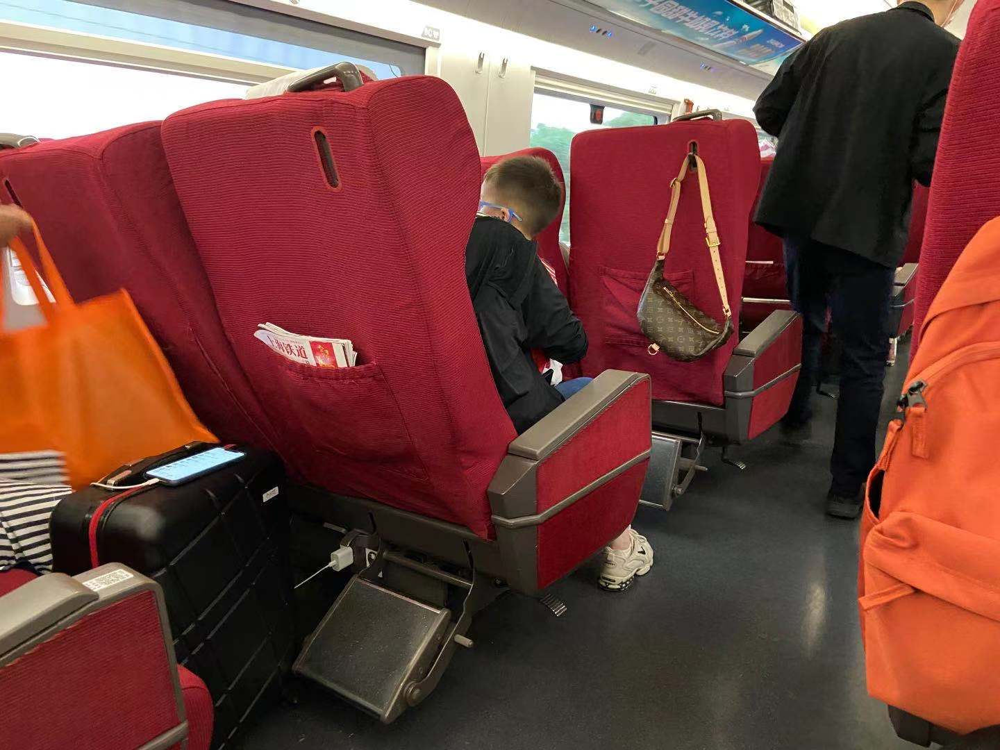

# 武林游记

> ~~“我常想，我到底放不下的是你这个人，还是你给我的感觉，又或者，是你出现在了我最爱的时光里。”~~

​		~~在我的宿舍里，有人刚刚分手，有人求爱不得，有人沉浸在恋爱的甜蜜中，有人却爱上了游戏$\cdots$他们各有各的表现，但我知道，无论喜悦或悲伤，都不必在意，它们转眼都会消散在风里$\cdots$人这一生中所遇到的，或所主动遇见的，无一不是过路人。他们与我们的相伴有长有短：或许有两三天与行程中导游的相处使你短暂地心花怒放；或许有让你一见钟情的恋人愿意陪你厮守一生 $\cdots$ 但是胜地不常，盛宴难再，天下没有不散的宴席。即使是最爱你的父母，也有一天要先你一步而去；你对最爱的子女，也有一天要难免说再见。所以永远记在心里，该说再见的时候，就说再见吧，体面的告别总比不欢而散要好。~~

---

​		曾经有多么糟糕我已不愿再提起，但在五月上旬，我的春天才刚刚回来。5月3日，在上海肆意尽欢之后，我一个人搭上上海地铁，一个人前往虹桥火车站，一个人搭乘 *G7371* 次列车在渐渐昏蒙的夜色里前往杭州。

<i>我这个穷 b第一次坐一等座</i>

​		把僵硬的大腿和腰背安放于一等座车厢宽大的红色座椅内，我不由得笑了出来。我属实有些后悔于多浪费四十多块钱给自己安排一个“升舱”了：座椅虽然宽大柔软，但腰并没有支撑，腿也伸展不开，甚至在有的方面比不上二等座舒服。这倒让我又一次想起马云的那句话：坐飞机我从来都是坐经济舱，因为头等舱和经济舱是一样的快。

​		列车晚点，发车已过十八时，在这个除东北地区以外中国最靠东的地方，初夏的太阳落得可真是够快。仿佛几个呼吸的功夫间，天空就从耀眼转为昏暗。太阳高照的时候，从来并不觉得他有多么的珍贵与伟大，但随着太阳高度角一点点趋于零度，日光不再是海洋，而撕裂成了一丝丝的，散射到车上、树上、竿上。我想抓住逐渐溜走的阳光，但车奔驰得实在太快了，不一会儿，东方之珠回归到宇宙的怀抱里。

​		我向来害怕黑暗。在夜里，我总觉得一切都抓不住，一切都会在立即到来的时间内逝去。列车就在黑暗之中的平原上不闻不问地奔跑，不给人留住过往的机会。前两日与现在形成的对比忽然就亮相在我眼前。“感觉…好孤独”，我在微信里发出这句话，闭上双眼，把耳机音量调大。

​		坐在我邻座靠窗的，是一位老人，同我一样到杭州去。在经停的每一站，他都会扭过身去问他的儿女，是不是要下车了。他的儿女一遍遍地回应厌了，便告诉他下车	时自然会叫他。这样老人便不再问了，可眼神却还畏缩地扫来扫去，仿佛迷了路的样子。我看着不忍，又无名分地感到伤心；蜷缩些身子，将手足带回离心脏更近的位置。

​		19:03，列车晚点八分钟到达杭州东站。杭州东站的站厅好似杭州城站的布局，让我一时错失于记忆与现实之间。

<i>19:31 的杭州东站</i>

​		太阳已经完全下山的杭州却甚至要比白天的上海炎热得多，空气中仿佛填充着数不尽的胶质，落在人的皮肤上，黏黏的，仅仅是从下车走到公交车站，衣服便湿透了。坐上 *28* 路公交车，不断地擦着鼻子上的汗，一阵空虚迷茫袭来。**我为什么要特意再来一次杭州呢？**我目前所处的地方去年8月从未来过，对于我来说，这是个陌生的行政区，却又像个陌生的城市。这里没有打铁关日日夜夜的打桩机的工作声，也没有武林门码头对面环球中心怪异的灯火通明，似乎也找不到我上次来时心中的那种爱意与幸福。 **这个时候我意识到我可能错了，我想寻找的acquaintance是不具有时间的延展性的，**过去的就是过去了，变的不是杭州，而是自己。

​		公交车一路都恰好避开了我曾熟悉的街区。杭州的公交司机还是一如既往地喜欢急油门与急刹车，颠簸了近一个小时，才抵达曙光路上的酒店。房间很小很久，但样样整洁干净，还算让人觉得舒服自在。

<i>百合花酒店房间内的老式控制面板</i>

​		洗过澡稍作休息，我决定起身步行前往西湖。西湖本是我这次旅行最最挂念的，无奈行程太短，只恐不能饱览西湖美景，便夜游一次、日游一次。

​		沿曙光路向南而行，没过多久便走到了西湖附近，循着上次的路，从竹素园的小门进入，绕过被我取笑过“哪里有人哪里就有”的星巴克，面前被竹林层层覆盖的视线渐渐明朗，倏然间天地开阔，便走入了西湖的怀抱。夜晚的西湖竟有着歌舞升平、镭射灯作伴的歌舞表演，七彩的灯光直捅云霄，映得湖面的波纹微微隐现。

<i>如梦如幻的歌舞表演</i>

​		表演在西湖主湖区，而我所处的地方在西北角的岳湖，为了看得清楚，看得详尽，我沿湖边小路而行，想从玉带桥到达西湖的沿岸。可刚刚走至觞咏亭附近，原本欢快的歌声与彩灯一齐瞬间消失，整个西湖一下子落入黑暗的深渊之中；景区内静得出奇，只有昆虫的鸣声刺入耳朵，进一步地衬着周围的死寂。西湖在这一瞬间仿佛突然暴毙的青年人，一切的幽怆让人有些恐惧，我挑选了最快走出西湖的路，落荒而逃。

​		步行良久，来到酒店附近的一家潮汕菜馆吃过垂涎已久的海鲜，已是接近午夜了。走出餐厅才发现下过了雨，不由得嗔笑一下自己把伞拿出放到了酒店的桌子上还忘记了带，若是走在西湖遇上下雨可要狼狈而归了。回酒店的路上却真的下起了小雨，幸好南方的植物长得茂盛，街边的树木替我挡住了大滴的雨水，让雨水非但没有毁掉我的好心情，反而让我享受了这水花在暖洋洋的空气中润在肌肤上的些许清凉。

<i>夜色下的黄龙体育中心</i>

​		一天走过太多，身上确实有些疲乏，回到酒店便躺到了床上。可是并不困，没有打开电视，而是打开网易云听起了音乐。在抵达杭州后似乎一步都没有停歇，可心里那个空虚的溶洞却越长越大，让我惊慌而酸楚。 **是的呀，这一切怕是要归结于我想找的永远都回不来了吧。**但再多的回望与自谴有什么用呢？我把自己的伤口削开千次，也了无裨益，而且我深知破镜不可能重圆的道理。这样下去，这苦海定是无止境的。“这一生你的心里满哀困”，这一句让我心里发寒生惧，如果这一生真的困顿于这一点事而耽误了无限我连想象都无法想象的广阔与美好，虽然悲哀中的自己不自知，但看清局面的旁人恐怕都要为我叹息吧！

<i>等(Live)&nbsp&nbsp&nbsp&nbspcover 陈百强</i>

---

​		1时19分，带着疲惫的身体和疲惫的心灵沉沉地睡去，7时43分轻快地自然醒来。拉开窗帘，这后半夜的雨，似下了，又似没下。柏油马路仍湿润着，可天空仍是无垠的云的平原。房间里的空气是郁结，而窗外清凉的晨间雾气早已浸满了泥土和雨水的气息分子，如兴奋的麻雀般跳跃着、碰撞着我的鼻腔。我所站的窗边，仿佛成了阴阳两界的分界，一边是被泪水打湿的混沌，一边是西湖所引渡的爱与美好。杭州的西湖区是个安静的美人，她的眉目是那么的温柔，眼里是无穷尽翻涌的爱意波涛，仅是远远望着，便沉沦于其中，妄想投入进其爱的怀抱。

> 欲把西湖比西子，淡妆浓抹总相宜
>
>  
——《饮湖上初晴后雨二首 · 其二》 苏轼

​		背好背包，拿上相机，难得地在早饭的时间走出酒店，可酒店的方圆近一千米竟都没有营业的早点铺，便大手一挥并不在意，步向公交车站。乘上89路，再次感受到了杭州公交车熟悉的疯狂。似乎所有开上了电动车的公交司机都已成为脱了缰的野马，奔回原属于他自由的草原。急加油，急刹车，在杭州到处都在施工的街头小巷里颠簸地穿梭来去已成为他们的家常便饭。只"苦了"车上的无论游客或市民，不许他们低头玩手机，只能乖乖欣赏到处的美景。

<video id="video" controls="controls" preload="auto">
<source id="mp4" src="./武林游记.assets/IMG_0171.mp4" type="video/mp4">
</video>

<i>杭州 89路公交车 浙江大学附近</i>

​		杭州很小，仿佛所有的脏器都挤在一个小小的腔内，离了西湖的周围没多远，开到紫荆花路上，便已觉得到达偏僻的郊区了。下了车，雨仍是将停未停的架势，举伞实在不便，便收了伞，只用手为宝贵的相机挡着雨。到公园门口的一小段路上还途径了一座小桥，河边有深谙鱼儿习性的大爷放着竿，也并不打伞，边注意着鱼漂，边同桥上的路人打着俏皮话。

​		五月初正赶上西溪湿地公园的花朝节，从来不对花粉过敏的我到了这里鼻子却痒了，打了十数个喷嚏，也许是这里皋月的艳华太过热情难却了吧。杭州的湿地真是湿透了，空气是湿的，肺是湿的，地上是湿的，花上闪着露水，眼睛上起着雾，马背上的毛发被打成一绺一绺的。空气湿过昨晚，热却并不炎热，如同微微融化的棉花糖裹挟全身，要沁入我的身心，要把我灌醉。

<i>西溪国家湿地湿地公园——第十一届西溪花朝节</i>

​		西溪给我留下最深刻的印象，除了**湿**，便是**绿**，一切绿得明亮，绿得扎眼。树上的叶、地上的草，就连花的陪衬都是那么绿，绿到好像布坊的绿色染缸打翻在草木之间，不停地流淌在每一处植被上面。走了良久，一路上的风景同样的美丽便不再赘述，让我记忆深刻的仍可细数：经过一片玫瑰花海所引导的花的长廊，即可抵达一处小小的渡口，船上有鲜花作饰，可用鲜花宴，乘船的艄公头上也顶着鲜花的花环；景区中区，竟有一处氦气球的升空体验项目，原本巨大的气球升空后逐渐缩影为小小一只，拖着一根细绳，仿佛是它在牵着地球向上攀升。虽然各地的湿地公园着实大同小异，但这些确实杭州独有而别处不会模仿得到的。杭州是浪漫的城市，是爱情的城市，是温柔的城市，*这个城市里乘氦气球不会有单人的票*。

​		踱到最繁华的一片商业街，闻到炸物烤物的香气，才想起早饭还没吃，一看表都已过了十点了。在随便一个小店买了份15块钱的葱包侩，本想边走边吃，可刚刚走到商业街的尽头雨便下大了，只好躲在店铺的屋檐下边吃边等雨停。淅淅沥沥的小雨在屋檐的背景下亮晶晶的格外显眼，大大小小的雨滴落到地上溅起大大小小的水花。身着汉服的姐姐妹妹们，用手里的丝扇挡着雨，笑着小跑回店中躲雨。因为怕被雨淋湿而着急，但长裙又勾着着她们的双腿，只好快速踱步，颇有江南女子的小巧风味了。

​		雨又渐小了，反反复复的无常天气让人好想笑着拍拍他的头嗔怪他的调皮。接下来的路走了好久好久，久到忘了时间，走过无数的无栏的桥，闯过无数的竹林，终于走到了西溪的南出入口。此时正午的艳阳已要把云层晒穿，虽然仍不见阳光，但身上已有热乎乎的感觉了。我站在路边，任轿车从我面前几步的距离飞驰而过，看着手机上已堵成深红色的上山路，又看看不富裕的余额，还是放弃了打车前往灵隐寺的打算，叫了辆车便悻悻地回酒店了。

​		回去的车狭小逼仄，几乎简陋到只剩“能开”这一功能。闷热的空气在车内不断回流升温，要将人扼杀。我靠在车窗上给额头降降温，心里对没能再一次去成灵隐寺而感到些许不免的遗憾。说是要去灵隐寺，实际上是要去景区里的韬光寺。由于要登山并且名气远不如灵隐寺来的大，游客大多摩肩接踵地挤在山脚下的灵隐寺内敲钟拜佛，这时就显出韬光寺的可贵。仅高灵隐寺百米的山腰小片平地上，伫立着略经修缮的韬光寺，寺旁少有他人，唯一老僧在寺旁守着香火。这里有观海阁，虽现已不能再登上去，但在寺前的平台亦足以“观海”，俯瞰整个西湖乃至余杭。美至甚哉！

<i>摄于 2020年 9月 8日 杭州韬光寺观海阁</i>

​		路程不远，不到二十分钟就开回了曙光路。雨越下越大，在很短的时间内便演化为了暴雨，甚至让人很难想象看似薄褥般的一层云彩怎会容纳了这么多的水分。幸而我也恰好抵达了酒店，心中也不禁窃喜因祸得福。回到房间，坐进背朝窗户的单人沙发内，点上一支香烟，享受着惬意的午间。心里想着，大雨天的灵隐寺大概也别有一番独特的韵味，只不过烟雨蒙蒙，怕是望不见武林了。

​		同北京大部分的暴雨一样，杭州的大雨也是来得快，去得也快，在酒店歇脚正放松至最舒适，便听不见雨声了。将手展至窗外确认过天公心情不错后，便再次北上背包抓紧在白天再游一度西湖。

​		杭州不大，我最喜爱的出行方式永远是步行，步行慢走让我能记住在城市里走过的每一条街，路过的每一家店。沿着曙光路下山，左转进入北山街，一路上便见到许许多多从西湖归来的游客，无一不有说有笑的。走着走着，转过街角遇见一家肯德基，便突然哑然失笑，颇有一种老熟人再相逢的感觉——我又走到了岳庙（*上次是乘公交车来的，故理所当然并不记得路，上次来到这里也是未吃饭的午后，但景区旁肯德基的价格实在让人望而生畏，便饿着肚子继续走了一下午*）。我虽然并不很饿，但仿佛不去吃一顿就好像在一个敌人脚下败了两次似的，便一定要吃，终究还是被自己的倔性子破费了一把，可能恰好中了店家的圈套吧！

> 西式快餐与中餐的差距属实是天壤之别，无论西式快餐的口味是咸是辣，其**风味**终究是<i>plain</i>的，不由得怀念前一天晚上吃的潮汕菜。

​		既然已两次从竹素园进入西湖景区，这次便理所当然该沿着另一方向走。绕过岳庙附近的众多小吃与小商品店，天地一下子从众多屋檐与树叶的分隔重新汇合起来。整个西湖上徘徊着一片将散未散的淡蓝灰色的雾气，仿佛一片小得可爱的、婴童般的海一样。又像一口偌大的井，井中映着天，天里又映着井。无论是天上的飞鸟还是湖上的游船，都好像夹在两面镜子之间，在天地间穿梭交映。

​		西湖的大部分堤岸并没有围栏，有的也仅是还没有膝盖高的一个个石柱，相邻连接着松垮的铁链。前一天在看短视频的时候，还看到有博主将西湖的堤岸与其他水系去对比，强调西湖的水边都不设围栏。我也知道，杭州作为浙江省会，全国的一线城市，阿里的所在之地，自然也是一个对于年轻人压力不小的城市。或者说，即使不是一个压力大的城市，想必各地也都会有想要自杀的人。但杭州，尤其是西湖，她的温柔能够让人安静，让人无论在多冷酷的生活中都感受到这世界上还可以有让自己感到不舍之物。可这也不意味着西湖带给人的就是快乐、是感动，在西湖旁，感到的唯是静罢了，静到安心，静到惊心，静到落泪。这种让人感伤到心痛又万分不舍的感觉，是痛并享受着*（或许并不快乐）*，却也是十分痛快的。

<i>西湖画船</i>

​		下午起风了，在西湖湖畔不断盘旋，渐渐吹干了空气中和身上的水汽，清爽而凉快。风一吹，我倒因为惬意而有些疲惫，停在一处柳树附近，关注着柳枝被初夏的风玩弄着摆来摆去。与上午的风不同，这时的快风穿袖而过，呼呼不停，仿佛把我带进在西湖周岸流转的涡旋当中。风拍打着我的外套，曳着我手中相机的颈带。

​		“一点浩然气，千里快哉风”，让我惊讶的是，西湖的美远不止她的湖水，其曼妙的风竟也是在这江南地带可遇而不可多求的另一宝物。风和水、风和云是两大自然界相处的融洽。在我所经历的范围之内，张家界天子山是风和云相处的极佳之地，而杭州西湖则是风与水约会的胜地。西湖的水域不大得过分，不小得逼仄，使得这万平湖水能泛起波涛又不翻涌。

<i>西湖波涛</i>

​		涛水、雾山、云天连成一篇，仿佛有一种从北半球的池塘坐看头顶的南半球悉尼蓝山的感觉。这里的水光天色让我想起苏轼，他曾两度在杭州任官，而两次经历都与西湖的水利密不可分。想必苏东坡在疏浚西湖、缓解无常的旱情涝情之后，也曾多次乘船游览西湖吧，自然其中也少不了夜游西湖。我十分喜爱苏轼的《前赤壁赋》，认为其为与范仲淹的《岳阳楼记》并为宋朝最佳的两篇散文。我并未去过黄冈，对长江也仅有几面之缘，但我对赤壁赋中苏东坡描绘的星夜华丽的景象已有了从词藻中生成的印象。起了风的西湖却恰与这“纵一苇之所如，凌万顷之茫然”完美地契合在了一起。

​		苏轼于公元1069和1086年两度出任杭州，而赤壁赋在这两次之间于黄州写成。可以说，杭州的水倒是与长江水虽然景色相似，可能够给人带来的心境却完全迥异。“大江东去，浪淘尽”，二者最大的区别大概就在于，湖水是**静**的，而江水是**动**的。就是说，无论长江的景色有多么壮丽绝美，即使你永远可以看到这美景，每一秒的景色却相对于上一秒是崭新的江景。虽然你永远热爱着赤壁江水，可你却无法挽留已去的江水，而从容且无感知地接受着新的江水。景色随时间推移的变化可以是大同小异的，但提供这一景色之物却日新月异，实可嗟兮！

​		行至西湖的东北角时，天空终于兜不住大朵的云彩而下起了小雨，细细软软的，如同撸猫过后落在手里的猫毛，不必撑伞。我同其他诸多游客挤在小桥上，感受着这未曾体会过的至柔的雨，看着湖岸边的浪在云雨中愈涌愈高，推搡着残存的荷叶。

​		行至此当天已走了十余公里，一年以前便是走到这里为止。此处的湖对岸正是雷峰塔半消隐于烟雨朦胧之中，我虽并不想去登雷峰塔也无力气走到雷峰塔，但我仍将雷峰塔作为此次步行的目的地。一边是空旷、宁静的湖面，另一边是人挤人、车水马龙的龙翔桥、湖滨银泰。这种差异在仅隔一街之间是迥异而令人惊讶的，仿佛是人与自然的分隔、现实与理想的分隔、物质与精神的分隔。方时至四时，尚早，我还舍不得离开而继续南下。没有目的，只是单纯地为了不想离开而停留。

<i>马可波罗像</i>

<i>"Hangzhou, the most beautiful and splendid city in the world." —Marco Polo</i>

​		继续走下去而人影渐少，路也渐窄。雨下过一阵，风刮过一阵，但也都渐渐停了。在走至东岸中部之后，有些乏了，望着朦胧的雷峰塔和虬龙般伸长的湖岸，感受着走了一天的疲惫，实在是不太想走下去了。路口向左一转身，沿着梧桐小径没走几步便从自然世界回到了人文世界。马路在两旁的树荫下显得有些幽静。路西侧我刚刚穿出的地方开着一家啤酒坊，尚还未到营业的时间，里面的店员还在打扫着地板桌椅。若不是天还太早，我倒真是想进去喝上几杯冰镇的精啤好好放松放松。过了马路，再往南走几步，遇上几位学生，才知道到了中国美术学院附近。街边的灯柱上挂着国美艺术展的海报，只可惜没赶上展览的时候，否则在这诗情画意的地方欣赏一些艺术作品相比也是极有情调的。

​		找定一家开在公交车站旁的咖啡馆，两层，在路边摆的铁质的桌椅无人占用可正好供我歇歇脚。咖啡馆不小，却又显得十分精致，可想必大多数人和我一样下午不喝咖啡，因此并没有顾客。我拿出手机，还不到五点，肚子也不饿，我规划过了六点再坐车去大名鼎鼎的武林夜市一饱口福。离我很远，在对面有个胖叔也选了个座位坐下。除我二人以外，路上车很少，也再无旁人。~~我把兜里的万宝路掏出来，数了数，还剩五根。虽然不是很喜欢烟味也并不想多抽，可向来的焦虑又让我担心这几根不够我最后一晚加一早的消遣。掐爆两颗爆珠，点上一根，橙子和薄荷的味道盖过焦油在我口中和鼻腔中弥漫。~~我望着将暗未暗的天，白云、灰云厚厚地盖住了原本天空的颜色，让人分不出时间，却由手机告诉我这一天还早，却也快结束了。我在杭州停留的时间实在短得可怜，前一天晚上抵达而后一天早上即要离开。毕竟实在五一满满的安排中挤出的时间。这尚且是我在大学期间休闲时间较为充裕的情况下，更仗着父母的经济支持，若是未来工作后更无如此可无顾的旅途了。

​		~~一根接一根，火星不散。~~感叹时间，又不得不感叹这大半年的时间，过得真好似梦一场。所有我不敢相信的好事、坏事都发生了，却又发生的没凭没据。不可否认的是，她让去年九月的杭州行多了那么多的幸福和兴奋，这一次我却找不回来了。过了这么久，我早已难以再分辨出我是真的因为杭州而喜欢杭州还是因为她在心灵上的陪伴而喜欢上在杭州的感觉。某种层度上，如我前一日抵达杭州时怀疑的那样，我输了，我已成为我回忆的傀儡，被其无时无刻地牵着感情走。不能因自己喜而喜，因自己悲而悲，是很可怕的。这半年来日夜摧残我的无非“*为什么*”的问题。看明白的是，暧昧与分手倒是十分相像的，都在难以抑制地不断地猜测对方的心思，对方喜不喜欢我啦，我有没有机会啦；也都会有一个个妄想的梦或喜或悲将自己从梦中惊醒，而感到怅然若失。总结来讲，还是希望给了人失望，美好给了人残缺的反差。沉醉于过去与幻想的人是残忍地自我摧残的，但或许正是这份猜不透的心理才给人、给爱情以可玩性与吸引性，让人为爱情而昏了头脑。就算一切梦境与历史都是虚妄的话，起码还有这份辛酸苦痛与这份失落是真实的，让我感受到，我还在这个世界上，我还活着。

<i>黄鹤断矶头，故人今在否？ 旧江山浑是新愁。 欲买桂花同载酒，终不似，少年游。</i>
 
<i>《唐多令·芦叶满汀洲》</i>

​		好不容易熬过了时间，趁着公交车恰好来便起身搭上车，坐到武林夜市去。总以为夜市是小县城的产物，没想到在杭州这种一线城市的市中心也会有。可到了地点才知道根本不是想的那回事——没有臭豆腐、烤面筋、羊肉串，有的只是一条巷子里数不尽卖小商品的摊位。大概五点吧，商贩们才刚刚出摊，支起桌板，把平板车上的手机壳、衣帽袜子什么的摆上台面。一整条街就像层叠的褶皱逐渐展开，露出真面目。两侧迎面的铺位之间只隔着一个身位的距离，我小心翼翼地从中间挤过，生怕勾掉了桌上的玩意儿或打翻了人家的棚子。直从街头走到巷尾所见到的唯一一家卖食品的摊子也只是无骨凤爪。摇摇头，又一次打开大众点评，选定朝向备选地点士林夜市进发。

<i>武林路 9号 士林夜市</i>

​		杭州的夜市简直是名过其实，精致得、规模小得简直对不起其“夜市”的名字。从头走到尾也不过百步的距离，整条“街”最火的却竟是木屋烧烤，实在有些可笑。一份臭豆腐，一大串羊肉串~~（我觉得是鸭肉）~~凑活成了我当晚的晚饭。这里虽然地方不大，人却也来来往往的，情侣、一家三四口。世界越大，我越觉得孤独。本来我是享受独自旅游的，可当场景变得无聊，我却难以抑制自己想和有趣的人纠缠的欲望。走出小吃街一路向西，声光逐渐被抛在背影之后，我走向一个人的寂静狂欢。

​		回酒店的公交依旧急起急停，让人很不舒服。市民好似都已蛰伏，除了我以外，只有一个大妈坐在前面和司机一起骂着工作与生活。我期望公交车经过我曾熟悉的武林广场，可迎面而来的只有无限的陌生的街景。我就在黑夜的洪流里不断前行，错过过往也错过将来，红色的尾灯在我身旁一条条甩过，如同破碎的时空里不稳定的能量碎片一般。最负压的空寂却压迫着我，要压碎我。

​		回到酒店我洗了个澡，因为吹风机是坏的只能乖乖等待头发晾干。换上外套，稍微装扮、喷上香水，只带着手机和房卡，我又一次走出酒店，一路哼着小曲去我前一天晚上在去西湖路上看到的Livehouse。“糊涂是你的一颗心…”最近脑中不住地单曲循环。不一会儿便走到了，酒吧十分显眼，因为整条街亮灯的招牌甚至不超过三家。酒吧的名字叫“老船长”，或许最早的这一酒吧是一名退役（退休）的老船长开的。想着这个名字配以灯光，我想到的却是带着海盗帽、眼罩的海盗船长，属实有一点滑稽，不过那样才符合*Old Captain*这个西式名字的浪漫意境。不过我相信酒吧的旧主人肯定不会有这样传奇的年轻故事，权当一个名字了。

​		这是我第一次进Livehouse，房间的一侧有放有立麦和架子鼓的小舞台，现在却虚位以待。在吧台坐下，按照惯例先点了一杯教父。冰块很好地掩盖住了威士忌的苦味与烈度，乙醇和整日的疲惫相互激发下，比往常还要上头一些。四名看上去也就二十出头的男青年一同来到店里，在单桌坐下，径直要了一箱啤酒，点上烟畅饮畅谈起来。与清吧截然相反的是，这里人声鼎沸，倒也不有失偏颇，但受了吵闹却没体验到酒吧驻唱却让我有些后悔没去清吧静静地品酒。

​		第一杯很快见底，便接着点了杯特调，什么名字早已记不得了，只记得还挺好喝的，不过有25度，依旧很烈。第二杯饮至一半时，竟迎来了驻唱。这一次我才了解到Livehouse的音响声音究竟有多大，可随着感官逐渐被酒精麻痹，我也渐渐习惯，并被女主唱磁性的声音带动起来。音响声音过大使我并听不清唱的具体的词是什么，加上人已半醉，记忆也都模糊不清，只记得有唱的时候的确热闹非凡。借着听歌，我也稍作休息缓一缓酒，只可惜表演并不很久。乐队下场后，人声又盖过了一切。第三杯依旧是25度的特调，此时的我已到了忘记拍照的程度，或是到了懒得拍照的心情。消费自己，忘乎所以。

​		醉，但也只是半醉。每次喝酒都以外显的笑容善谈和内心的郁郁寡欢为终，这次也并不例外。我仍惦记着第二天一早的火车，不到十点半便走出酒吧。回酒店和出酒店一样，也都唱着差不多的歌，怀着差不多的心情。直到回到床上一身瘫软，却也记得发朋友圈、定闹钟，却也记得那么多过去的事。

​		5日早七点，乘公交车前往杭州东站，途经去年所住过的打铁关附近。

---

## **后序**：

​		本文自5月26日敲下第一个字，至7月28日凌晨完成正文初稿。这期间有太多的论文作业、期末考试占据了绝大部分时间，在写作过程中，记忆的逐渐模糊和回忆的痛苦也造成了不小的干扰。我的文笔不好，也不想让这篇文章显得我是一个非常矫情的人，唯希望能将自己真实所想所感记录下来，在日后以供我心态的恢复作一个客观的、实在的证据。在这两个月里，曾有一大段的时间我真正相信自己完全走出来了，但只至那些偶尔的抑郁的清晨出现，我才明白是忙碌彻底麻痹了自己。

​		本文写成之后，我也重新审度过文章内容是否得体，也多次处在发出或是私藏的纠结当中。本文的确基于我五一期间在杭州的所见所感凝聚而成，但难免有一定改动。我一直认为人活得要坦荡些，我也自认为自己还算是一个比较真实的人，不愿藏着掖着也不愿说假话，但人毕竟对待他人所语也要有取有舍不可全拿。因此我希冀各位读者权当此文为消遣一看，文中之言不必全信；有些见解现在的我与当时的我也有所改变，只为记录自己当时的切身感受罢了。

​		三四载来，我所见有太多曾令人羡慕的爱情未能走到最后，我对其婉兮甚至有胜过自己，但也让我逐渐相信这本就是规律。我相信几乎所有的成年人都是曾一天看过四十三次日落的小王子，因而看到别人emo抑郁的时候也大可不必以之取乐。一百天或是一百年，即使是地球和月球几十亿年的相守也有终期，但美丽的故事却永远铭刻在历史的时间轴上。如果宇宙有循环的话，佳话还会重演；如果宇宙有尽头的话，其更是独一无二。我珍惜一切带给我的，无论喜或悲。

2021年8月1日凌晨&nbsp&nbsp&nbsp&nbsp北京 有删改

